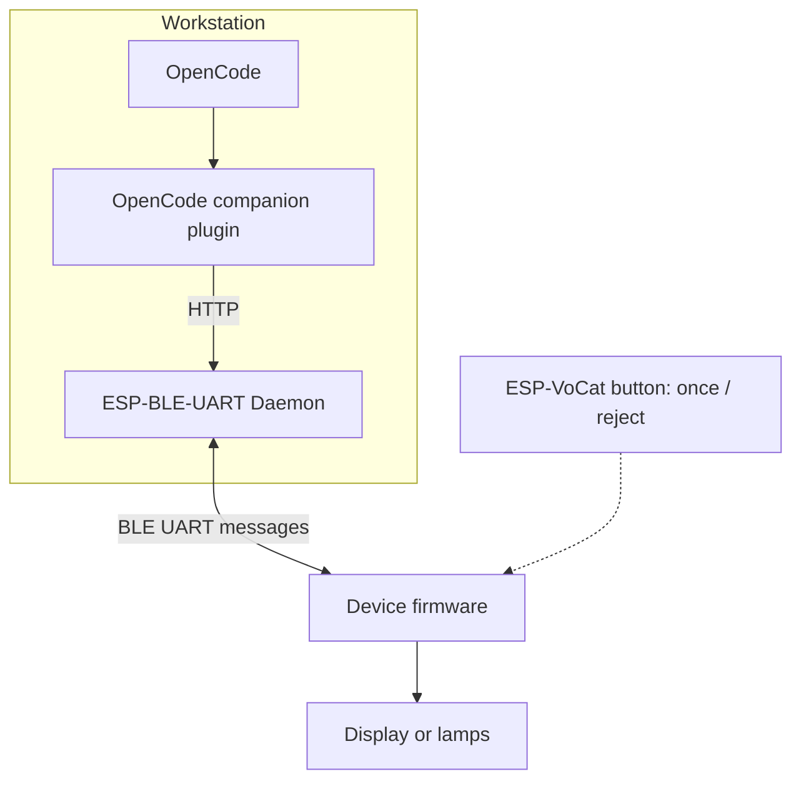
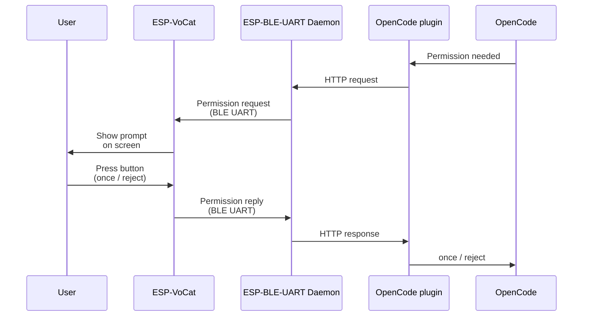
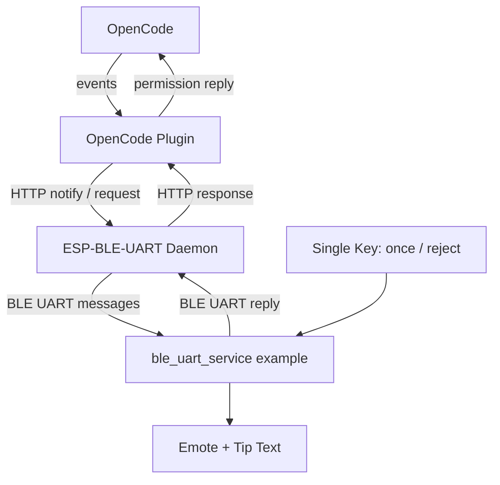

## Introduction

Have you ever wanted an AI agent as your desktop pet? In this tutorial, we turn ESP-VoCat into a small physical companion for OpenCode: it sits on your desk, shows what the agent is doing, displays permission requests, and lets you approve or reject them with a single button press.




[ESP-VoCat](https://docs.espressif.com/projects/esp-dev-kits/en/latest/esp32s3/esp-vocat/index.html) is an intelligent AI development kit based on the ESP32-S3 module, featuring a circular touch display and single-button input. That combination is a good fit for a lightweight companion: the display can show the current OpenCode status or a compact permission prompt, while the button adds an explicit physical approval step. The companion firmware comes from the [`ble_uart_service` example](https://github.com/espressif/esp-iot-solution/tree/master/examples/bluetooth/ble_uart_service) in the [esp-iot-solution](https://github.com/espressif/esp-iot-solution) repository. It renders session status as on-screen expressions and presents permission requests for physical approval. See the example README in esp-iot-solution for supported boards, required component versions, and build details.

The tutorial creates the companion in two main stages, with an optional third:

1. We use **ESP-BLE-UART Console** with the `ble_uart_service` Echo Server to prove that the host can discover, connect to, and exchange data with a BLE UART device.
2. We switch to the ESP-VoCat companion firmware in the [`ble_uart_service` example](https://github.com/espressif/esp-iot-solution/tree/master/examples/bluetooth/ble_uart_service) from esp-iot-solution, start the **ESP-BLE-UART Daemon**, and install the **OpenCode companion plugin** that forwards OpenCode session status (busy, idle, retry) and permission prompts to the hardware.
3. (Optional) We use the `ble_uart_vibe_indicator` example in ESP-IDF for a signal-light board instead of a screen and button (Part 3).

BLE UART is the transport layer that makes this companion implementation simple. On the workstation, OpenCode talks to the **OpenCode companion plugin**, which forwards session and permission events to the **ESP-BLE-UART Daemon** over local HTTP. The daemon keeps the Bluetooth LE connection open and exchanges companion messages over the BLE UART link. On the device, the ESP-VoCat firmware turns those messages into emotes and prompt text, and sends `once` / `reject` permission decisions back over BLE UART. The optional `ble_uart_vibe_indicator` path uses the same transport to mirror activity as lamp states, but permission answers stay in the OpenCode TUI.



## What the Companion Will Do

- Show OpenCode status updates such as busy, idle, and retry on ESP-VoCat.
- Display permission prompts on the ESP-VoCat screen.
- Return `once` or `reject` decisions to OpenCode from the device button.
- Optionally mirror activity with the Part 3 signal-light indicator, while permission answers stay in the OpenCode TUI.

The permission round-trip looks like this:



## Prerequisites

You need a desktop or laptop running Linux, macOS, or Windows (smartphones and tablets are not supported), with a Bluetooth adapter and scan/connect permissions. Install [ESP-IDF `release/v5.5`](/workshops/esp-idf-setup/) and export the environment — one installation covers every part of this tutorial.

To build the ESP-VoCat OpenCode companion, you also need:

- An [ESP-VoCat](https://docs.espressif.com/projects/esp-dev-kits/en/latest/esp32s3/esp-vocat/index.html) development board based on ESP32-S3, with a circular touch display and single-button input.
- The ESP-IDF `ble_uart_service` Echo Server in `$IDF_PATH/examples/bluetooth/ble_uart_service` for Part 1, and the esp-iot-solution [`ble_uart_service` example](https://github.com/espressif/esp-iot-solution/tree/master/examples/bluetooth/ble_uart_service) for the ESP-VoCat companion firmware in Part 2; see the esp-iot-solution README for supported boards, dependency versions, and build instructions.
- Host-side ESP-BLE-UART Bridge Python dependencies (Console in Part 1 and **ESP-BLE-UART Daemon** in Part 2):

```bash
cd $IDF_PATH
. ./export.sh
python -m pip install -r tools/ble/ble_uart_bridge/requirements.txt
```

On Windows, use `export.bat` or `export.ps1` from the ESP-IDF root instead of `. ./export.sh`.

- Network access on the first CMake configure of the esp-iot-solution example to download `emote_assets.bin` (or set `EMOTE_ASSETS_BIN` to a local path for offline builds).
- OpenCode installed to run the companion plugin demo.

### Signal-light indicator (Part 3, optional)

- A board supported by `$IDF_PATH/examples/bluetooth/ble_uart_vibe_indicator`; choose the target according to that example's README.
- The host setup and **ESP-BLE-UART Daemon** / **OpenCode companion plugin** configuration from Parts 1–2; no ESP-VoCat board is required.

## Part 1: Prove the BLE UART Link

### The Transport Behind the Companion

Before the ESP-VoCat can act as an OpenCode companion, the host must be able to move bytes to and from the device reliably. Bluetooth LE does not have a real UART peripheral in the classic serial-port sense. A BLE UART service is a GATT convention: one characteristic serves as the host-to-device RX channel, another as the device-to-host TX channel. The Echo Server in `ble_uart_service` uses Nordic UART Service-style UUIDs and sends received bytes back through TX notifications, which makes it suitable for verifying the host-side Console path.

The transport layer only moves bytes. In this first stage, those bytes are simple echoed text. Later, the ESP-VoCat companion firmware uses the same BLE UART channel for status updates and permission prompts.

### Build and Flash the Echo Server

```bash
cd $IDF_PATH/examples/bluetooth/ble_uart_service
idf.py set-target esp32s3    # or another supported target
idf.py build flash monitor
```

Keep the monitor open during pairing. The firmware console output should resemble the following log; unrelated registration lines are omitted with `...`, and the address and device name suffix will vary:

```text
I (548) ble_uart: BLE host task started
...
I (608) ble_uart: addr=74:4d:bd:a9:ed:72
...
I (628) ble_uart: advertising as 'BleUart-ED72'
I (628) main_task: Returned from app_main()
```

The `ble_uart: addr=74:4d:bd:a9:ed:72` line shows the device Bluetooth MAC address, `74:4D:BD:A9:ED:72`. The device advertises under the name shown in the `ble_uart: advertising as 'BleUart-XXXX'` line.

When your host computer connects, the firmware logs a pairing passkey prompt. If you are prompted for a passkey by the system Bluetooth dialog or the `connection-check` command, enter the six-digit number shown in the monitor:

```text
W (19298) ble_uart:     +-----------------------------+
W (19298) ble_uart:     |  BLE PAIRING PASSKEY:       |
W (19298) ble_uart:     |       617138                |
W (19298) ble_uart:     +-----------------------------+
```

### Find the BLE UART Device

The host-side Bridge tools identify your board by a **device ID** — the Bluetooth MAC address on Linux and Windows, or a CoreBluetooth UUID on macOS. You will pass this value as `DEVICE_ID` in the `connection-check` and `console` commands below (and later as `VOCAT_DEVICE_ID` when starting the **ESP-BLE-UART Daemon** in Part 2).

Open a second terminal:

```bash
cd $IDF_PATH/tools/ble/ble_uart_bridge
python main.py list-devices
```

From the `list-devices` output, copy the identifier for your board and use it as `DEVICE_ID`. You can check whether the target device has been discovered by matching the MAC address or device name in the output. On Linux, the device MAC address is printed directly:

```text
> python main.py list-devices

2026-06-05 11:19:56.728 | INFO     | src.core.scanner:scan_devices:42 - Scanning for nearby BLE devices in 5.0s...
2026-06-05 11:19:57.108 | SUCCESS  | src.core.scanner:on_detect:39 - Found: 74:4D:BD:A9:ED:72, with name BleUart-ED72, rssi=-46
```

The `74:4D:BD:A9:ED:72` MAC address and `BleUart-ED72` device name in this output match the firmware log above.

On macOS, system restrictions prevent the tool from displaying the real Bluetooth MAC address. Instead, macOS assigns a CoreBluetooth UUID as the device identifier. Match the device name, `BleUart-ED72` in this example, in the `list-devices` output with the name shown in the firmware log to find the corresponding UUID:

```text
> python main.py list-devices

2026-06-05 11:19:56.728 | INFO     | src.core.scanner:scan_devices:42 - Scanning for nearby BLE devices in 5.0s...
2026-06-05 11:19:57.108 | SUCCESS  | src.core.scanner:on_detect:39 - Found: 5BA2476C-CDD2-BF3F-F98C-252CFA45F8B5, with name BleUart-ED72, rssi=-46
```

The `5BA2476C-CDD2-BF3F-F98C-252CFA45F8B5` string in this example is the CoreBluetooth UUID to use as `DEVICE_ID` on macOS.

### Check the Bluetooth LE Link Before Opening Console

```bash
python main.py connection-check "<DEVICE_ID>"
```

This command connects, discovers the BLE UART service and characteristics, then disconnects. On Linux or Windows, pass the device MAC address as `DEVICE_ID`; on macOS, use the CoreBluetooth UUID instead.

```text
> python main.py connection-check 74:4D:BD:A9:ED:72
... Succeeded to connect to 74:4D:BD:A9:ED:72!
... Disconnected from 74:4D:BD:A9:ED:72
```

### Talk Over the BLE UART Link

```bash
python main.py console "<DEVICE_ID>" --terminator lf
```

In the Console, type a short line and press Enter:

```text
hello from console
```

Expected result:

```text
[INFO] Connected to <DEVICE_ID>
[TX] hello from console
[RX] hello from console
```

- Console shows `[TX]` lines for the input.
- The ESP-BLE-UART example echoes the same bytes back as `[RX]` output.

At this point Bluetooth LE discovery, connection, host-to-device writes, and device-to-host notifications all work. That means the transport for the companion is ready.

For optional Console debugging options, see the [Quick Start guide](https://github.com/espressif/esp-idf/blob/master/tools/ble/ble_uart_bridge/docs/Quick-Start-BLE-UART-Console.md).


For a comprehensive understanding of Bluetooth Low Energy, see the [Bluetooth LE Overview](https://docs.espressif.com/projects/esp-idf/en/latest/esp32/api-guides/ble/overview.html). For Bluetooth LE connection management and data exchange, refer to the [Bluetooth LE Multi-Connection Guide](https://docs.espressif.com/projects/esp-idf/en/latest/esp32/api-guides/ble/ble-multiconnection-guide.html).


## Part 2: Turn ESP-VoCat into the OpenCode Companion

Part 1 only verified the transport. In this part, the device starts speaking the companion protocol used by the OpenCode plugin.

### How the Companion Fits Together

The companion setup has four parts, shown in the diagram below. OpenCode emits session and permission events. The **OpenCode companion plugin** translates those events into local HTTP calls. The **ESP-BLE-UART Daemon** keeps the Bluetooth LE connection open. The ESP-VoCat firmware renders the companion UI and sends button decisions back over BLE UART.

The [ESP-BLE-UART Bridge tools](https://github.com/espressif/esp-idf/tree/master/tools/ble/ble_uart_bridge) and [OpenCode demo plugin](https://github.com/espressif/esp-idf/tree/master/tools/ble/ble_uart_bridge/demos/opencode) are included in ESP-IDF `release/v5.5` under `tools/ble/ble_uart_bridge/`. The `ble_uart_service` example implements the device side of the protocol and is available in the [esp-iot-solution](https://github.com/espressif/esp-iot-solution) repository. The same plugin also supports the signal-light indicator in Part 3; the **ESP-BLE-UART Daemon** stays a generic transport.



### Connect the Companion Through the Daemon

Now we'll replace the echo-server firmware with the actual companion firmware.

1. Flash the `ble_uart_service` example from the [esp-iot-solution](https://github.com/espressif/esp-iot-solution) repository onto the ESP-VoCat board:

```bash
# Clone esp-iot-solution if not already available
git clone https://github.com/espressif/esp-iot-solution.git
cd esp-iot-solution/examples/bluetooth/ble_uart_service
idf.py set-target esp32s3
idf.py build flash monitor
```

   See the example README in esp-iot-solution for dependency versions and board-specific configuration.

2. Scan for the device and verify the connection. Use the ESP-VoCat device identifier as `VOCAT_DEVICE_ID`:

```bash
cd $IDF_PATH/tools/ble/ble_uart_bridge
python main.py list-devices
python main.py connection-check "<VOCAT_DEVICE_ID>"
```

3. Start the daemon with the ESP-VoCat device:

```bash
cd $IDF_PATH/tools/ble/ble_uart_bridge
python main.py daemon "<VOCAT_DEVICE_ID>" --host 127.0.0.1 --port 8888
```

4. In another terminal, check daemon status:

```bash
cd $IDF_PATH/tools/ble/ble_uart_bridge
python main.py daemon-status
```

Optional smoke test: before starting OpenCode, send a `session.status` message through the daemon to confirm the daemon → BLE UART → firmware path. From `$IDF_PATH/tools/ble/ble_uart_bridge`, run:

```bash
python main.py daemon-notify --op session.status --json '{"v":1,"kind":"session.status","event_id":"evt_manual","session_id":"ses_manual","requires_reply":false,"payload":{"type":"busy"}}'
```

For more request examples, see the operations in the [esp-iot-solution example's `json_format.md`](https://github.com/espressif/esp-iot-solution/blob/master/examples/bluetooth/ble_uart_service/json_format.md).

### Safety Reminder

Keep the daemon bound to `127.0.0.1` and pair only with a device you trust. A `once` decision approves only the current request; if the BLE link, daemon, plugin, or device decision path fails, OpenCode rejects instead of silently approving.

### Install the OpenCode Companion Plugin

The OpenCode demo plugin is included in ESP-IDF under [`tools/ble/ble_uart_bridge/demos/opencode`](https://github.com/espressif/esp-idf/tree/master/tools/ble/ble_uart_bridge/demos/opencode). Use a project-local install while experimenting, so the setup only affects this project:

1. Copy the plugin into your project:

```bash
mkdir -p <proj-path>/.opencode/plugins/opencode-ble-uart-bridge
cp $IDF_PATH/tools/ble/ble_uart_bridge/demos/opencode/src/*.ts \
  <proj-path>/.opencode/plugins/opencode-ble-uart-bridge/
```

2. Add or merge the following into `<proj-path>/opencode.json`:

```json
{
  "$schema": "https://opencode.ai/config.json",
  "plugin": [
    ".opencode/plugins/opencode-ble-uart-bridge/opencode-ble-uart-bridge.ts"
  ],
  "permission": {
    "edit": "ask"
  }
}
```

3. Restart OpenCode so it loads the new plugin and config. For user-level installs, environment variables, and indicator binding, see the [OpenCode demo README](https://github.com/espressif/esp-idf/blob/master/tools/ble/ble_uart_bridge/demos/opencode/README.md). For general plugin mechanics, see the [OpenCode plugin documentation](https://opencode.ai/docs/plugins/).

### Let OpenCode Talk to the Companion

1. Keep the firmware running and advertising/connected.
2. Keep the ESP-BLE-UART Daemon running on `127.0.0.1:8888`.
3. Start OpenCode in the project where the plugin is configured.
4. Trigger a permission prompt, for example an edit operation when `permission.edit` is set to `ask`.

Verify the following behavior:

- OpenCode session status is forwarded as best-effort `session.status` updates.
- ESP-VoCat shows busy/idle/retry expressions.
- Permission prompts appear on ESP-VoCat with compact metadata such as command, path, or URL.
- Single click returns `once` to OpenCode.
- Long press or timeout returns `reject`.
- Plugin status and errors are reported through OpenCode TUI toasts and logs when available.

To demonstrate bash or tool execution permissions, ensure the OpenCode permission config is set to prompt for that tool category. Otherwise, use an edit permission as the primary trigger.



## Part 3: Signal-Light Indicator (Optional)

If you only need at-a-glance OpenCode status — or several OpenCode instances sharing one board — use the lamp-only `ble_uart_vibe_indicator` example in ESP-IDF instead of ESP-VoCat. It uses the same BLE UART transport, the same daemon, and the same OpenCode plugin; only the firmware application protocol differs.

### When to Use the Indicator Path

- You want red / yellow / green lamps instead of a screen and permission button.
- Multiple independent OpenCode instances should each drive their own lamp group on one physical board.
- You already completed Part 1 and understand the daemon workflow from Part 2.

The indicator firmware cannot return a permission decision. On `permission.asked`, the plugin lights the yellow "waiting" lamp and you answer in the OpenCode TUI.

### Build and Connect the Indicator

Flash the indicator firmware, then use the indicator's `DEVICE_ID` for the Part 2 scan, `connection-check`, and daemon steps. Install the same OpenCode plugin:

```bash
cd $IDF_PATH/examples/bluetooth/ble_uart_vibe_indicator
idf.py set-target <your-board-target>
idf.py build flash monitor
```

When OpenCode starts and the daemon is connected, the plugin probes the device, classifies it as `vibe_indicator`, and begins driving lamps on an automatically assigned channel.

### Lamp Effects and Multi-Instance Sharing

The indicator plugin maps OpenCode activity to simple lamp states:

| OpenCode status | Indicator behavior |
|---|---|
| Running or retrying | Green slow blink |
| Finished without error | Green on |
| Waiting for permission | Yellow on; answer in the OpenCode TUI |
| Error | Red on until new work starts |

If several OpenCode instances share one indicator board, the plugin automatically assigns each instance a free lamp channel and remembers the binding per project. Use the plugin's `indicator_bind_channel`, `indicator_unbind_channel`, or `indicator_show_binding` tools only when you need to override that automatic choice.

For protocol details, lamp field values, and customization notes, see the [OpenCode demo README](https://github.com/espressif/esp-idf/blob/master/tools/ble/ble_uart_bridge/demos/opencode/README.md#indicator-device-support-vibe_indicator) in ESP-IDF.

## Protocol Reference

The companion protocol is documented in the `ble_uart_service` example's [`json_format.md`](https://github.com/espressif/esp-iot-solution/blob/master/examples/bluetooth/ble_uart_service/json_format.md) in the [esp-iot-solution](https://github.com/espressif/esp-iot-solution) repository. The signal-light indicator uses a separate command vocabulary documented in the [OpenCode demo README](https://github.com/espressif/esp-idf/blob/master/tools/ble/ble_uart_bridge/demos/opencode/README.md#indicator-device-support-vibe_indicator).

## Troubleshooting

- For BLE scanning, pairing, `connection-check`, Console, and daemon basics, start with the [BLE UART Console Quick Start](https://github.com/espressif/esp-idf/blob/master/tools/ble/ble_uart_bridge/docs/Quick-Start-BLE-UART-Console.md).
- For OpenCode plugin behavior, daemon environment variables, and signal-light indicator binding, see the [OpenCode demo README](https://github.com/espressif/esp-idf/blob/master/tools/ble/ble_uart_bridge/demos/opencode/README.md).
- Remember that the firmware accepts only one Bluetooth LE connection at a time; close Console before using the daemon.
- Permission handling fails closed: timeout, disconnect, daemon failure, or plugin failure rejects instead of silently approving.

## Ideas for a More Capable Companion

- Add carefully designed gestures for additional approval or denial policies beyond the demo's `once` / `reject` decisions, if your workflow and threat model allow them.
- Add richer display layouts for command/path/URL metadata.
- Add device-side settings for prompt timeout.
- Add an allowlist for low-risk commands.
- Add integration tests with a mocked daemon and simulated firmware replies.
- For the signal-light indicator, customize lamp colors and blink rates in `indicator-control.ts` if your board wires the lamps differently.

## Takeaways

The companion is intentionally split into small, replaceable layers. Console proves the raw BLE UART path, the daemon turns one Bluetooth LE connection into a local HTTP bridge, the OpenCode companion plugin maps OpenCode session and permission events to daemon requests, and ESP-VoCat provides the physical UI.

That separation is what makes the idea easy to adapt. You can keep the OpenCode plugin and build a different device UI, keep the ESP-VoCat UI and replace the host integration, or use the same BLE UART bridge for a different desktop workflow. The important part is the companion pattern: keep the editor flow on the host, but move the moments that benefit from physical presence onto a small device beside you. Part 3 shows the same pattern with a lamp-only indicator when a screen and button are not needed.
