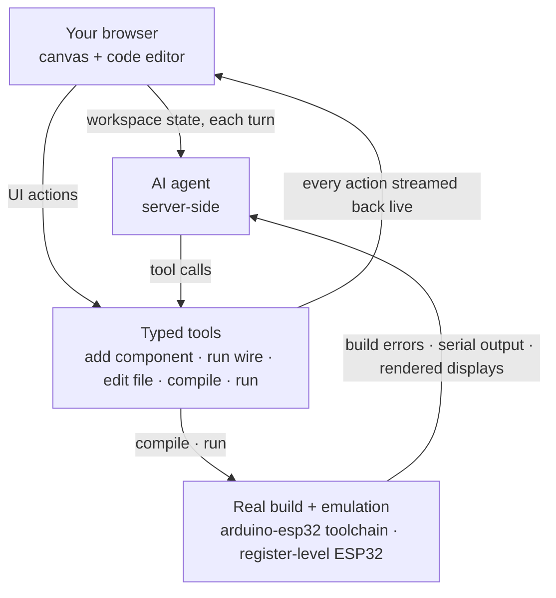

One day, I was looking online for a way to emulate a project that used two ESP32 boards communicating over SPI. To my surprise, I couldn't find any platform that could run it. There were a few alternatives capable of emulating a single ESP32, but my project went much further: it also included resistors, diodes, and analog components, making the challenge even greater. That made me wonder: would it be possible to build a platform capable of running an entire embedded project directly in the browser? I decided to build a prototype to find out. That prototype eventually became Velxio.

## Velxio's community today

As of mid-2026, more than 15,000 developers have registered on Velxio, and they run over a thousand simulations every day. ESP32-family boards account for more than half of those simulations, making them by far the most popular hardware on the platform. The open-source core has gathered thousands of stars and hundreds of forks on GitHub.

## What is Velxio?

Velxio is a multi-board embedded simulator that runs in a browser tab. The core pieces:

- **Real CPU emulation, not behavioral models.** ESP32 boards run on a QEMU fork with Xtensa LX6/LX7 and RISC-V system emulation; AVR and RP2040 boards run entirely in the browser via [avr8js](https://github.com/wokwi/avr8js) and rp2040js.
- **A real compilation chain.** `arduino-cli` and ESP-IDF produce genuine `.hex`, `.uf2`, and `.bin` files server-side. What you run in the simulator is what you'd flash.
- **30+ boards across 6 CPU architectures.** Ten of them are ESP32-family, alongside Arduino AVR boards, Raspberry Pi Pico, STM32 (Blue Pill through F4 Discovery), and Raspberry Pi single-board computers booting Linux on emulated Cortex-A cores.
- **150+ interactive components.** LEDs, sensors, OLED and TFT displays, NeoPixel strips, ePaper panels, MicroSD cards, and motors, all dragged onto a canvas and wired to your board.
- **Hybrid digital + analog co-simulation.** ngspice compiled to WebAssembly solves the analog side: `analogRead()` returns the actual node voltage from Modified Nodal Analysis, so op-amps saturate and diodes drop volts like they should.
- **Arduino, ESP-IDF, and MicroPython development.** Multi-file workspaces, a library manager backed by the Arduino Library Index, ESP-IDF projects, and 300+ one-click example projects, nearly 80 of them targeting ESP32-family boards.
- **Fully self-hostable.** The whole stack (frontend, backend, emulators, toolchains) ships as one Docker image.

## Hands-on: your first ESP32 project in the browser

Let's run the embedded "Hello World." Open [velxio.dev/example/esp32-blink-led](https://velxio.dev/example/esp32-blink-led), no sign-up needed. The example loads an **ESP32 DevKit V1** with an external LED already wired to GPIO4 through a resistor (the board's built-in blue LED sits on GPIO2):

```cpp
#define LED_BUILTIN_PIN 2   // Built-in blue LED
#define LED_EXT_PIN     4   // External red LED

void setup() {
  Serial.begin(115200);
  pinMode(LED_BUILTIN_PIN, OUTPUT);
  pinMode(LED_EXT_PIN, OUTPUT);
  Serial.println("ESP32 Blink ready!");
}

void loop() {
  digitalWrite(LED_BUILTIN_PIN, HIGH);
  digitalWrite(LED_EXT_PIN, HIGH);
  Serial.println("LED ON");
  delay(500);

  digitalWrite(LED_BUILTIN_PIN, LOW);
  digitalWrite(LED_EXT_PIN, LOW);
  Serial.println("LED OFF");
  delay(500);
}
```

Click **Run**. The backend compiles the sketch with the arduino-esp32 core (you can watch the real build log scroll by) and then boots the binary on the emulated Xtensa LX6. Within seconds the LED is blinking on the canvas and the Serial Monitor streams `LED ON` / `LED OFF`:



Everything in that screenshot is live: you can edit the code and re-run, drag components while the simulation runs, type into the serial monitor, or open the scope panel and probe a pin.

## Under the hood

Velxio's ESP32 support does not use simplified peripheral models. Each ESP32-family board boots a real QEMU system emulation with register-level peripherals:

| Peripheral | Emulation detail |
| --- | --- |
| GPIO | Full digital I/O on all pins, wired to the canvas components |
| UART | Multiple UARTs with auto-baud detection, bridged to the Serial Monitor |
| ADC | 12-bit multi-channel; reads real solved voltages from the SPICE co-simulation |
| I²C / SPI | Protocol-level emulation driving OLED, TFT, sensor and SD components |
| RMT | WS2812-timing-accurate NeoPixel strips render correctly |
| LEDC / PWM | Hardware PWM channels |
| WiFi | Virtual access point (`Velxio-GUEST`) with SLIRP NAT out to the internet |
| Camera | ESP32-CAM bridges a real webcam frame into the emulated camera module |

The compile side is equally real. ESP32 sketches build against the arduino-esp32 3.3.10 core on ESP-IDF v5.5 inside the backend. A cold build compiles the full IDF (~1,500 objects, a few minutes), but ccache plus persistent per-target build directories mean warm compiles land in **under a minute**. Build options mirror the Arduino IDE Tools menu: partition schemes, CPU frequency, flash mode/size, PSRAM, core pinning for the Arduino loop, all serialized per board and translated into `sdkconfig` at compile time. You can even upload files into a SPIFFS partition from the browser.

ESP32-C3 boards take the same path on QEMU's RISC-V system emulation (RV32IMC), so the C3's peripherals are also emulated at the register level.

Here's that peripheral stack in action. The [ESP32 Weather Station](https://velxio.dev/dave/estacin-meteorolgica-esp32) is a single project in which the emulated board:

- Reads a BMP280 (temperature + pressure) over I²C
- Reads a DHT22 (humidity) on a GPIO
- Draws a live dashboard on an ILI9341 TFT over SPI through the Adafruit GFX stack

Both emulated buses work at the same time. And this project has a twist: it wasn't wired by hand. It was designed, wired, and programmed end-to-end by Velxio's AI agent (that's its chat panel on the right of the screenshot).



### WiFi that actually reaches the internet

The emulated ESP32 joins a virtual open access point and gets NAT'd through the host. That means real `WiFi.begin()`, real DHCP, DNS, and TCP out to the world. The gallery's MQTT example connects to `broker.hivemq.com`, publishes to a unique topic, subscribes to the same topic, and toggles GPIO2 every time a message round-trips through the actual public broker:

```cpp
#include <WiFi.h>
#include <PubSubClient.h>

const char* WIFI_SSID   = "Velxio-GUEST";     // open AP the emulator advertises
const char* MQTT_BROKER = "broker.hivemq.com";

void connectWiFi() {
  WiFi.mode(WIFI_STA);
  WiFi.begin(WIFI_SSID);
  while (WiFi.status() != WL_CONNECTED) { delay(300); Serial.print("."); }
  Serial.printf("\nWiFi connected, IP %s\n", WiFi.localIP().toString().c_str());
}
```

HTTP clients, web servers (proxied so you can open the ESP32's page in another tab), and MQTT all work inside the simulation. Try this example: [velxio.dev/example/esp32-wifi-mqtt](https://velxio.dev/example/esp32-wifi-mqtt).

## An AI agent that builds circuits and firmware

The [weather station above](https://velxio.dev/dave/estacin-meteorolgica-esp32) was not assembled by hand. Velxio includes an AI agent (on paid plans) that works directly on your live canvas and code editor: you describe what you want to build, and it builds it in front of you.

Concretely, the agent:

- **Designs the circuit.** It picks a board and parts from the same 150+ component library you use, drops them on the canvas or seats them on a breadboard, and wires pin to pin. Agent-drawn wires are auto-routed around components, so the layout comes out looking hand-made.
- **Writes the firmware.** It codes in ESP-IDF, Arduino C++ or MicroPython, multi-file if needed, installing Arduino libraries along the way (with your approval).
- **Compiles and runs it.** The sketch goes through the real arduino-esp32 toolchain and boots on the emulated silicon. If the build fails, the agent reads the compiler errors, fixes the code, and recompiles until it builds.
- **Verifies its own work.** It reads the serial monitor, inspects the actually-rendered state of displays and LEDs, and can press buttons in the running simulation to confirm the firmware reacts.

The technical part worth noting: the agent drives the exact same tool surface the UI does. Your browser sends the workspace state with each turn; the server-side agent mutates it through typed tools (add a component, run a wire, edit a file, compile, run) and streams every action back, so you watch parts appear and wires route in real time. Because the compilation and the emulation are real, the agent's feedback loop is real too: it iterates against genuine build output and register-level emulated hardware, not a mock. That's what lets it hand you a working project like the weather station from a one-sentence prompt.



There is also a Tutor mode that flips the same system to read-only. Instead of building, it walks you through an existing circuit and its code step by step, making it ideal for classrooms.

## The ESP32 ecosystem on Velxio

Ten ESP32-family boards are supported today, spanning all three cores Espressif ships in the Arduino ecosystem:

| Board | Core | Notes |
| --- | --- | --- |
| ESP32 DevKit V1 | Xtensa LX6, dual-core | The workhorse; WiFi + full GPIO |
| ESP32 DevKit C V4 | Xtensa LX6 | Official Espressif devkit layout |
| ESP32-CAM | Xtensa LX6 | Camera module fed by a real webcam |
| Wemos Lolin32 Lite | Xtensa LX6 | Popular battery-friendly board |
| ESP32-S3 DevKit | Xtensa LX7, dual-core | Hardware SPI (GPSPI2) peripherals |
| Seeed XIAO ESP32-S3 | Xtensa LX7 | Ultra-compact |
| Arduino Nano ESP32 | Xtensa LX7 (ESP32-S3) | Arduino form factor |
| ESP32-C3 DevKit | RISC-V RV32IMC | Emulated via QEMU RISC-V |
| Seeed XIAO ESP32-C3 | RISC-V RV32IMC | Ultra-compact |
| ESP32-C3 SuperMini | RISC-V RV32IMC | Mini development board |

ESP-IDF,Arduino C++, and MicroPython are all available on the ESP32 family: the language dropdown sits right in the toolbar.



Beyond single boards, Velxio 3.0's multi-board canvas wires boards to each other: UART, I²C, and SPI links between any two boards are resolved through the actual drawn wires, so an ESP32 can talk Serial2 to a Pico that talks to an Uno, all in one simulation. A SignalRouter models the ESP32's GPIO matrix so peripherals land on the pins your firmware asked for.

## Self-hosting: your own instance in one command

The entire emulation core is open source under AGPLv3 at [github.com/davidmonterocrespo24/velxio](https://github.com/davidmonterocrespo24/velxio). One Docker image bundles the frontend, backend, QEMU builds, arduino-cli cores, and the ESP-IDF toolchain:

```bash
docker run -d \
  --name velxio \
  -p 3080:80 \
  -v velxio-data:/app/data \
  -v velxio-arduino-libs:/root/.arduino15 \
  -v velxio-arduino-user-libs:/root/Arduino \
  -v velxio-ccache:/var/cache/ccache \
  -v velxio-build:/var/lib/velxio-build \
  ghcr.io/davidmonterocrespo24/velxio:master
```

Open `http://localhost:3080` and every board, all ESP32 variants included, works offline on your own hardware. The named volumes keep the ccache and Arduino libraries warm across container rebuilds, which is what keeps ESP32 compile times short. Schools and workshops run Velxio this way on a single shared server.

## What's next for ESP32 on Velxio

Two efforts are underway that Espressif developers may find especially interesting:

- **Browser-native ESP32 emulators.** To make ESP32 simulation lighter and fully offline-capable, we're building new emulators for the ESP32, ESP32-S3, ESP32-C3 and ESP32-C6, written from scratch in JavaScript to run 100% in the browser, with no backend and no server round-trips. They're entering extensive validation now.
- **ESP32-P4.** We've invested significant time in P4 emulation, including handling differences between chip revisions, so developers can explore the P4 from the browser while real silicon is still hard to come by and Arduino support matures.

## Conclusion

Velxio takes you from an idea to a running ESP32 project without installing anything: a real toolchain, register-level emulation, and the same binary you would flash to silicon. Browse the 300+ ready-to-run projects at [velxio.dev/examples](https://velxio.dev/examples), pick any of the ten ESP32 boards in Arduino C++, ESP-IDF, or MicroPython, and when you're done, export the project as a `.vlx` file or flash the identical firmware to a real board.



If you'd like a board or peripheral supported, or have ideas for tutorials, come tell us:

- **GitHub**: [github.com/davidmonterocrespo24/velxio](https://github.com/davidmonterocrespo24/velxio)
- **Discord**: [discord.gg/3mARjJrh4E](https://discord.gg/3mARjJrh4E)
- **Docs**: [velxio.dev/docs](https://velxio.dev/docs)
