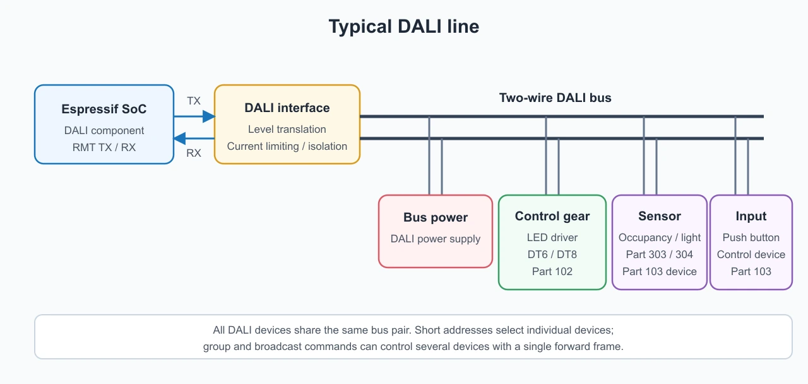

Digital Addressable Lighting Interface (DALI) is widely used to control lighting in commercial buildings. It provides more than switching: luminaires can be addressed individually, assigned to groups, dimmed, queried for status, and configured with behavior such as fade time and power-on level.

The [`dali` component](https://components.espressif.com/components/espressif/dali/) in ESP-IoT-Solution implements an IEC 62386 master on Espressif SoCs using the RMT peripheral. It provides APIs for control gear, input devices, occupancy and light sensors, and DT8 color control. This article introduces the component, walks through its main APIs, and shows how to use it as the DALI side of a Matter-to-DALI bridge.

## Introduction

This article is written for firmware developers who want to add DALI lighting control to an Espressif SoC project. Prior familiarity with ESP-IDF task and GPIO concepts is assumed. DALI protocol knowledge is not required, but having a DALI transceiver and at least one DALI control gear unit available for testing will make the hands-on sections more useful.

The article is organized as follows:

- **Why DALI** covers the motivation for using DALI over simpler lighting interfaces, the roles of devices on a DALI line, and the frame structure used by the rest of the protocol.
- **Inside the ESP DALI component** describes what the component implements, which IEC 62386 parts it covers, and how the API layers are organized.
- **Starting a DALI master** walks through driver initialization and the single transaction function used for commands, direct arc power control, and queries.
- **Commissioning control gear and input devices** explains how to discover and address Part 102 control gear and Part 103 input devices, and how to work with occupancy and light sensor instances.
- **Controlling DT8 color gear** shows the high-level color API for tunable-white and RGB luminaires, and explains what capability discovery is needed before sending color commands.
- **From a DALI controller to a Matter bridge** describes an architecture that combines the `dali` component with ESP-Matter to expose DALI luminaires and sensors as bridged Matter endpoints, covering attribute translation, state caching, and endpoint lifecycle.
- **Other solutions** briefly outlines what else can be built with the same component: MQTT gateways, daylight-harvesting controllers, commissioning tools, and multi-line controllers.
- **Designing for a real installation** covers the electrical interface, persistent inventory, OTA updates, diagnostics, and security considerations that a deployable product needs beyond a proof of concept.
- **Try the example** points to the `dali_basic` example and describes a staged bring-up sequence.

A working DALI master requires an external interface circuit between the SoC's 3.3 V logic and the DALI bus. That hardware requirement is noted throughout; the software examples assume the circuit is in place.

## Why DALI?

A conventional lighting circuit controls a group of lamps by switching their mains supply. DALI separates power from control. The luminaires remain powered, while a two-wire DALI bus carries digital commands between an application controller, control gear, and input devices.

This architecture provides several useful properties:

- **Individual and group control:** a DALI line supports up to 64 short-addressed control gear units and 16 groups. Broadcast commands are also available.
- **Bidirectional communication:** an application can query actual levels, device type, configuration, and failure status instead of assuming that a command succeeded.
- **Consistent dimming:** direct arc power control (DAPC) uses a standardized level range and stored fade parameters.
- **Distributed input devices:** switches and sensors can share the same bus with lighting control gear.
- **Color control:** IEC 62386-209, commonly known as DT8, defines color temperature, RGB/RGBWAF, primary-N, and XY color control. The component's high-level `dali_master_set_color()` helper supports CCT, RGB, and RGBWAF; XY operations remain available through raw DT8 commands.
- **Interoperability:** DALI is defined by the IEC 62386 series, allowing an application controller to work with compliant gear from different vendors.

DALI is a two-wire control bus with strict electrical and timing requirements. An Espressif GPIO must therefore **not** be connected directly to it. A DALI-compliant interface circuit is required between the SoC's 3.3 V signals and the DALI bus, which operates at a nominally higher voltage and requires current limiting and, depending on the design, galvanic isolation.

### The devices on a DALI line

IEC 62386 separates devices by role:

- **Control gear** receives lighting commands and drives a load. LED drivers, electronic ballasts, and emergency lighting gear are typical examples.
- **Control devices** generate information or make control decisions. Push-button couplers, occupancy sensors, light sensors, and application controllers belong to this category.
- **Bus power supplies and interfaces** provide the electrical conditions required by the bus and translate between the bus and the controller's logic domain.



*A typical DALI line. The Espressif SoC communicates through a compliant DALI interface circuit; the bus power supply, control gear, and input devices share the two-wire bus.*

The terminology matters when writing an application. Part 102 commands target control gear, while Part 103 commands target control devices and their individual instances. A sensor can contain more than one instance—for example, one physical unit may expose both an occupancy instance and an ambient-light instance.

Unlike a simple analog 0–10 V lighting interface, DALI carries addressed digital messages. Changing the level of short address 7 does not affect address 8, even when both drivers share the same pair of bus wires. A group command, on the other hand, lets several drivers act on one frame, producing synchronized changes without sending a separate command to every luminaire.

### Frames, timing, and replies

Before looking at the frame format, here are the terms used throughout the article:

| Term | Meaning |
| --- | --- |
| `Te` | The DALI half-bit period. Its nominal value is 416.67 µs, and protocol timing is expressed in multiples of `Te`. |
| DAPC | Direct Arc Power Control. A forward frame carries the target light-output level directly instead of an indirect command. |
| RMT | The ESP-IDF Remote Control Transceiver peripheral. The component uses it to generate and decode precisely timed Manchester symbols. |
| Forward frame | A frame sent by the application controller to DALI control gear or control devices. |
| Backward frame | A reply returned by a DALI device after a query. |
| DT6 | DALI device type 6, commonly used for LED control gear with dimming support. |
| DT8 | DALI device type 8, which adds color-control capabilities such as tunable white and multi-channel color. |

A Part 102 forward frame contains an address byte and a command or data byte. With the start and stop bits included, its wire time is 38 `Te`. A backward frame carries an 8-bit response and occupies 22 `Te`. The addressed device must answer inside the response window defined by the standard.

The meaning of the second byte depends on the selector bit in the address byte:

- For DAPC, it is an arc-power value.
- For an indirect command, it selects an operation such as OFF, STEP UP, RECALL MAX LEVEL, or QUERY STATUS.
- For special commands used during commissioning, the first byte selects the operation and the second byte carries its parameter.

Frames are short and tightly timed, so keep timing in the driver. The application should describe a transaction; the driver generates the waveform, waits for a reply in the response window, decodes it, and enforces the next legal transmission time.

## Inside the ESP DALI component

At the physical layer, DALI uses Manchester encoding with a nominal half-bit period, `Te`, of 416.67 µs. A master sends 16-bit forward frames and a queried device answers with an 8-bit backward frame. The timing of the response window and the gap between transactions are part of the protocol.

The component uses the RMT peripheral to generate and decode this waveform. This is a good fit because RMT handles precisely timed transitions in hardware, leaving the application to work with addresses, commands, and response bytes.

The current implementation provides:

- RMT-based Manchester transmission and reception, including polarity inversion for different interface circuits
- Short, group, broadcast, and special-command addressing
- IEC 62386-102 control gear commands, queries, DAPC, scenes, and configuration
- IEC 62386-103 control device commissioning and device- or instance-level commands
- IEC 62386-303 occupancy sensor helpers
- IEC 62386-304 light sensor helpers
- IEC 62386-209 DT8 high-level color control for CCT, RGB, and RGBWAF, with additional DT8 operations available through raw commands
- Automatic short-address assignment for Part 102 and Part 103 devices
- Automatic double transmission of configuration commands that must be sent twice within 100 ms
- Automatic insertion of the minimum inter-frame gap
- Independent handles, allowing multiple DALI master instances on different GPIO pairs

At the time of writing, the supported targets are ESP32, ESP32-S2, ESP32-S3, ESP32-C3, ESP32-C6, ESP32-H2, and ESP32-P4. The component uses the current RMT driver API and requires ESP-IDF v5.5 or later.

Most protocol layers are selected at compile time. Run `idf.py menuconfig`, open **Component config → DALI Component Configuration**, and enable the parts required by the application:

| Kconfig option | Capability |
| --- | --- |
| `DALI_PART102_ENABLED` | Part 102 control gear APIs |
| `DALI_PART209_ENABLED` | Part 209 DT8 color APIs; requires Part 102 |
| `DALI_PART103_ENABLED` | Part 103 input-device APIs |
| `DALI_PART303_304_ENABLED` | Parts 303/304 sensor helpers; requires Part 103 |

Part 101 physical-layer support is always included. Disabling unused protocol parts reduces the component's code footprint and hides APIs that are not relevant to the application.

### Software organization

The APIs are organized around the relevant IEC 62386 parts:

| Layer | Main responsibility |
| --- | --- |
| Part 101 and RMT driver core | Manchester TX/RX, frame timing, response decoding, and transaction serialization |
| Part 102 control gear | Addressing, DAPC, configuration, queries, scenes, groups, and commissioning |
| Part 103 control devices | Device and instance commands, input-device commissioning, and event handling |
| Parts 303/304 helpers | Typed occupancy- and light-sensor operations |
| Part 209 DT8 | Color capability queries and high-level CCT, RGB, or RGBWAF color control; raw commands cover additional DT8 operations such as XY |

The public transaction API is intentionally lower-level than a complete lighting application. It does not define rooms, automation rules, a user interface, or how the device list is stored. That split is useful in a commissioning tool and in a building gateway: the DALI transactions stay the same; the product decides how devices are named, grouped, exposed, and controlled.

## Starting a DALI master

The driver needs one transmit GPIO and one receive GPIO connected through the external DALI interface circuit. Initialization is handle-based:

```c
#include "dali.h"
#include "dali_command.h"

dali_master_handle_t dali;

dali_master_config_t dali_config = {
    .rx_gpio = GPIO_NUM_4,
    .tx_gpio = GPIO_NUM_5,
    .invert_tx = false,
    .invert_rx = false,
};

dali_master_rmt_config_t rmt_config = {
    .mem_block_symbols = 64,
};

ESP_ERROR_CHECK(dali_new_master_rmt(&dali_config, &rmt_config, &dali));
```

`invert_tx` and `invert_rx` make the driver adaptable to interface circuits whose logic path is inverted. The master handle owns the RMT resources and is passed to subsequent API calls.

### Sending commands and reading responses

All basic transactions use `dali_master_do_transaction()`. The configuration identifies the address, selects a command or a DAPC value, and specifies whether the command needs to be transmitted twice.

The following command recalls the maximum level of control gear at short address 0:

```c
dali_master_transaction_config_t tx = {
    .addr_type = DALI_ADDR_SHORT,
    .addr = 0,
    .is_cmd = true,
    .command = DALI_CMD_RECALL_MAX_LEVEL,
    .send_twice = false,
    .tx_timeout_ms = DALI_TX_TIMEOUT_MS,
};

ESP_ERROR_CHECK(dali_master_do_transaction(dali, &tx, NULL));
```

For direct arc power control, set `is_cmd` to `false` and put the arc power value in `command`. This example sets the same device to level 200:

```c
tx.is_cmd = false;
tx.command = 200;
ESP_ERROR_CHECK(dali_master_do_transaction(dali, &tx, NULL));
```

DALI queries use the same transaction function but supply a result pointer. The driver distinguishes a valid backward frame from no reply, a collision, or a decoding error.

```c
int result = DALI_RESULT_NO_REPLY;

tx.is_cmd = true;
tx.command = DALI_CMD_QUERY_ACTUAL_LEVEL;

ESP_ERROR_CHECK(dali_master_do_transaction(dali, &tx, &result));

if (DALI_RESULT_IS_VALID(result)) {
    ESP_LOGI("dali", "Actual level: %u", (unsigned)result);
}
```

The transaction API is blocking and automatically enforces the required inter-frame gap. It should be called from a normal task, not from an ISR or another time-critical context. In a larger application, a dedicated DALI task and command queue are a convenient way to serialize bus access.

### Addressing and group operations

An application can target four categories of addresses:

- **Short address:** one control gear or control device
- **Group address:** a configured set of control gear
- **Broadcast:** every applicable device on the line
- **Special command:** commissioning and data-transfer operations

Short addresses are best for state inspection and individual control. Groups are better when several luminaires must change together, because the bus carries only one command and all group members receive it at the same time. A typical controller uses group commands for room-level actions, then short-address queries to check status and catch mismatches.

DALI scenes are also useful locally. A scene number refers to a level stored in each participating gear unit. Recalling a scene takes one bus command; the gateway does not have to compute and send every output level at run time. For a connected product, cloud or Matter automations can trigger these local operations, and DALI still performs the time-critical work.

### Handling errors explicitly

A successfully transmitted forward frame does not necessarily mean that a target exists or accepted a command. Queries can produce a valid byte, no response, a collision, or a malformed response. Product firmware should keep transport status separate from device state and apply an intentional retry policy.

For example, a maintenance query that receives no reply can be retried later, while an interactive ON command may update the state cache optimistically and schedule a query to verify it. Repeated failures can mark a device as unreachable without blocking control of the rest of the line. This distinction matters when a bridge must update Matter attributes quickly and still report real DALI failures.

## Commissioning control gear and input devices

New or replaced DALI devices may not yet have short addresses. Commissioning discovers devices through their 24-bit random addresses and assigns unique short addresses.

For Part 102 control gear, a complete commissioning pass can be started with:

```c
uint8_t gear_count = 0;

ESP_ERROR_CHECK(dali_commission(
    dali,
    DALI_COMMISSION_ALL,
    0,                         // First short address
    64,                        // Maximum number of devices
    &gear_count,
    DALI_TX_TIMEOUT_MS));
```

Part 103 input devices have an independent short-address space and use a separate commissioning API:

```c
uint8_t input_device_count = 0;

ESP_ERROR_CHECK(dali_103_commission(
    dali,
    DALI_COMMISSION_ALL,
    0,
    64,
    &input_device_count,
    DALI_TX_TIMEOUT_MS));
```

After commissioning, an application can query the number and type of instances in each input device. The Part 303 helpers provide typed access to occupancy state, hold timers, and dead-time timers. The Part 304 helpers cover hysteresis, report-timer, and dead-time configuration. Part 304 light data obtained from event or raw instance values can be converted with `DALI_304_RAW_TO_LUX_FP()`; the component does not currently provide a dedicated high-level lux-query function.

The commissioning functions leave Part 103 devices in quiescent mode. This prevents unsolicited input-device traffic from interfering with the commissioning flow. Once the application is ready to process events, stop quiescent mode with the Part 103 device-command API—not the two-byte `dali_master_do_transaction()` path:

```c
#include "control_device.h"

ESP_ERROR_CHECK(dali_103_do_device_command(
    dali,
    DALI_ADDR_BROADCAST,
    0,
    DALI_103_STOP_QUIESCENT_MODE,
    true,
    DALI_TX_TIMEOUT_MS,
    NULL));
```

After this broadcast command completes, input devices can resume event reporting.

### What happens during commissioning?

At a high level, control-gear commissioning follows these steps:

1. Put all devices—or only unaddressed devices—into initialization mode.
2. Ask the devices to generate 24-bit random addresses.
3. Use a binary search with the search-address and `COMPARE` commands to isolate one device.
4. Program and verify a short address for that device.
5. Withdraw it from the current search and repeat until no devices remain.
6. Terminate the initialization sequence.

The component implements this algorithm for both control gear and input devices. The caller selects whether to commission all devices or only unaddressed ones and specifies the first short address and maximum count.

Commissioning changes persistent configuration in the DALI devices, so a production UI should make the operation explicit. Three product workflows are worth distinguishing:

- **Initial installation:** address every device and build a new inventory.
- **Add or replace:** commission only unaddressed equipment and preserve existing mappings.
- **Factory reset/rebuild:** intentionally discard previous address and endpoint assignments, then recommission the line.

After commissioning, the application should build an inventory by querying device type, version, group membership, levels, and DT8 capabilities. Store this inventory in Non-Volatile Storage together with product-level metadata such as room, user-visible name, Matter endpoint ID, and last-known status.

### From sensor data to local automation

Each Part 103 input device can expose one or more typed instances. The application can first query how many instances are present and then inspect each instance type. Type 3 identifies a Part 303 occupancy instance, while type 4 identifies a Part 304 light instance. Communication with these devices uses the Part 103 24-bit frame format rather than the Part 102 16-bit control-gear format.

Polling is straightforward and useful during discovery or recovery. Event-driven operation is more efficient for normal use: the controller processes input-device event frames and applies a policy locally. An example policy might be:

1. When occupancy changes to occupied, recall a working-light scene.
2. Process ambient-light data reported by the Part 304 instance.
3. Reduce the DAPC target when adequate daylight is available.
4. Start or update an occupancy hold timer.
5. After the area becomes vacant and the hold period expires, fade to a standby level and then switch off.

Keeping this policy on the Espressif device reduces latency. The installation can keep running when the upstream IP network is down.

## Controlling DT8 color gear

A DT8 device can control multiple color channels through one DALI short address. The high-level color API writes the required data transfer registers, enables the device type, and activates the temporary color value.

For example, an RGB luminaire at short address 4 can be set to red as follows:

```c
dali_color_val_t red = {
    .rgb = {
        .r = 254,
        .g = 0,
        .b = 0,
    },
};

ESP_ERROR_CHECK(dali_master_set_color(
    dali,
    DALI_ADDR_SHORT,
    4,
    DALI_COLOR_RGB,
    red,
    DALI_TX_TIMEOUT_MS));
```

Color temperature is expressed in Mirek (`1,000,000 / kelvin`). The following sets a CCT-capable luminaire to approximately 2700 K:

```c
dali_color_val_t warm_white = {
    .cct = {
        .mirek = 370,
    },
};

ESP_ERROR_CHECK(dali_master_set_color(
    dali,
    DALI_ADDR_SHORT,
    4,
    DALI_COLOR_CCT,
    warm_white,
    DALI_TX_TIMEOUT_MS));
```

Applications can query color capabilities before exposing controls to a user. This is especially useful when a DALI line contains a mixture of DT6 dimmable drivers and DT8 color drivers.

DT8 capability discovery should be part of the inventory process. Not every DT8 device supports every color representation. One gear unit may support only tunable white, another may expose XY coordinates, and another may implement RGBWAF channels. A user interface—or a Matter endpoint—should offer only operations that the gear actually supports.

Color commands also illustrate why a higher-level API is valuable. A single conceptual operation can require several DALI frames: write DTR registers, enable device type 8, send the color command, and activate the temporary value. `dali_master_set_color()` packages this sequence, reducing duplicated protocol code in the application.

## From a DALI controller to a Matter bridge

A Matter bridge presents non-Matter devices as Matter endpoints. On the Matter fabric, each bridged DALI luminaire looks like a regular Matter light even though its physical commands still travel over the DALI bus.

The `dali` component does not include a ready-made Matter bridge, and ESP-IoT-Solution does not currently provide a DALI-to-Matter bridge example. The following architecture describes one way to build such a product by combining the component with ESP-Matter.

An ESP-based DALI bridge can combine the `dali` component with [ESP-Matter](https://github.com/espressif/esp-matter):

```text
Matter controller or ecosystem
            |
      Wi-Fi / Ethernet
            |
+----------------------------------+
| Espressif SoC                    |
|                                  |
|  ESP-Matter                      |
|  - Aggregator endpoint           |
|  - Bridged lighting endpoints    |
|  - Attribute/event handling      |
|               |                  |
|  Mapping and state cache         |
|               |                  |
|  ESP DALI component + RMT        |
+---------------|------------------+
                |
       DALI interface circuit
                |
       DALI control gear/sensors
```

The bridge data model can map DALI capabilities to Matter device types and clusters:

| DALI capability | Matter representation | Translation example |
| --- | --- | --- |
| DT6 or other dimmable gear | Dimmable Light | `OnOff` and `CurrentLevel` become DALI OFF/RECALL or DAPC commands |
| DT8 tunable white | Color Temperature Light | `ColorTemperatureMireds` maps directly to the DT8 Mirek value |
| DT8 RGB or RGBWAF gear | Extended Color Light | Matter hue/saturation or XY values are converted to RGB or RGBWAF values accepted by the high-level DALI color API |
| Part 303 occupancy instance | Occupancy Sensor | DALI occupancy state updates the Matter occupancy attribute |
| Part 304 light instance | Light Sensor | Part 304 event or raw-instance data is converted to lux, then to the Matter illuminance representation |
| Gear status and failures | Diagnostics/application status | Periodic DALI queries update local state and can feed logs, telemetry, or vendor-defined diagnostics |

ESP-Matter provides endpoint APIs for aggregators, bridged nodes, dimmable lights, color-temperature lights, and extended-color lights. During DALI commissioning, the application can discover each gear unit, inspect its device type and color capabilities, and create the matching bridged endpoint. The DALI short address and Matter endpoint ID should be stored persistently so the mapping survives a reboot.

### Building the Matter endpoint tree

A typical bridge exposes a Root Node and an Aggregator endpoint. Each DALI device is represented by a bridged endpoint under that aggregator. The endpoint contains the appropriate lighting device type plus the Bridged Node behavior and identifying information such as a node label.

The endpoint lifecycle should follow the physical inventory:

1. Load the saved DALI inventory at boot.
2. Create the aggregator and one bridged endpoint for every retained device.
3. Restore the mapping from Matter endpoint ID to DALI line and short address.
4. Reconcile the saved inventory with the live bus in the background.
5. Add an endpoint when newly commissioned gear appears.
6. Remove an endpoint only after an explicit administrative action, not after one missed reply.

Stable endpoint IDs are important. If IDs change after every reboot, controllers may treat familiar luminaires as new devices or lose automations associated with them. The bridge should therefore persist the allocation and reuse it unless the user removes or resets the device.

### Keep the meaning when translating attributes

The translation layer needs more than a table of command codes. It must account for differences in state models:

- **On/off and level:** DALI level 0 is OFF, while levels 1–254 represent light output. The bridge must decide how a Matter ON operation restores a previous level and how it represents DALI mask values.
- **Transition time:** Matter and DALI express transitions differently. A bridge can use stored DALI fade parameters, configure an appropriate fade time, or approximate a requested transition with scheduled DAPC changes.
- **Color:** CCT maps directly because both sides use mired/Mirek values. Hue/saturation or XY requests can be converted to RGB or RGBWAF for the high-level DALI API, followed by clamping to the gear's reported capabilities. A design that targets native DALI XY can instead issue the relevant raw DT8 command sequence.
- **Groups and scenes:** Matter groups are endpoint collections on the Matter side, while DALI groups are stored in the gear. A product can maintain a mapping, but should define which side is authoritative.
- **Reachability:** one missed backward frame should not immediately make an endpoint unreachable. A threshold and recovery policy avoids user-visible flapping on a busy or noisy bus.

The bridge should validate values before placing them on the bus. For example, a requested color temperature must be constrained to the gear's physical coolest and warmest limits. The applied value should be written back to the Matter attribute store so controllers see the actual state rather than the unsupported request.

There are two directions to keep synchronized:

1. **Matter to DALI:** an attribute write from a Matter controller is queued to the DALI task and translated to a command. For example, a level write becomes DAPC, while a color-temperature write becomes a DT8 CCT operation.
2. **DALI to Matter:** a DALI query or input-device event updates the corresponding Matter attribute and reports the change to subscribed controllers.

The bridge should not issue a new query for every Matter read. DALI is a low-data-rate shared bus, so synchronous reads would increase latency and bus load. A state cache, updated after successful commands and by scheduled polling, keeps Matter reads fast without overloading the bus. Writes should be coalesced when a controller generates rapid level or color transitions, while safety- or presence-related events should receive higher priority.

A practical scheduler can divide work into priority classes:

| Priority | Typical traffic |
| --- | --- |
| High | User commands, occupancy events, and urgent recovery operations |
| Medium | State verification after writes and sensor updates |
| Low | Inventory scans, periodic status queries, and maintenance telemetry |

Only the DALI worker task should own the driver handle. Matter callbacks, network handlers, and local automation tasks submit requests to its queue. The worker can then:

- Coalesce repeated level writes
- Keep multi-frame DT8 operations together
- Apply the selected retry policy
- Prevent unrelated tasks from interleaving protocol sequences

### Choosing an Espressif platform

The component runs on several Espressif SoCs, so the product can be sized around its upstream connectivity and user interface:

- A Wi-Fi SoC can implement a compact Matter-over-Wi-Fi or MQTT-to-DALI gateway.
- A device with Ethernet support can target fixed commercial installations where wired networking is preferred.
- An ESP32-C6 or ESP32-H2 can be used when the product also needs IEEE 802.15.4, depending on the Matter transport.
- An ESP32-P4 can host a richer local display or gateway application, with connectivity supplied according to the board design.

The final selection should also consider:

- Matter endpoint count
- Persistent inventory size
- OTA image and flash-partition layout
- Product security requirements
- Memory and processing demands from concurrent protocol stacks or a graphical UI

This is a useful retrofit: an installed DALI lighting system can be controlled from Matter without replacing luminaires or drivers. Local DALI groups and scenes can stay the fast path for synchronized lighting, while Matter provides discovery, user control, automation, and interoperability with other device types.

## Other solutions that use the component

Matter bridging is one option. The same component also supports:

- **IP-to-DALI gateways:** expose lighting control and status through MQTT, REST, or another building-management protocol.
- **Occupancy- and daylight-aware lighting:** combine Parts 303 and 304 input devices with local policies to reduce energy use without requiring cloud connectivity.
- **Commissioning and maintenance tools:** discover devices, assign addresses, identify DT6 and DT8 gear, inspect configuration, and report lamp or control-gear failures through a local UI.
- **Multi-line lighting controllers:** use independent driver handles and interface circuits to operate more than one DALI line from a capable Espressif platform.
- **Cloud-managed commercial lighting:** keep time-critical control local while sending inventory, energy-related state, faults, and maintenance information to a backend.
- **Controllers with other radios:** combine DALI lighting with Wi-Fi, Ethernet, Thread, Zigbee, or Bluetooth, using the radios available on Espressif chips.

These architectures can preserve DALI's deterministic local groups and scenes. If the IP network or cloud connection is unavailable, the application controller can continue to process DALI input events and run local lighting policies.

## Designing for a real installation

A proof of concept can send DALI commands from a single task. A deployable controller needs to address electrical, lifecycle, and service considerations as well.

### Electrical interface and isolation

The external interface must satisfy the DALI bus voltage, current, polarity, and timing requirements. The TX path needs a compliant way to pull the bus low, while the RX path must translate the bus state into safe logic levels. If the product requires galvanic isolation, choose components and PCB clearances for the relevant installation category. The `invert_tx` and `invert_rx` options accommodate the logical polarity of the selected circuit, but they do not replace electrical compliance testing.

### Persistent data and recovery

Persist at least the DALI short address, device role, capabilities, Matter endpoint ID, and a record version. Use a transactional update strategy so a power loss during commissioning cannot leave a partially written inventory. On boot, restore service quickly from the saved inventory and reconcile it asynchronously rather than blocking the whole product on a full scan.

### OTA updates and schema migration

A connected bridge should support signed OTA updates and rollback. Inventory formats and endpoint metadata may change between firmware releases, so include a schema version and migration path. An update must not silently recommission the bus or replace endpoint IDs, because either action can disrupt an installed lighting system and its Matter automations.

### Diagnostics

Useful field diagnostics include:

- Frame and response counters by result category
- Last-seen time and consecutive-failure count for each address
- Bus utilization and queue depth
- Commissioning history and address allocation
- Reported gear status, lamp failure, and power-failure flags
- Detected device type, version, and DT8 capabilities
- Matter endpoint-to-DALI address mapping

Rate-limit detailed logs in normal operation, but retain compact counters and recent error history. These records make it much easier to distinguish a failed driver, wiring fault, address conflict, overloaded bus, and upstream network problem.

### Security boundaries

DALI itself is a local control bus, while a Matter or cloud gateway creates a path from an IP network to physical lighting. Treat commissioning, device removal, factory reset, and firmware update as privileged operations. Matter fabric credentials, product certificates, network credentials, and any cloud keys must be protected using the security facilities appropriate to the chosen SoC and product threat model.

## Try the example

To get started, explore the [component source code](https://github.com/espressif/esp-iot-solution/tree/master/components/dali), read the [documentation](https://docs.espressif.com/projects/esp-iot-solution/en/latest/electrical_lighting_solution/dali.html).

The [`dali_basic` example](https://github.com/espressif/esp-iot-solution/tree/master/examples/lighting/dali_basic) demonstrates the complete flow: Part 102 and Part 103 commissioning, DT6/DT8 detection, DAPC dimming, sensor access, color control, simultaneous effects, and query commands.

Before running it, connect the selected GPIOs through a compliant DALI transceiver and verify the transmit and receive polarity. Never connect the DALI pair directly to the SoC. Then configure the example for the required protocol parts, build it with ESP-IDF, flash the target, and monitor the commissioning log.

A useful bring-up sequence is:

1. Validate the interface with a known control gear unit and a broadcast ON/OFF command.
2. Send `QUERY_CONTROL_GEAR` and verify that a valid backward frame is decoded.
3. Commission a small line and confirm that every gear unit receives a unique short address.
4. Query actual level and device type for each discovered address.
5. Add a DT8 device and verify its reported color capabilities before sending color commands.
6. Add a Part 303 or Part 304 input device, inspect its instances, then enable event processing.
7. Introduce the application queue, persistent inventory, and upstream protocol only after the DALI line is stable.

This staged approach separates physical-layer and bus issues from Matter, cloud, or application logic. A logic analyzer on the logic side of the transceiver and detailed transaction result logging are particularly useful during the first two steps.

The [ESP DALI programming guide](https://docs.espressif.com/projects/esp-iot-solution/en/latest/electrical_lighting_solution/dali.html) contains the full API reference, timing notes, and command definitions.

## Conclusion

The ESP DALI component implements a practical IEC 62386 master on the RMT peripheral, with APIs for commissioning, addressing, control, queries, sensors, and DT8 color. An application can start as a standalone DALI controller and later add gateway features without reimplementing physical-layer timing.

Combined with Espressif SoC connectivity and ESP-Matter's bridge data model, it can also be the DALI side of a Matter-to-DALI bridge: existing DALI luminaires can appear as Matter lights, and the controller can still use DALI sensors and status queries for local automation.
