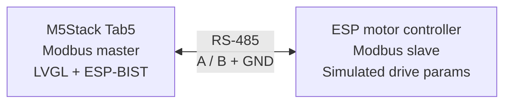

## Introduction

Somewhere on a factory floor, a motor is doing exactly what it's supposed to do. It's turning at 1400 RPM, the bearings are inside tolerance, the winding temperature is climbing the way it climbs on a normal day. None of that is the interesting part.

The interesting part is the screen bolted next to it, the one telling an operator that everything is fine. Here's the thing about that screen: it's also just a microcontroller. It has RAM that can flip a bit. It has a CPU core that can execute the wrong instruction and never tell anyone. And if that happens quietly enough, the display keeps saying "OK" long after "OK" stopped being true.

That gap between a system that works and a system that can *prove* it's working is what [IEC 60730](https://en.wikipedia.org/wiki/IEC_60730) exists to close, and it's what [ESP-BIST](https://github.com/espressif/esp-bist) provides to help you close on Espressif silicon.

This article covers three things, in order: what ESP-BIST actually tests, why that matters for something such as an HMI, and how we put it to work on an [ESP32-P4](https://www.espressif.com/en/products/socs/esp32-p4)-powered HMI that talks Modbus to a simulated drive and shows its work on an LVGL touchscreen.

## What Built-In Self Test actually tests

BIST stands for Built-In Self Test, and it's exactly what it sounds like: routines that ask the hardware "are you still the hardware I think you are?" and get a verifiable answer back. [ESP-BIST](https://github.com/espressif/esp-bist) is Espressif's implementation of that idea: an LGPL-3.0 library of self-test routines aimed at applications that can't afford to find out the hard way that a core register got stuck.

The library doesn't test one thing. It tests the list of things that quietly ruin a control loop:

| What it checks | Why it matters |
|---|---|
| CPU registers and CSRs | A stuck-at fault here corrupts every calculation downstream |
| Program counter | Proves execution is actually flowing through the code you wrote |
| CPU stack | Catches overflow before it corrupts adjacent memory |
| RAM (March A, March X, Abraham) | Finds stuck bits and, with Abraham, coupling faults between cells |
| Flash (CRC) | Confirms the firmware you're running is the firmware you flashed |
| Clock sources | Detects a drifting or dead crystal before timing assumptions break |
| Watchdog | Guarantees the last line of defense actually fires |
| GPIO / ADC | Plausibility-checks the analog and digital world outside the SoC |

None of this runs once and forgets about it. ESP-BIST structures testing into two phases. **Post-boot** tests run once, right after startup, and they're thorough: full RAM sweeps, flash CRC, etc, because at boot you have enough time to be paranoid. **Runtime** tests run continuously in the background, lighter-weight by necessity, with configurable period as to minimize disruption on main control loop. If either phase turns up something wrong, the library doesn't shrug and continue: it forces a safe state.

On SoCs with a low-power RISC-V core (the ESP32-C5, ESP32-C6, and the ESP32-P4 we'll be using) ESP-BIST goes a step further with a feature called **Host Diagnostics**. The LP core runs its own self-tests as a **safety companion core** and then turns around and supervises the main application core. It's not a passive observer. The LP side issues timed cryptographic challenges that the main application has to answer correctly and on time, runs its own watchdog independently of anything the application does, and — this is the part that matters — owns the decision to force a safe state. The application can log a failure. It cannot talk its way out of one.

## What IEC 60730 actually asks for

IEC 60730-1 is titled “Automatic electrical controls – Part 1: General requirements” in the current 2022 edition. The scope matters because Class A, B, and C are classifications of control functions, not categories of appliances. Class A functions are not intended to be relied upon for the safety of the application; examples include timers and lighting controls. Class B functions are intended to prevent unsafe operation of the controlled equipment, with examples including thermal cutoffs and door locks in laundry equipment. Class C functions are intended to prevent special hazards, such as those associated with automatic burner controls or thermal cutouts for closed, unvented water-heater systems. Annex H specifies requirements for electronic controls and software implementing Class B and C control functions, including measures for detecting, controlling, or otherwise mitigating specified faults and errors rather than simply assuming that the control electronics will operate correctly.

ESP-BIST is built to that target, and it's specific about which tier each test reaches. As an example, the March algorithms cover the Class B baseline for RAM. Where the library wants more, it adds the Abraham algorithm on top, which reaches Class C-level coverage for coupling faults between memory cells (a case where two supposedly independent bits fail together), which March-style tests alone won't always catch.

The project backs this up with a documented, IEC 60730 Table H.1 requirements map, and the numbers are worth quoting exactly rather than rounding up:

> "Requirements Coverage: 100% of IEC 60730 Table H.1 components are implemented and tested"
>
> [`Requirements Coverage`](https://github.com/espressif/esp-bist/blob/main/docs/en/coverage_analysis.rst), ESP-BIST documentation

That is a genuinely useful claim, and it's also not the whole story, so let's be precise about what it does and doesn't mean. It means every self-test component the standard's Table H.1 asks for has a corresponding implementation and a corresponding test case with recorded results. It does not mean ESP-BIST hands you a certified product. The library's own Host Diagnostics documentation says so directly:

> "Status: Architecture and implementation overview (not a certified safety claim)"
>
> [`Host Diagnostics.rst`](https://github.com/espressif/esp-bist/blob/main/docs/en/host_diagnostics.rst), ESP-BIST documentation

The same document is equally direct about the LP core's limits as a supervisor: it's a valid software watchdog, sharing die, power, and clock domains with the very core it's watching. That's a real and useful line of defense. It is not, on its own, the kind of physically independent safety channel that an external watchdog IC or a second MCU would provide. If a product needs that stronger, hardware-independent guarantee, ESP-BIST's own documentation tells you to add it and it doesn't pretend the LP core is something it isn't.

Certification is a process you run on a finished product, with a test house, a safety case, and your own name on it. What ESP-BIST gives you is the traceable, documented self-test coverage that process is built on top of.

## Why a motor controller cares about any of this

A fully industrial motor drive isn't, strictly speaking, what IEC 60730-1 is scoped for. That document is about household and similar controls, and a heavy industrial drive more often lives under an adjacent standard like IEC 61800-5-1. But the underlying discipline is identical, which is exactly why motor control keeps showing up as the example whenever people explain Annex H: a motor drive that misreads its own speed feedback, or fails to notice an overcurrent condition, doesn't fail quietly. Detecting a fault in the control electronics before it becomes a fault in the controlled equipment is the same job whether the nameplate says "washing machine" or "conveyor drive", only the paperwork governing it changes.

But there's a second machine in this story that gets less attention: the display. Somewhere near that motor is a human-machine interface, and its entire job is to tell a person the truth. "Motor running at setpoint." "Overspeed alarm." "System fault: do not approach." Every one of those is a safety-relevant claim, and every one of them is only as trustworthy as the silicon rendering it.

Here's the uncomfortable question that follows: if the HMI itself never checks its own health, what's actually backing up its claims? A touch interface needs a real applications processor: enough RAM for a graphics library, enough compute for a responsive UI, enough peripherals for a serial link to the thing it's monitoring. Historically, that's meant reaching for a chip that's good at graphics and bad at self-certifying, and bolting a separate, minimal safety controller on the side to do the part that actually matters. Two chips, two firmware images, two things to keep synchronized.

The [ESP32-P4](https://www.espressif.com/en/products/socs/esp32-p4) is interesting here specifically because it doesn't force that trade. It's a dual-core high-performance RISC-V applications processor (the part capable of running LVGL, decoding a touch panel, driving a display over MIPI DSI) with a low-power RISC-V core sitting alongside it. ESP-BIST's Host Diagnostics architecture uses that LP core exactly the way we described above: it self-tests, then it supervises the HP core running your actual interface. One chip. One board. A UI processor that can also make a credible, documented claim about its own integrity, instead of an HMI that just hopes the graphics chip is behaving.

That's the setup we built a demo around.

## Enter BIST HMI

The demo application BIST HMI puts this into a concrete, physical loop. There are two boards involved, playing two very different roles.

The [M5Stack Tab5](https://docs.m5stack.com/en/core/Tab5) is an ESP32-P4 devkit with a built-in touch display that runs the HMI firmware: the LVGL interface, the ESP-BIST Host Diagnostics Agent on the HP core, while the LP Core runs Host Diagnostic Companion, and a Modbus RTU **master**. A second, separate ESP board runs a small firmware that simulates a motor drive and answers as a Modbus RTU **slave** at address 1, exposing exactly the kind of registers a real drive would expose. The two talk over RS-485, the workhorse physical layer of industrial control, because if you're going to demo an industrial pattern, you should demo it over the wiring industrial engineers actually use.

The register map looks like the following:

| Type | Field | Meaning |
|---|---|---|
| Coil | `motor_on_off` | Motor power command |
| Discrete input | `overspeed_alarm` | Overspeed alarm flag |
| Holding register | `motor_speed_setpoint` | Target speed (RPM) |
| Holding register | `critical_speed` | Overspeed threshold |
| Input register | `motor_current_speed` | Actual speed (RPM) |
| Input register | `motor_temperature` | Motor temperature (°C) |

The HMI application polls that register set continuously, drives the ON/OFF coil, and mirrors everything it reads onto the touch UI. Nothing about that part is novel. Modbus master polling a slave is one of the oldest patterns in industrial automation. What's different is what happens *before* any of that polling is allowed to start.

## The boot gate: no self-test, no motor control

This is the part of the demo that actually earns the word "safety" instead of just decorating with it.

When the ESP32-P4 boots the HMI application, the HP core tells LP core to wake up and run its post-boot self-test battery (CPU registers, CSRs, a full RAM sweep, flash CRC). Only after that battery passes does the LP core report a passing status to the application core over the Host Diagnostics protocol. And only after the application core receives that passing status does the firmware do anything else. The display doesn't come up. The Modbus master doesn't initialize, there is no HMI, and there is no motor control, until the chip has proven to itself that it's fit to run either.

That ordering isn't an implementation detail but the entire argument. An HMI that starts polling a motor controller regardless of its own health is a liability with a nice UI. An HMI that refuses to even display a screen until it's checked itself is a system making a claim it can actually back up.

It doesn't stop at boot. ESP-BIST's runtime tests keep running for the life of the session with lighter checks, continuously, in the background. If one of them fails while the motor is running, the response isn't a log message or a subtle icon change. The firmware tells the motor controller to cut motor power immediately (in this example), clears any pending Modbus commands, and switches the display to a plainly labeled halted state. The self-test is wired directly into the actuator path.

## Walking the interface

The UI itself, built in LVGL, is an illustration of what you'd find on a real HMI panel.



The screen is split cleanly between "what the motor is doing" and "what the chip thinks of itself":

- **Motor controls** — ON/OFF buttons that write the `motor_on_off` coil, and a target-speed stepper that adjusts `motor_speed_setpoint` in 100 RPM increments, defaulting to 1000 RPM.
- **Live motor status** — actual speed and temperature, read straight from the slave's input registers every polling cycle.
- **BIST status, twice over** — separate labels for post-boot and runtime results, because they answer different questions ("was the chip healthy when it woke up" versus "is it still healthy right now"), and an HMI worth trusting should let you tell them apart.
- **Overspeed alarm** — a direct readout of the slave's `overspeed_alarm` discrete input.



And then there's the screen nobody wants to see:



That third image is the one that matters most. Any interface can show a green checkmark. The interesting engineering is in what happens the moment the checkmark should turn red and here, "should turn red" and "does turn red, immediately, with the motor already off" are the same event.

## Where this leaves you

Strip away the motor and the RS-485 cable and the LVGL polish, and the chain of reasoning is short: ESP-BIST gives an Espressif SoC a documented, traceable way to test its own hardware against IEC 60730 Class B expectations, with Host Diagnostics extending that self-knowledge from a small LP supervisor to a full applications processor. That's what let us put a real graphical interface (the kind that needs a capable chip like the ESP32-P4) directly in the safety loop of an industrial control system, instead of treating the display as an afterthought bolted onto a "real" safety controller.

None of that makes BIST HMI a certified product, and it isn't trying to be one. It's a reference pattern: boot gate first, continuous self-test second, fail-safe actuator control third, and only then, a screen you have good reason to believe.

ESP-BIST is available at [ESP-BIST page](https://github.com/espressif/esp-bist). The demo from this article is at [esp-bist-hmi](https://github.com/fdcavalcanti/esp-bist-hmi) if you want to start wiring the same pattern into your own HMI.
