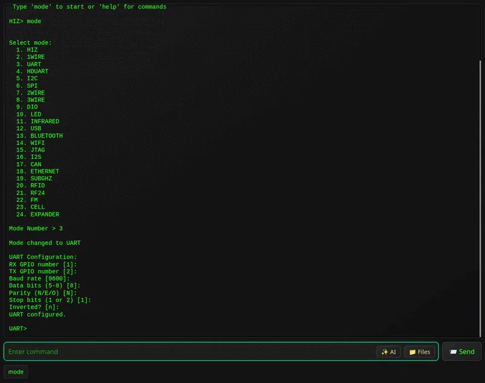
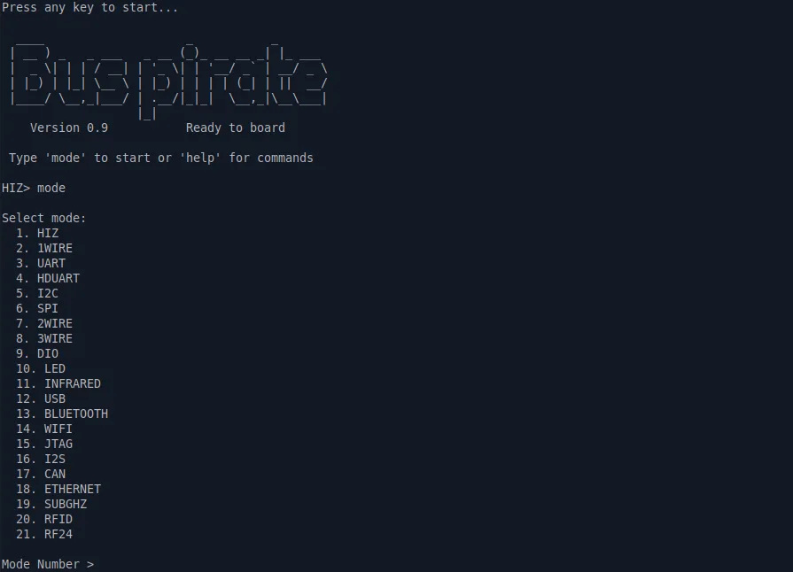
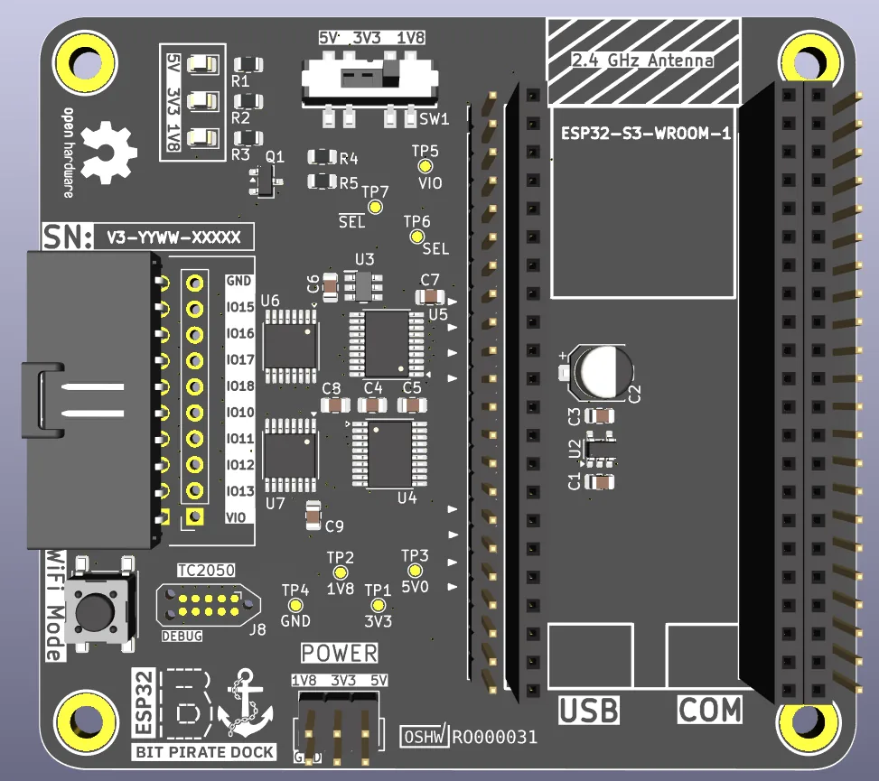
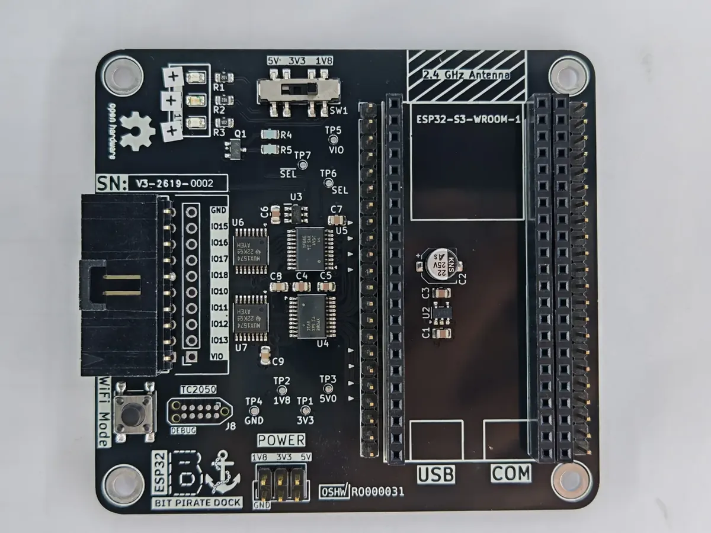
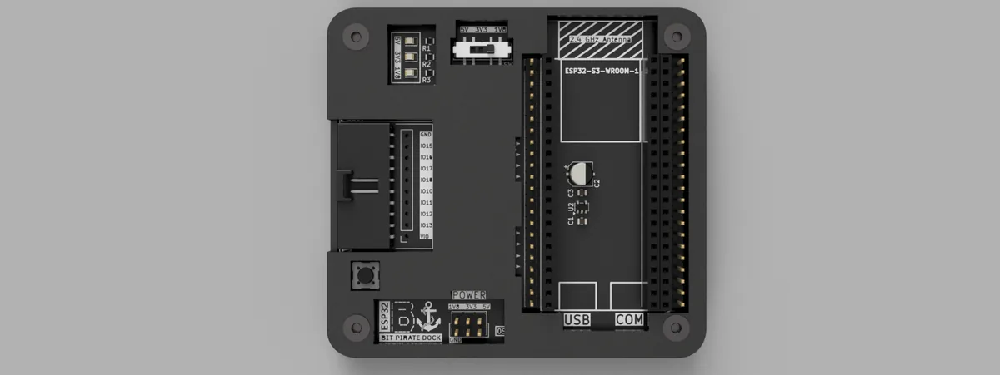
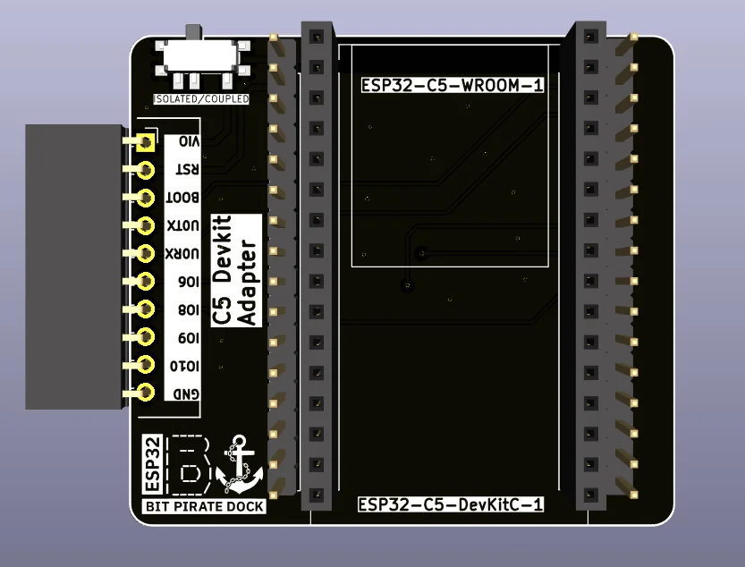

## One board on the bench, most of the bus protocols you meet

Seat an ESP32-S3 DevKit in the dock, flash it, and you have a single tool on the bench that talks I2C, SPI, UART, JTAG, SWD, CAN, 1-Wire and about fifteen more protocols — at 1.8 V, 3.3 V or 5 V, driven from a browser or a serial terminal, scriptable, and with a second radio available when you want dual-band Wi-Fi work in the same session.

That capability is spread across three open-source projects that fit together. [ESP32 Bit Pirate](https://github.com/geo-tp/ESP32-Bit-Pirate) is the firmware, by [geo-tp](https://github.com/geo-tp). [ESP32-Bus-Expander](https://github.com/geo-tp/ESP32-Bus-Expander) is the companion firmware that brings an ESP32-C5 in as a radio coprocessor. The [ESP32-Bit-Pirate-Dock](https://github.com/AndreiVladescu/ESP32-Bit-Pirate-Dock) is the open hardware we designed to carry the dev kit and the C5. This article walks through what each one adds.

## The firmware: twenty-plus modes and three ways to drive them

[ESP32 Bit Pirate](https://github.com/geo-tp/ESP32-Bit-Pirate) takes its inspiration from the original [Bus Pirate](https://buspirate.com/) and rebuilds the idea on an ESP32. It ships more than twenty modes. On the wired side that covers I2C, SPI, UART and half-duplex UART, 1-Wire, 2-Wire and 3-Wire, smartcard work including SLE4442, JTAG and SWD, CAN, I2S, USB in CDC, HID, MSC and host roles, and Ethernet. On the wireless side it covers Wi-Fi, BLE, Sub-GHz with CC1101, RFID, RF24, FM and RDS, plus infrared and addressable LED control.

Layered on top of the raw modes is the tooling that makes a mode useful: bus scanners, protocol sniffers, EEPROM and flash dumpers, logic capture, bridging, flashing, and register-level pokes.

You drive it three ways, and they are genuinely interchangeable:

- **Serial**, over USB from any terminal. The fastest path, and the one to reach for on bulk dumps.
- **Web CLI**, served over Wi-Fi straight from the device to a browser. Nothing to install — no PuTTY, no minicom.
- **Standalone**, on boards that bring their own keyboard and screen, such as the M5 Cardputer.

It runs on ESP32-S3 boards with 8 MB of flash or more. Supported targets include the ESP32-S3-DevKitC-1, the M5 Cardputer, M5 StickC Plus 2 and StickS3, the LILYGO T-Embed and T-Embed CC1101, and the Seeed Studio XIAO ESP32-S3. The [web flasher](https://geo-tp.github.io/ESP32-Bit-Pirate/webflasher/) puts it on a board from the browser in a couple of clicks.

## Scripting: the part that turns a session into a tool

Interactive commands are where you start; scripting is where the time savings are. The firmware supports Python scripting, so a sequence you worked out by hand at the prompt — select a mode, configure the bus, scan, read a register block, dump to a file — becomes something you run again on the next board without rediscovering it.

The project also publishes a growing set of [recipes](https://geo-tp.github.io/ESP32-Bit-Pirate/recipes/): worked end-to-end procedures for specific jobs, which double as a good way to learn what the modes can do.

## The dock: three I/O voltages and the Bus Pirate probe ecosystem

The [ESP32-Bit-Pirate-Dock](https://github.com/AndreiVladescu/ESP32-Bit-Pirate-Dock) is a carrier board. The ESP32-S3-DevKitC-1 drops into headers on top, and the I/O lines come back out through bidirectional level translation at a voltage you select with a slide switch: **1.8 V, 3.3 V or 5 V**. The 1.8 V rail is generated on the board, so low-voltage targets need nothing external. Third-party DevKit clones fit as well, provided the header layout and board dimensions match the official kit.

The translation is direction-sensing, which lets the dock stay completely transparent to the firmware: Bit Pirate reassigns the same physical pins as you move between modes, and the dock follows along without being told. Status LEDs and the boot button stay reachable once the dev kit is seated under the carrier.

The I/O comes out on a 10-pin connector that lands in the existing Bus Pirate ecosystem of probe cables, hooks and adapters, so the accessories are off-the-shelf rather than something you have to build.

One operational note worth stating plainly: connect peripherals at the voltage you have selected, and confirm the switch position before powering up a target.

The board is on revision V3, and the design is fully open. KiCad schematic and layout live in `dock/kicad/`, fabrication outputs in `dock/gerbers/`, the bill of materials in `dock/BOM.csv`, and a two-piece FDM-printable enclosure in `dock/3d_models/` that prints on a 0.4 mm nozzle.

## The C5 adapter: a dual-band radio alongside the S3

The second companion is the one we find most interesting, because it is really about putting two Espressif SoCs to work together.

The **ESP32-C5** is Espressif's dual-band RISC-V SoC, covering 2.4 GHz and 5 GHz. Pairing it with the S3 rather than swapping to it keeps the S3's peripheral set and everything the firmware already does with it, and adds the C5's radio next to it as a coprocessor.

[ESP32-Bus-Expander](https://github.com/geo-tp/ESP32-Bus-Expander) is the firmware for that role. It runs on an ESP32-C5 with 4 MB of flash and no PSRAM requirement, and exposes the C5's radio to the main device. The link between the two is refreshingly plain: **three wires — RX, TX and GND — over UART**, with the port configuration in `platformio.ini`. Bit Pirate detects the expander once it is connected and takes it from there.

Today that adds 5 GHz Wi-Fi work to a session running on the S3. Next on the list is IEEE 802.15.4, which opens the door to Zigbee, Thread and Matter targets from the same tool.

The `c5_adapter/` directory of the dock repository holds the KiCad design for the board that seats an ESP32-C5-DevKitC-1 alongside the dock, so the pairing is a module you plug in rather than three flying leads. A header brings out the UART pair and ground for the link, along with VIO, RST, BOOT and a few GPIOs, and a switch selects between isolated and coupled operation.

## Putting one together

The pieces are three repositories that fit together rather than a kit you buy in one go.

1. **Source an ESP32-S3 DevKit** — genuine Espressif or a dimensionally compatible clone. It is deliberately not part of the dock design, so you supply it.
2. **Fabricate the dock.** Send `dock/gerbers/` to a fab house and populate from `dock/BOM.csv`.
3. **Print the case**, optionally, from `dock/3d_models/`.
4. **Seat the dev kit and select your I/O voltage** before connecting anything.
5. **Flash [ESP32 Bit Pirate](https://geo-tp.github.io/ESP32-Bit-Pirate/webflasher/)** and start probing.
6. **Add the C5** for the second radio: build the adapter from `c5_adapter/`, flash [ESP32-Bus-Expander](https://github.com/geo-tp/ESP32-Bus-Expander) onto it, and wire the three UART lines.

## Licensing and credits

The Bit Pirate and Bus Expander firmware are geo-tp's work, and the dock and C5 adapter were designed to serve them. The CLI screenshots above come from the ESP32 Bit Pirate project.

The dock hardware design files are licensed **CERN-OHL-W-2.0**. Documentation and images in that repository are **CC BY 4.0**. Third-party silicon, datasheets and trademarks remain with their owners.
