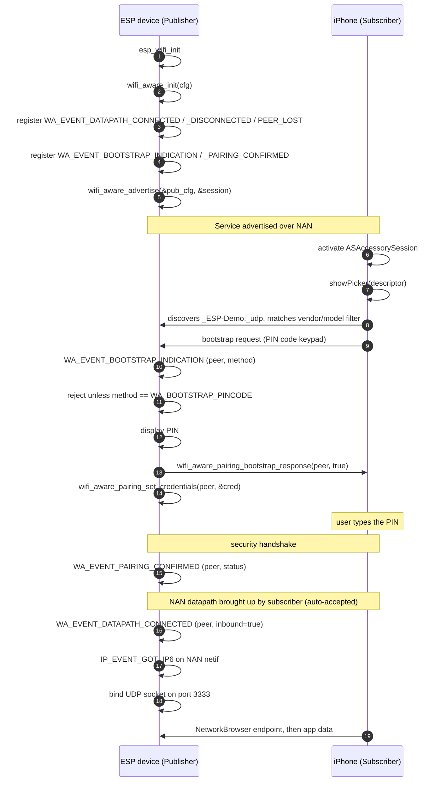

## Introduction

Establishing direct Wi-Fi communication between an iPhone device and an IoT device has always been a complex process. One way to achieve this is to bring the device into your local network first, which involves multiple steps of discovery (typically over BLE), entering credentials and provisioning. Another way is to make the device bring up its own SoftAP and connect to it. Although iOS has streamlined this process, it still makes the iPhone lose its Wi-Fi connectivity with the Access Point.

**Wi-Fi Aware**, also known as Neighbor Awareness Networking (NAN), is the Wi-Fi Alliance standard that fills this gap. Devices synchronize into a cluster, advertise and discover services, optionally pair if required, and then set up a direct, high-bandwidth encrypted data link between two peers, opening up socket-level communication over IPv6. There is no access point, no DHCP server, and no internet connection involved.

Apple announced Wi-Fi Aware support at WWDC 2025 and shipped it with **iOS 26**. Apple's implementation makes Wi-Fi Aware a concurrent interface, which means that while communicating over Wi-Fi Aware an iPhone does not lose its Wi-Fi connectivity. But the real reason to care is that every recent iPhone (iPhone 12 and newer) and a long list of iPads (iPad 10th generation, iPad Air 4th generation, iPad mini 6th generation, and the recent iPad Pro models, and newer) support it once they are upgraded to iOS 26 or iPadOS 26. See the full list of eligible devices and further details in Apple's [Wi-Fi Aware documentation](https://developer.apple.com/documentation/wifiaware).

Wi-Fi Aware has been supported in Android since 8.0, but its adoption failed for various reasons. One was limited support from Android vendors; another was Android's implementation, which left messaging and naming conventions up to each application.

## Why iOS support changes the design

Apple took a different approach: the iOS [Wi-Fi Aware framework](https://developer.apple.com/documentation/wifiaware) hides away the protocol dials and exposes just a few necessary APIs, simplifying the task for application developers. That standardizes three things across every app:

- **Naming follows DNS-SD.** A service is identified by a string like `_ESP-Demo._udp`, following [RFC 6763](https://www.rfc-editor.org/rfc/rfc6763) and [RFC 6335](https://www.rfc-editor.org/rfc/rfc6335), and it must be declared up front in the app's `Info.plist`.
- **Pairing is mandatory and always uses a six-digit PIN.** There is no open datapath and no password-based security. iOS always uses Wi-Fi Aware Pairing and performs the key exchange internally.
- **The transport is the Network framework.** Once paired, the app opens an ordinary connection through the `NetworkConnection` API, with no Wi-Fi Aware parameters left to manage.

> [!NOTE]
> The latest Wi-Fi Aware standard v4.0 added pairing support, with WPA3-PSK equivalent security protocol. This has been adopted by Apple and mandated for compatibility.
> Read Apple's [Accessory Design Guidelines](https://developer.apple.com/accessories/Accessory-Design-Guidelines.pdf) for the full Wi-Fi Aware interoperability requirements.

This push for Wi-Fi Aware by Apple hasn't gone unnoticed, and slowly but steadily the industry is catching up.

At Espressif, we've also upgraded our security standards to match the latest specifications and closed the gap with Apple's implementation. A new component [wifi_aware](https://components.espressif.com/components/espressif/wifi_aware) is specifically built for this purpose. It implements the DNS-SD naming and discovery conventions on top of the Wi-Fi Aware protocol, so that applications are compatible with iOS out of the box.

> [!NOTE]
> For ESP-to-ESP or ESP-to-Android communication, any security standard or even no security can be chosen. The higher-security restriction is iOS-specific.

## How to get started

### On the ESP side

You need ESP-IDF **v6.1** or newer and a chip with Wi-Fi Aware support, such as the ESP32-C5 used throughout this article. Check the component [README](https://components.espressif.com/components/espressif/wifi_aware) for the current target list.

> [!NOTE]
> Wi-Fi Aware Pairing and datapath security ship as experimental features in ESP-IDF v6.1. Earlier releases support discovery and open datapaths only, which iPhones cannot connect to.

The quickest way to get a working project is to start with the component's `udp_server` example. If you use VS Code, open the Command Palette and run **> ESP-IDF: Show ESP Component Registry**. Find the `wifi_aware` component, navigate to the `udp_server` example, and click **Create project from this example**. Open the new project, run **> ESP-IDF: Select Project Configuration**, and choose **iOS compatible pairing config** before building and flashing.

Terminal users can run the following commands after activating an ESP-IDF v6.1 environment:

```bash
idf.py create-project-from-example "espressif/wifi_aware=0.1.0:udp_server"
cd udp_server
idf.py --preset ios set-target esp32c5 build flash monitor
```

The `ios` preset configures all parameters an iPhone requires and generates the build in `build_ios/`. Keep `--preset ios` on every subsequent `flash`, `monitor`, or `menuconfig` command. Without it, `idf.py` falls back to the default `build/` folder, which has none of the iOS-compatible options applied.

### On the iOS side

Clone or download the iOS demo [`wifi-aware-ios-demo` project](https://github.com/nachiketkukade/wifi-aware-ios-demo), then open `ESPWiFiAwareDemo.xcodeproj` in Xcode 26 or newer. Select your development team and use a bundle identifier registered to that team.

Wi-Fi Aware is a managed capability. It must be enabled for your App ID and included in its provisioning profile before the app can be signed. The demo already declares the [`com.apple.developer.wifi-aware`](https://developer.apple.com/documentation/BundleResources/Entitlements/com.apple.developer.wifi-aware) entitlement with the `Subscribe` capability, but that declaration does not grant the capability to your development team. Request it for your team through Apple's [Wi-Fi Aware entitlement request form](https://developer.apple.com/contact/request/wifi-aware) and wait for approval before you build the app.

Run the app on a physical device that supports Wi-Fi Aware and runs iOS 26 or iPadOS 26. Wi-Fi Aware is not available in the simulator.

Once both sides are running, tap **Pair New Device** in the app, select the ESP device, and enter the PIN shown in the ESP monitor which is `000000` by default.



### What happens after pairing?

After pairing is complete, the app automatically opens a UDP socket and displays the echo response. Paired ESP devices show up in the `Paired ESP32s` section and in the iPhone's **Settings** &rarr; **Privacy & Security** &rarr; **Accessories**. Use the buttons provided by the app to disconnect from or reconnect to the ESP device; there is no need to enter the PIN again.

Credentials generated from the pairing process are persisted by the ESP device even after reset. But in case the pairing needs to be performed again, the previous credentials can be erased on ESP-DevKitC boards by pressing the BOOT button for 3 seconds. On the iPhone, the user must go to the **Accessories** menu mentioned earlier and press **Reset WLAN Identifier**. Only after pairing credentials from both ESP and iPhone are reset, can the pairing be performed again between the two.

## The full flow

At the API level, this is what one pairing and connection looks like:



## Using Wi-Fi Aware in your project

Once the example is working, you can move the same setup into your application.

### Add the component

Add `wifi_aware` to your project's `main/idf_component.yml`:

```yaml {title="main/idf_component.yml"}
dependencies:
  espressif/wifi_aware:
    version: "^0.1.0"
```

For the ESP-IDF configuration, copy the Kconfig options from the example's `sdkconfig.defaults.ios` into your project's `sdkconfig.defaults`. Using the example file as the reference keeps your project aligned with the options required by the current component release.

### PIN-code pairing

Configure the advertised service to use PIN pairing, then pass that security config to the publish config:

```c
const wa_dp_security_cfg_t security = {
    .mode = WA_SEC_PIN_PAIRING,
    .pairing = {
        .caching_enabled = true,
    },
};

const wa_publish_cfg_t pub_cfg = {
    .service_type = "ESP-Demo",
    .proto        = WA_PROTO_UDP,
    .port         = 3333,
    .security     = &security,
};

wa_session_handle_t session;
wifi_aware_advertise(&pub_cfg, &session);
```

The ESP device displays the PIN, and the user enters it on the iPhone. If your product has no display, you can print the PIN to a console during development or provide it on a label.

With `caching_enabled`, the phone can reconnect without pairing again. Pass `use_nvs_for_caching` to `wifi_aware_init()` if those credentials should survive an ESP reboot.

### Vendor, model, and pairing name

Set `vendor_name`, `model_name`, and `pairing_name` in the `pairing_info` field of `wa_publish_cfg_t`. Each value can be up to 15 characters. iOS uses these fields to identify the accessory and show a useful name in the pairing sheet.

The component's `instance_name` is not shown by iOS, so use `pairing_name` for the name a person should see. If your app uses [AccessorySetupKit](https://developer.apple.com/documentation/accessorysetupkit), its discovery descriptor can also filter devices by the vendor and model values.

## Wrapping up

Wi-Fi Aware removes the provisioning step from phone-to-device communication, and iOS 26 makes that useful for a very large installed base of phones. On the ESP side, the `wifi_aware` component handles discovery and datapath security protocols, leaving the application with a simplified set of APIs and data-structure handles.

<div style="font-size: 0.8em; color: #888; margin-top: 2em;">
Apple, iPhone, and iPad are trademarks of Apple Inc., registered in the U.S. and other countries and regions.
This article is an independent publication and has not been authorized, sponsored, or otherwise approved by Apple Inc.

IOS is a trademark or registered trademark of Cisco in the U.S. and other countries and is used under license.

Wi-Fi Aware is a trademark of Wi-Fi Alliance.
</div>
