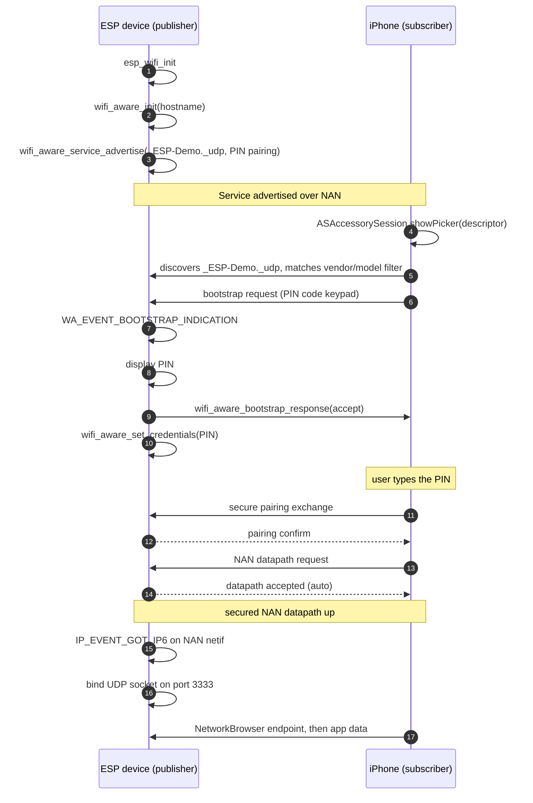

## Introduction

Getting your iPhone to communicate with an IoT device using Wi-Fi has always been awkward. One way to achieve this is to bring the device into your local network first (assuming there is an access point to begin with), which involves multiple steps: discovery (typically over BLE), entering credentials, and provisioning. Another way is to make the device bring up its own SoftAP and connect to it. Although some iOS frameworks have streamlined that process, they cannot prevent the phone from going off the local network for the duration of the session.

**Wi-Fi Aware**, also known as Neighbor Awareness Networking (NAN), is the Wi-Fi Alliance standard that fills this gap. Devices synchronize into a cluster, advertise and discover services, optionally pair if required, and then set up a direct, high-bandwidth encrypted data link between two peers, opening up socket-level communication over IPv6. There is no access point, no DHCP server, and no internet connection involved.

The reason to care about it right now is that Apple announced Wi-Fi Aware support at WWDC 2025 and shipped it with **iOS 26**. All recent iPhones (iPhone 12 and newer, to be precise) and iPads (10th generation and newer) support it once they are upgraded to iOS 26 — that is more than a billion devices. See the full list of eligible devices and further details in Apple's [Wi-Fi Aware documentation](https://developer.apple.com/documentation/wifiaware).

Wi-Fi Aware has been supported in Android since 8.0, but market adoption did not pick up, for various reasons. One was limited adoption by vendors; another was that the Android APIs mapped directly onto the specifications, leaving messaging and naming conventions to each implementation. That raised the barrier to wider adoption. Espressif has also supported Wi-Fi Aware for a long time, but the stack was not upgraded to the latest security standards, again due to the lack of market adoption.

## Why iOS support changes the design

Apple took a different approach: the iOS [Wi-Fi Aware framework](https://developer.apple.com/documentation/wifiaware) hides away the protocol dials and exposes just a few necessary APIs, simplifying the task for application developers. That standardizes three things across every app:

- **Naming follows DNS-SD.** A service is identified by a string like `_ESP-Demo._udp`, following [RFC 6763](https://www.rfc-editor.org/rfc/rfc6763) and [RFC 6335](https://www.rfc-editor.org/rfc/rfc6335), and it must be declared up front in the app's `Info.plist`.
- **Pairing is mandatory and always uses a six-digit PIN.** There is no open datapath and no passphrase mode. Wi-Fi Aware Pairing is equivalent to WPA3-PSK in infrastructure mode, and iOS performs the key exchange itself.
- **The transport is the Network framework.** Once paired, the app opens an ordinary connection and never sees a NAN frame.

> [!NOTE]
> The security ladder mirrors the specification history. Wi-Fi Aware v3.0 added passphrase-based security, roughly equivalent to WPA2-PSK. Wi-Fi Aware v4.0 added pairing, roughly equivalent to WPA3-PSK, along with out-of-band bootstrapping methods for exchanging the credential. PIN-code entry is one of those bootstrapping methods, and it is the one Apple chose.

This push for Wi-Fi Aware by Apple did not go unnoticed, and slowly but steadily the industry is catching up.

At Espressif, we've also upgraded our security standards to match that of Apple and closed the gap in implementation. A new component [`wifi_aware`](https://components.espressif.com/components/espressif/wifi_aware) is specifically built for this purpose. It implements the DNS-SD naming and discovery conventions on top of ESP-IDF's NAN support, so you never assemble a service name by hand, and it is compatible with iOS out of the box.


For ESP-to-ESP or ESP-to-Android communication, any security standard or even no security can be chosen. The restriction of higher security standard is only iOS-specific.


## What you need

### On the ESP side

- Wi-Fi Aware needs hardware NAN support, which at the time of writing is available on the ESP32, ESP32-S2, ESP32-C5, ESP32-C61, and ESP32-S31.
- Wi-Fi Aware Pairing, the standard required by iOS, is available from ESP-IDF v6.1 onwards.
- The component also works with earlier ESP-IDF versions and is fine to use for ESP-to-ESP or ESP-to-Android over an open datapath.

### On the iOS side

- Xcode, with the `com.apple.developer.wifi-aware` entitlement on your target.
- A physical iPhone or iPad from the generations listed above. Wi-Fi Aware cannot be exercised in the simulator.

## What iOS requires from the ESP side

Two things have to line up with what iOS expects. Getting either of them wrong produces the same symptom, which is a device that never appears in the pairing sheet.

### PIN-code pairing

On the ESP side this means one security mode and one bootstrapping method:

```c
wa_dp_security_cfg_t security = {
    .mode = WA_SEC_PIN_PAIRING,
    .pairing = {
        .caching_enabled = true,
    },
};
```

`WA_SEC_PIN_PAIRING` configures the secure PIN-pairing mode, and the component advertises PIN entry as the supported bootstrapping method.

The direction of the PIN matters and it is easy to get backwards. In Apple's flow, **the publisher displays the PIN and the subscriber types it in**. Since an accessory is naturally the publisher, that means your ESP device generates and shows the PIN, and the user enters it on the iPhone. A device with a display can show it directly; a headless device can log it, derive it from a label, or use a fixed factory PIN.

Setting `caching_enabled` keeps the pairing keys so the phone and the device can reconnect later without going through the sheet again. Pass `use_nvs_for_caching` to `wifi_aware_init()` to have that survive a reboot, and `erase_old_creds` to force a fresh pairing.

### Vendor, model, and pairing name

Apple's recommended pairing path for hardware is [AccessorySetupKit](https://developer.apple.com/documentation/accessorysetupkit), where the app builds an `ASDiscoveryDescriptor` that filters candidate devices by properties like vendor and model before showing them to the user. Those properties come from the accessory's advertisement, and the component carries them in `wa_pairing_info_t` as `vendor_name`, `model_name`, and `pairing_name`, each capped at 15 characters. Fill them in even if your first app does not filter on them: it costs nothing, and it is what lets an app show a meaningful name in the pairing sheet instead of a raw identifier.

Note that these are the only names an iOS app ever sees, alongside the service name itself. The component's `instance_name` is not surfaced to iOS; it distinguishes devices advertising the same service type on the ESP side and is the handle you pass into the component's own connection APIs.

## Firmware: advertising a service an iPhone can find

The role you want is publisher, since that is what an accessory is in Apple's model, and it is also the side that shows the PIN.

### Add the component

In your project's `main/idf_component.yml`:

```yaml
dependencies:
  espressif/wifi_aware:
    version: "^0.0.1"
```

### Enable the required Kconfig options

Put these in `sdkconfig.defaults`:

```ini
CONFIG_ESP_WIFI_NAN_SYNC_ENABLE=y
CONFIG_ESP_WIFI_NAN_SECURITY=y
CONFIG_ESP_WIFI_NAN_PAIRING=y
CONFIG_LWIP_IPV6=y
CONFIG_IDF_EXPERIMENTAL_FEATURES=y
CONFIG_PARTITION_TABLE_SINGLE_APP_LARGE=y
```

`CONFIG_ESP_WIFI_NAN_SECURITY` and `CONFIG_ESP_WIFI_NAN_PAIRING` gate the PIN-pairing code paths in both ESP-IDF and the component, so without them `WA_SEC_PIN_PAIRING` is not even compiled in. `CONFIG_IDF_EXPERIMENTAL_FEATURES` is there because the NAN options are still gated behind experimental features, and the larger single-app partition gives the NAN and pairing code room to fit.

> [!TIP]
> If a pairing field or API such as `pairing_info` or `wifi_aware_set_credentials()` is unavailable in your build, verify the security and pairing Kconfig options first.

### Advertise the service

Wi-Fi is owned by the application, so call `esp_wifi_init()` before `wifi_aware_init()`. The init config takes a `hostname`, which becomes the DNS-SD SRV target and must be unique per device — deriving it from the base MAC is the easy way to guarantee that.

Then `wifi_aware_service_advertise()` takes the service config, the port to advertise, and the security config from above. In the service config you set `service_type` to `ESP-Demo` and `proto` to `WA_PROTO_UDP`, and the component advertises `_ESP-Demo._udp` — you never write the underscores or the transport suffix yourself.

The service name is the one string that has to match the iOS app exactly. Apple allows only `a-z`, `A-Z`, `0-9`, and hyphens, requires at least one letter, forbids a leading or trailing hyphen, and caps the name at **15 characters**. An invalid service name in `Info.plist` causes the app to crash, while a valid but mismatched name prevents discovery. Keep the ESP and iOS strings identical.

### Complete the pairing

When the iPhone selects your device, the component raises `WA_EVENT_BOOTSTRAP_INDICATION`, carrying the bootstrapping method the peer chose. Two calls finish the exchange from your handler:

- **`wifi_aware_bootstrap_response()`** accepts (or rejects) the peer's proposed pairing method. Passing `NULL` as the instance name uses the pending bootstrap context the component populated from the incoming request, which is what you want when a single service is advertised.
- **`wifi_aware_set_credentials()`** sets the six-digit PIN that the secure pairing exchange will verify. Display the same PIN you pass here, and keep it within `NAN_PAIRING_PINCODE_MIN` and `NAN_PAIRING_PINCODE_MAX`.

Check the event's `selected_method` against `WIFI_NAN_BOOTSTRAP_PIN_CODE_KEYPAD` before responding, so a peer offering a method you do not support is rejected rather than left hanging.

### Serve data on the datapath

The publisher has nothing left to do on the NAN side, because the component auto-accepts the incoming datapath request. Once the interface has an IPv6 address it fires `IP_EVENT_GOT_IP6`, which is your cue to open a socket.

Two details are easy to trip over. Use `WA_NETIF_KEY` to identify the NAN interface, because that key remains stable across a deinit and init cycle, and ignore `GOT_IP6` events from other interfaces. Keep the interface index returned by `esp_netif_get_netif_impl_index()` and assign it to `sockaddr_in6.sin6_scope_id` when sending to a link-local address, so lwIP routes the packet through the NAN interface.

## The iOS app side

A companion iOS demo maintained by the article author is available in the [`wifi-aware-ios-demo` repository](https://github.com/nachiketkukade/wifi-aware-ios-demo). It uses AccessorySetupKit to pair with the component's `udp_server` example, opens a UDP datapath for `_ESP-Demo._udp`, and displays the send/echo loop in an on-screen console.

The project demonstrates the following application flow:

**Declare the entitlement and the service.** The `com.apple.developer.wifi-aware` entitlement takes an array of capability strings: `Publish` to host a service, `Subscribe` to consume one. Talking to an ESP accessory needs `Subscribe`. Then declare the service in `Info.plist`, keyed by its fully qualified name:

```xml
<key>WiFiAwareServices</key>
<dict>
    <key>_ESP-Demo._udp</key>
    <dict>
        <key>Subscribable</key>
        <dict/>
    </dict>
</dict>
```

**Check for support at runtime.** `WACapabilities.supportedFeatures` tells you whether the device can do Wi-Fi Aware at all, which matters because iOS 26 also runs on hardware older than iPhone 12.

**Pair.** For an accessory, build an `ASDiscoveryDescriptor` with the service name and any vendor or model filters, then present the picker with `ASAccessorySession.showPicker`. The system runs discovery, shows the PIN prompt, and performs the pairing. On success you get an `ASAccessory` carrying an `ASAccessoryWiFiAwarePairedDeviceID`, which you look up as a `WAPairedDevice`. If you are pairing app-to-app instead, `DeviceDiscoveryUI` provides `DevicePairingView` and `DevicePicker` for the two sides.

**Connect.** Build a `NetworkBrowser` from the `WASubscribableService` and a device filter, run it to get connectable endpoints, and open a connection. Stop the browser once you have the connections you need, since browsing costs power and airtime.

Apple's [Adopting Wi-Fi Aware](https://developer.apple.com/documentation/wifiaware/adopting-wi-fi-aware) article covers the entitlement and `Info.plist` in detail, and the WWDC25 session [Supercharge device connectivity with Wi-Fi Aware](https://developer.apple.com/videos/play/wwdc2025/228/) walks through the pairing and connection code.

## The full flow

Putting both sides together, this is what one pairing and connection looks like:



Note the asymmetry that follows from Apple's model: the ESP device advertises and waits, while the phone drives discovery, pairing, and the datapath request. The ESP firmware never calls `wifi_aware_request_connection()`, which is a subscriber-side API. It is there for ESP-to-ESP setups, where one of the two devices has to play the phone's role.

## Try it on real hardware

The fastest end-to-end test uses the component's `udp_server` example and the companion iOS demo.



`udp_server` is the publisher: it advertises `_ESP-Demo._udp` and echoes back every datagram it receives, prefixed with `OK: `. Build and flash it to a supported ESP32:

```bash
cd components/wifi_aware/examples/udp_server
idf.py set-target esp32s2
idf.py build flash monitor
```

Then clone the [companion iOS project](https://github.com/nachiketkukade/wifi-aware-ios-demo), open `ESPWiFiAwareDemo.xcodeproj`, select your own Apple development team, and run the app on a compatible physical iPhone or iPad. Tap **Pair New Device**, select the ESP32, and enter the PIN printed in the ESP32 monitor. After pairing, the app opens the UDP datapath and displays the echo exchange.

The component also ships a `udp_client` example for ESP-to-ESP testing. It discovers the same service, performs PIN pairing, and runs the same echo loop against `udp_server`.

## Wrapping up

Wi-Fi Aware removes the provisioning step from phone-to-device communication, and iOS 26 makes that useful for a very large installed base of phones. On the ESP side the `wifi_aware` component handles the naming, discovery, and datapath plumbing, leaving you a service name, a PIN, and a few identifying strings to fill in.

If you are building a shipping product rather than a prototype, read Apple's Accessory Design Guidelines for the Wi-Fi Aware interoperability requirements, and look into Wi-Fi Alliance certification. Apple's framework is documented as connecting to Wi-Fi Aware certified accessories, and following the guidelines is what keeps discovery, pairing, and throughput reliable across iOS releases.
