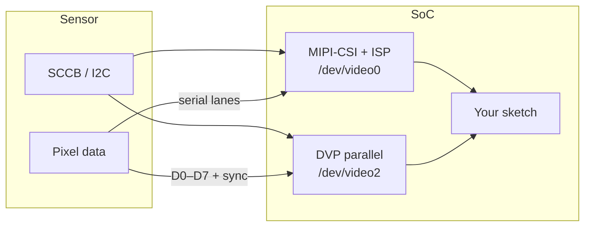
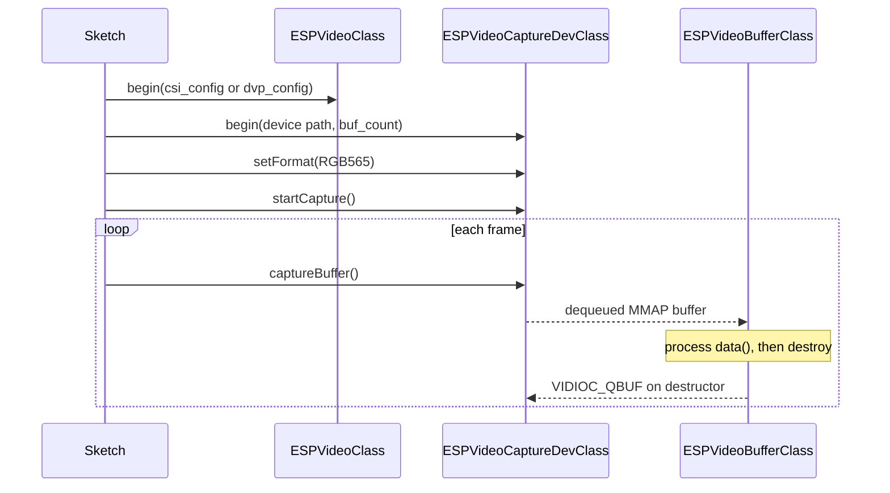

## Introduction

Camera bring-up on a microcontroller usually starts with pin tables, sensor registers, and buffer bookkeeping. The [ESP_Video](https://github.com/espressif/arduino-esp32/tree/master/libraries/ESP_Video) library in the Arduino core for ESP32 wraps the ESP-IDF [`esp_video`](https://docs.espressif.com/projects/esp-video-components/en/latest/esp32p4/Get_Started/index.html) component and turns that work into a small set of C++ classes: configure the camera bus, open a video device, start streaming, and dequeue frames.

The capture API follows the Linux [V4L2](https://www.kernel.org/doc/html/latest/userspace-api/media/v4l/v4l2.html) model. After hardware initialization, applications talk to device nodes such as `/dev/video0`, request MMAP buffers, and pull frames in a loop. Typical uses include live preview, frame grabbing for computer vision, JPEG stills, and sensor tuning (gain, exposure, flip, and similar controls).

ESP_Video is available when the Arduino core is built with **ESP-IDF 5.4.0 or later**, and the target is **ESP32-S3** or **ESP32-P4**:

| SoC | MIPI-CSI (with ISP) | DVP |
| --- | :---: | :---: |
| ESP32-P4 | yes | yes |
| ESP32-S3 | — | yes |

The official examples target the [ESP32-P4-Function-EV-Board](https://docs.espressif.com/projects/esp-dev-kits/en/latest/esp32p4/esp32-p4-function-ev-board/user_guide.html) (MIPI-CSI and DVP) and the [ESP32-S3-EYE](https://github.com/espressif/esp-who/blob/master/docs/en/get-started/ESP32-S3-EYE_Getting_Started_Guide.md) (DVP).

If you have used the classic `esp_camera` / CameraWebServer path before, think of ESP_Video as the next layer: the same kind of Arduino sketch, but with first-class MIPI-CSI support, an on-chip ISP (image signal processor) on ESP32-P4, a V4L2 device model, and a wider set of pixel formats.

This article covers the following:

- **Camera interfaces**: MIPI-CSI versus DVP and how they show up as video devices
- **ESP_Video API**: the configuration, capture, and buffer classes
- **Getting started with Arduino IDE**: open an example, select a board, flash, and watch frames on the serial monitor
- **Capture examples**: under the hood of those sketches — how MIPI-CSI (ESP32-P4) and DVP (ESP32-S3 or ESP32-P4) capture is implemented
- **Pixel formats** and **Sensor controls**: where to find `setFormat()` values and `setSensor*()` methods in the Arduino ESP32 docs

## Camera interfaces

A camera sensor needs two things from the SoC: a control bus and a pixel bus.

**SCCB** (Serial Camera Control Bus) is I2C in all but name. The host uses it to detect the sensor, load register settings, and change gain, exposure, flip, and JPEG quality at runtime.

The **pixel bus** is where the image actually arrives. ESP_Video currently exposes DVP and MIPI-CSI.

### DVP

DVP (Digital Video Port) is a parallel camera interface. The sensor drives eight data lines (D0–D7) together with VSYNC, DE (HREF), PCLK, and an external clock (XCLK) generated by the SoC.

It is the interface you already know from ESP32-CAM boards and from ESP32-S3-EYE. Wiring is straightforward, bandwidth is limited by the parallel bus and GPIO routing, and it is a good fit for VGA-class sensors and JPEG output.

On ESP_Video, a DVP camera without the ISP path appears as `ESP_VIDEO_DVP_DEVICE_NAME` (`/dev/video2`).

### MIPI-CSI

MIPI-CSI is a high-speed serial camera interface. Pixel data travels on differential lanes instead of eight GPIOs, which is why ESP32-P4 can take higher-resolution RAW sensors and run them through the on-chip **ISP** (image signal processor) before the application sees RGB, YUV, or JPEG.

On ESP_Video, the MIPI-CSI camera appears as `ESP_VIDEO_MIPI_CSI_DEVICE_NAME` (`/dev/video0`).

ESP32-P4 can run CSI and DVP at the same time. Each interface is initialized independently and released in `ESPVideoClass::end()` or when the object is destroyed.



> [!NOTE]
> Additional V4L2 nodes exist in ESP-IDF for SPI cameras, USB UVC, JPEG/H.264 codecs, and ISP devices when those Kconfig options are enabled. The Arduino examples in this article use the MIPI-CSI and DVP capture nodes.

## ESP_Video API

Include the library header in your sketch:

```cpp
#include <ESP_Video.h>
```

The API is organized in seven layers:

1. **Pixel format** — `esp_video_format_t` and `ESPVideoFormatClass`
2. **Resolution** — `ESPVideoSolutionClass` (frame width and height)
3. **Hardware configuration** — `ESPVideoCamConfigClass`, `ESPVideoCSIConfigClass`, `ESPVideoDVPPinsConfigClass`, `ESPVideoDVPConfigClass`
4. **Hardware initialization** — `ESPVideoClass::begin()`
5. **Capture device** — `ESPVideoCaptureDevClass`
6. **Buffer** — `ESPVideoBufferClass`
7. **Sensor controls** — `ESPVideoCaptureDevClass::setSensor*()` methods

A complete capture session looks like this:



A few design rules are worth keeping in mind before looking at code:

- **Configuration objects are value types.** They store pin and bus settings only. Pin reservation through `periman` happens in `ESPVideoClass::begin()` and is released in `end()` or the destructor.
- **Capture opening is unified.** `ESPVideoCaptureDevClass::begin()` opens the device, reads and re-applies the current V4L2 format, stores width and height, and requests capture buffers.
- **Format and resolution travel with the frame.** Both the capture device and each dequeued buffer inherit format and resolution metadata, so `buffer.formatName()`, `getWidth()`, and `getHeight()` describe the frame you just received.
- **Resource-owning classes are not copyable.** Use one `ESPVideoClass` and one `ESPVideoCaptureDevClass` for the lifetime of the sketch. `ESPVideoBufferClass` is move-only.

The next sections walk through the objects you actually construct in `setup()`.

### Camera configuration (SCCB)

`ESPVideoCamConfigClass` holds the SCCB / I2C settings shared by CSI and DVP. Call `begin()`, then pass the object into a CSI or DVP configuration.

```cpp
ESPVideoCamConfigClass cam_config;
cam_config.begin(port, scl_pin, sda_pin);
```

The arguments are:

- **`port`** — I2C port used for SCCB when the library initializes the bus
- **`scl_pin` / `sda_pin`** — SCCB clock and data pins
- **`i2c_freq`** — optional; defaults to 100 kHz
- **`reset_pin` / `pwdn_pin`** — optional sensor reset and power-down GPIOs; pass `-1` if unused

If your sketch already owns an I2C master bus, use the overload that takes `i2c_master_bus_handle_t`. In that case the library does not create a second I2C driver for SCCB.

### MIPI-CSI configuration

`ESPVideoCSIConfigClass` extends the camera configuration for MIPI-CSI + ISP on ESP32-P4.

```cpp
ESPVideoCSIConfigClass csi_config;
csi_config.begin(cam_config);
```

Pass `dont_init_ldo = true` as the second argument if MIPI PHY power is supplied externally and you do not want the CSI driver to initialize the LDO.

### DVP configuration

DVP needs two extra pieces: the parallel pin map and the sensor XCLK frequency.

```cpp
ESPVideoDVPPinsConfigClass dvp_pins;
dvp_pins.begin(vsync, de, pclk, xclk, d0, d1, d2, d3, d4, d5, d6, d7);

ESPVideoDVPConfigClass dvp_config;
dvp_config.begin(cam_config, dvp_pins, xclk_freq_hz);
```

`begin()` on the pin object always configures 8-bit data width (D0–D7). `xclk_freq_hz` is the external clock the SoC generates for the sensor — 10 MHz on ESP32-S3-EYE, 20 MHz on the ESP32-P4-Function-EV-Board DVP camera.

### Hardware initialization

Create one `ESPVideoClass` instance (global or static) and call the `begin()` overload that matches the interface:

```cpp
ESPVideoClass video;

if (!video.begin(csi_config)) {  // or dvp_config
    Serial.println("failed to init camera");
    return;
}
```

That call reserves GPIOs, initializes `esp_video` with the CSI+ISP or DVP flags, and keeps the configuration for teardown. It returns `true` if initialization succeeded or was already done. On failure, reserved pins are released before the function returns `false`.

### Capture device and frames

`ESPVideoCaptureDevClass` opens a V4L2 capture node, manages MMAP buffers, and dequeues frames.

```cpp
ESPVideoCaptureDevClass capture;

if (!capture.begin(ESP_VIDEO_MIPI_CSI_DEVICE_NAME, 2)) {
    Serial.println("failed to open capture device");
    return;
}

if (!capture.setFormat(ESP_VIDEO_FORMAT_RGB565)) {
    Serial.println("failed to set format");
    return;
}

if (!capture.startCapture()) {
    Serial.println("failed to start capture");
    return;
}
```

- **`begin(path, buf_count)`** opens the device, applies the current format, and requests `buf_count` MMAP buffers. Use at least 2 so capture can double-buffer and drop fewer frames.
- **`setFormat()`** maps an `esp_video_format_t` value to a V4L2 fourcc and issues `VIDIOC_S_FMT`. Call it after `begin()` and before `startCapture()`. If buffers were already allocated and the format changes, they are re-requested automatically.
- **`startCapture()`** queues every buffer and starts the stream (`VIDIOC_STREAMON`).

In `loop()`, dequeue one frame, use it, and let the object go out of scope:

```cpp
ESPVideoBufferClass frame = capture.captureBuffer();
if (frame.valid()) {
    uint8_t *pixels = frame.data();
    size_t nbytes = frame.size();
    // process the frame
}
// destructor re-queues the buffer
```

`ESPVideoBufferClass` is an RAII wrapper around one dequeued buffer. When it is destroyed, moved-from, or `end()` is called, the buffer is returned to the driver with `VIDIOC_QBUF`. Do not store `data()` past the lifetime of the object. If you hold buffers and never release them, `captureBuffer()` will stall.

## Getting started with Arduino IDE

You need:

- [Arduino IDE](https://www.arduino.cc/en/software) 2.x
- [Arduino Core for ESP32](https://github.com/espressif/arduino-esp32) with the ESP_Video library (core **3.3.10** or later)
- A supported board with a camera: ESP32-P4-Function-EV-Board (MIPI-CSI or DVP) or ESP32-S3-EYE (DVP)
- A USB data cable

If the ESP32 board package is not installed yet, follow [Getting Started with ESP32 Arduino](/blog/2025/10/arduino-get-started/). Use the **development** Board Manager URL if you want the latest core that includes ESP_Video before it lands in a stable package:

```
https://espressif.github.io/arduino-esp32/package_esp32_dev_index.json
```

### Select the board

1. Connect the board over USB.
2. In Arduino IDE, open **Tools > Board > esp32** and select the matching board, for example **ESP32P4 Core Board**.
3. Under **Tools**, enable **PSRAM** if the menu offers it. Camera frames are large; without PSRAM, buffer allocation is likely to fail.
4. Select the serial **Port**.



### Open an official example

The library examples already produce a stream of valid frames, so you can skip a blank driver bring-up. In Arduino IDE, open **File > Examples > ESP_Video** and pick the sketch that matches your camera interface:

- **mipi_csi_camera** — MIPI-CSI on ESP32-P4-Function-EV-Board V1.5
- **dvp_camera** — DVP on ESP32-S3-EYE or ESP32-P4-Function-EV-Board V1.5



The pin defines at the top of each sketch match those boards. If your camera is wired differently, change the `EXAMPLE_*` macros before uploading.

On ESP32-P4, the MIPI-CSI example CI configuration uses a 16 MB flash size and a larger partition scheme. If the default partition is too small for your application plus frame buffers, pick a larger scheme under **Tools > Partition Scheme**.

### Upload and watch frames

1. Click **Upload**.
2. Open **Tools > Serial Monitor** at **115200** baud.
3. After `Arduino camera example started`, you should see one line per frame: buffer pointer, size, format name, width, and height.



A successful run looks like this (values depend on the sensor and format):

```text
Arduino camera example started
captured buffer: 0x3c0a0000 size: 614400 format: RGB565 width: 640 height: 480
captured buffer: 0x3c110000 size: 614400 format: RGB565 width: 640 height: 480
```

Exact addresses depend on PSRAM layout. If initialization fails, the sketch prints `failed to init CSI camera` / `failed to init DVP camera` or `failed to open capture device` and then waits in `loop()`. Double-check the board selection, PSRAM, SCCB pins, and that a supported sensor is connected.

> [!IMPORTANT]
> The public API in `ESP_Video.h` is compiled only when at least one of `CONFIG_ESP_VIDEO_ENABLE_MIPI_CSI_VIDEO_DEVICE` or `CONFIG_ESP_VIDEO_ENABLE_DVP_VIDEO_DEVICE` is enabled. The Arduino core enables these for ESP32-P4 and ESP32-S3 in the default SDK configuration used by the examples. If you build Arduino as an ESP-IDF component with a custom `sdkconfig`, turn the matching option on.

## MIPI-CSI capture on ESP32-P4

This section walks through [`mipi_csi_camera.ino`](https://github.com/espressif/arduino-esp32/blob/master/libraries/ESP_Video/examples/mipi_csi_camera/mipi_csi_camera.ino). The default wiring is the ESP32-P4-Function-EV-Board V1.5 MIPI-CSI camera: SCCB on I2C port 0, SCL GPIO 8, SDA GPIO 7.

### Configure SCCB and CSI

```cpp
ESPVideoCamConfigClass cam_config;
cam_config.begin(EXAMPLE_MIPI_CSI_SCCB_I2C_PORT,
                 EXAMPLE_MIPI_CSI_SCCB_I2C_SCL_PIN,
                 EXAMPLE_MIPI_CSI_SCCB_I2C_SDA_PIN);

ESPVideoCSIConfigClass csi_config;
csi_config.begin(cam_config);

if (!video.begin(csi_config)) {
    Serial.println("failed to init CSI camera");
    return;
}
```

`video.begin(csi_config)` initializes MIPI-CSI and the ISP (`ESP_VIDEO_INIT_FLAGS_MIPI_CSI | ESP_VIDEO_INIT_FLAGS_ISP`). After this returns, `/dev/video0` exists and the sensor driver has probed the camera on SCCB.

### Open the device, set RGB565, start streaming

```cpp
const size_t kCaptureBufferCount = 2;

if (!capture_dev.begin(ESP_VIDEO_MIPI_CSI_DEVICE_NAME, kCaptureBufferCount)) {
    Serial.println("failed to open capture device");
    return;
}

if (!capture_dev.setFormat(ESP_VIDEO_FORMAT_RGB565)) {
    Serial.println("failed to set format");
    return;
}

if (!capture_dev.startCapture()) {
    Serial.println("failed to start capture");
    return;
}
```

RGB565 is a convenient preview format: two bytes per pixel, easy to blit to an RGB565 LCD. If the sensor or ISP cannot produce it, `setFormat()` returns `false` — try `ESP_VIDEO_FORMAT_YUV422_YUYV`, `ESP_VIDEO_FORMAT_JPEG`, or leave the driver default by skipping `setFormat()`.

### Dequeue frames in `loop()`

```cpp
void loop() {
    if (!capture_dev.isOpened() || !capture_dev.isCaptureStarted()) {
        delay(1000);
        return;
    }

    ESPVideoBufferClass buffer = capture_dev.captureBuffer();
    if (!buffer.valid()) {
        Serial.println("failed to capture buffer");
        delay(10);
        return;
    }

    Serial.printf(
        "captured buffer: %p size: %lu format: %s width: %lu height: %lu\n",
        buffer.data(), (unsigned long)buffer.size(), buffer.formatName(),
        (unsigned long)buffer.getWidth(), (unsigned long)buffer.getHeight());
}
```

That is the whole application-side capture path. Replace the `Serial.printf` with your preview, encoder, or neural-network input. Keep the `ESPVideoBufferClass` object only while you process that one frame.

<details>
<summary>Full MIPI-CSI example</summary>

```cpp {title="mipi_csi_camera.ino"}
#include "Arduino.h"
#include <ESP_Video.h>

#define EXAMPLE_MIPI_CSI_SCCB_I2C_PORT    0
#define EXAMPLE_MIPI_CSI_SCCB_I2C_SCL_PIN 8
#define EXAMPLE_MIPI_CSI_SCCB_I2C_SDA_PIN 7

ESPVideoClass video;
ESPVideoCaptureDevClass capture_dev;
const size_t kCaptureBufferCount = 2;

void setup() {
    Serial.begin(115200);

    ESPVideoCamConfigClass cam_config;
    cam_config.begin(EXAMPLE_MIPI_CSI_SCCB_I2C_PORT,
                     EXAMPLE_MIPI_CSI_SCCB_I2C_SCL_PIN,
                     EXAMPLE_MIPI_CSI_SCCB_I2C_SDA_PIN);

    ESPVideoCSIConfigClass csi_config;
    csi_config.begin(cam_config);

    if (!video.begin(csi_config)) {
        Serial.println("failed to init CSI camera");
        return;
    }

    if (!capture_dev.begin(ESP_VIDEO_MIPI_CSI_DEVICE_NAME, kCaptureBufferCount)) {
        Serial.println("failed to open capture device");
        return;
    }

    if (!capture_dev.setFormat(ESP_VIDEO_FORMAT_RGB565)) {
        Serial.println("failed to set format");
        return;
    }

    if (!capture_dev.startCapture()) {
        Serial.println("failed to start capture");
        return;
    }

    Serial.println("Arduino camera example started");
}

void loop() {
    if (!capture_dev.isOpened() || !capture_dev.isCaptureStarted()) {
        delay(1000);
        return;
    }

    ESPVideoBufferClass buffer = capture_dev.captureBuffer();
    if (!buffer.valid()) {
        Serial.println("failed to capture buffer");
        delay(10);
        return;
    }

    Serial.printf(
        "captured buffer: %p size: %lu format: %s width: %lu height: %lu\n",
        buffer.data(), (unsigned long)buffer.size(), buffer.formatName(),
        (unsigned long)buffer.getWidth(), (unsigned long)buffer.getHeight());
}
```

</details>

## DVP capture on ESP32-S3 or ESP32-P4

[`dvp_camera.ino`](https://github.com/espressif/arduino-esp32/blob/master/libraries/ESP_Video/examples/dvp_camera/dvp_camera.ino) follows the same pattern. The extra step is filling `ESPVideoDVPPinsConfigClass` before `ESPVideoDVPConfigClass`.

Default pin maps:


  

| Signal | GPIO |
| --- | :---: |
| SCCB SCL / SDA | 5 / 4 |
| XCLK / PCLK | 15 / 13 |
| VSYNC / DE | 6 / 7 |
| D0–D7 | 11, 9, 8, 10, 12, 18, 17, 16 |
| XCLK frequency | 10 MHz |

  
  

| Signal | GPIO |
| --- | :---: |
| SCCB SCL / SDA | 8 / 7 |
| XCLK / PCLK | 20 / 4 |
| VSYNC / DE | 37 / 22 |
| D0–D7 | 2, 32, 33, 23, 3, 6, 5, 21 |
| XCLK frequency | 20 MHz |

  


### Configure SCCB, pins, and DVP

```cpp
ESPVideoCamConfigClass cam_config;
cam_config.begin(EXAMPLE_DVP_SCCB_I2C_PORT,
                 EXAMPLE_DVP_SCCB_I2C_SCL_PIN,
                 EXAMPLE_DVP_SCCB_I2C_SDA_PIN);

ESPVideoDVPPinsConfigClass dvp_pins;
dvp_pins.begin(
    EXAMPLE_DVP_VSYNC_PIN, EXAMPLE_DVP_DE_PIN,
    EXAMPLE_DVP_PCLK_PIN, EXAMPLE_DVP_XCLK_PIN,
    EXAMPLE_DVP_D0_PIN, EXAMPLE_DVP_D1_PIN, EXAMPLE_DVP_D2_PIN, EXAMPLE_DVP_D3_PIN,
    EXAMPLE_DVP_D4_PIN, EXAMPLE_DVP_D5_PIN, EXAMPLE_DVP_D6_PIN, EXAMPLE_DVP_D7_PIN);

ESPVideoDVPConfigClass dvp_config;
dvp_config.begin(cam_config, dvp_pins, EXAMPLE_DVP_XCLK_FREQ);

if (!video.begin(dvp_config)) {
    Serial.println("failed to init DVP camera");
    return;
}
```

### Open `/dev/video2` and capture

```cpp
if (!capture_dev.begin(ESP_VIDEO_DVP_DEVICE_NAME, kCaptureBufferCount)) {
    Serial.println("failed to open capture device");
    return;
}

if (!capture_dev.startCapture()) {
    Serial.println("failed to start capture");
    return;
}
```

The DVP example leaves the driver default format in place instead of calling `setFormat()`. You can still call `setFormat()` after `begin()` if you need a specific fourcc. `loop()` is identical to the MIPI-CSI sketch: dequeue, print metadata, release.

## Pixel formats

Call `setFormat()` with an `esp_video_format_t` value after `begin()`. Which formats a sensor actually supports depends on the driver and the active video device. For the enum, V4L2 fourcc mapping, and format name strings, see [Pixel format](https://docs.espressif.com/projects/arduino-esp32/en/latest/api/esp_video.html#pixel-format) in the Arduino ESP32 documentation.

## Sensor controls

Once the capture device is open, you can tune gain, exposure, flip, JPEG quality, and similar settings. Each method returns `true` if the driver accepted the value. Support depends on the sensor and the current format. For the full `setSensor*()` list and V4L2 control mapping, see [Sensor controls](https://docs.espressif.com/projects/arduino-esp32/en/latest/api/esp_video.html#sensor-controls) in the Arduino ESP32 documentation.

```cpp
capture.setSensorGain(16);
capture.setSensorExposure(800);
capture.setSensorVFlip(true);
capture.setSensorHFlip(false);
capture.setSensorJPEGQuality(12);
```

A test pattern is useful when you are bringing up a new board: if `setSensorTestPattern(true)` produces a known image, the pixel bus is alive and you can debug SCCB or ISP settings separately.

## Going further

The examples in this article stop at printing frame metadata. From there you can:

- Display RGB565 frames on an LCD for a local preview
- Feed YUV or RGB buffers into [ESP-WHO](/blog/2026/05/esp-who-get-started/) or [ESP-DL](https://github.com/espressif/esp-dl) for detection and recognition
- Capture JPEG stills and serve them over HTTP, similar in spirit to [CameraWebServer](https://github.com/espressif/arduino-esp32/tree/master/libraries/ESP32/examples/Camera/CameraWebServer)
- Build a Matter camera product on ESP32-P4, as described in [Introducing Matter Cameras](/blog/2026/01/introducing-esp-matter-camera/)

Full class and method reference:

- [ESP Video API (Arduino ESP32 documentation)](https://docs.espressif.com/projects/arduino-esp32/en/latest/api/esp_video.html)
- [ESP_Video library source and examples](https://github.com/espressif/arduino-esp32/tree/master/libraries/ESP_Video)
- [ESP-Video-Components](https://docs.espressif.com/projects/esp-video-components/en/latest/esp32p4/Get_Started/index.html) for the IDF-side architecture, supported sensors, and ISP tuning

## Conclusion

This article introduced ESP_Video as the Arduino-facing camera stack for ESP32-P4 and ESP32-S3: MIPI-CSI with an on-chip ISP, DVP, and a V4L2-style capture loop that fits in `setup()` and `loop()`. It showed how to run an official example from the Arduino IDE to confirm a stream of valid frames, then walked through how those sketches configure SCCB and the pixel bus, open a device node, and dequeue RAII buffers. Pixel formats and sensor controls are documented in the Arduino ESP32 API, so this article can focus on the path from a working capture to an application.

That path starts in `loop()`. The examples print the pointer, size, format, and resolution; everything else is a different use of the same `ESPVideoBufferClass` object while that object is still in scope.

A local preview is the most direct next step. RGB565 is two bytes per pixel and maps cleanly onto many LCDs: blit `data()` as a `getWidth()` by `getHeight()` image, then let the buffer destructor return the slot to the driver. If the panel expects a different format or orientation, `setFormat()` and `setSensorVFlip()` / `setSensorHFlip()` are the same calls already shown for capture.

Computer vision follows the same hand-off. YUV or RGB frames can feed [ESP-WHO](/blog/2026/05/esp-who-get-started/) or [ESP-DL](https://github.com/espressif/esp-dl) for on-device detection and recognition, without a PC in the pipeline. JPEG stills go the other way: encode them on the sensor or ISP, then serve the images over HTTP in the spirit of [CameraWebServer](https://github.com/espressif/arduino-esp32/tree/master/libraries/ESP32/examples/Camera/CameraWebServer). On ESP32-P4, the same camera stack is the base for a Matter camera product, as described in [Introducing Matter Cameras](/blog/2026/01/introducing-esp-matter-camera/).

Once frames arrive, the interesting work is no longer driver bring-up. It is choosing a format, keeping buffer lifetime short, and plugging the pixels into preview, inference, a web UI, or a connected-home pipeline.
