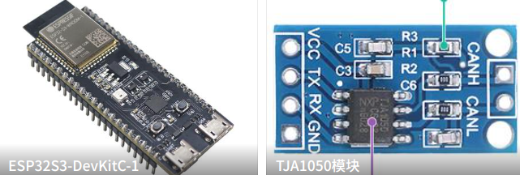

An ESP chip with native USB Device and TWAI can act as a compact USB-CAN adapter without a separate bridge MCU. Here, TWAI is Espressif's CAN-compatible controller. so the ESP-IDF example [`usb_twai_adapter`](https://github.com/espressif/esp-idf/tree/master/examples/peripherals/twai/usb_twai_adapter) can present the device as a Candlelight / `gs_usb` compatible adapter to the host, then bridge frames between USB and the TWAI bus.

This article walks through the example from the host view inward. First, it places Candlelight and `gs_usb` in the host ecosystem. Then it follows how USB frames and CAN or CAN FD frames move through the firmware. Finally, it covers how to wire, flash, and use the adapter on Linux, plus what to expect on Windows today.

## Candlelight, gs_usb, and the host ecosystem

**gs_usb** is the device protocol used by Geschwister Schneider USB/CAN adapters and the open [candleLight](https://github.com/candle-usb/candleLight_fw) firmware. Linux also ships an in-tree driver with the same name. People often call the dongles **CANable** or **Candlelight**; on the wire and in the kernel, the name that matters is **gs_usb**.

On Linux it is simple: the device enumerates self as OpenMoko Candlelight (`0x1D50:0x606F`) device, the in-tree `gs_usb` driver binds, and you get a SocketCAN interface such as `can0`. After that, the usual tools work — `ip link`, `cansend` / `candump`, Wireshark, and anything else that already speaks this class of adapter.

That host-facing USB contract is what matters. Many existing dongles used STM32-class parts; the ESP-IDF example implements the same host-visible behavior with on-chip USB Device and TWAI.

## How frames move through the example

At a high level the adapter is a bridge with two sides and a small amount of buffering in the middle:

```
PC Host (SocketCAN / tools)
    ↕  USB vendor control + bulk (`gs_host_frame`)
ESP TinyUSB vendor interface   ← `gs_usb.c`
    ↕  TX / RX frame pools
TWAI driver                    ← `candlelight_twai.c`
    ↕  transceiver
CAN / CAN FD bus
```

**Control** and **data** are separate on USB. Control transfers set capabilities, bit timing, and start/stop. Bulk endpoints carry a stream of fixed-layout `gs_host_frame` structures.

Two pools keep the directions independent: USB→TWAI (`tx_pool`) and TWAI→USB (`rx_pool`). Meanwhile, gs_usb requires a **TX echo** after the controller finishes sending a host-originated frame: the device must send that same `gs_host_frame` back on USB so the host can treat it as TX confirmation. Frames that received from the bus use `echo_id = UINT32_MAX`.

The next two sections look at the USB side and the TWAI side in turn. Since the USB side hold user action and configuration params, it work as main role and controls the TWAI side status.

## USB side

On the ESP, the USB side has one job: look like a Candlelight device and answer the host the way `gs_usb` expects. TinyUSB presents the familiar OpenMoko VID/PID and a vendor interface, while `gs_usb.h` defines the protocol types same with the Linux `gs_usb` driver.

In `gs_usb.c`:

- `tud_vendor_control_xfer_cb()` handles the host's vendor control requests, it hold configur params.
- `tud_vendor_rx_cb()` handles the bulk OUT data stream carrying host-originated `gs_host_frame` records.

Until the host starts the channel, TWAI is not running. During bring-up, the host first probes device configuration and timing capabilities. Later, when the host configures bitrate or brings the interface up or down, those USB control requests drive the TWAI application's state transitions.

Parts of USB control events code bellow [gs_usb.c](https://github.com/espressif/esp-idf/blob/422c4f5925d9a2408d5ddcc5bb1a95cc46da1e3d/examples/peripherals/twai/usb_twai_adapter/main/gs_usb.c#L105):
```c
/*
 * gs_usb vendor control path. Each bRequest has SETUP then ACK stages.
 */
bool tud_vendor_control_xfer_cb(uint8_t rhport, uint8_t stage, tusb_control_request_t const *request)
{
    ESP_LOGD(CANDLELIGHT_TAG, "tud_vendor_control_xfer_cb: request->bRequest = %d, stage = %d", request->bRequest, stage);
    switch ((enum gs_usb_breq)request->bRequest) {
    case GS_USB_BREQ_HOST_FORMAT:           /* endianness probe */
        if (stage == CONTROL_STAGE_SETUP) {
            return tud_control_xfer(rhport, request, &g_ctx.host_config, sizeof(g_ctx.host_config));
        }
        return true;

    case GS_USB_BREQ_DEVICE_CONFIG:         /* channel count / versions */
        if (stage == CONTROL_STAGE_SETUP) {
            return tud_control_xfer(rhport, request, (void *)&s_device_config, sizeof(s_device_config));
        }
        return true;

    case GS_USB_BREQ_GET_BT_CONST:          /* classic timing limits */
        if (stage == CONTROL_STAGE_SETUP) {
            return tud_control_xfer(rhport, request, (void *)&g_ctx.gsdev_bt_const, sizeof(struct gs_device_bt_const));
        }
        return true;
```

The mapping show events/flow bellow — host stage or command on the left, `bRequest` on the right, roughly in bring-up order:

```
Host stage / command                         USB side action
-----------------------------------------    ----------------------------------
OS see a `0x1D50:0x606F` device           <- Plug in
gs_usb driver matches VID/PID
Drvier probe (0xbeef) device              -> HOST_FORMAT event
Read channel count & versions             -> DEVICE_CONFIG event
Query bit-timing limits                   -> GET_BT_CONST event
                                          -> GET_BT_CONST_EXT   (FD capable)
ip link … bitrate …                       -> SET_BITTIMING event
ip link … dbitrate … fd on                -> SET_DATA_BITTIMING (FD) event
ip link set canX up                       -> MODE(start) event
                                             create & start TWAI
ip link set canX down                     -> MODE(stop/reset) event
                                             stop & delete TWAI

  (while up)  ip -d link show canX        -> GET_STATE event
  (while up)  Sync HW timestamp clock     -> TIMESTAMP event
```

First, `GET_BT_CONST_EXT` and `SET_DATA_BITTIMING` only appear when the device advertised CAN FD ability — this example does that on TWAI FD capable chips.

What `MODE(start)` actually starts the TWAI side. That is next.

## TWAI side

At a high level, the TWAI side does three jobs:
- apply the bus timing requested by the host.
- send host-originated frames onto the bus.
- turn bus activity back into the `gs_usb` format that the host expects.

In practice, that means converting frames to and back between `gs_host_frame` and `twai_frame_t` formate, and generating the TX echo that `gs_usb` uses as transmit confirmation. The separate `tx_pool` and `rx_pool` buffers keep those two directions decoupled, so traffic flowing from USB to the bus does not block frames and state notifications flowing back to the host.

Parts of TWAI RX code bellow [candlelight_twai.c](https://github.com/espressif/esp-idf/blob/422c4f5925d9a2408d5ddcc5bb1a95cc46da1e3d/examples/peripherals/twai/usb_twai_adapter/main/candlelight_twai.c#L185):
```c
static void twai_rx_task(void *param)
{
    while (1) {
        xSemaphoreTake(g_ctx.usb_tx_mutex, portMAX_DELAY);
        while (pending_len < g_ctx.usb_tx_frame_size) {
            // get a rx frame
            adapter_frame_t *frame = frame_pool_slot(rx_pool, rx_pool->out_idx);
            uint8_t *usb_frame = (uint8_t *)&frame->gs_frame;

            // converent frame to usb frame formate
            frame_twai_to_gs(&frame->gs_frame, &frame->twai_frame, GS_HOST_FRAME_ECHO_ID_RX);

            // send back to usb
            pending_len += tud_vendor_n_write(ITF_NUM_VENDOR, usb_frame + pending_len, g_ctx.usb_tx_frame_size - pending_len);
            tud_vendor_n_write_flush(ITF_NUM_VENDOR);
```

## Hardware setup and flashing

To try the example, you need an ESP target with both USB Device and TWAI support (e.g. ESP32S3/P4), plus a TWAI transceiver such as SN65HVD230 or TJA1050. CAN FD also requires a TWAI FD capable chip.



The example defaults to `GPIO4` for TWAI TX and `GPIO5` for TWAI RX. Connect those pins to the transceiver, then connect the transceiver to the CAN bus. If your board needs different pins, change them in `candlelight_internal.h`.

Build and flash as usual with ESP-IDF:

```bash
idf.py -p PORT flash monitor
```

One detail matters here: use the chip's native USB device port for the `gs_usb` interface. A USB-to-UART bridge can still be useful for logs, but it is not the USB path that the host will enumerate as a Candlelight-compatible adapter.

## Using it on Linux

On Linux, the happy path is straightforward: plug the board into the host through its native USB device port, let the in-tree `gs_usb` driver bind, bring the CAN interface up, and then use normal SocketCAN tools.

First, confirm that the device enumerates with the expected Candlelight VID/PID:

```bash
lsusb
# ... ID 1d50:606f OpenMoko, Inc. Geschwister Schneider CAN adapter
```

Then check that Linux created a CAN network interface, typically `can0`:

```bash
ip link show
# ...
# 3: can0: <NOARP,ECHO> mtu 16 qdisc noop state DOWN mode DEFAULT group default qlen 10
#     link/can
```

For a CAN FD capable target, bring the interface up with both arbitration and data-phase bitrates:

```bash
sudo ip link set can0 up type can bitrate 500000 dbitrate 2000000 fd on
```

At that point, standard SocketCAN tools should work. In one terminal, start a dump:

```bash
candump can0 -ex
# ...
# can0  TX - -       123   [4]  DE AD BE EF
```

In another, send a test frame:

```bash
cansend can0 123##1DEADBEEF
```

If you only need classic CAN, omit the FD options:

```bash
sudo ip link set can0 up type can bitrate 500000
```

When you are done, bring the interface down again:

```bash
sudo ip link set can0 down
```
