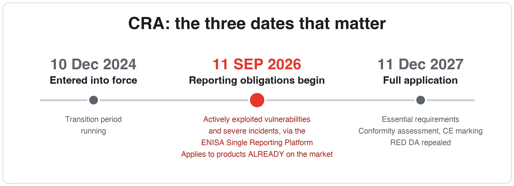
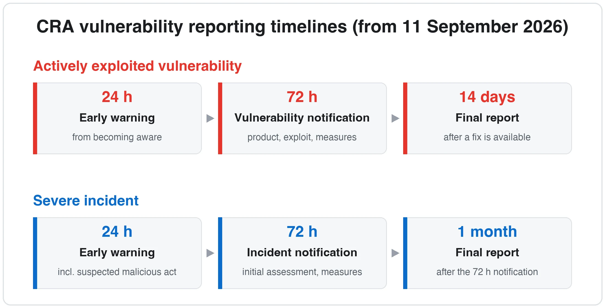
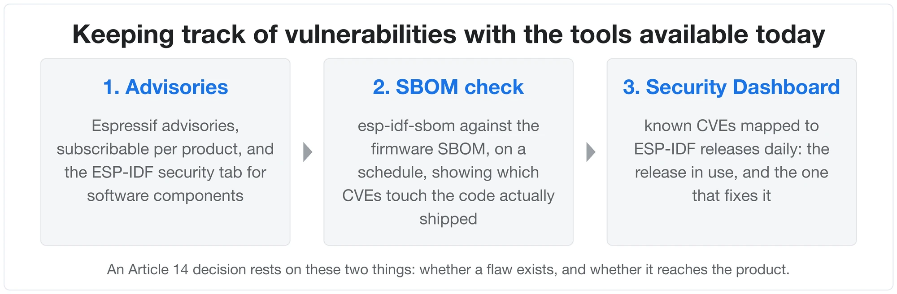
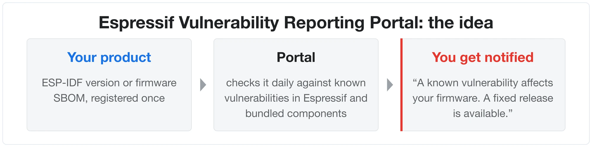

In [Part 1](https://developer.espressif.com/blog/2025/04/esp32-red-da-en18031-compliance-guide/) of this series we walked through the RED Delegated Act and EN 18031, and [Part 2](https://developer.espressif.com/blog/2026/03/esp32-cra-compliance/) introduced the Cyber Resilience Act. This part covers what arrives first: the vulnerability reporting obligations that start on 11 September 2026.

It is a narrow set of duties, separate from the rest of the regulation. The essential requirements and conformity assessment do not arrive until December 2027. An upcoming article in the series will cover those, and what changes for a product that has already been through EN 18031.

| Date | What begins | Applies to |
|------|-------------|------------|
| **11 Sep 2026** | Article 14 reporting via the ENISA Single Reporting Platform | All in-scope products already on the EU market |
| **11 Dec 2027** | Full application: essential requirements, conformity assessment, CE marking | Units placed on the market from this date. Earlier units are pulled in only if they are substantially modified from that date (Art. 69(2)) |

## Vulnerability reporting obligations: 11 September 2026

From 11 September 2026, Article 14 of the CRA starts to apply. It requires manufacturers selling connected products in the EU to report **actively exploited vulnerabilities** and **severe incidents** in their products.

The CRA creates four such duties, each owed to a different recipient:

| You have to | Tell | Under | From |
|---|---|---|---|
| **Notify** | your coordinator CSIRT and ENISA, through the Single Reporting Platform | Art. 14(1), (3) | 11 Sep 2026 |
| **Inform** | the users of your product | Art. 14(8) | 11 Sep 2026 |
| **Report upstream** | whoever maintains the affected component, sharing your fix with them | Art. 13(6) | 11 Dec 2027 |
| **Publicly disclose** | everyone, once the security update ships | Annex I Pt II(4) | 11 Dec 2027 |

The bottom two arrive with full application in December 2027 and will be covered in an upcoming article in the series. If you already report bugs upstream and publish advisories, both are covered.

The deadlines attach only to notification. Whether one needs to notify at all depends on whether the flaw can be exploited in the product. For a flaw in ESP-IDF:

| Can the flaw be exploited in the product? | The product manufacturer | Espressif |
|---|---|---|
| **Yes** | Reports for its product | Reports for its own product |
| **No** | No report required | Reports for its own product |

A flaw that cannot be reached in the finished device is not the product manufacturer's to report. The duty is tied to a manufacturer's own product: the CRA describes active exploitation as a breach resulting from a flaw in a product that the manufacturer itself placed on the market (CRA Recital 68).

**Informing users** works down the same chain. Espressif informs its own users, meaning the product manufacturers who build on ESP32. Informing the people who buy the finished product is the product manufacturer's job, whether they are business customers or consumers. In practice it can be an app notification or a security advisory page. Where automatic OTA updates are in place, the notice can say the fix is already applied.

### What the product manufacturer should report

- **Actively exploited vulnerability**: a vulnerability for which there is reliable evidence that a malicious actor has exploited it in a system without the owner's permission (Article 3(42)). It is this determination that starts the 24-hour clock (see the diagram below).
- **Severe incident**: an incident affecting the product's security in either of two ways (Article 14(5)):
  - it harms, or could harm, the product's ability to protect the availability, authenticity, integrity or confidentiality of sensitive or important data or functions; or
  - it has led, or could lead, to malicious code being introduced or run in the product or in a user's systems.

  The regulation gives its own example (CRA Recital 68): an attacker who succeeds in introducing malicious code into the release channel through which a manufacturer ships security updates. A compromised signing key or build pipeline starts the 24-hour clock.

The 14-day clock for a vulnerability runs from the moment a corrective or mitigating measure is available, not from the original notification (Art. 14(2)(c)). If no fix exists yet, nothing falls due at day 14, though the coordinator CSIRT can ask for interim status reports in the meantime (Art. 14(6)).

### What does not need to be reported

- Routine vulnerabilities found during development or internal testing.
- Findings reported through good-faith security research. The regulation says so directly: vulnerabilities discovered "with no malicious intent for purposes of good faith testing, investigation, correction or disclosure" are not subject to mandatory notification (CRA Recital 68).
- Published proof-of-concept code without evidence of real-world exploitation. This follows from the definition rather than from a stated exclusion: a proof of concept is not evidence that anyone has actually exploited the flaw.

These follow the normal fix-and-advisory process; no notification to the authorities is involved.

### How to report

All notifications go through the **ENISA Single Reporting Platform (SRP)**: one submission, which the platform routes to the national CSIRT and to ENISA. Reports are filed by the manufacturer's registered **Assigned Representatives (ARs)** -- named individuals with personal accounts. The platform is due to be available by 11 September 2026, with submissions through web forms rather than an API at launch.

The two terms are easily confused: an Assigned Representative is an account role on the platform, and is not the same thing as the **authorised representative** under Art. 18, who acts for a manufacturer under a written mandate.

The coordinator CSIRT passes the notification to the CSIRTs of every Member State where you have indicated the product is available (Art. 16(2)), and informs market surveillance authorities. Art. 14(2)(b) lets you indicate how sensitive you consider the information to be, and that is the mechanism behind a request to delay wider dissemination, for instance while a coordinated disclosure is still under embargo.

Using it comes down to three things:

1. **An [EU Login](https://ecas.ec.europa.eu/cas/login) account** for each person who will report, with two-factor authentication enabled. These can be created today.
2. **Registration as Assigned Representatives** once the platform opens. One primary representative registers the manufacturer and invites the others, and those invitations expire.
3. **A web form submission** when a reportable event occurs, within the deadlines above.

CSIRT validation of a manufacturer's registration happens after first access and runs in parallel, so it does not block filing a notification.

ENISA publishes the registration and submission procedure, along with step-by-step guides for Assigned Representatives, on its [Single Reporting Platform page](https://www.enisa.europa.eu/topics/product-security/single-reporting-platform-srp).

This is the extent of what applies in September. Article 14 is the only part of the CRA that binds manufacturers before December 2027. Chapter IV applied earlier still, from 11 June 2026, which is when Member States could begin designating the notified bodies that some products will need. It places no duty on manufacturers.

## Who does what: platform, application, and other vendors

A connected product typically contains three layers, and CRA responsibility follows the same structure:

| Layer | Examples | Who takes care of it |
|---|---|---|
| **Espressif platform** | ESP32 chip/module, ESP-IDF and the components bundled with it | Espressif: monitoring, fixes in ESP-IDF releases, advisories, and conformity for its own chips and modules once the CRA applies |
| **Your application** | Application logic, cloud services, companion app, product configuration | You, as the product manufacturer |
| **Other vendors' components** | A secure element from another supplier, a cellular module, software from another vendor | The respective vendor, with the same due-diligence relationship you have with Espressif |

The platform layer is Espressif's to monitor, patch and account for.

## How Espressif supports you

Espressif monitors and patches ESP-IDF and its bundled components across supported releases, publishes security advisories, and runs the vulnerability handling process behind them. It also carries the conformity of its own chips and modules, including the Declaration of Conformity once the CRA applies, and provides component evidence for manufacturers to use in their own due diligence.

### What can be done today

Article 14 turns on what a manufacturer knows, so the practical question is how that knowledge stays current. Three things cover it:

1. **Security advisories.** Hardware and software disclosures are published as advisories on the documentation site, where they can be [subscribed to per product](https://documentation.espressif.com/en/subscriptions). Advisories for ESP-IDF software components are published in the [esp-idf security tab](https://github.com/espressif/esp-idf/security/advisories). Reports to Espressif go through the channel described in the [Espressif Security Incident Response Process](https://www.espressif.com/sites/default/files/Espressif%20Security%20Incident%20Response%20Process%20v1.0_EN.pdf).
2. **[esp-idf-sbom](https://github.com/espressif/esp-idf-sbom), run against the firmware on a schedule.** It produces an SPDX bill of materials from an ESP-IDF build and checks it for known vulnerabilities against the latest NVD data. The CRA expects a product to be placed on the market without known exploitable vulnerabilities.
3. **The [ESP-IDF Security Dashboard](https://espressif.github.io/esp-idf-security-dashboard/), for the release in use.** It maps known CVEs to ESP-IDF releases daily, covering the bundled components alongside Espressif's own code, including which release fixes a given CVE.

### What is coming

The **Espressif Vulnerability Reporting Portal** is launching by the end of September, and automates most of the steps above. More details will follow in a later part of this series.

## Frequently Asked Questions (FAQ)

**Q: Do reporting obligations apply to products we shipped years ago?**
Yes. From 11 September 2026 the reporting obligations cover every in-scope product placed on the EU market, regardless of when. A product sold five years ago, even one no longer on sale, is covered: the CRA expects awareness of an actively exploited vulnerability or severe incident from that date onwards to be reported, and affected users to be informed. Two limits apply: awareness from before 11 September 2026 does not need retroactive reporting, and for products placed before December 2027 only the reporting and user-information duties apply. The full conformity obligations bind units placed on the market from 11 December 2027.

**Q: Who is the "manufacturer" for a white-labelled product?**
The entity that places the product on the EU market under its own name or trademark. A device built by a contract manufacturer and sold in the EU under an EU company's brand makes that EU company the manufacturer, with the full set of CRA obligations. Art. 21 says so directly: an importer or distributor that places a product on the market under its own name or trademark, or substantially modifies one already placed, "shall be considered to be a manufacturer" and is subject to Articles 13 and 14. The same logic applies to any white-label arrangement: the brand on the product carries the responsibility, wherever the device was built.

**Q: A PoC was published against our device. Do we have 24 hours?**
Not by itself. The clock starts on reliable evidence of actual malicious exploitation. A PoC alone goes through the normal handling process, and voluntary notification under Art. 15 remains available.

**Q: Can Espressif provide a CRA certificate for the ESP32 today?**
The CRA conformity regime comes into effect in December 2027, and Espressif will provide the relevant Declaration of Conformity for its products at that point. The due-diligence evidence available today is: EN 18031 evidence for modules, SBOMs, security advisories, and the security documentation.

**Q: Is there such a thing as a "CRA-compliant" API, SDK or feature?**
No. Compliance is a property of the final product, established through its risk assessment, configuration, and processes; no component or API can be CRA-compliant by itself. Espressif's features are the building blocks: a supported ESP-IDF release, security features enabled in production configuration, and the [Security Dashboard](https://espressif.github.io/esp-idf-security-dashboard/) for version checks.

## References

**Official texts and guidance**

- [Regulation (EU) 2024/2847, the Cyber Resilience Act](https://eur-lex.europa.eu/eli/reg/2024/2847/oj/eng)
- [European Commission, CRA implementation guidance (July 2026)](https://digital-strategy.ec.europa.eu/en/library/commission-publishes-new-guidance-support-timely-cyber-resilience-act-implementation)
- [European Commission, CRA FAQ](https://digital-strategy.ec.europa.eu/en/policies/cyber-resilience-act)

**Reporting (from 11 September 2026)**

- [European Commission, CRA reporting obligations](https://digital-strategy.ec.europa.eu/en/policies/cra-reporting)
- [ENISA, Single Reporting Platform](https://www.enisa.europa.eu/topics/product-security/single-reporting-platform-srp)

**Espressif resources**

- [Part 1: ESP32 RED DA / EN 18031 Compliance Guide](https://developer.espressif.com/blog/2025/04/esp32-red-da-en18031-compliance-guide/)
- [Part 2: Understanding the EU Cyber Resilience Act](https://developer.espressif.com/blog/2026/03/esp32-cra-compliance/)
- [Staying Ahead with ESP32 Security Updates](https://developer.espressif.com/blog/2026/03/esp32-security-updates/)
