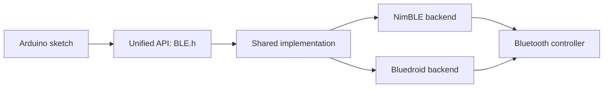

If you have maintained Arduino BLE code across different ESP32 chips, you have likely run into the host-stack divide: juggling `#ifdef` blocks for connection callbacks, managing incompatible security methods, or troubleshooting descriptors that behave differently across targets.

In Arduino Core for ESP32 v4.0, we rebuilt the `BLE` library to eliminate these differences, providing a single stack-independent API across both NimBLE and Bluedroid with Bluetooth 5 enabled by default on supported silicon. We also overhauled `BluetoothSerial` to support multiple concurrent peers and structured discovery. Under the hood, the internal codebase for both libraries was modernized to be more efficient, flexible, and safer against memory bugs, while making the core significantly easier to maintain.

Because both libraries introduce breaking changes compared to v3.x, existing sketches will need adjustments. This article walks through why the refactor was necessary, what changes in your code, and how to migrate to v4.0.0-RC1.


The new libraries are available in [Arduino core v4.0.0-RC1](https://github.com/espressif/arduino-esp32/releases/tag/4.0.0-RC1). In the Arduino IDE, add `https://espressif.github.io/arduino-esp32/package_esp32_dev_index.json` to the Boards Manager URLs, then install v4.0.0-RC1. Please test your projects and [report problems on GitHub](https://github.com/espressif/arduino-esp32/issues).


## One public API for NimBLE and Bluedroid

The ESP32 BLE library in Arduino dates back to 2017. Over time, it grew to support two different underlying host stacks: NimBLE on newer SoCs and Bluedroid on the original ESP32 (which also supports Bluetooth Classic). While sharing class names allowed basic sketches to compile across targets, the abstraction was leaky.

Connection details arrived through stack-specific callback overloads, so a sketch that needed the peer address had to handle raw Bluedroid and NimBLE types directly:

```cpp {title="v3.3.12"}
class MyServerCallbacks : public BLEServerCallbacks {
#if defined(CONFIG_BLUEDROID_ENABLED)
  void onConnect(BLEServer *server, esp_ble_gatts_cb_param_t *param) override {
    BLEAddress peer(param->connect.remote_bda);
    Serial.printf("Connected: %s\n", peer.toString().c_str());
  }
#elif defined(CONFIG_NIMBLE_ENABLED)
  void onConnect(BLEServer *server, ble_gap_conn_desc *desc) override {
    BLEAddress peer(desc->peer_ota_addr);
    Serial.printf("Connected: %s\n", peer.toString().c_str());
  }
#endif
};
```

This division ran deeper than callbacks. Because each backend had separate code paths, bug fixes, connection lifecycles, and event ordering often diverged between chips.

Public headers in v4.0 no longer expose underlying stack types. Connection callbacks receive a unified `BLEConnInfo` object containing the peer address, connection handle, MTU, security status, connection parameters, and PHY regardless of the active backend:

```cpp {title="v4.0.0-RC1"}
server.onConnect([](BLEServer server, const BLEConnInfo &conn) {
  Serial.printf("Connected: %s\n", conn.getAddress().toString().c_str());
});

server.onDisconnect([](BLEServer server, const BLEConnInfo &conn, uint8_t reason) {
  Serial.printf("Disconnected: %s, reason 0x%02X\n",
                conn.getAddress().toString().c_str(), reason);
});
```

To achieve this consistency, v4.0 introduces a shared core layer between the public API and the backend drivers. Only the driver required for your target chip is compiled into the build:



Every major component follows this structure. For example, the GATT server provides a public `BLEServer` handle, shared business logic in `BLEServerImpl`, and backend-specific code in `.nimble.cpp` and `.bluedroid.cpp`. Both adapters enforce identical state machines and event ordering.

When a feature is not supported by a particular chip or stack, the API remains declared so your code still compiles. The call either returns `BTStatus::NotSupported` or yields an empty handle, allowing your sketch to check capabilities at runtime rather than relying on compile-time flags.

## Consistent security models and notification setup

In earlier releases, setting up GATT characteristics required navigating subtle, stack-dependent behaviors. Overlooking these differences often resulted in characteristics that appeared configured correctly but failed silently or left data unprotected.

### Separating properties from access permissions

Historically, NimBLE configured security requirements via characteristic property flags, whereas Bluedroid relied on `setAccessPermissions()`. Because each stack ignored the other's configuration method, portable code had to specify security in two different places:

```cpp {title="v3.3.12"}
uint32_t properties =
  BLECharacteristic::PROPERTY_READ | BLECharacteristic::PROPERTY_WRITE |
  BLECharacteristic::PROPERTY_READ_AUTHEN |       // NimBLE only
  BLECharacteristic::PROPERTY_WRITE_AUTHEN;

BLECharacteristic *pChar = pService->createCharacteristic(
  CHARACTERISTIC_UUID, properties
);
pChar->setAccessPermissions(
  ESP_GATT_PERM_READ_ENC_MITM |                   // Bluedroid only
  ESP_GATT_PERM_WRITE_ENC_MITM
);
```

If you omitted the NimBLE property flags, a characteristic verified as secure on an ESP32 (Bluedroid) would end up completely unauthenticated when flashed to an ESP32-S3 or ESP32-C6 (NimBLE).

The new API cleanly separates properties and permissions across both backends: properties define what operations are supported, and permissions define who is allowed to perform them:

```cpp {title="v4.0.0-RC1"}
BLECharacteristic chr = svc.createCharacteristic(
  CHR_UUID,
  BLEProperty::Read | BLEProperty::Write,
  BLEPermission::ReadWriteAuthenticated
);
```

Permission constants combine an operation direction (`Read`, `Write`, or `ReadWrite`) with a security requirement (`Open`, `Encrypted`, `Authenticated`, or `Authorized`). You can combine different levels using bitwise OR:

```cpp
BLEPermission::ReadOpen | BLEPermission::WriteEncrypted
```

Access is closed by default. If you define a characteristic with `BLEProperty::Read` but omit read permissions, clients will be unable to read the value. When migrating to v4.0, make sure to specify explicit permissions for every readable or writable characteristic.

`BLESecurity` already existed in v3.x, but its underlying implementation was rewritten in v4.0 to be safer and more uniform across backends, handling pairing modes, IO capabilities, and passkeys consistently without stack-specific quirks:

```cpp
BLESecurity sec = BLE.getSecurity();
sec.setAuthenticationMode(true, true, true);  // bonding, MITM, Secure Connections
sec.setIOCapability(BLEIOCapability::DisplayOnly);
sec.setStaticPassKey(123456);
```

### Automatic CCCD creation for notifications

To allow clients to subscribe to notifications or indications, a characteristic must include a Client Characteristic Configuration Descriptor (CCCD, UUID `0x2902`). Bluedroid previously required sketches to manually allocate and attach this descriptor:

```cpp {title="v3.3.12"}
pChar->addDescriptor(new BLE2902());
```

If you omitted that line, notifications failed silently. NimBLE, by contrast, generated the CCCD automatically and deprecated `BLE2902`.

Starting in v4.0, declaring `BLEProperty::Notify` or `BLEProperty::Indicate` automatically creates the required CCCD on both backends:

```cpp {title="v4.0.0-RC1"}
BLECharacteristic chr = svc.createCharacteristic(
  CHR_UUID,
  BLEProperty::Read | BLEProperty::Notify,
  BLEPermission::ReadOpen
);
```

Other legacy descriptor helper classes have also been replaced by direct methods. For instance, `chr.setDescription("Temperature")` replaces manually creating a `BLE2901` descriptor.

## Resource management with handles instead of raw pointers

### Safe lifetimes and explicit shutdown

Creating BLE servers, services, and characteristics in v3.x relied on factory methods that returned raw pointers:

```cpp {title="v3.3.12"}
#include <BLEDevice.h>
#include <BLEServer.h>

BLEDevice::init("MyServer");
BLEServer *pServer = BLEDevice::createServer();
BLEService *pService = pServer->createService(SERVICE_UUID);
BLECharacteristic *pChar = pService->createCharacteristic(
  CHARACTERISTIC_UUID,
  BLECharacteristic::PROPERTY_READ
);
pChar->setValue("Hello");
pService->start();

BLEAdvertising *pAdvertising = BLEDevice::getAdvertising();
pAdvertising->addServiceUUID(SERVICE_UUID);
BLEDevice::startAdvertising();
```

Ownership rules were ambiguous. Sketches had to allocate objects with `new` without a clear lifecycle, and calling `BLEDevice::deinit()` tore down internal instances while leaving user code holding dangling pointers.

With v4.0, the static `BLEDevice` class is replaced by a global `BLE` instance, and factory methods return lightweight, copyable handles backed by reference-counted implementations:

```cpp {title="v4.0.0-RC1"}
#include <BLE.h>

BLE.begin("MyServer");
BLEServer server = BLE.createServer();
BLEService svc = server.createService(SVC_UUID);
BLECharacteristic chr = svc.createCharacteristic(
  CHR_UUID,
  BLEProperty::Read,
  BLEPermission::ReadOpen
);
chr.setValue("Hello");
server.start();

BLEAdvertising adv = BLE.getAdvertising();
adv.addServiceUUID(SVC_UUID);
adv.start();
```

Because handles manage their underlying resources automatically, you can safely pass them by value, store them in standard containers, or capture them in lambda callbacks without manual `delete` calls. An uninitialized or released handle safely evaluates to `false`.

Service registration is also consolidated. Instead of calling `start()` on every individual service, calling `server.start()` registers the complete GATT table in one pass once all services and characteristics are configured.

Stack teardown is predictable as well. Calling `BLE.end()` shuts down the host stack cleanly even if your sketch still holds active handles (which will subsequently return `BTStatus::InvalidState`). If you need to reclaim memory, `BLE.end(true)` releases controller memory as well, after which BLE remains disabled until the SoC is restarted.

### Independent client instances

Previously, the library tracked only a single static client instance internally:

```cpp {title="v3.3.12"}
// BLEDevice.h
static BLEClient *m_pClient;
```

While you could call `BLEDevice::createClient()` multiple times, only the most recently created instance received GAP events on Bluedroid, and `deinit()` cleaned up only that final pointer.

Each `BLE.createClient()` call now yields a fully independent client with its own connection lifecycle, state machine, and callbacks. Managing multiple concurrent client connections is now straightforward:

```cpp {title="v4.0.0-RC1"}
BLEScan::Results results = BLE.getScan().startBlocking(5000);
std::vector<BLEClient> clients;

for (const BLEAdvertisedDevice &dev : results) {
  if (!dev.isAdvertisingService(SVC_UUID)) {
    continue;
  }

  BLEClient client = BLE.createClient();
  if (client.connect(dev) && client.discoverServices()) {
    clients.push_back(client);
  }
}
```

For non-blocking workflows, `client.connectAsync()` initiates connection in the background, and `client.cancelConnect()` aborts an in-progress attempt. On the peripheral side, `chr.notify()` broadcasts to all subscribed peers, while `chr.notify(conn.getHandle())` targets a specific connection.

## Structured error reporting with `BTStatus`

Most v3.x functions returned either `void` or a simple `bool`, leaving the caller without information about why an operation failed. Worse, if a feature was omitted from the build configuration, factory functions like `createServer()` or `createClient()` would invoke `abort()` and crash the microcontroller.

Operations that can fail now return a `BTStatus` code. You can evaluate it directly in boolean expressions, convert it to a descriptive string, or inspect specific failure modes:

```cpp {title="v4.0.0-RC1"}
BTStatus status = BLE.begin("MyDevice");
if (!status) {
  Serial.printf("BLE init failed: %s\n", status.toString());
  return;
}

status = client.connect(address, 5000);
if (status == BTStatus::Timeout) {
  Serial.println("Connection timed out");
}
```

Common status codes include `Timeout`, `NotConnected`, `AuthFailed`, `PermissionDenied`, `NotSupported`, and `InvalidState`. In addition, core types like `BTStatus` and `BTAddress` (which replaces `BLEAddress`) are now shared across both BLE and Bluetooth Classic.

## Bluetooth 5 enabled by default with a standard API

In v3.x, Bluetooth 5 capabilities were disabled by default in precompiled release binaries. To use them, developers had to recompile the static libraries with custom `sdkconfig` options or include Arduino as an ESP-IDF component. Even with the options enabled, sketches had to bypass the Arduino abstraction and configure low-level ESP-IDF structs directly:

```cpp {title="v3.3.12"}
esp_ble_gap_ext_adv_params_t params = {
  .type = ESP_BLE_GAP_SET_EXT_ADV_PROP_SCANNABLE,
  .primary_phy = ESP_BLE_GAP_PHY_1M,
  .secondary_phy = ESP_BLE_GAP_PHY_2M,
  .sid = 1,
  // Several more ESP-IDF fields were required here.
};

BLEMultiAdvertising advert(4);
advert.setAdvertisingParams(0, &params);
```

This approach also created practical hurdles: the v3.x examples assumed Bluedroid on a Bluetooth 5 SoC, whereas stock Arduino builds configured newer Bluetooth 5 chips with NimBLE and the original ESP32 (a Bluetooth 4.2 device) with Bluedroid.

The v4.0 core enables Bluetooth 5 out of the box in precompiled binaries for all supported chips. Features like extended advertising, periodic advertising, periodic sync, PHY selection (2M and Coded PHY), and Data Length Extension (DLE) are part of the standard `BLEAdvertising` API:

```cpp {title="v4.0.0-RC1"}
BLEAdvertising adv = BLE.getAdvertising();
adv.setExtType(ADV_INSTANCE, BLEAdvType::ConnectableScannable);
adv.setExtPhy(ADV_INSTANCE, BLEPhy::PHY_1M, BLEPhy::PHY_2M);
adv.setExtSID(ADV_INSTANCE, 1);

BLEAdvertisementData data;
data.setName("ESP32-BLE5-Extended");
data.addServiceUUID(SVC_UUID);
adv.setExtAdvertisementData(ADV_INSTANCE, data);

BTStatus status = adv.startExtended(ADV_INSTANCE);
```

Extended advertising allows payload sizes up to 1650 bytes, far exceeding the 31-byte legacy advertising limit. When run on original ESP32 hardware that lacks Bluetooth 5 support, these methods return `BTStatus::NotSupported` at runtime.

## New features in v4.0

### Multi-peer support and updates in `BluetoothSerial`

`BluetoothSerial` handles Bluetooth Classic (SPP) communication. In standard precompiled builds, it runs on the original ESP32 with Bluedroid. (Like other features requiring non-default `sdkconfig` options, it can also be enabled on other classic-capable SoCs such as the ESP32-S31 when recompiling the static libraries or running Arduino as an ESP-IDF component.)

Earlier versions supported only one connection at a time. The v4.0 library adds multi-peer acceptor support, allowing multiple devices to connect concurrently. Event callbacks like `onConnect()`, `onDisconnect()`, and `onPeerData()` pass the peer's `BTAddress`, and `writeTo()` lets you transmit to a specific device rather than broadcasting to all connected peers.

Device discovery and bonding have also been overhauled: `discover()` now returns a `std::vector` of scan results containing the address, name, device class, and RSSI, while `getBondedDevices()`, `deleteBond()`, and `deleteAllBonds()` provide full bond management. In addition, Secure Simple Pairing (SSP) confirmation is simplified: `onConfirmRequest()` now returns a boolean directly (`true` to accept, `false` to reject) instead of requiring a separate call to `SerialBT.confirmReply()`.

### `BLEStream` for serial-like data transfer over BLE

The new `BLEStream` class implements the Nordic UART Service (NUS) on top of Arduino's `Stream` interface. Sketches that use `Serial` or hardware UARTs can use the exact same `read()`, `write()`, and `available()` methods over BLE:

```cpp
#include <BLE.h>

BLEStream bleSerial;

void setup() {
  Serial.begin(115200);

  BTStatus status = bleSerial.begin("ESP32 UART");
  if (!status) {
    Serial.printf("BLEStream failed: %s\n", status.toString());
  }
}

void loop() {
  while (bleSerial.available()) {
    Serial.write(bleSerial.read());
  }
  while (Serial.available()) {
    bleSerial.write(Serial.read());
  }
}
```

`BLEStream` also supports multiple simultaneous peer connections. Calling `write()` broadcasts data to all connected clients, while `writeTo()` directs bytes to a specific peer:

```cpp
bleSerial.onPeerData([](const BLEConnInfo &peer, const uint8_t *data, size_t len) {
  bleSerial.writeTo(peer, data, len);
});
```

### L2CAP connection-oriented channels

For high-throughput applications that do not require GATT attributes, NimBLE targets now support L2CAP Connection-Oriented Channels (CoC) via `BLE.createL2CAPServer()` and `BLE.connectL2CAP()`. The library handles packet fragmentation across the channel MTU and credit-based flow control automatically.

On Bluedroid, L2CAP CoC is managed internally by the host stack and is not exposed for direct user configuration or application data streaming. Calling these factory methods on Bluedroid builds logs a warning and returns an empty handle, while operations on those handles return `BTStatus::NotSupported`.

### Integrated HID device setup

Human Interface Device (HID) setup is now integrated directly with the GATT server. `BLEHIDDevice` takes a `BLEServer` handle, ensuring all required HID services and descriptors register in a single step during `server.start()`:

```cpp
BLEHIDDevice hid(server);
hid.manufacturer("Espressif");
hid.reportMap(reportMap, sizeof(reportMap));
BLECharacteristic input = hid.inputReport(1);
server.start();

BLE.getAdvertising().setAppearance(BLE_APPEARANCE_HID_KEYBOARD);
```

The library automatically manages the required HID service UUIDs, attaches the mandatory Battery Service, and registers the External Report Reference descriptor.

## Upcoming: LE Audio and Auracast

Support for Bluetooth LE Audio is actively in development for compatible Espressif SoCs. This will bring Broadcast Audio (Auracast) and Connected Isochronous Streams (CIS/BIS) directly into the Arduino environment. We will publish a dedicated guide and API walkthrough once the preview builds are ready for testing.

## Migrate and test your sketches

Detailed migration guides with comprehensive before-and-after code samples are available in the repository:

- [BLE Migration Guide](https://github.com/espressif/arduino-esp32/blob/release/v4.0.x/libraries/BLE/MIGRATION.md)
- [BluetoothSerial Migration Guide](https://github.com/espressif/arduino-esp32/blob/release/v4.0.x/libraries/BluetoothSerial/MIGRATION.md)

After updating to v4.0.0-RC1, you can explore the updated example sketches under **File > Examples > BLE** and **File > Examples > BluetoothSerial**. Please test your migrated projects on target hardware and [report any issues on GitHub](https://github.com/espressif/arduino-esp32/issues).

### Quick reference for porting a v3.x BLE sketch

| v3.3.12 | v4.0.0-RC1 |
|---|---|
| `#include <BLEDevice.h>`, `BLEDevice::init()` | `#include <BLE.h>`, `BLE.begin()` |
| `BLEDevice::deinit()` | `BLE.end()` |
| Raw pointers (`BLEServer *`, `BLECharacteristic *`) | Handles (`BLEServer`, `BLECharacteristic`) |
| `pService->start()` for each individual service | `server.start()` once after all services are added |
| `BLEDevice::startAdvertising()` | `BLE.getAdvertising()`, then `adv.start()` |
| `onConnect()` with stack-specific structs | `server.onConnect()` with `const BLEConnInfo &` |
| `PROPERTY_READ_AUTHEN` plus `setAccessPermissions()` | `BLEProperty` and `BLEPermission` in `createCharacteristic()` |
| `addDescriptor(new BLE2902())` | Automatic when using `BLEProperty::Notify` / `Indicate` |
| `BLE2901` helper | `chr.setDescription()` |
| `BLEAddress` | `BTAddress` |
| `esp_ble_gap_ext_adv_params_t` with `BLEMultiAdvertising` | `setExtType()`, `setExtPhy()`, `setExtSID()`, `startExtended()` |

## Acknowledgements

The v4.0 Bluetooth libraries build upon years of development and contributions from the open-source community:

- **Neil Kolban**, who created the original `esp32-snippets` BLE library in 2017.
- **Ryan Powell** ([h2zero](https://github.com/h2zero)), whose `NimBLE-Arduino` and `esp-nimble-cpp` projects form the foundation of NimBLE support in the Arduino core.
- **chegewara**, for core contributions to HID and security implementations.
- **pcbreflux**, for Eddystone beacon support.
- **Evandro Luis Copercini**, author of the original `BluetoothSerial` library.
- The **mbed** project, whose HID type definitions continue to serve the library.
- The community members who reported issues, shared logs, and tested implementations across various hardware revisions.

Detailed attribution and license notices are available in the source file headers and in the library's [`NOTICE`](https://github.com/espressif/arduino-esp32/blob/release/v4.0.x/libraries/BLE/NOTICE) file.

## Resources and documentation

- [BLE library README and security guide](https://github.com/espressif/arduino-esp32/blob/release/v4.0.x/libraries/BLE/README.md)
- [BLE architecture and design documentation](https://github.com/espressif/arduino-esp32/blob/release/v4.0.x/libraries/BLE/DESIGN.md)
- [BLE examples repository](https://github.com/espressif/arduino-esp32/tree/release/v4.0.x/libraries/BLE/examples)
- [BluetoothSerial examples repository](https://github.com/espressif/arduino-esp32/tree/release/v4.0.x/libraries/BluetoothSerial/examples)
- [NimBLE-Arduino upstream project](https://github.com/h2zero/NimBLE-Arduino)
