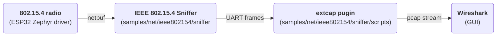

## From Radio Waves to Wireshark

When a Thread network refuses to form or a Zigbee device never answers, the first question is always the same: what is actually on the air? A packet sniffer answers it, and if your board already has an IEEE 802.15.4 radio, a sniffer is the cheapest useful thing you can build with it. It is also the most direct test of a radio driver, because it uses only the receive path and nothing else.

This article shows how a Zephyr sample turns an Espressif SoC into a promiscuous 802.15.4 sniffer that feeds Wireshark live. The whole chain looks like this:



The firmware runs on every Espressif SoC that has an 802.15.4 radio. It has been built and run on:

- `esp32h2_devkitm`
- `esp32c6_devkitc/esp32c6/hpcore`
- `esp32c5_devkitc/esp32c5/hpcore`

The original ESP32 and the ESP32-S series have no 802.15.4 radio, so they cannot be used.

Besides the how-to, the article covers why the design looks the way it does, and the handful of things that went wrong on the way. Most of them are not specific to 802.15.4 and will bite any serial tool on Espressif devkits.

## The Pieces of the Puzzle

There are three parts, and each one does as little as it can:

1. **The firmware**, `samples/net/ieee802154/sniffer/`. It puts the radio into promiscuous receive mode and prints every frame it hears as one line of text. It uses only the generic Zephyr radio API (`struct ieee802154_radio_api`), so nothing in it is Espressif specific.
2. **The console UART.** The capture lines, the Zephyr shell and the log messages all share the one serial port the devkit exposes over USB. No second UART and no second cable are needed.
3. **The extcap plugin**, `samples/boards/espressif/wireshark/ieee802154_sniffer.py`. It is one Python file, written for this sample from the extcap and IEEE 802.15.4 TAP specifications. Wireshark starts it, it drives the sniffer through the shell, turns capture lines into a pcap stream and hands that stream back to Wireshark.

The firmware sits in the generic networking samples because any 802.15.4 radio with a Zephyr driver can run it. The plugin lives under `samples/boards/espressif/` because it is handling Espressif specifics such as replacement of FCS field by LQI and RSSI on the driver blob level.

## Inside the Sniffer Firmware

The sample is built with `CONFIG_IEEE802154_RAW_MODE=y`, which leaves the 802.15.4 L2, the network interface and the sockets out of the build. The radio driver still hands every received frame to `net_recv_data()`, and in raw mode nothing in the stack defines that function, so the application defines it itself. That one function is the whole link between the driver and the sample:

```c
/* Raw mode (CONFIG_IEEE802154_RAW_MODE) leaves the net stack
 * out of the build, so the driver's receive path lands here
 * directly. It runs in the driver's RX thread.
 */
int net_recv_data(struct net_if *iface, struct net_pkt *pkt)
```

Everything else goes through `struct ieee802154_radio_api` directly: `start`, `stop`, `set_channel`, `configure` and `get_capabilities`. At boot the sample reads the driver's capabilities and, if the driver reports `IEEE802154_HW_PROMISC`, enables promiscuous mode with `IEEE802154_CONFIG_PROMISCUOUS`. Then it tunes the radio to the boot channel (`CONFIG_NET_CONFIG_IEEE802154_CHANNEL`) and starts receiving.

On Espressif parts, promiscuous mode turns off the hardware frame filter, so every frame with a valid CRC is delivered, whatever its PAN ID, short address or extended address.

### Capturing Raw 802.15.4 Frames

The Espressif radio checks the frame checksum (FCS) in hardware and drops frames that fail. For frames that pass, it writes RSSI and LQI over the two FCS bytes in the receive buffer before the driver sees them. So by the time a frame reaches software, its last two bytes are no longer a checksum.

Zephyr's default for raw mode is to include those two bytes (`CONFIG_IEEE802154_L2_PKT_INCL_FCS` is `default y` when `IEEE802154_RAW_MODE` is enabled). The sample turns it off in `prj.conf`, so the capture line carries the PSDU without them:

```
# The capture line carries the PSDU without an FCS and
# the host tool appends a recomputed one. The radio has
# already dropped the frames whose checksum was wrong,
# and some radios, the ESP32 among them, overwrite the
# two FCS bytes with RSSI and LQI, so what the driver
# would hand up is not a checksum at all.
CONFIG_IEEE802154_L2_PKT_INCL_FCS=n
```

A side effect is that this sniffer only ever shows good frames. Capturing corrupt frames, or anything below the PSDU (preamble, SFD, symbol timing), is not possible through this path. For protocol work on Thread, Zigbee or plain 802.15.4 MAC that makes no difference, but it is not an RF debugging tool.

The receive path has two stages so that a slow UART never blocks the radio driver:

1. `net_recv_data()` runs in the driver's receive thread. It copies the PSDU, RSSI, LQI and timestamp into a small message, puts it into a `k_msgq` 16 entries deep and returns at once. If the queue is full, the frame is counted as dropped instead of waiting.
2. A stream thread takes messages off the queue and prints them with `uart_poll_out()`. The hex digits go out one byte at a time rather than being formatted into a buffer first, because a maximum-length PSDU alone is about 250 characters of hex.

### Timestamps, RSSI and LQI

Each frame carries three pieces of metadata from the driver:

- **Timestamp.** The ESP32 driver takes it with `esp_timer_get_time()` when the radio signals the start-of-frame delimiter, so it is in microseconds since boot. The sample enables `CONFIG_NET_PKT_TIMESTAMP` to get it into the `net_pkt`. The board has no idea of wall-clock time, so the plugin pins the first frame it receives to the host's clock and places every later frame relative to that one.
- **RSSI**, in dBm, signed. When the driver has no value it reports `IEEE802154_MAC_RSSI_DBM_UNDEFINED` (`-32768`). The sample prints that value instead of leaving the field out, so every line has the same shape, and the plugin leaves the RSSI field out of the frame it writes to Wireshark.
- **LQI**, the link quality indicator, from 0 to 255.

### Getting Packets Off the Device

Every captured frame becomes one line on the console UART:

```
psdu: 41881234567890abcdef power: -47 lqi: 103 time: 123456789
```

- `psdu`: the frame as lowercase hex, no separators, no FCS.
- `power`: RSSI in dBm.
- `lqi`: 0 to 255.
- `time`: microseconds since boot.

We are using the plain text messages because the radio is what limits how fast frames can come out and the UART speed is suitable. Some numbers:

- 802.15.4 runs at 250 kbit/s, so a 127-byte frame takes `127 * 8 / 250000` = **4.06 ms** on the air.
- Its capture line is about 290 characters. At 8N1 that is 10 bits per character.
- At 115200 baud the line takes `294 * 10 / 115200` = **25.5 ms**, six times the air time.
- At 921600 baud it takes **3.2 ms**, just under the air time, so back-to-back maximum-length frames can be kept up with.

A binary format would halve the line length, which still leaves 115200 baud too slow and does not matter at 921600. In exchange it would give up the one property that makes the whole design simple: text lines can share the UART with the shell and the log. The plugin ignores every line that does not match the capture pattern, so a log message or a shell prompt in the middle of a capture does no harm. That is also what lets the plugin send shell commands and read frames over the same port, which extcap needs.

So the format stays text, and the baud rate goes up during a capture instead (see [Channel Selection and Runtime Commands](#channel-selection-and-runtime-commands)).

## Meeting Wireshark: Extcap

Extcap is Wireshark's interface for external capture programs. Any executable in Wireshark's extcap folder is asked a few questions on startup, and the answers make it show up as a normal capture interface. When you start a capture, Wireshark runs the program again with a path to a fifo, and the program writes a pcap stream into it until it is stopped.

| Wireshark calls | The plugin answers |
| --- | --- |
| `--extcap-interfaces` | one interface per USB serial port (ports without a USB vendor ID, such as `/dev/ttyS*`, are skipped) |
| `--extcap-dlts` | the link type: `dlt {number=283}{name=IEEE802_15_4_TAP}` |
| `--extcap-config` | the fields of the interface settings dialog: channel, baud rate, capture baud rate, diagnostic log |
| `--capture --fifo <path> --extcap-interface <port> ...` | writes a pcap stream into the fifo until it gets `SIGINT` or `SIGTERM` |

The link type is the one real decision here. The plugin uses **DLT 283, IEEE 802.15.4 TAP**. TAP puts a small header of type-length-value (TLV) fields in front of each frame, so the channel, RSSI and LQI show up in Wireshark as per-packet fields you can filter and sort on. Run standalone with `--metadata none`, the plugin instead writes bare frames with **DLT 195, IEEE 802.15.4 with FCS**, which is handy for checking that the frames themselves dissect correctly.

## Building the Wireshark Bridge

The plugin's capture path is short: read lines from the serial port, match each one against the capture pattern, turn it into a pcap record, and write the record into the fifo.

**Reading lines.** It does not use pySerial's `Serial.readline()`. That method comes from `io.RawIOBase`, reads one byte per system call and, when the read timeout expires mid-line, returns the part of the line it has. The rest of the line then arrives as a separate line, and neither half matches the pattern. The plugin's `LineReader` instead reads whatever is waiting (`port.read(max(1, port.in_waiting))`), splits the buffer on newlines and keeps the incomplete tail for next time. In a test where every line was cut in half with a 300 ms pause in the middle, the buffered reader lost no frames and `readline()` lost all of them.

**The TAP header.** Each record starts with a 4-byte header (version 0, one reserved byte, total length) followed by TLVs, each padded to 4 bytes:

| TLV | Type | Length | Value |
| --- | --- | --- | --- |
| FCS type | 0 | 1 | 1 = 16-bit CRC |
| RSS | 1 | 4 | float32, dBm (left out when RSSI is undefined) |
| Channel assignment | 3 | 3 | u16 channel + u8 channel page |
| LQI | 10 | 1 | u8 |

With all four present the header is 36 bytes.

**The FCS, regenerated.** The firmware sends frames without an FCS, and the plugin computes one and appends it, because other tools that read the capture expect complete frames. It is the standard 802.15.4 CRC-16: reflected polynomial `0x8408`, zero seed, appended little endian.

For the PSDU `41880134127856bc9adeadbeef` this gives `0x2abd`, and Wireshark shows `FCS: 0x2abd (Correct)`. Be aware of what this value means: the radio checked the real checksum before overwriting it, so the regenerated one always matches the frame, but it is **not** the checksum that arrived over the air.

The appended bytes and the FCS-type TLV belong together. Without the TLV, Wireshark's TAP dissector assumes the frame has no FCS and shows the two CRC bytes as payload (`Data: deadbeefbd2a` instead of `deadbeef` plus a correct FCS). Add both or neither.

## Controlling the Sniffer from Wireshark

Build and flash the firmware (full commands in [List of Materials](#list-of-materials)), then install the plugin into Wireshark's personal extcap folder. Wireshark shows the folder under **Help > About Wireshark > Folders > Personal Extcap path**:

```console
mkdir -p <personal-extcap-path>
cp samples/net/ieee802154/sniffer/scripts/espressif_ieee802154_sniffer.py <personal-extcap-path>/
chmod +x <personal-extcap-path>/espressif_ieee802154_sniffer.py
```

Restart Wireshark, or use **Capture > Refresh Interfaces**. Each USB serial port shows up as *Espressif IEEE 802.15.4 sniffer (port description)*. On Linux, the user running Wireshark needs access to the serial port (usually the `dialout` group, `uucp` on some distributions) and to capturing (usually the `pcap` or `wireshark` group).

The gear icon next to the interface opens its settings:

- **Channel**, 11 to 26, default 20. The plugin retunes the radio at the start of every capture, so the channel the board booted on does not matter.
- **Baud rate**, default 115200: the rate the console runs at when the capture starts.
- **Capture baud rate**, default 921600: the rate the plugin raises the console to for the capture and resets afterwards. 0 leaves the rate alone.
- **Diagnostic log**, a file path, empty by default. See [Debugging the Capture Pipeline](#debugging-the-capture-pipeline).

Opening the port does not reset the board. On Espressif devkits, DTR and RTS drive the auto-reset circuit, and pySerial asserts both lines when it opens a port. The board reboots, and a chip with a USB serial/JTAG peripheral can be left in the download mode, where it never sends a frame again. The plugin creates the `Serial` object unopened, sets `dtr` and `rts` to `False`, and only then calls `open()`; pySerial applies the stored values as it opens the port. Every serial tool written for these boards runs into this sooner or later.

## Channel Selection and Runtime Commands

The sample registers a `sniffer` shell command, so it can be driven by hand from any serial terminal as well as by the plugin:

```console
uart:~$ sniffer channel 15
channel 15
uart:~$ sniffer start
started
psdu: 41881234567890abcdef power: -47 lqi: 103 time: 123456789
uart:~$ sniffer stats
enq=1 drop=0 tx_rec=1 tx_bytes=68 q_hwm=1 q_used=0/16
uart:~$ sniffer stop
stopped
uart:~$ sniffer speed
speed 115200
```

| Command | What it does |
| --- | --- |
| `sniffer start` / `stop` | turn receive on and off |
| `sniffer channel [n]` | show or set the channel; refused with `-EBUSY` while the radio is running |
| `sniffer speed [baud]` | show or set the console baud rate |
| `sniffer stats` | counters: frames queued (`enq`), dropped (`drop`), lines printed (`tx_rec`), bytes printed (`tx_bytes`), queue high-water mark and current fill |
| `sniffer stats_reset` | zero the counters |

The channel can only change while the radio is stopped, because the plugin labels every frame with the channel it asked for. Changing it under a running capture would make those labels wrong.

`sniffer speed` changes the console rate on a running board using `uart_configure()`, which the Espressif UART driver supports with `CONFIG_UART_USE_RUNTIME_CONFIGURE` (enabled in the sample). There is a catch: the driver resets both UART FIFOs when the rate changes, so anything still waiting to be sent is lost. The command therefore prints its reply first, waits 20 ms for it to leave the wire, and only then switches the rate. The console stays at the board's default 115200 baud otherwise, so the shell still works in a normal terminal.

When a capture starts, the plugin goes through this sequence:

1. Open the fifo and write the pcap header, then open the serial port with DTR and RTS low.
2. Find the console rate: send a bare newline and listen for a prompt, a frame or readable text. If nothing readable comes back, try the other common rate (115200 or 921600). A capture that was killed outright leaves the board at the capture rate, and this is how the next capture finds it.
3. Send `shell echo off` and `sniffer stop`.
4. `sniffer speed 921600`, switch the host side too, then read the rate back with `sniffer speed` to confirm. If there is no confirmation, go back to the old rate: a slower capture beats none.
5. `sniffer channel <n>`, `sniffer start`, `sniffer stats`.
6. Write every frame line to the fifo until Wireshark stops the capture.
7. On the way out, `sniffer stop` and reset the console rate.

Each command is retried and checked for its expected reply, but none of them can stop the capture. A board that does not answer is still captured from, and the log records which commands went unanswered. Frames that arrive during steps 2 to 5 are dropped and do not reach Wireshark.

Changing the channel during a running capture is not supported yet. It needs an extcap control toolbar, which the plugin does not have. For now, stop the capture, change the channel in the interface settings and start again.

## Debugging the Capture Pipeline

When Wireshark's packet list stays empty, the first question is: did the radio hear anything at all? `sniffer stats` answers it:

```
enq=0 drop=0 tx_rec=0 tx_bytes=0 q_hwm=0 q_used=0/16
```

`enq=0` means no frame reached the sample. Check the channel and whether anything is transmitting. A non-zero `enq` with a non-zero `drop` means the UART cannot keep up; raise the capture baud rate. A non-zero `enq` and `tx_rec` with an empty Wireshark means the problem is on the host.

For host-side problems, fill in **Diagnostic log** in the interface settings (or pass `--log-file`). Wireshark throws away whatever an extcap plugin writes to stderr, so this file is the only record of what happened. It holds the replies to each command, the rate the plugin settled on and the first lines that did not parse. A healthy start looks like this (captured from a test run against an emulated board on a pty):

```
/dev/pts/11 open at 115200 baud
'sniffer speed 921600' -> speed 921600
console raised to 921600 baud
'sniffer channel 15' -> channel 15
'sniffer start' -> started
'sniffer stats' -> enq=7 drop=0 tx_rec=7 tx_bytes=476 q_hwm=1 q_used=0/16
```

The plugin also runs without Wireshark, which is the fastest way to tell a firmware problem from a plugin problem:

```console
./samples/net/ieee802154/sniffer/scripts/espressif_ieee802154_sniffer.py --extcap-interfaces
./samples/net/ieee802154/sniffer/scripts/espressif_ieee802154_sniffer.py --capture \
    --extcap-interface /dev/ttyUSB0 --channel 15 \
    --log-file sniffer.log --fifo capture.pcap
tshark -r capture.pcap -V | grep -E 'FCS:|Channel:|Data:'
```

## Prerequisites

Hardware:

- One Espressif devkit with an 802.15.4 radio: ESP32-C6-DevKitC, ESP32-H2-DevKitM or ESP32-C5-DevKitC, plus a USB data cable for its UART port.
- Something that sends 802.15.4 traffic: a Thread or Zigbee network, or a second devkit running, for example, a Zephyr OpenThread sample.

Software:

- A Zephyr workspace with the Zephyr SDK and the Espressif binary blobs (`west blobs fetch hal_espressif`). See the [Zephyr Getting Started Guide](https://docs.zephyrproject.org/latest/develop/getting_started/index.html).
- Wireshark 4.0 or later.
- Python 3.10 or later with pySerial (`pip install pyserial`).

Build and flash the firmware from the root of the Zephyr tree:

```console
west build -p -b esp32c6_devkitc/esp32c6/hpcore samples/net/ieee802154/sniffer
west flash
```

For the other boards, replace the board name with `esp32h2_devkitm` or `esp32c5_devkitc/esp32c5/hpcore`.

## Links

- Firmware: [`samples/net/ieee802154/sniffer`](https://docs.zephyrproject.org/latest/samples/net/ieee802154/sniffer/README.html)
- Extcap plugin: `samples/net/ieee802154/sniffer/espressif_ieee802154_sniffer.py`
- [Wireshark extcap documentation](https://www.wireshark.org/docs/wsdg_html_chunked/ChCaptureExtcap.html)
- [IEEE 802.15.4 TAP specification](https://github.com/jkcko/ieee802.15.4-tap)
