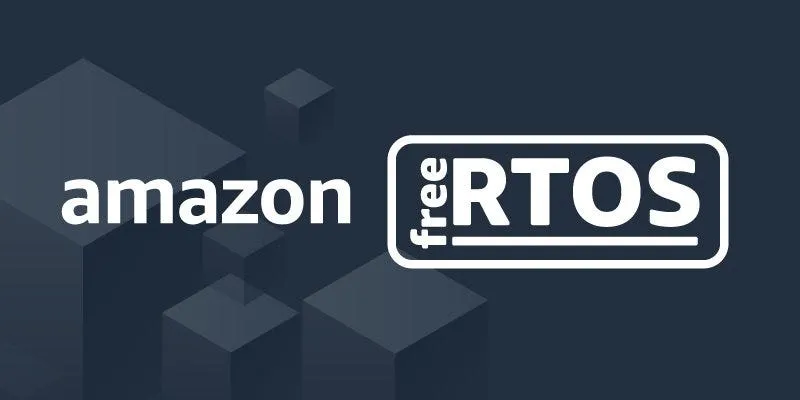

Amazon FreeRTOS is an operating system for microcontrollers that extends the FreeRTOS kernel with libraries that make it easy to connect devices to AWS services like AWS IoT Core and AWS GreenGrass. ESP32 is a certified and fully supported platform for Amazon FreeRTOS.

Some relevant articles:

- [Amazon FreeRTOS and ESP32](https://medium.com/the-esp-journal/amazon-freertos-esp32-support-9874a4412a21)
- [Managing OTA Firmware Upgrades](https://medium.com/the-esp-journal/esp32-ota-updates-amazon-freertos-9ffbbb8f4784)
