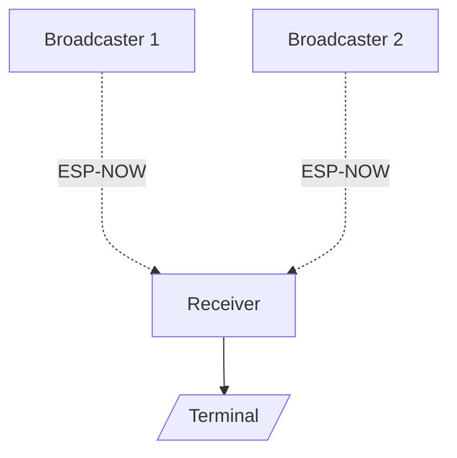

[ESP-NOW](https://www.espressif.com/en/solutions/low-power-solutions/esp-now) is a connectionless Wi-Fi communication protocol developed by Espressif for its microcontrollers. It allows for efficient, low-power, and low-latency peer-to-peer communication. This article will guide you through the essentials of using the new ESP-NOW library included in Arduino 3.0.0, from basic setup to advanced features.

## What is ESP-NOW?

ESP-NOW enables direct communication between multiple devices without needing a router, ideal for applications requiring real-time data transfer with minimal delay. Key features include:
- **Low Latency:** Real-time data transfer.
- **Low Power Consumption:** Suitable for battery-powered devices.
- **Peer-to-Peer Communication:** Direct device-to-device communication.
- **Scalability:** Supports multiple peers in a network.
- **Security:** Built-in encryption for secure data transfer.



Some examples of applications that can benefit from ESP-NOW include home automation, sensor networks, remote control systems, and IoT devices.
The project [ESP-Drone](https://github.com/espressif/esp-drone), for example, uses ESP-NOW to provide a low-latency and reliable connection.

## Getting Started with ESP-NOW in Arduino

To use ESP-NOW with Arduino, you need:
- Any ESP32 board supported by Arduino with Wi-Fi capabilities (note that the H series chips are not supported as they lack Wi-Fi);
- Arduino IDE installed on your computer;
- Arduino Core for ESP32 installed (v3.0.0 or later).

If you still haven't installed the Arduino Core for ESP32, you can do so by following the steps in the [official documentation](https://docs.espressif.com/projects/arduino-esp32/en/latest/getting_started.html).

Note that this guide focuses on the new ESP-NOW library and assumes you are familiar with Arduino/C++ programming and the ESP32 platform.

## Basic ESP-NOW Setup

The ESP-NOW library in Arduino provides a set of classes and functions to simplify the setup and management of ESP-NOW communication. The library includes classes for handling peers, sending and receiving data, and managing the ESP-NOW network.

The basic setup for ESP-NOW involves creating a custom class that inherits from the `ESP_NOW_Peer` class to handle the communication with a peer device. This class will define the send and receive callbacks and manage the ESP-NOW communication.

After creating the custom class, you can create an instance of it passing the MAC address of the peer device, the Wi-Fi channel, the Wi-Fi interface, and the Local Master Key (LMK). Then, you can call the `ESP_NOW.begin()` and `add()` methods to initialize the ESP-NOW communication and register the peer device. Finally, you can use the `send()` method to send data to the peer device and the `onReceive()` method to handle received data.

Be sure to check the [ESP-NOW Library Documentation](https://docs.espressif.com/projects/arduino-esp32/en/latest/api/espnow.html) for detailed information on the classes and methods available in the ESP-NOW library.

Let's show the capabilities of the ESP-NOW library with some examples.

### Two-Device Communication


Let's start with the basics by sending and receiving data between two devices using ESP-NOW. This example is based on the [`ESP_NOW_Serial`](https://github.com/espressif/arduino-esp32/blob/master/libraries/ESP_NOW/examples/ESP_NOW_Serial/ESP_NOW_Serial.ino) sketch provided by the ESP-NOW library. You can find it in the Arduino IDE under `File > Examples > ESP_NOW > ESP_NOW_Serial`.

Normally, you would need to set up an ESP-NOW peer class and define the send and receive callbacks. However, for communication between only two devices, the `ESP_NOW_Serial_Class` is provided to simplify the setup process. To use this class, you need to include the `ESP32_NOW_Serial.h` header file.

We can create a new instance of the `ESP_NOW_Serial_Class` and use it to send and receive data. Let's create a basic sketch to demonstrate this.

```cpp
#include "ESP32_NOW_Serial.h"
#include "MacAddress.h"
#include "WiFi.h"

#include "esp_wifi.h"

#define ESPNOW_WIFI_CHANNEL 1            // WiFi channel to be used by ESP-NOW. The available channels will depend on your region.
#define ESPNOW_WIFI_MODE    WIFI_STA     // WiFi mode to be used by ESP-NOW. Any mode can be used.
#define ESPNOW_WIFI_IF      WIFI_IF_STA  // WiFi interface to be used by ESP-NOW. Any interface can be used.

// Set the MAC address of the peer device to communicate with.
// Change this for each device when uploading the code.
// For example: F4:12:FA:40:64:4C
const MacAddress peer_mac({0xF4, 0x12, 0xFA, 0x40, 0x64, 0x4C});

// Create an instance of the ESP-NOW Serial Class. Parameters: peer MAC address, WiFi channel, WiFi interface.
ESP_NOW_Serial_Class NowSerial(peer_mac, ESPNOW_WIFI_CHANNEL, ESPNOW_WIFI_IF);

void setup() {
  // Start the Serial Monitor
  Serial.begin(115200);
  while (!Serial) {
    delay(10);
  }

  // Set the WiFi to the mode and channel to be used by ESP-NOW
  Serial.println("Setting up WiFi...");
  WiFi.mode(ESPNOW_WIFI_MODE);
  WiFi.setChannel(ESPNOW_WIFI_CHANNEL, WIFI_SECOND_CHAN_NONE);

  // Wait for the WiFi to start
  while (!WiFi.STA.started()) {
    delay(100);
  }

  // Print the MAC address of this device
  Serial.print("MAC Address: ");
  Serial.println(WiFi.macAddress());

  // Start the ESP-NOW communication
  Serial.println("ESP-NOW communication starting...");
  NowSerial.begin(115200);
  Serial.println("You can now send data to the peer device using the Serial Monitor.\n");
}

void loop() {
  // Read data received from the peer device and print it to the Serial Monitor if available
  while (NowSerial.available()) {
    Serial.write(NowSerial.read());
  }

  // Send data received from the Serial Monitor to the peer device if available
  while (Serial.available() && NowSerial.availableForWrite()) {
    if (NowSerial.write(Serial.read()) <= 0) {
      Serial.println("Failed to send data");
      break;
    }
  }

  delay(1);
}
```

Using our newly created object `NowSerial`, we can send and receive data between the two devices. The `ESP_NOW_Serial_Class` handles the setup and communication details, making it easier to work with ESP-NOW.

Any data sent from the Serial Monitor will be transmitted to the peer device, and any data received from the peer device will be printed to the Serial Monitor.

To properly test this example, you need to upload the code to two ESP32 devices, each with the MAC address of the other device set in the `peer_mac` variable.

The data received can be properly displayed in the Serial Monitor of the Arduino IDE by selecting `Both NL & CR` as the line ending.

After loading the code to both devices, you can open the Serial Monitor for each device and start sending data between them.

For example:

- Device 1:
  

- Device 2:
  

### Broadcasting Data

To broadcast data to multiple devices, you can use the broadcast address `FF:FF:FF:FF:FF:FF`. This address will send data to all devices in the network. This address is available as `ESP_NOW.BROADCAST_ADDR` in the ESP-NOW library to simplify its use.



The following examples are based, respectively, on the [ESP-NOW Broadcast Master](https://github.com/espressif/arduino-esp32/blob/master/libraries/ESP_NOW/examples/ESP_NOW_Broadcast_Master/ESP_NOW_Broadcast_Master.ino) and [ESP-NOW Broadcast Slave](https://github.com/espressif/arduino-esp32/blob/master/libraries/ESP_NOW/examples/ESP_NOW_Broadcast_Slave/ESP_NOW_Broadcast_Slave.ino) sketches provided by the ESP-NOW library. You can find them in the Arduino IDE under the `File > Examples > ESP_NOW` sub-menu.

#### Broadcaster Device

To demonstrate broadcasting, let's create a new example using a custom class to handle the ESP-NOW communication. First let's create a new class called `ESP_NOW_Broadcast_Peer` that will handle the setup and communication details. It will be used by the broadcaster device to send data to all receiver devices.

```cpp
#include "ESP32_NOW.h"
#include "WiFi.h"

/* Definitions */

#define ESPNOW_WIFI_CHANNEL 6

/* Classes */

// Creating a new class that inherits from the ESP_NOW_Peer class is required.

class ESP_NOW_Broadcast_Peer : public ESP_NOW_Peer {
public:
  // Constructor of the class using the broadcast address
  // The ESP_NOW_Peer constructor expects the following parameters:
  // MAC address of the peer device, the WiFi channel, the WiFi interface, and the Local Master Key (LMK).
  // In this case, the MAC address will be the broadcast address.
  ESP_NOW_Broadcast_Peer(uint8_t channel, wifi_interface_t iface, const uint8_t *lmk) : ESP_NOW_Peer(ESP_NOW.BROADCAST_ADDR, channel, iface, lmk) {}

  // Destructor of the class
  ~ESP_NOW_Broadcast_Peer() {
    remove(); // Remove the peer from the ESP-NOW network (list of peers).
              // Method from the ESP_NOW_Peer class.
  }

  // Function to properly initialize the ESP-NOW and register the broadcast peer
  bool begin() {
    // The ESP-NOW communication must be started before adding the peer by calling ESP_NOW.begin().
    // The add() method from the ESP_NOW_Peer class is used to register the peer in the ESP-NOW network.
    if (!ESP_NOW.begin() || !add()) {
      log_e("Failed to initialize ESP-NOW or register the broadcast peer");
      return false;
    }
    return true;
  }

  // Function to send a message to all devices within the network
  bool send_message(const uint8_t *data, size_t len) {
    if (!send(data, len)) { // The send(const uint8_t *data, size_t len) method from the ESP_NOW_Peer class is used to send data to the peer.
      log_e("Failed to broadcast message");
      return false;
    }
    return true;
  }

  // We will use the default onReceive() and onSent() methods from the ESP_NOW_Peer class.
  // These methods are called when a message is received or sent, respectively.
};

```

To use this class, we need to create an instance of it and call the `begin()` method to initialize the ESP-NOW communication and register the broadcast peer. Then, we can use the `send_message()` method to broadcast data to all devices in the network. Let's finish the example by creating the setup and loop functions for the broadcaster device.

```cpp

/* Global Variables */

// Message counter
uint32_t msg_count = 0;

// Create a broadcast peer object
ESP_NOW_Broadcast_Peer broadcast_peer(ESPNOW_WIFI_CHANNEL, WIFI_IF_STA, NULL);

/* Main */

void setup() {
  // Start the Serial Monitor
  Serial.begin(115200);
  while (!Serial) {
    delay(10);
  }

  // Initialize the Wi-Fi module
  WiFi.mode(WIFI_STA);
  WiFi.setChannel(ESPNOW_WIFI_CHANNEL);
  while (!WiFi.STA.started()) {
    delay(100);
  }

  Serial.println("ESP-NOW Example - Broadcaster");
  Serial.println("Wi-Fi parameters:");
  Serial.println("  Mode: STA");
  Serial.println("  MAC Address: " + WiFi.macAddress());
  Serial.printf("  Channel: %d\n", ESPNOW_WIFI_CHANNEL);

  // Register the broadcast peer
  if (!broadcast_peer.begin()) {
    Serial.println("Failed to initialize broadcast peer");
    Serial.println("Reebooting in 5 seconds...");
    delay(5000);
    ESP.restart();
  }

  Serial.println("Setup complete. Broadcasting messages every 5 seconds.");
}

void loop() {
  char data[32];

  // Create a message with a counter
  snprintf(data, sizeof(data), "Hello, World! #%lu", msg_count++);

  Serial.printf("Broadcasting message: %s\n", data);

  // Send the message to all devices
  if (!broadcast_peer.send_message((uint8_t *)data, sizeof(data))) {
    Serial.println("Failed to broadcast message");
  }

  // Wait 5 seconds before broadcasting the next message
  delay(5000);
}

```

After uploading the code to the broadcaster device, you can create a similar code for the receiver devices. The receiver devices will obtain the messages from the broadcaster device.

#### Receiver Device

The receiver device will acquire the messages from the broadcaster devices. If a new broadcaster device is added to the network, the receiver device will automatically register it as a peer and start receiving messages. We can create a similar class to handle the ESP-NOW communication for the receiver device.

```cpp
#include "ESP32_NOW.h"
#include "WiFi.h"

#include <esp_mac.h>  // For the MAC2STR and MACSTR macros

#include <vector>

/* Definitions */

#define ESPNOW_WIFI_CHANNEL 6

/* Classes */

// Creating a new class that inherits from the ESP_NOW_Peer class is required.

class ESP_NOW_Peer_Class : public ESP_NOW_Peer {
public:
  // Constructor of the class. Note that the MAC address of peer is not the broadcast address.
  // The ESP_NOW_Peer constructor expects the following parameters:
  // MAC address of the peer device, the WiFi channel, the WiFi interface, and the Local Master Key (LMK).
  ESP_NOW_Peer_Class(const uint8_t *mac_addr, uint8_t channel, wifi_interface_t iface, const uint8_t *lmk) : ESP_NOW_Peer(mac_addr, channel, iface, lmk) {}

  // Destructor of the class
  ~ESP_NOW_Peer_Class() {
    // We will avoid the remove() method here to avoid accidentally removing the peer in the new broadcaster callback.
    // If needed, the remove() method can be called explicitly.
    // In this case, the peer will be removed when the receiver device is turned off.
  }

  // Function to register the new broadcaster peer
  bool add_peer() {
    if (!add()) { // The add() method from the ESP_NOW_Peer class is used to register the peer in the ESP-NOW network.
      log_e("Failed to register the broadcast peer");
      return false;
    }
    return true;
  }

  // Function to print the received messages from the broadcaster
  // The default onReceive() method from the ESP_NOW_Peer will be overridden to handle the received messages.
  void onReceive(const uint8_t *data, size_t len, bool broadcast) {
    // addr() method from the ESP_NOW_Peer class is used to get the MAC address of the current peer.
    Serial.printf("Received a message from broadcaster " MACSTR " (%s)\n", MAC2STR(addr()), broadcast ? "broadcast" : "unicast");
    Serial.printf("  Message: %s\n", (char *)data);
  }

  // We will use the default onSent() method from the ESP_NOW_Peer class.
};
```

We will also need a place to store the peers that will be added to the network and a callback function to handle the addition of unknown peers. Let's create them.

```cpp
/* Global Variables */

// List of all the broadcasters. It will be populated when a new broadcaster is registered
std::vector<ESP_NOW_Peer_Class> broadcasters;

/* Callbacks */

// Callback called when an unknown peer sends a message
// The callback for registering new peers must have the following signature:
// void (*)(const esp_now_recv_info_t *info, const uint8_t *data, int len, void *arg)
// The info parameter contains information about the received message, such as the MAC addresses of the sender and receiver.
// The data parameter contains the message data.
// The len parameter contains the length of the message data.
// The arg parameter is an optional argument that can be passed to the callback.
void register_new_broadcaster(const esp_now_recv_info_t *info, const uint8_t *data, int len, void *arg) {
  if (memcmp(info->des_addr, ESP_NOW.BROADCAST_ADDR, 6) == 0) { // Check if the message was sent to the broadcast address
    Serial.printf("Unknown peer " MACSTR " sent a broadcast message\n", MAC2STR(info->src_addr));
    Serial.println("Registering the peer as a broadcaster");

    // Create a new broadcaster object
    // This auxiliary object will be destroyed after the callback execution.
    // That's why we avoid the use of remove() in the destructor of the ESP_NOW_Peer_Class.
    ESP_NOW_Peer_Class new_broadcaster(info->src_addr, ESPNOW_WIFI_CHANNEL, WIFI_IF_STA, NULL);

    // Add the new broadcaster to the list of broadcasters
    broadcasters.push_back(new_broadcaster);

    // Register the new broadcaster in the ESP-NOW network
    if (!broadcasters.back().add_peer()) {
      Serial.println("Failed to register the new broadcaster");
      return;
    }
  } else {
    // The receiver will only receive broadcast messages
    log_v("Received a unicast message from " MACSTR, MAC2STR(info->src_addr));
    log_v("Igorning the message");
  }
}
```

Now, we can create the setup and loop functions for the receiver device. Note that, as we are already using the `onReceive()` method from the `ESP_NOW_Peer_Class` to handle the received messages, we don't need to do anything in the loop function.

```cpp
void setup() {
  // Start the Serial Monitor
  Serial.begin(115200);
  while (!Serial) {
    delay(10);
  }

  // Initialize the Wi-Fi module
  WiFi.mode(WIFI_STA);
  WiFi.setChannel(ESPNOW_WIFI_CHANNEL);
  while (!WiFi.STA.started()) {
    delay(100);
  }

  Serial.println("ESP-NOW Example - Receiver");
  Serial.println("Wi-Fi parameters:");
  Serial.println("  Mode: STA");
  Serial.println("  MAC Address: " + WiFi.macAddress());
  Serial.printf("  Channel: %d\n", ESPNOW_WIFI_CHANNEL);

  // Initialize the ESP-NOW protocol
  if (!ESP_NOW.begin()) {
    Serial.println("Failed to initialize ESP-NOW");
    Serial.println("Reeboting in 5 seconds...");
    delay(5000);
    ESP.restart();
  }

  // Register the new peer callback that we created before
  // The NULL parameter is an optional argument that can be passed to the callback.
  ESP_NOW.onNewPeer(register_new_broadcaster, NULL);

  Serial.println("Setup complete. Waiting for a broadcast message...");
}

void loop() {
  delay(1000); // Delay to avoid watchdog reset
}
```

After uploading the code to the receiver device, you can start the broadcaster device. The receiver device will automatically register the broadcaster device and start receiving the messages.

For example:

- Broadcaster Device:
  

- Receiver Device:
  

As you can see, the receiver device automatically registers the broadcaster device and starts receiving the messages. If you add more broadcaster devices to the network, the receiver device will also register them and start receiving their messages. This way, you can easily create a network of devices using ESP-NOW.

This example was based on the [`ESP_NOW_Broadcast_Master`](https://github.com/espressif/arduino-esp32/blob/master/libraries/ESP_NOW/examples/ESP_NOW_Broadcast_Master/ESP_NOW_Broadcast_Master.ino) and [`ESP_NOW_Broadcast_Slave`](https://github.com/espressif/arduino-esp32/blob/master/libraries/ESP_NOW/examples/ESP_NOW_Broadcast_Slave/ESP_NOW_Broadcast_Slave.ino) examples provided in the ESP-NOW library. You can find them in the Arduino IDE under `File > Examples > ESP_NOW`.

## Advanced Examples

To create more complex applications using ESP-NOW, you can explore the advanced [examples](https://github.com/espressif/arduino-esp32/blob/master/libraries/ESP_NOW/examples) provided in the ESP-NOW library. These examples demonstrate how to create a network of devices, send and receive data between multiple devices, handle different types of messages, add encryption to the communication, automatically decide the role of the device in the network without hardcoding it, and more.

As the code for these examples is more extensive, we recommend checking the commented code directly in the Arduino IDE under `File > Examples > ESP_NOW`. You can find sketches, such as [`ESP_NOW_Network`](https://github.com/espressif/arduino-esp32/blob/master/libraries/ESP_NOW/examples/ESP_NOW_Network/ESP_NOW_Network.ino), that highlight many of the previously mentioned features.

### Network of Devices

Let's briefly demonstrate the [`ESP_NOW_Network`](https://github.com/espressif/arduino-esp32/blob/master/libraries/ESP_NOW/examples/ESP_NOW_Network/ESP_NOW_Network.ino) example. Its aim is to demonstrate how to create a more complex network of devices using the ESP-NOW protocol.

First, all devices will be set up ESP-NOW with cryptography enabled and define a master device that will manage the network.

The main device will receive the data from the secondary devices and print it to the Serial Monitor. From time
to time, the main device will calculate the average of the data of the secondary devices and send it to
all the secondary devices.

The secondary devices will broadcast random data to the master device every 5 seconds and, from time to time,
they will ping the other secondary devices with a "Hello!" message.


Here is the output of the example running on three devices:

- Device 1 (Master):
  

- Device 2:
  

- Device 3:
  

## Conclusion

ESP-NOW is a powerful protocol that enhances the capabilities of ESP32 microcontrollers. By following this guide, you can leverage the new ESP-NOW library in Arduino to create efficient and reliable communication networks for your projects. Experiment with the examples provided, explore advanced features, and unlock the full potential of the ESP32 SoCs with ESP-NOW in your wireless applications.

With ESP-NOW, you can create low-latency, low-power, and secure peer-to-peer communication networks for a wide range of applications, from home automation to IoT devices. Start exploring the possibilities of ESP-NOW in your projects today!

---

## Additional Resources

- [Arduino Core for ESP32](https://github.com/espressif/arduino-esp32)
- [ESP-NOW Library Documentation](https://docs.espressif.com/projects/arduino-esp32/en/latest/api/espnow.html)
- [ESP-NOW Broadcast Master Example](https://github.com/espressif/arduino-esp32/blob/master/libraries/ESP_NOW/examples/ESP_NOW_Broadcast_Master/ESP_NOW_Broadcast_Master.ino)
- [ESP-NOW Broadcast Slave Example](https://github.com/espressif/arduino-esp32/blob/master/libraries/ESP_NOW/examples/ESP_NOW_Broadcast_Slave/ESP_NOW_Broadcast_Slave.ino)
- [ESP-NOW Network Example](https://github.com/espressif/arduino-esp32/blob/master/libraries/ESP_NOW/examples/ESP_NOW_Network/ESP_NOW_Network.ino)
- [ESP-NOW Serial Example](https://github.com/espressif/arduino-esp32/blob/master/libraries/ESP_NOW/examples/ESP_NOW_Serial/ESP_NOW_Serial.ino)
