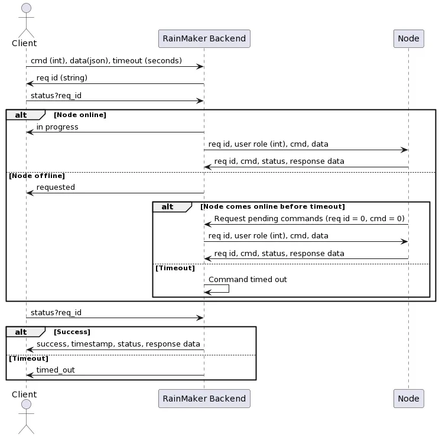

[*If you have been following the Espressif blogs and announcements, you must already be aware of ESP RainMaker and its various features. If not, please check out the info *[*here*](https://rainmaker.espressif.com/)* so that you get an idea about what ESP RainMaker is before you proceed further*.]

Admin users in ESP RainMaker can look at some basic node data like type, model, firmware version, etc. and push OTA firmware upgrades. They can view additional diagnostics data if linked with ESP Insights. However, there was no way for them to send some data to the nodes. The [set params](https://swaggerapis.rainmaker.espressif.com/#/Node%20Parameter%20Operations/updatenodestate) operations were available to only end users.

The command — response framework introduced in ESP RainMaker now provides a new way to communicate with the nodes. It is available to admin as well as end users (both, primary and secondary). It also provides better access control on node side and allows more reliable communication with explicit error reporting from the firmware.

## Workflow

A high level workflow is shown here:

To explain in short,

- Client generates request payload and sends to cloud.
- Cloud assigns it a request id and returns it back to the client, which can then be used to track the status.
- The request is forwarded to the node right away if it is online or is sent later if the node is offline at that time.
- The response of the node is tracked against the request id so that the status can be queried by the client.

You can read more about the specifications [here](https://rainmaker.espressif.com/docs/cmd-resp).

## Advantages

This new framework enables many new use cases and workflows

One of the key advantages is that it allows admins to send some data or commands to the nodes, which was earlier not possible. Moreover, on the firmware side, you can specify which type of users (admin, primary, secondary user) should have access to the commands, giving better access control. Eg. You may allow admins and secondary users to reboot a device, but only primary users will be able to reset the Wi-Fi. You can let only primary users to create schedules, but not admins or secondary users.

Another major advantage is that you can trigger a command even when a node is offline. This allows to push certain configurations and other information at any time and let the nodes get them whenever they come back online.

The framework not only provides reliable information about delivery of commands to a node, but also lets users check the status (Eg. request timed out, value out of bounds, operation not permitted, etc.)

We hope that this new framework will unlock new use cases and workflows. Do give this a try by looking into the [docs](https://rainmaker.espressif.com/docs/cmd-resp) and let us know if you find this useful. Command-response sample usage is also available in the [led_light example](https://github.com/espressif/esp-rainmaker/blob/master/examples/led_light/main/app_main.c)
