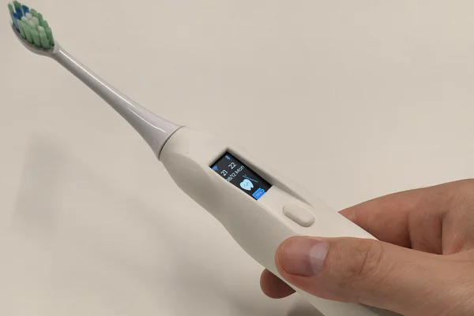

## Introduction

Open the first step with a smart teeth cleaning from a thoughtful and creative idea. Our goal is not only to make a smart toothbrush, but also to create an oral health companion that combines innovative technology with deep human care. We believe that through careful design and constant technological innovation, we can bring more comfortable and personalized dental cleaning experience to your life.

### Overview of ESP-Toothbrush

ESP-Toothbrush is an smart electric toothbrush which driver by the ESP32-C2 chip from Espressif. It integrates a 0.96 inch LCD display with SPI interface to display informations such as battery level, networking status, brushing time and brushing status. The ESP-Toothbrush have only one button to drive the ultrasonic motor of the toothbrush head and a buzzer to play the prompt tone. In addition, the ESP-Toothbrush supports connect to WiFi and access to ESP-RainMaker, which allows to view detailed brushing data and configure the toothbrush through the ESP-RainMaker APP on the phone. Finally, it supports the use of USB Type-C for firmware flashing and charging, as well as charging via a magnetic stylus.


### ESP-Toothbrush Hardware Framework

For this project, we have developed a clear hardware framework, which is as follows:


## ESP-Toothbrush Hareware Design

In order to translate our ideas into reality, for each functional module of the smart toothbrush, we need to design the hardware schematic. This process is critical, we need to plan the layout of each circuit carefully and the selection of electronic components to ensure the reliability and optimal performance of the circuit, laying the foundation for the final assembly and testing. For hardware design instructions, please refer to "[ESP Hardware Design Guidelines](https://docs.espressif.com/projects/esp-hardware-design-guidelines/en/latest/esp32c2/index.html#esp-hardware-design-guidelines)".


ESP-ToothBrush supports two power supply modes:

  - 18350 Lithium battery (Default power supply, Recommended)
  - Use ESP32-C2's USB interface for power supply, and also used for charging the 18350 lithium battery

Description of different circuit blocks:

  - `Battery Manager` : TP4056 chip is used for battery management to achieve charging function, while preventing overcharge and overdischarge, and has anti-reverse connection protection function. The CHRG pin is pulled up through a 10K resistor. When the battery is charged, the CHRG pin is low level, and the other states are high level. The TP4056 chip's CHRG pin is connected to the ESP32-C2's GPIO5 to identify the battery charging status by detecting the level status of the GPIO5 pin.
  - `Battery Power Monitor` : Since the maximum range of ESP32-C2 ADC is 0-3.3V, and the 18350 lithium battery voltage can reach up to 4.2V, which is already more than 3.3V, so we use two equivalent resistors to divide the battery voltage in here. Then the battery voltage is obtained through the ESP32-C2 ADC (GPIO4 corresponds to ADC channel 4), and the measured voltage value is multiplied by 2 to obtain the actual battery voltage, thus achieving to monitor the battery power.
  - `LDO Voltage Regulator` : The HE9073A33M5R LDO chip with a wide input voltage range is used to regulate the voltage of the lithium battery to 3.3V to supply power to the chip and other peripherals.
  - `LCD` : A 0.96 inch (80*160) LCD screen is used to display informations, such as battery level, networking status, brushing time and brushing status.
  - `Motor Driver` : The TC118S DC motor driver chip is used to drive the ultrasonic vibration motor, which has the advantages of low power consumption and low cost.
  - `USB-UART Bridge` : Use a CP2102N USB to UART chip and through USB Type-C port to burn program and debugging.
  - `Button` : Set a unique button to switch the working mode of the toothbrush.
  - `Beep` : Use a passive buzzer to realize the sound prompt function.

The hardware BOM table can be downloaded in here.

## ESP-Toothbrush PCB Layout

After designing the hardware, we pay attention to the placement of each part, to ensure that they work well,  but also to ensure that the entire device is small. We carefully adjusted to get every part just right,  without compromising performance or increase unnecessary PCB size.


## Software Implementation

After finished the hardware design, we focus on the software development to realize the functions of the toothbrush, and ensuring that it is both practical and meets the daily needs of users. 

We can define individual tasks for each functions, For example:

```c

  buzzer_init(BUZZER_PIN_NUM);
  motor_driver_init(MOTOR_DRIVER_INPUT_A, MOTOR_DRIVER_INPUT_B);
  power_init();

```


We went through multiple rounds of testing to make sure everything worked as expected.


## ESP-Rainmaker UI Design

Details determine success or failure, the user's experience is first. Based on this toothbrush, we connected to the ESP-Rainmaker cloud, and we designed the UI of the esp-rainmaker app carefully to ensure that every interaction with the toothbrush is intuitive and smooth.

ESP-RainMaker is a lightweight IoT cloud computing software that is deeply integrated with Amazon Cloud Technologies' serverless architecture. Based on the serverless architecture, ESP-RainMaker has great flexibility in data storage space and transmission capacity, and can dynamically assign tasks to the cloud server according to the actual data traffic, effectively reducing the pressure of data storage on the cloud.

For more information about ESP-RainMaker, please refer to the [ESP-RainMaker Introduction](https://rainmaker.espressif.com/docs/intro/).

On ESP-RainMaker APP, we achieved the following interface:

- Create low battery pop-up and home screen on ESP-Rainmaker interface


- Create a brushing time log on ESP-RainMaker interface


- Create a ESP-Toothbrush control interface


## ESP-Toothbrush 3D Design

In order to make the ESP-Toothbrush look good and practical, we polished its appearance with a 3D printer. This process was revised several times to ensure that the final design was both aesthetically pleasing and user-friendly.


## Product Display

After careful design and repeated testing, we finally finished the production of this smart toothbrush. Now, let's enjoy the final product, which is both practical and beautiful.




## Basic Functions

- Support 3-minute regular brushing


- Support double click the button to switch four gear to switch the vibration intensity


- Support long press the button to power on and power off to saving power consumption


- Support lithium battery power supply and wireless charging


- Support to view the battery, time, animation, Bluetooth and WiFi connect to network statu through the LCD screen


## Interactive Functions

After the ESP-Toothbrush is connected to the WiFi, It is support use the APP (ESP-Rainmaker) todo the following interaction:

- Support monitor the battery level: low battery reminder below 20%
- Supports switch brushing mode: four gear vibration intensity setting
- Support control power on and power off
- Support setting brushing duration
- Support record daily brushing time and duration: data within a month


