## Introduction

For most people, one of the first tasks of the day is toothbrushing. This task is usually done by a conventional nylon toothbrush, [invented in 1938](https://www.loc.gov/everyday-mysteries/technology/item/who-invented-the-toothbrush-and-when-was-it-invented/) but used in different forms and materials even before.

Today, you can easily find electronic toothbrushes and some start toothbrushes that helps you to keep track how you are brushing your tooth.

Our goal here is not just to build a smart toothbrush, but to create a true oral health companion—one that combines cutting-edge technology with user-centric design. Through careful innovation, we aim to deliver a more comfortable, personalized dental care experience for everyday life.

### Overview of ESP-Toothbrush

The ESP-Toothbrush is a smart electric toothbrush powered by the ESP32-C2 chip from Espressif. It features a 0.96-inch LCD display with an SPI interface, displaying important information such as battery level, network connectivity, brushing time, and brushing status.

Designed with simplicity in mind, the ESP-Toothbrush has a single button to activate its ultrasonic motor and a buzzer for audio prompts. Additionally, it connects to Wi-Fi and integrates with ESP-RainMaker, allowing users to track detailed brushing data and configure the toothbrush via the ESP-RainMaker app on their smartphone.

For ease of use, the toothbrush includes a USB Type-C port for both firmware updates and charging. It also supports charging via a magnetic stylus, offering flexibility and convenience.

### Block Diagram

The block diagram for the ESP-ToothBrush project clearly outlines the key functional components and how they interact. The main sections include:

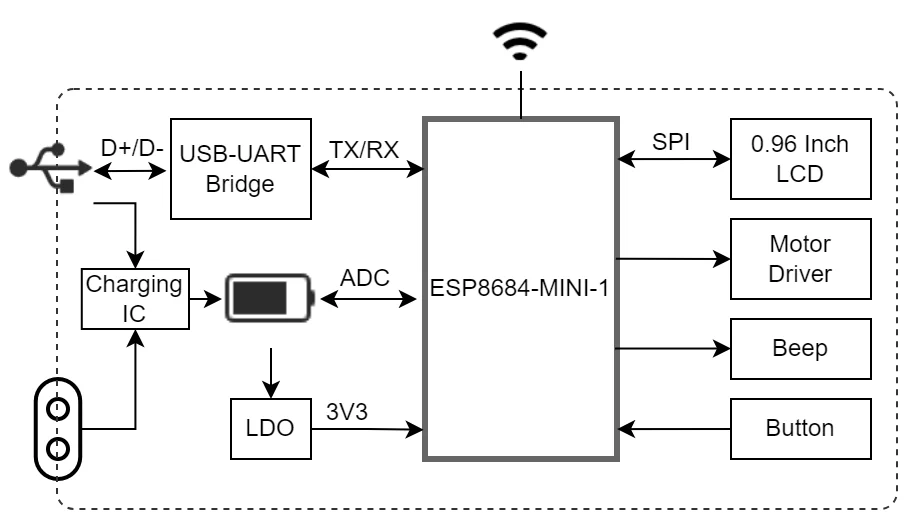

#### Power Supply Modes

The ESP-ToothBrush supports two versatile power supply modes, ensuring flexibility and reliability:

- **18350 Lithium Battery (Default Power Supply, Recommended):**
The toothbrush is primarily powered by a rechargeable 18350 lithium battery, offering portability and long-lasting use. This battery is the recommended power source due to its high energy density and suitability for compact devices like the ESP-ToothBrush.

- **USB Power Supply (via ESP32-C2 USB Interface):**
Alternatively, the toothbrush can be powered through its USB Type-C interface, connected directly to the ESP32-C2. This interface is not only used for power supply but also enables convenient charging of the 18350 lithium battery when connected to a USB power source, making it a dual-purpose port for both power and charging.

#### Description of Different Circuit Blocks

- **Battery Manager:**
The TP4056 chip is used for battery management, providing charging functionality while preventing over charge and over discharge. It also includes reverse connection protection. The CHRG pin is pulled up via a 10K resistor. During charging, the CHRG pin is at a low level, while in other states, it is high. The CHRG pin is connected to the ESP32-C2's GPIO5, enabling the microcontroller to monitor the battery's charging status by detecting the GPIO5 pin's level.

- **Battery Power Monitor:**
The ESP32-C2's ADC (Analog-to-Digital Converter) operates within a range of 0–3.3V, while the 18350 lithium battery can reach up to 4.2V, which exceeds this limit. To safely measure the battery voltage, two equivalent resistors are used to divide the battery voltage. The divided voltage is read by the ESP32-C2's ADC on GPIO4 (channel 4). The measured value is then multiplied by 2 to determine the actual battery voltage, allowing for real-time monitoring of the battery's power level.

- **LDO Voltage Regulator:**
The HE9073A33M5R LDO (Low Dropout) voltage regulator chip is employed to convert the lithium battery's variable input voltage to a stable 3.3V output. This supplies power to the ESP32-C2 and its peripherals, ensuring consistent operation across different battery levels.

- **LCD:**
A 0.96-inch LCD screen (80x160 resolution) is used to display key information such as battery level, network status, brushing time, and brushing status. The display communicates with the ESP32-C2 via an SPI interface for fast and efficient data transmission.

- **Motor Driver:**
The ultrasonic motor is driven by the TC118S DC motor driver chip, known for its low power consumption and cost efficiency. This chip is ideal for controlling the toothbrush’s ultrasonic vibration motor with precision.

- **USB-UART Bridge:**
A CP2102N USB-to-UART bridge is used for programming and debugging the ESP32-C2. It interfaces via a USB Type-C port, providing a modern, high-speed connection for flashing firmware and debugging the system.

- **Button:**
A single multifunctional button is implemented to switch between different operating modes of the toothbrush, simplifying user interaction and control.

- **Buzzer:**
A passive buzzer is used to provide audio feedback and prompts. This component plays specific sounds to notify the user of status changes or important actions, enhancing the user experience.

## Hardware Design

For each functional module of the smart toothbrush, we need to develop detailed hardware schematics. This step is crucial to ensure that every part of the circuit operates reliably and efficiently. The design process will involve careful planning of the layout for each circuit, along with the strategic selection of electronic components to optimize the performance and stability of the system.

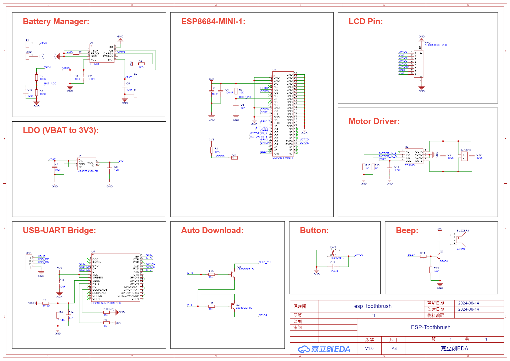

For further guidance on the best practices and specific requirements for the ESP32-C2 and its associated components, please refer to the official [ESP Hardware Design Guidelines](https://docs.espressif.com/projects/esp-hardware-design-guidelines/en/latest/esp32c2/index.html#esp-hardware-design-guidelines). These guidelines provide in-depth information on layout strategies, power supply recommendations, and more to ensure the successful design and implementation of hardware projects using

## PCB Layout

Once the hardware design is complete, we focus on the precise placement of each component to ensure optimal functionality while maintaining a compact overall design. Every element is carefully positioned to maximize performance without increasing the PCB size unnecessarily. Through meticulous adjustments, we achieve a balance between functionality, efficiency, and minimal space, ensuring that all components work seamlessly together in a small form factor.

**Layout**

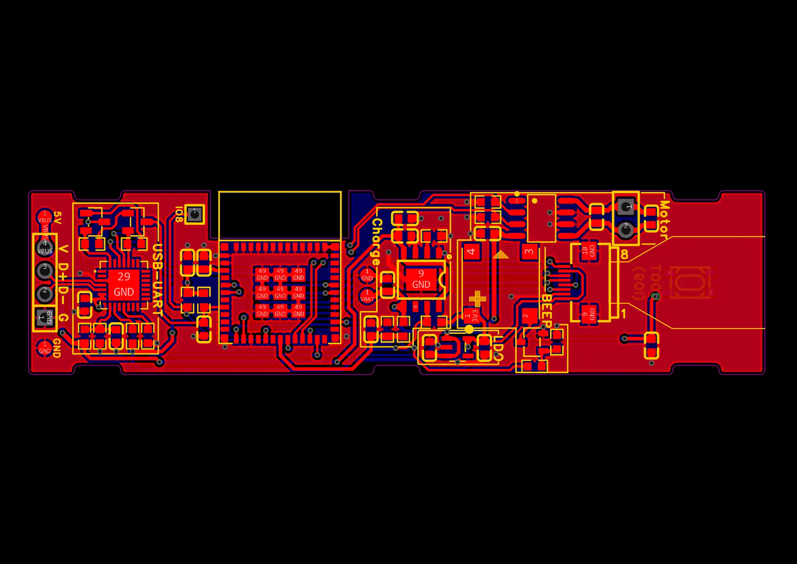

**Front**

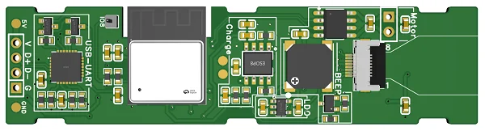

**Back**

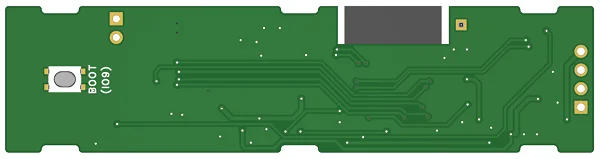

## 3D Design

To ensure the ESP-Toothbrush is both visually appealing and practical, we developed its design using 3D printing. The design process went through several iterations, refining both the form and function to create a final product that is not only ergonomic but also user-friendly.

Each revision was aimed at enhancing both the aesthetic and practical aspects of the toothbrush, resulting in a sleek and functional device.

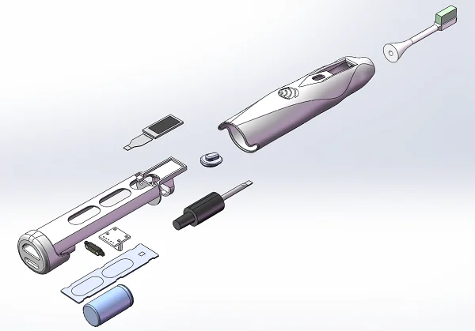

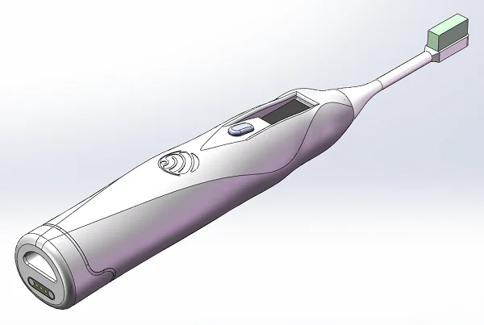

## Software Implementation

After the hardware design, we focus on the software development to ensure the ESP-Toothbrush is both functional and practical for everyday use. The software integrates various individual functions, utilizing multiple resources provided by Espressif for seamless operation.

- **LCD Display:**
To implement the LCD functionality, we used the example codes provided in the [ESP-IDF examples](https://github.com/espressif/esp-idf/tree/release/v5.3/examples/peripherals/lcd), which cover various LCD interfaces. We also used the [esp_lv_spng](https://components.espressif.com/components/espressif/esp_lv_spng/versions/0.1.0) component to efficiently display PNG images on the LCD. The [LCD Screen User Guide](https://docs.espressif.com/projects/esp-iot-solution/en/latest/display/lcd/lcd_guide.html#lcd-introduction) offers additional insights into LCD integration.

- **Motor Driver and Buzzer:**
The motor driver and buzzer are controlled via the PWM interface. Espressif provides a [LEDC example](https://github.com/espressif/esp-idf/tree/release/v5.3/examples/peripherals/ledc) that demonstrates how to implement PWM for such applications. The [LEDC Programming Guide](https://docs.espressif.com/projects/esp-idf/en/v5.3/esp32c2/api-reference/peripherals/ledc.html#led-control-ledc) offers further details. For controlling the buzzer, we utilized the [hayschan/buzzer](https://components.espressif.com/components/hayschan/buzzer/versions/1.0.0) component to simplify the software development and achieve better sound effects.

- **Battery Power Monitoring:**
We implemented battery voltage monitoring using the ADC interface, referring to the [ADC oneshot read example](https://github.com/espressif/esp-idf/tree/release/v5.3/examples/peripherals/adc/oneshot_read). The [ADC Oneshot Mode Driver Guide](https://docs.espressif.com/projects/esp-idf/en/v5.3/esp32c2/api-reference/peripherals/adc_oneshot.html?highlight=adc#analog-to-digital-converter-adc-oneshot-mode-driver) provides further instructions on how to read ADC data in oneshot mode.

- **Wi-Fi Connection:**
For the WiFi functionality, the ESP32-C2 is set to WiFi Station mode. You can refer to the [WiFi Station](https://github.com/espressif/esp-idf/tree/release/v5.3/examples/wifi/getting_started/station) example to learn how to connect to an Access Point. The [WiFi Driver](https://docs.espressif.com/projects/esp-idf/en/v5.3.1/esp32c2/api-guides/wifi.html#wi-fi-driver) Guide provides additional information for setting up WiFi connections.

- **ESP-RainMaker Integration:**
For cloud control and monitoring, the [ESP-Rainmaker](https://github.com/espressif/esp-rainmaker) SDK allows remote control of the toothbrush. You can directly use the [ESP RainMaker](https://components.espressif.com/components/espressif/esp_rainmaker) component for integration, and refer to the [ESP-Rainmaker Get Started](https://rainmaker.espressif.com/docs/get-started/) Guide for detailed instructions.

## ESP-Rainmaker 

Now it's time to connect the toothbrush to the [ESP RainMaker](https://rainmaker.espressif.com/).

### UI Design

In designing the ESP-Toothbrush, we prioritized the user's experience, ensuring that every interaction with the device is intuitive and seamless. By connecting the toothbrush to the ESP-RainMaker cloud, we carefully crafted the UI of the ESP-RainMaker app to provide smooth, user-friendly control over the toothbrush’s features.

ESP-RainMaker is a lightweight IoT cloud solution that is tightly integrated with Amazon Cloud Technologies' serverless architecture. This serverless framework offers tremendous flexibility in data storage and transmission, dynamically allocating resources based on actual traffic. This design minimizes the strain on cloud storage, ensuring efficient and scalable performance as data demands grow.

For more information about ESP-RainMaker and its capabilities, refer to the official [ESP-RainMaker Introduction](https://rainmaker.espressif.com/docs/intro/).

On ESP-RainMaker mobile application side, following interfaces were created:

- Low battery pop-up and home screen on ESP-Rainmaker interface

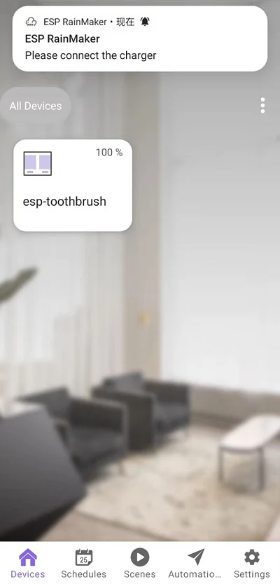

- Brushing time log on ESP-RainMaker interface

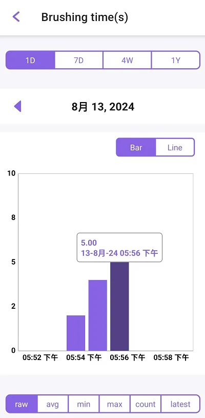

- Control interface

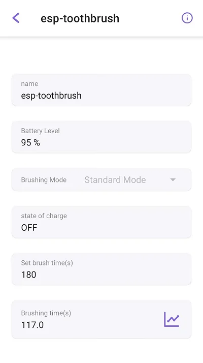

## Product Display

After meticulous design and extensive testing, we have successfully completed the production of the ESP-Toothbrush. The final product is a perfect blend of practicality and aesthetic appeal. Now, let’s take a moment to appreciate the sleek and functional design that brings cutting-edge technology into your daily routine.

Please see the video below for a closer look at the final product in action.



## Basic Functions

- 3-minute regular brushing.

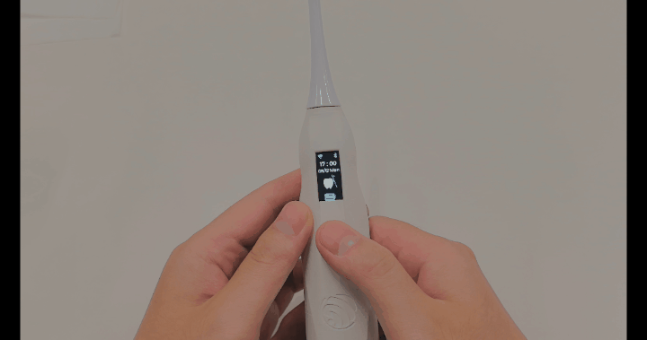

- Double click the button to switch four gear to switch the vibration intensity.

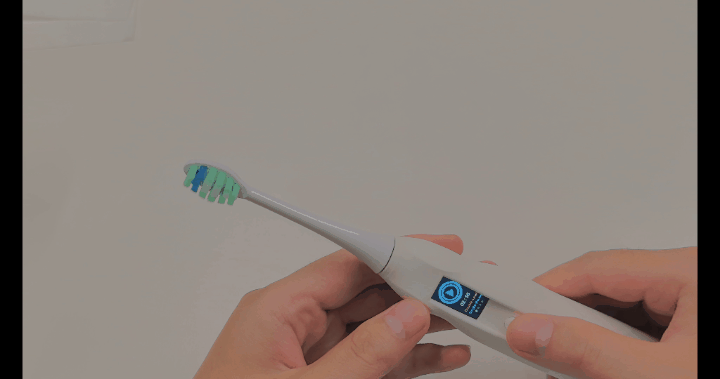

- Long press the button to power on and power off to saving power consumption.

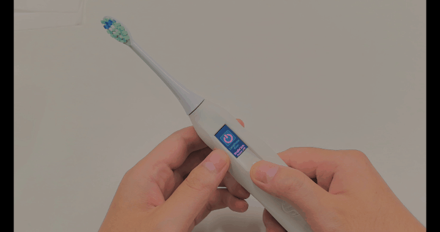

- Lithium battery power supply and wireless charging.

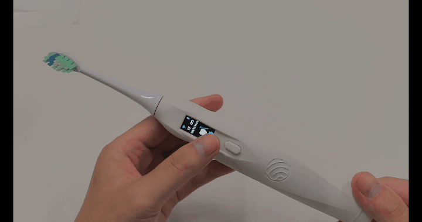

- Feature to view the battery, time, animation, Bluetooth and Wi-Fi connect to network status through the LCD screen.

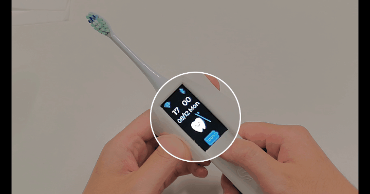

## Interactive Functions

Once the ESP-Toothbrush is connected to WiFi, it can be controlled via the ESP-Rainmaker app to perform the following interactive functions:

-  **Battery Monitoring:** Monitor the battery level with a low battery reminder when below 20%.
-  **Brushing Mode Control:** Switch between four vibration intensity levels.
-  **Power Control:** Remotely turn the toothbrush on or off.
-  **Brushing Duration Setting:** Customize the brushing duration according to user preferences.
-  **Brushing History Tracking:** Record daily brushing time and duration, with data stored for up to a month.

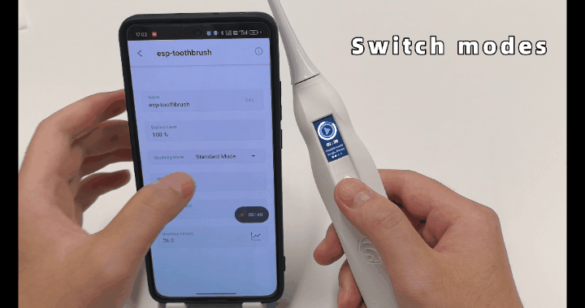

## Conclusion

The ESP-Toothbrush combines smart technology with everyday practicality, offering a seamless and personalized dental care experience. Through careful hardware design, intuitive software integration, and interactive features, it brings convenience and innovation to oral hygiene.

With WiFi connectivity and ESP-Rainmaker support, users can easily control and monitor their brushing habits, making it a truly modern solution for daily care.
