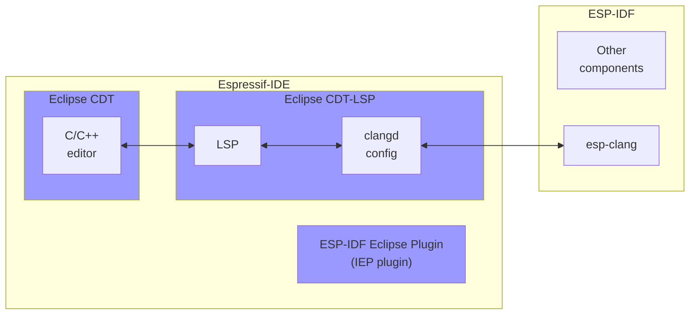

This article has the following major sections:

- [Introduction](#introduction)
- [Deciphering the alphabet soup](#deciphering-the-alphabet-soup)
- [Project building and toolchains](#project-building-and-toolchains)
- [Why moving to LSP-based editor?](#why-moving-to-lsp-based-editor)
- [Clangd Setup](#clangd-setup)
- [Editor Features](#editor-features)
- [Conclusion](#conclusion)


## Introduction

We are excited to announce the release of Espressif-IDE 3.0.0, a significant update that brings long-awaited features!

This version includes:

- **Eclipse CDT-LSP plugins** that bringing support for the latest C/C++ standards
- New **LSP-based C/C++ Editor** powered by the LLVM clangd C/C++ language server and offering advanced editor features for ESP-IDF developers


## Deciphering the alphabet soup

The article includes a number of concepts and abbreviations that might look somewhat intimidating, such as LLVM, LSP, CDT-LSP, Clang, Clangd, esp-clang, etc. The uninitiated reader might easily get lost. Let's go through those quickly.



- [ESP-IDF Eclipse Plugin](https://github.com/espressif/idf-eclipse-plugin) (a.k.a. IEP plugin) is an easy-to-use Eclipse-based development environment which simplifies and enhances standard Eclipse CDT for developing IoT applications on Espressif chips, such as ESP32 or ESP32-P4.
- [Espressif-IDE](https://github.com/espressif/idf-eclipse-plugin/releases/tag/v3.0.0) is a cross-platform integrated development environment that combines Eclipse CDT, the IEP plugin, and more. It is the recommended way to install and use the ESP-IDF Eclipse Plugin.
- [Eclipse CDT](https://projects.eclipse.org/projects/tools.cdt) (C/C++ Development Tooling) is a fully functional C and C++ Integrated Development Environment (IDE) offering enhanced development experience. However, it integrates the GCC (GNU Compiler Collection) development tools that are not as advanced or user-friendly as Clang tools. Though, Clang tools can only be accessed via the Language Server Protocol (LSP).
- [Eclipse CDT LSP](https://github.com/eclipse-cdt/cdt-lsp) (LSP based C/C++ Editor) integrates the Language Server Protocol (LSP) within the Eclipse CDT environment. It enables access to Clang tools that support newer C/C++ standards required by more recent versions of ESP-IDF.
- [Clang](https://clang.llvm.org/) is a compiler front-end and tooling infrastructure for C, C++ and other C family languages within the LLVM project. Compared to the GCC (GNU Compiler Collection), Clang offers better support for the newer C++ standards. Instead of Clang, we use its customized version -- esp-clang.
- [clangd](https://clangd.llvm.org/) is a language server that provides IDE-like features, such as code completion, navigation, and documentation, for C, C++, and C family languages. It is part of the LLVM project and leverages the Clang front end to parse and analyze code. In our case, it fetches information from esp-clang (not Clang) and uses the Language Server Protocol (LSP) to communicate with the C/C++ editor.
- [esp-clang](https://github.com/espressif/llvm-project) is a customized version of the Clang compiler specifically tailored for developing IoT applications on Espressif chips. The esp-clang compiler is installed as part of [ESP-IDF](https://github.com/espressif/esp-idf).
- [LLVM](https://llvm.org/) (just for completeness) is an open-source collection of modular and reusable compiler and toolchain technologies. Initially designed as a set of compiler tools, LLVM has evolved to encompass a broad range of components for developing compilers and other language-related tools.


## Project building and toolchains

Even though in the current release of Espressif-IDE 3.0.0, the C/C++ editor uses clangd for editor features by default, the projects are built with the GCC toolchain only. The esp-clang toolchain is currently an experimental feature.


## Why moving to LSP-based editor?

Many users have been reporting that the Eclipse CDT Editor/Indexer is unable to resolve headers and symbols when working with ESP-IDF 5.0 and higher. This issue arises because the Eclipse CDT only supports the versions up to C++14. However, ESP-IDF v5.0 uses C++20 (with GCC 11.2) and ESP-IDF v5.2 uses C++23 (with GCC 13.1).

By adopting an LSP-based editor with the help of Eclipse CDT LSP and esp-clang, Espressif-IDE 3.0.0 enables support for newer C/C++ standards required by more recent versions of ESP-IDF. The support for newer C/C++ standards makes coding easier and more efficient.

This also means that we have stopped supporting the old C/C++ editor in Espressif-IDE. Therefore, you cannot use the old C/C++ editor and its Indexer for ESP-IDF projects. However, you can still use the old C/C++ editor for non-ESP-IDF projects as-is.


## Clangd Setup

The C/C++ Editor is configured to work with LSP and clangd by default. Here are some additional setup instructions that might be helpful if you encounter any challenges.


<!-- omit in toc -->
### clangd server setup

By default, the esp-clang toolchain is installed as part of the ESP-IDF tools installation process. Espressif-IDE 3.0.0 requires esp-clang of version
clang-esp-17.0.1_20240419 or higher.

The clangd path is configured in the preferences. The *Drivers* path and *--compile-commands-dir* path will be set based on the selected target (e.g., esp32, esp32c6) and the project you’re building.

However, if there are any issues with the configuration, you can set it up as follows:

1. Go to `Window > Preferences > C/C++ > Editor (LSP)`.
2. Navigate to the `clangd` node.
3. Provide the `Drivers` path as shown in the screenshot. It should point to the target toolchain path.
4. Set `--compile-commands-dir=/project/build` in the Additional arguments section.
5. Click Apply and Close.


  



<!-- omit in toc -->
### `.clangd` configuration

For a new project, a `.clangd` configuration file is created by default with the contents provided below. For an existing project, create a `.clangd` file in its root folder yourself and add required parameters.

```yaml
CompileFlags:
  CompilationDatabase: build
  Remove: [-m*, -f*]
```

- `CompileFlags`: This key indicates the start of a dictionary (or map) containing compilation flag settings.
- `CompilationDatabase`: This key specifies the location of the compilation database, which, in our case, is the `compile_commands.json` file generated by CMake. The value indicates that `compile_commands.json` in located in the `build` directory relative to the root of the project.

  A compilation database (`compile_commands.json`) is a file that contains an array of command objects, each representing a single compilation unit, providing details like the compiler executable, the compiler flags used, the source files, and the working directory. This database is used by clangd to determine how the source code is compiled.

- `Remove`: This key lists the patterns, meaning that any compilation flags that start with `-m` or `-f` should be removed from the compilation commands. This is needed to remove some errors reported by clangd because Espressif-IDE uses the **GCC toolchain** by default to build projects. If you choose to use the experimental **esp-clang toolchain**, this key is not needed.

Here are the errors you may find in the file if you haven’t added the remove flags as mentioned above.


  


> If you’re dealing with a custom build directory, it’s important to check whether the CompilationDatabase is set correctly in the `.clangd` file and set the correct build directory(`--compile-commands-dir` in the additional args) in the clangd preferences. These settings are configured by default, but you should pay attention to them if something goes wrong.


## Editor Features

<!-- omit in toc -->
### Errors and warnings

clangd runs the clang compiler on your code as you type, and shows diagnostics of errors and warnings in-place.


  



<!-- omit in toc -->
### Fixes

The compiler can suggest fixes for many common problems automatically, and clangd can update the code for you.




<!-- omit in toc -->
### Find definition/declaration

Jump to the definition or declaration of a symbol by pressing ctrl+click action.




<!-- omit in toc -->
### Hover

Hover over a symbol to see more information about it, such as its type, documentation, and definition.




<!-- omit in toc -->
### Formatting

clangd embeds [clang-format](https://clang.llvm.org/docs/ClangFormat.html), which can reformat your code: fixing indentation, breaking lines, and reflowing comments.

clangd language server searches for a .clang-format file in the source folder and its parents. File can be formatted using **Source > Format** option or also on file save if you enable [Save Actions](https://github.com/eclipse-cdt/cdt-lsp?tab=readme-ov-file#save-actions-using-clang-format) in the preferences.



> You can’t use standard C/C++ formatting styles with the LSP editor.

However, you should be able to generate the default formatting styles using the [clang-format](https://clang.llvm.org/docs/ClangFormat.html) tool. It offers different coding styles ( LLVM, GNU, Google, Chromium, Microsoft,Mozilla, WebKit).




<!-- omit in toc -->
### Editor Colors

The clangd-based editor is derived from the standard Eclipse Text Editor, so you can change the editor color options from the Text Editor preferences. For example, you can modify the line number foreground color and the current line highlight color, among other options available in the Text Editor preferences.




## Conclusion

We believe that the new features and enhancements in Espressif-IDE 3.0.0 will significantly improve the development experience for ESP-IDF developers. The transition to a clangd-based editor brings robust support for the latest C/C++ standards and offers powerful IDE-like capabilities that address previous limitations. If you encounter any issues with Espressif-IDE, you can report them in the GitHub issue section of the project [here](https://github.com/espressif/idf-eclipse-plugin/issues).
