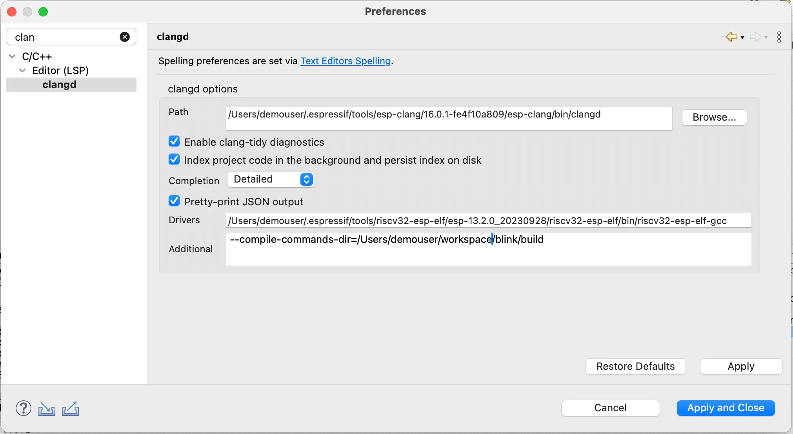
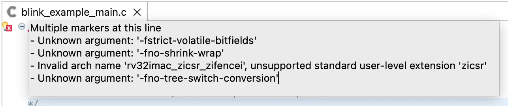
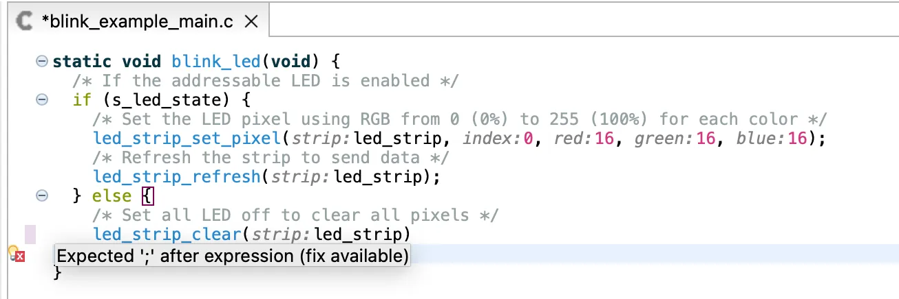
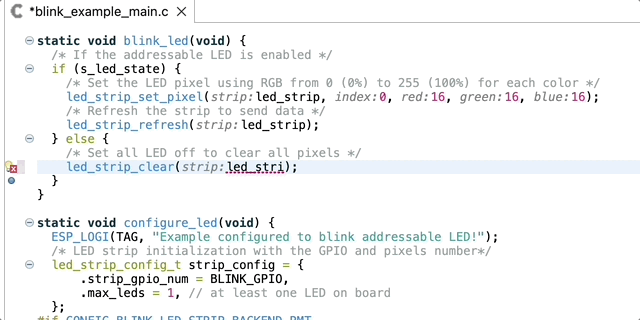
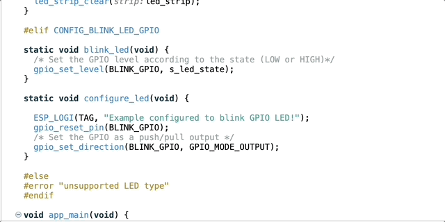
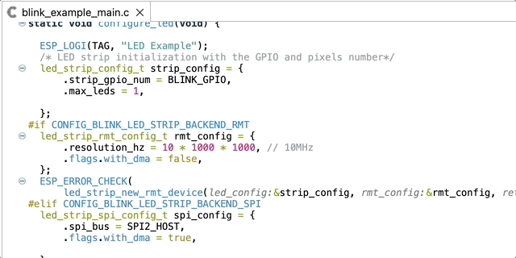
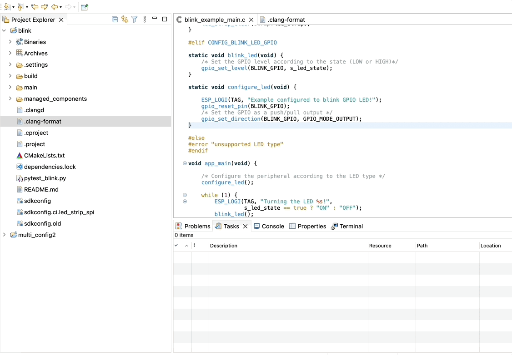
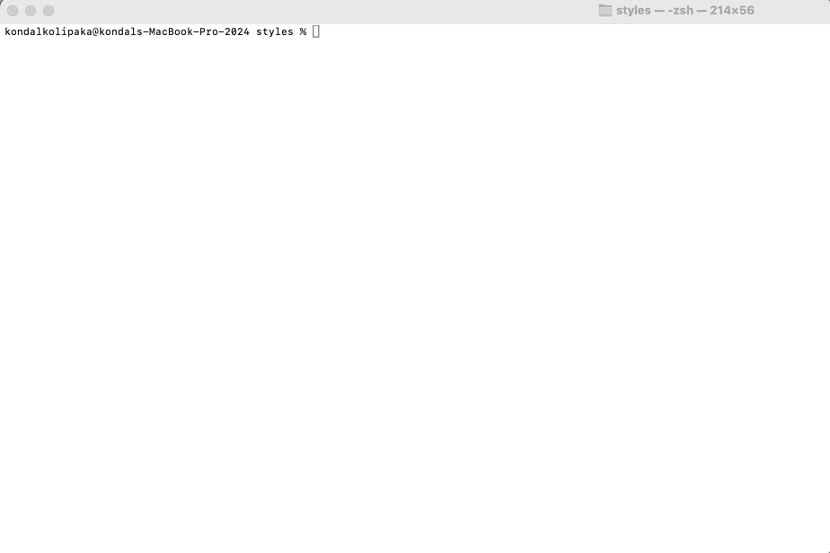
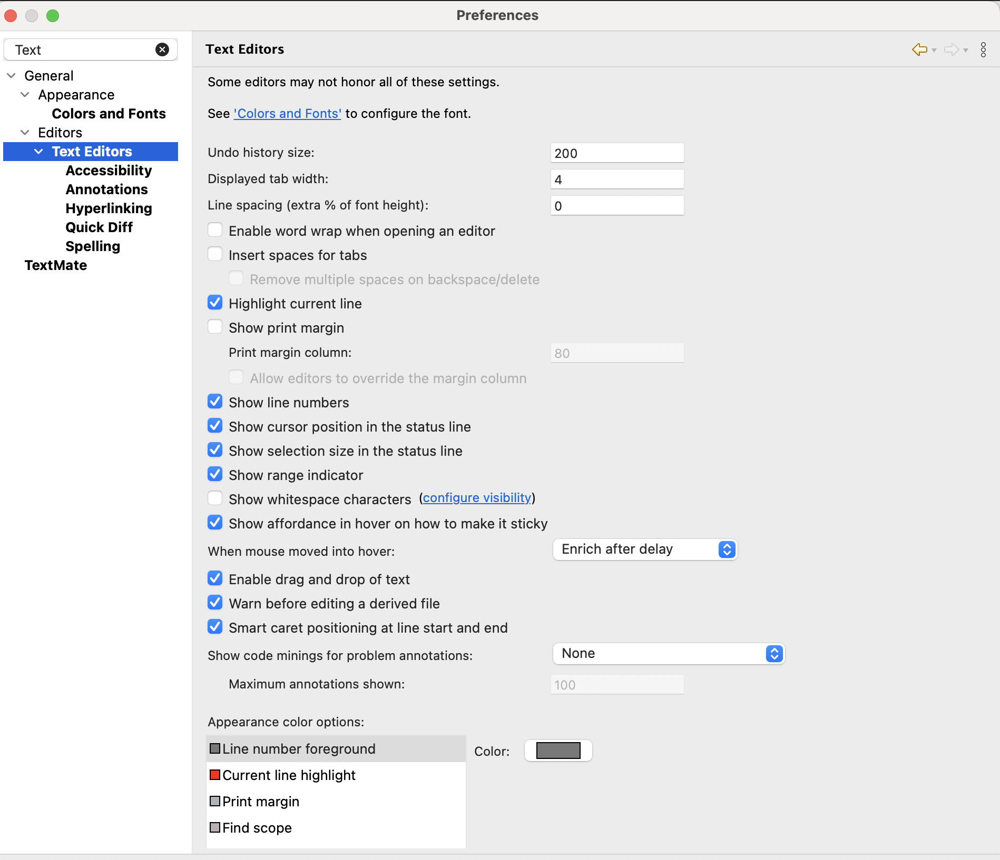

# Table of Contents
* [ Introduction](#Introduction) <br>
* [ What are LSP, Clangd, and Clang?](#LSPClangdClang) <br>
* [ Why are we moving to clangd based editor?](#whyClangdEditor) <br>
* [ Clangd Setup](#Setup) <br>
* [ Editor Features](#EditorFeatures) <br>
* [ Conclusion](#Conclusion) <br>

<a name="Introduction"></a>
## Introduction

We are excited to announce the release of [Espressif-IDE 3.0.0](https://github.com/espressif/idf-eclipse-plugin/releases/tag/v3.0.0), a significant update that brings long-awaited features! This version includes Eclipse [CDT-LSP](https://github.com/eclipse-cdt/cdt-lsp) plugins, bringing support for the latest C/C++ standards and a new LSP-based C/C++ Editor. This editor, powered by the [LLVM clangd C/C++ language server](https://github.com/espressif/llvm-project) (need esp-clang toolchain version 17.0.1_20240419 and higher), offers advanced editor features for ESP-IDF developers.

<a name="LSPClangdClang"></a>
## What are LSP, Clangd, and Clang?

[LSP](https://microsoft.github.io/language-server-protocol/) stands for Language Server Protocol. It is a protocol used to provide language-specific features in integrated development environments (IDEs) and text editors.

[clangd](https://clangd.llvm.org/) is a language server that provides IDE-like features such as code completion, navigation, and documentation. It uses the Language Server Protocol (LSP) to communicate with text editors and IDEs.

[Clang](https://clang.llvm.org/) is a compiler front end for the C, C++, and Objective-C programming languages. It is designed to be a replacement for the GCC (GNU Compiler Collection) and is known for its fast compilation times and excellent diagnostics.

> In the current release of Espressif-IDE 3.0.0, the C/C++ editor is enabled with clangd for editor features by default. However, it still builds projects with the GCC toolchain only (not with the clang toolchain), considering that the esp-clang toolchain is currently an experimental feature. 

<a name="whyClangdEditor"></a>
## Why are we moving to clangd based editor?

Many users have been reporting that the CDT Editor/Indexer is unable to resolve headers and symbols when working with ESP-IDF 5.0 and higher. This issue arises because the CDT Editor/Indexer only supports up to C++14, while ESP-IDF 5.0 uses C++20 (with GCC 11.2) and ESP-IDF v5.2 uses C++23 (with GCC 13.1), which requires language support in the editor for identifying new language grammar. By adopting an LSP-based editor, we should be able to support the latest ESP-IDF, making coding easier and better.

> This also means that we have stopped supporting the old C/C++ editor in Espressif-IDE. Therefore, you cannot open your editor with the old C/C++ editor and use the Indexer for ESP-IDF projects. However, you can still use the standard C/C++ editor for non-ESP-IDF projects as-is.

<a name="Setup"></a>
## Clangd Setup

The C/C++ Editor is configured to work with clangd, and all the configuration is set by default. Here are some additional setup instructions that might be helpful if you encounter any challenges.

### clangd server setup

By default, the [esp-clang](https://github.com/espressif/llvm-project) toolchain is installed as part of the ESP-IDF tools installation process, and the clangd path is configured in the preferences. The *Drivers* path and *--compile-commands-dir* path will be set based on the selected target (e.g., esp32, esp32c6) and the project you’re building.

However, if there are any issues with the configuration, you can set it up as follows:

1. Go to `Window > Preferences > C/C++ > Editor (LSP)`.
1. Navigate to the `clangd` node.
1. Provide the `Drivers` path as shown in the screenshot. It should point to the target toolchain path.
1. Set `--compile-commands-dir=/project/build` in the Additional arguments section.
1. Click Apply and Close.


  



### .clangd Configuration

By default, when you create a new project, a [.clangd configuration file](https://clangd.llvm.org/config#files) is created with the following arguments. For existing projects, please create a .clangd file at the root of the project and add the following content.

```text
 CompileFlags:
  CompilationDatabase: build
  Remove: [-m*, -f*]
```

**CompilationDatabase:** This parameter specifies the location of the compilation database. In this case, it is set to `build`. A compilation database is typically a `compile_commands.json` file that contains information about how each translation unit of a codebase is compiled. This file is usually generated by CMake build systems.

**Remove:** This parameter lists flags that should be removed from the compilation commands. The flags `-m*` and `-f*` are likely wildcards, meaning any compilation flags that start with `-m` or `-f` should be removed. These were added to remove some of the errors reported by clangd as we built the project with the GCC toolchain(not with the esp-clang toolchain)

Here are the errors you may find in the file if you haven’t added the remove flags as mentioned above.


  


> If you’re dealing with a custom build directory, it’s important to check whether the CompilationDatabase is set correctly in the `.clangd` file and set the correct build directory(`--compile-commands-dir` in the additional args) in the clangd preferences. These settings are configured by default, but you should pay attention to them if something goes wrong.

<a name="EditorFeatures"></a>
## Editor Features

### Errors and warnings

clangd runs the clang compiler on your code as you type, and shows diagnostics of errors and warnings in-place.


  


### Fixes

The compiler can suggest fixes for many common problems automatically, and clangd can update the code for you.



### Find definition/declaration

Jump to the definition or declaration of a symbol by pressing ctrl+click action.



### Hover

Hover over a symbol to see more information about it, such as its type, documentation, and definition.



### Formatting

clangd embeds [clang-format](https://clang.llvm.org/docs/ClangFormat.html), which can reformat your code: fixing indentation, breaking lines, and reflowing comments.

clangd language server searches for a .clang-format file in the source folder and its parents. File can be formatted using **Source > Format** option or also on file save if you enable [Save Actions](https://github.com/eclipse-cdt/cdt-lsp?tab=readme-ov-file#save-actions-using-clang-format) in the preferences.



> You can’t use standard C/C++ formatting styles with the LSP editor.

However, you should be able to generate the default formatting styles using the [clang-format](https://clang.llvm.org/docs/ClangFormat.html) tool. It offers different coding styles ( LLVM, GNU, Google, Chromium, Microsoft,Mozilla, WebKit).



### Editor Colors
The clangd-based editor is derived from the standard Eclipse Text Editor, so you can change the editor color options from the Text Editor preferences. For example, you can modify the line number foreground color and the current line highlight color, among other options available in the Text Editor preferences.



<a name="Conclusion"></a>
## Conclusion

We believe that the new features and enhancements in Espressif-IDE 3.0.0 will significantly improve the development experience for ESP-IDF developers. The transition to a clangd-based editor brings robust support for the latest C/C++ standards and offers powerful IDE-like capabilities that address previous limitations. If you encounter any issues with Espressif-IDE, you can report them in the GitHub issue section of the project [here](https://github.com/espressif/idf-eclipse-plugin/issues).
