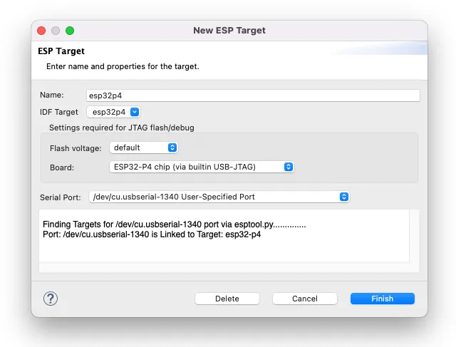

## Espressif-IDE

Today we announce the new version of the Espressif IDE, the version 3.1.0. This new version adds new functionalities and bug fixes.

<figure style="width: 90%; margin: 0 auto; text-align: center;">
    
    <figcaption>Espressif-IDE New target setup</figcaption>
</figure>

## New features

- Updated Eclipse Platform Support
  - Support for the [Eclipse CDT 2024-06](https://www.eclipse.org/downloads/packages/release/2024-06/r/eclipse-ide-cc-developers) release, ensuring compatibility with the latest Eclipse features and enhancements.
- CDT LSP 2.0 Integration
  - Full support for [CDT Language Server Protocol (LSP) 2.0](https://github.com/eclipse-cdt/cdt-lsp/releases/tag/CDT_LSP_2_0_0), providing enhanced code navigation, syntax highlighting, and error checking.
  - Improved Editor responsiveness and language feature parity for a smoother coding experience.
- Expanded Hardware Support
  - Added support for ESP32-P4, enabling development and debugging for the new Espressif chipset.
  - Streamlined setup for other Espressif SoCs, improving multi-target project management.
- Unified Target and Board Configuration
  - Consolidated all target and board configuration options into a single, intuitive interface for easier access and project configuration. Now, you can configure all of them in the ESP Target window.
- Welcome Page Overhaul
  - Revamped the welcome page and added the ESP-IDF Manager action to help users quickly get started.
  - Added links to key resources, tutorials, and community forums.
- Build Settings Enhancements
  - Improved Build Settings tab with more flexible configurations, enhanced readability, and easier management of build profiles.
  - Added messages for fields in the Build Settings tab to give some context to the user.
  - The relative custom-build folder path now relates to the project folder instead of the workspace.
  - Change the default name for the debug configuration.
- Multi-Configuration Support
  - Added support for multi_config setups and allow the developers to run sdkconfig editor from any build folder.
- New Project Standards
  - Automatic creation of a .clang-format file with default settings when a new project is created. Additionally, if the .clang-format file is missing, it is automatically added after the build.
- Feedback-Driven UX Improvements
- Quality and Stability Fixes
  - Various bug fixes and performance enhancements aimed at improving the overall quality, stability, and developer experience.
- Launch Configuration Improvements
  - Provided a configuration option in the launch configuration to open the serial monitor right after the serial flash.
  - Changing the configuration automatically sets the mode to Run/Debug accordingly.
- ESP-IDF Manager Improvements
  - Added functionality to remove all versions from the list.
  - Added validations for the ESP-IDF path and improved the UI.

Check the full [release notes](https://github.com/espressif/idf-eclipse-plugin/releases/tag/v3.1.0) for more detailed information.

## Download the new version

To install the new version, you can use one of the three options.

**Plugin**

Installing IDF Plugins using the Update site URL:

- [Plugins online install](https://dl.espressif.com/dl/idf-eclipse-plugin/updates/latest/)

Installing IDF Plugins using the local archive file:

- [Download the plugin](https://dl.espressif.com/dl/idf-eclipse-plugin/updates/com.espressif.idf.update-3.1.0.zip)

**Espressif IDE Installer**

Download the Espressif IDE for your operating system:

- [macosx-cocoa-aarch64](https://dl.espressif.com/dl/idf-eclipse-plugin/ide/Espressif-IDE-macosx-cocoa-aarch64-v3.1.0.dmg)
- [macosx-cocoa-x86_64](https://dl.espressif.com/dl/idf-eclipse-plugin/ide/Espressif-IDE-macosx-cocoa-x86_64-v3.1.0.dmg)
- [win32.win32.x86_64](https://dl.espressif.com/dl/idf-eclipse-plugin/ide/Espressif-IDE-3.1.0-win32.win32.x86_64.zip)
- [linux.gtk.x86_64](https://dl.espressif.com/dl/idf-eclipse-plugin/ide/Espressif-IDE-3.1.0-linux.gtk.x86_64.tar.gz)
- [linux.gtk.aarch64](https://dl.espressif.com/dl/idf-eclipse-plugin/ide/Espressif-IDE-3.1.0-linux.gtk.aarch64.tar.gz)

**ESP-IDF Windows Installer**

- [Download](https://dl.espressif.com/dl/esp-idf/)

Includes the Espressif IDE 3.1.0.
