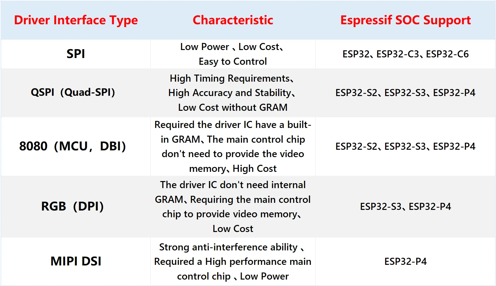
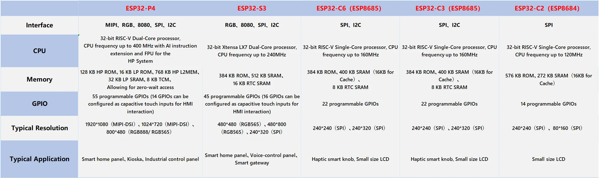
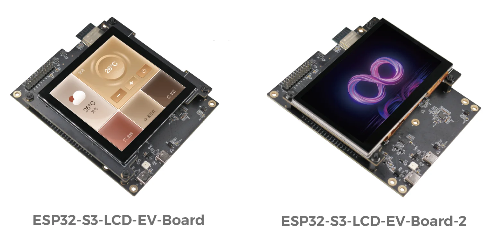
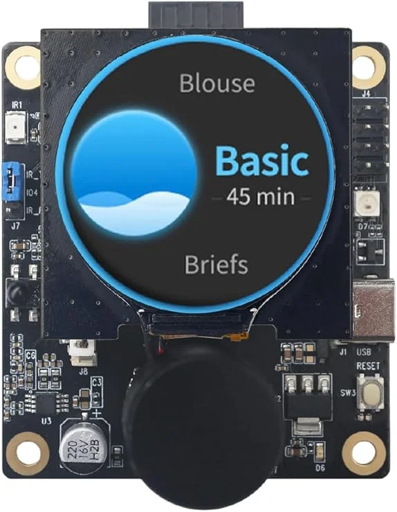
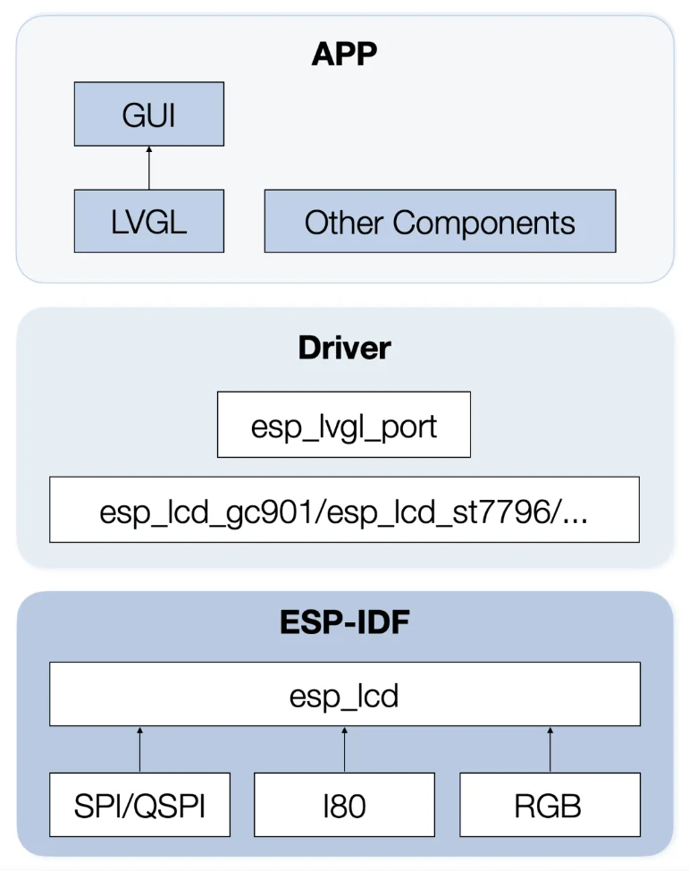

In today's rapidly evolving IoT landscape, LCD screens have become indispensable components of smart devices, providing real-time information and facilitating user interaction. As the demand for higher performance, lower power consumption, and more compact designs grows, it is crucial to choose the right technology to drive LCD screens. This article explores a number of Espressif SoCs that support different LCD driver interfaces, suitable for smart home, smart security, and other applications.

On top of that, this article touches on Espressif's rich development resources and one-stop AIoT cloud platform ESP-RainMaker which, among others, supports the Matter protocol to build cross-ecosystem solutions. Whether you're an engineer, developer, or product designer, this article will guide you through the unique features and practical applications of Espressif's SoCs with LCD screens.

## Current use of LCD Screens

LCD screens are built into all types of modern devices, serving as key components for displaying real-time information and enabling interactive experiences. They are especially important in the AIoT (Artificial Intelligence of Things) sector, where  the rapid development of IoT technologies has expanded the application scenarios for LCD screens.

These screens are widely used as the main input and output devices for human-computer interaction in various rapidly expanding fields, including:
- **Smart Home**: Control panels, smart mirrors, and other home automation devices.
- **Smart Security**: Displays in surveillance systems, doorbells, and security panels.
- **Industrial Control**: Interface screens for machinery and process monitoring.
- **Smart Cities**: Public information displays, traffic control systems, and environmental monitoring.

The commercial value of LCD screens is increasing as they become more integral to these applications, driven by their ability to meet the growing demands for performance, power efficiency, and compactness in modern electronic devices.

## Advantages of using Espressif SoCs with LCD screens

Modern products that integrate LCD screens push for high performance, low power consumption, and compact design. Equally important is the ability to handle complex functions such as UI display, screen control, voice interaction, and wireless connectivity (Wi-Fi and Bluetooth). Espressif SoCs are designed to meet and even exceed these demands by integrating multiple functionalities into a single, highly-efficient SoC.

With their rich functionality, Espressif SoCs reduce or even eliminate the need for additional hardware. This integration not only reduces hardware costs and power consumption but also minimizes the required physical space, allowing for more compact and efficient device designs.

Espressif provides comprehensive software tools, such as the ESP-IDF software development framework and the LVGL GUI development framework, which will be covered later in this article. These tools reduce software development time and costs. Additionally, Espressif provides rich and cost-effective LCD application solutions.

## Overview of supported LCD interfaces

Espressif SoCs support commonly used LCD interfaces, including SPI, QSPI, 8080, RGB, and MIPI DSI. The table below provides a high-level overview of the LCD interfaces and which Espressif SoCs support them respectively.

The following table provides recommendations for SoC selection based on the required application parameters.

## Recommended LCD Screen Solutions

There are three recommended tried-and-true solutions for integrating LCD screens with Espressif SoCs, each tailored to different LCD interfaces and application needs:

- **ESP32-P4 for MIPI + LCD**: Ideal for high-performance displays with extensive IO connectivity, suited for multimedia applications and advanced user interaction.
- **ESP32-S3 for RGB + LCD**: Perfect for large screens with high refresh rates, offering robust performance for smart home control panels and other interactive interfaces.
- **ESP32-C3 and ESP32-C6 for SPI + LCD**: Designed for small screens with cost and power efficiency in mind, suitable for compact consumer electronics and low-power devices.

### ESP32-P4 for MIPI + LCD

The MIPI interface offers high data transfer rates and is efficient in handling high-resolution displays. It is particularly suitable for applications requiring fast, high-quality graphics and real-time data processing.

For applications using the MIPI interface, the ESP32-P4 SoC is recommended. This SoC is suitable for products that demand extensive I/O connectivity and high performance, such as video doorbells, surveillance cameras, smart home control panels, central control panels, digital price tags, bicycle dashboards, etc.

The ESP32-P4 features:

- **Dual-Core Processor**: 400 MHz RISC-V
- **Memory Support**: Up to 32 MB PSRAM
- **USB Support**: USB 2.0 specification
- **Peripherals**: Includes MIPI-CSI/DSI, H264 Encoder, and other relevant peripherals

The [ESP32-P4-Function-EV-Board](https://docs.espressif.com/projects/esp-dev-kits/en/latest/esp32p4/esp32-p4-function-ev-board/user_guide.html#esp32-p4-function-ev-board) is the recommended development board for prototyping MIPI interface LCD solutions. It offers several key features:

- **Wi-Fi and Bluetooth Module**: 2.4 GHz Wi-Fi 6 & Bluetooth 5 (LE) via the integrated ESP32-C6-MINI-1 module
- **Display**: 7-inch capacitive touch screen with 1024 x 600 resolution
- **Camera**: 2MP camera with MIPI CSI
- **Applications**: Suitable for developing low-cost, high-performance, low-power network-connected audio and video products

This development board is an excellent choice for evaluating and building prototypes for various MIPI interface LCD applications. You can see the video presentation: [Unveiling ESP32-P4: High-performing SoC with extensive IO connectivity, HMI, and security features](https://www.youtube.com/watch?v=GTHHDZeIzcA).

### ESP32-S3 for RGB + LCD

The RGB interface is known for its high brush rate, making it ideal for controlling large screens. Its broad application range allows it to support various display sizes and resolutions, ensuring smooth and responsive graphical user interfaces (GUIs).

For applications using the RGB interface, the [ESP32-S3](https://www.espressif.com.cn/en/products/socs/esp32-s3) SoC is recommended. This SoC is suitable for several smart and interactive applications:

- **Smart Home Interfaces**: This includes various types of control panels such as device control panels, light switch panels, scene controllers, and temperature management panels.
- **Interactive Remote Controls**: Remote controls designed with responsive and engaging displays for improved user interaction.
- **Multi-Function Gateways**: Devices that combine several functions, providing comprehensive smart home control and enhanced human-computer interaction.

The ESP32-S3 features:

- **Dual-Core CPU**: Provides robust processing power.
- **AI Computing Power**: Enables sensitive touch experience and high-performance offline and online human-computer voice interaction.
- **Rich Peripheral Interfaces**: Supports communication with a variety of peripheral devices.
- **Smooth GUI Response**: Ensures a responsive and fluid graphical user interface.

The recommended development boards for building prototypes are as follows:

- [ESP32-S3-LCD-EV-Board](https://github.com/espressif/esp-dev-kits/tree/master/esp32-s3-lcd-ev-board):
  - **Screen**: 3.95-inch 480x480 LCD.
  - **Purpose**: Ideal for building prototypes and evaluating RGB interface solutions.
  - **Features**: Designed to work seamlessly with the ESP32-S3 SoC.

- [ESP32-S3-LCD-EV-Board-2](https://www.amazon.in/Espressif-ESP32-S3-LCD-EV-Board-2-Development-Board/dp/B0C9M48W66?ref_=ast_sto_dp&th=1&psc=1):
  - **Screen**: 3.95-inch 800x480 LCD.
  - **Purpose**: Offers an alternative for higher resolution prototyping.
  - **Features**: Provides enhanced evaluation capabilities with a larger display resolution.

### ESP32-C3 and ESP32-C6 for SPI + LCD

The SPI interface is well-suited for small screens and low-resolution displays due to its simplicity and cost-effectiveness. It is particularly efficient for small display applications with basic graphical needs. In other words, it is good for straightforward and economical solutions.

For applications using the SPI interface, the [ESP32-C3](https://www.espressif.com.cn/en/products/socs/esp32-c3) and [ESP32-C6](https://www.espressif.com.cn/en/products/socs/esp32-c6) SoCs are recommended. These SoCs are suitable for the following applications:

- **Household Appliances**: Washing machines, body fat scales, personal health devices, electric toothbrushes.
- **Small Display Devices**: Knob screens, compact displays used in various consumer electronics.

The ESP32-C3 is cost-effective and has industry-leading low-power performance. It can dynamically adjust its operating frequency and switch between low-power modes to extend battery life.

On the other hand, the ESP32-C6 offers larger RAM memory than the ESP32-C3 and supports higher resolution displays through the QSPI interface, achieving a low-cost intelligent screen display scheme with medium resolution.

The recommended development board for prototyping and evaluation is the [ESP32-C3-LCDkit](https://github.com/espressif/esp-dev-kits/tree/master/esp32-c3-lcdkit) board that can be bought [here](https://www.amazon.com/Espressif-ESP32-C3-LCDkit-Development-Board/dp/B0C9M1887C/ref=sr_1_3?crid=2WICDGC9FUSFI&dib=eyJ2IjoiMSJ9.QBZPTMh2NMnWLUPL5TU6rlhM53T6bPUhDd8yjTwawKFDG-pNO7FSiHJYsB4_YIobkkD4IoYHCpmCJWFi6pmzAs5q-8ZXxaEasxWwK6tG8FjmCDXFbYH9AICDOtWSYpRhB7GWAw-daWRRVF7BDpNYOwPlrwh4C-ClItJHUUcsgkLN6jJYVkc4k-aI8XNx5rW9gS3LHS5nXh-fMVqhY3xpM5ftMBwHh663jwIbZKUpYhc.H94wJsVmy219QdIUXgjNirv6Z7NiIF4zczyped05ndU&dib_tag=se&keywords=ESP32-C3-LCDkit&qid=1723622751&sprefix=esp32-c3-lcdkit%2Caps%2C824&sr=8-3).

<figure style="width: 50%; margin: 0 auto; text-align: center;">
    
    <figcaption>ESP32-C3-LCDkit comes with a 1.28-inch 240*240 LCD</figcaption>
</figure>

## Software ecosystem

Espressif’s LCD application solutions come with a comprehensive set of software development resources designed to streamline and enhance the development process.

The overall framework for Espressif’s LCD application development is as follows:

<figure style="width: 50%; margin: 0 auto; text-align: center;">
    
    <figcaption>Espressif's LCD application development of the overall framework</figcaption>
</figure>

### Development frameworks

Espressif provides [ESP-IDF](https://www.espressif.com/en/products/sdks/esp-idf) (Espressif IoT Development Framework), a robust environment for developing applications on Espressif SoCs. This framework facilitates efficient programming and integration with various hardware components.

Espressif’s solutions also incorporate SquareLine Studio GUI development framework. This GUI development framework allows developers to design and implement graphical user interfaces with ease, providing tools for creating visually appealing and interactive applications.

### Development tools and components

The [esp_lvgl_port](https://components.espressif.com/components/espressif/esp_lvgl_port) component is specifically designed to work with the ESP-IDF framework, enabling seamless integration of LVGL into your projects. It simplifies graphical interaction functionality and streamlines GUI development.

Espressif’s [ESP Component Registry](https://components.espressif.com/) offers a large number of components that can be easily integrated into new projects. This feature helps developers avoid redundant coding and reduces both development costs and complexity.

### Development boards and BSP components

Development boards like the [ESP32-S3-LCD-EV-Board](https://docs.espressif.com/projects/esp-dev-kits/en/latest/esp32s3/esp32-s3-lcd-ev-board/user_guide.html#esp32-s3-lcd-ev-board-v1-5) and [ESP32-C3-LCDkit](https://docs.espressif.com/projects/esp-dev-kits/en/latest/esp32c3/esp32-c3-lcdkit/user_guide.html#esp32-c3-lcdkit) come with BSP (Board Support Package) components available in the [ESP-BSP](https://github.com/espressif/esp-bsp) repository. These components can be directly added to your projects through the Component Manager, facilitating easy integration and development.

### Support for cross-ecosystem communication

Espressif’s LCD solutions support the [Matter](https://www.espressif.com/en/solutions/device-connectivity/esp-matter-solution) protocol, which enables communication across different ecosystems and brands. This ensures that smart screen devices can seamlessly interact with other smart home devices.

[ESP RainMaker®](https://rainmaker.espressif.com/en/index.html) is Espressif’s AIoT cloud platform, providing a comprehensive solution for managing and controlling smart devices. It supports both on-device cloud functionalities and remote control, making it easier to develop and deploy smart HMI (Human-Machine Interface) products.

## Contact information

To learn more about Espressif’s LCD application solutions or to discuss commercial project collaboration, don't hesitate to [get in touch](https://www.espressif.com/en/contact-us/sales-questions) with us. We are eager to explore how our solutions can meet your needs and contribute to your project’s success.
