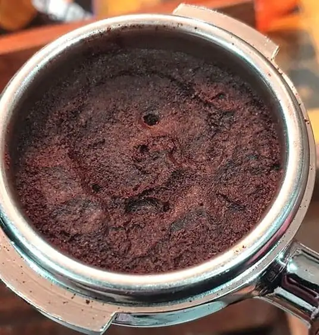
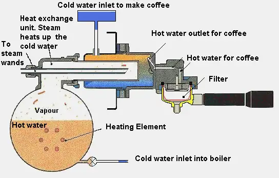
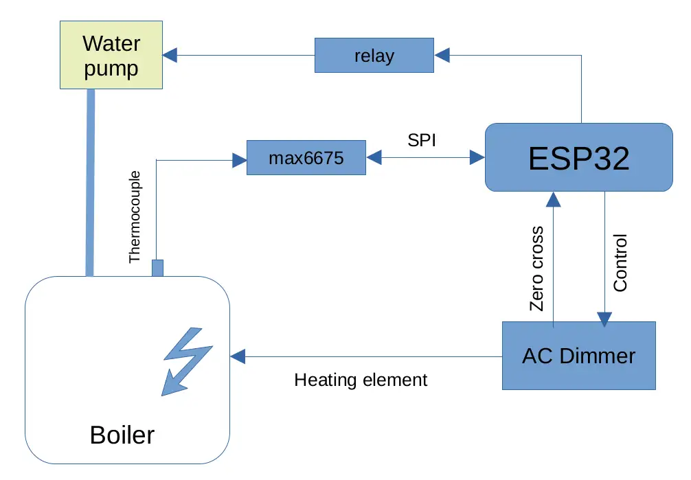
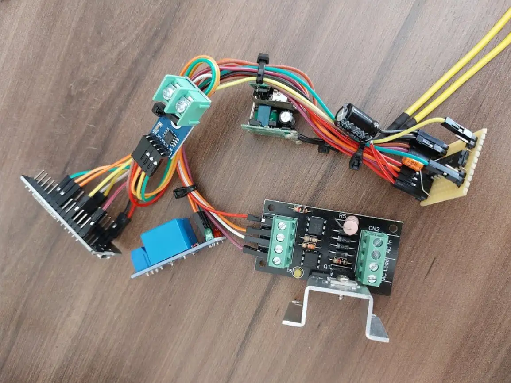
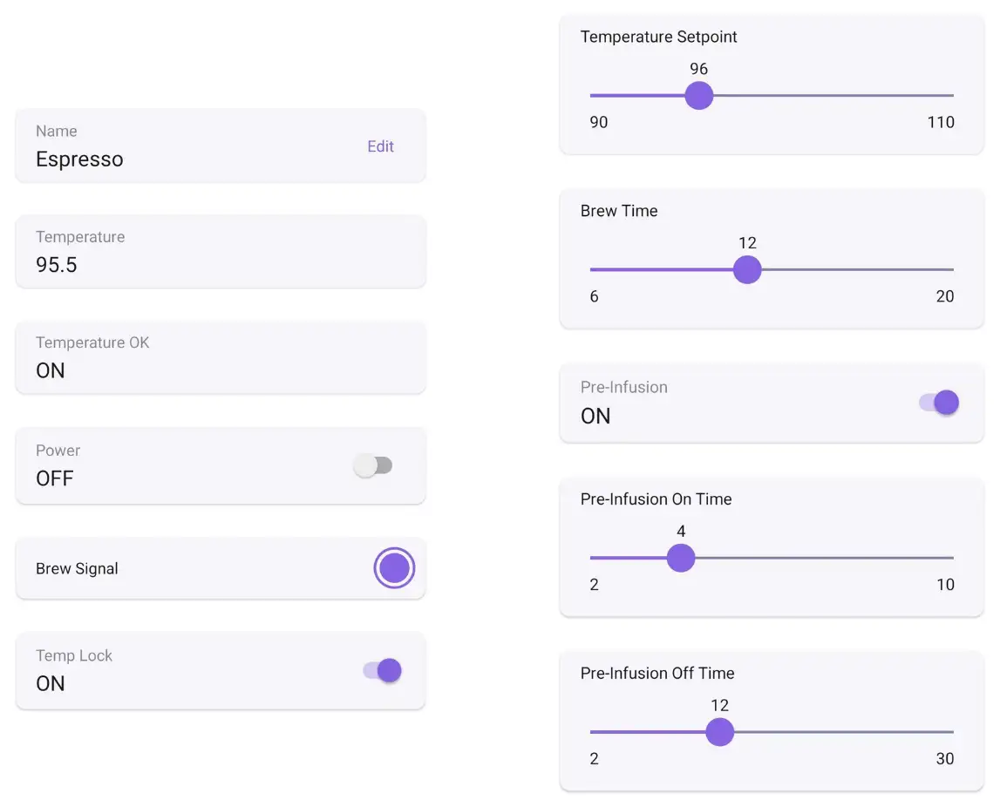

## 1. Introduction

Over 2.25 billion cups of coffee are consumed in the world daily [1]. For some people, coffee is part of their daily routine and is just a way to kick things off for a busy day. For others, it is a bit more than this, and can be a tasty source of pleasure at break time. Yet there are also the coffee aficionados, who are notorious for engaging in extensive discussions online regarding the best preparation practices and the complicated
physics behind coffee extraction.

Being a (sort of) aficionado myself, I have been puzzled by my experience when using my ~~dirty~~ cheap espresso machine at home and noticing how inconsistently I was able to produce a good cup. Sometimes it tasted really delicious, others quite underwhelming and bland. With the same coffee beans and setup, of course.

After some research and observation it became clear to me that one of the main issues is what is called channeling. Channeling is the natural tendency of water to flow through the path of least resistance of a coffee puck (this applies to unpressurized coffee baskets, so please check reference [2] if you are unfamiliar with the term). Much like an electrical current will flow proportionally more through the path of least resistance in a circuit, water will do the same in any physical setting. If during preparation coffee isn’t properly distributed and tamped, channeling is very likely to happen.

One of the strategies employed by more expensive espresso coffee machines to reduce channeling is to do a process called pre-infusion [4]. It consists of dispensing a small amount of water at the start of the brewing process, then wait for some seconds for the coffee puck to absorb water and become soaked. When the water pump is turned on again for the rest of the extraction, channeling is less likely to occur. The reasoning, besides the fact that the grounds are soaked and extraction is already underway, is that as the coffee puck swells it might redistribute better by filling gaps of lesser density in the basket.

Although more expensive equipment will probably allow for better control of the variables involved in the brewing process, there is a limit on how much this yields to better tasting coffee. Cheap and expensive machines are built alike, except for these sometimes sophisticated resources, some whistles and bells and good looks for a premium market and price.

With these considerations in mind, I decided to use a PID controller algorithm (please check reference [6] if
you are unfamiliar with how a PID works) and pre-infusion mechanism for my espresso machine using an ESP32 and RainMaker, in order to verify if it can really help consistently produce better tasting coffee and to play around a bit with control strategies.

### 1.1 A word about extraction

One of the most important factors that affect espresso taste is how well it was extracted. Extraction percentage is a measure of how much of the grind solids was successfully diluted by water and went to the cup in the brewing process. This can be assessed using an equipment (refractometer) or by taste. A well extracted cup is clearly tastier than a badly (under) extracted one.

Below are the most relevant factors that affect extraction, besides grind quality and size:

- Water temperature: a higher water temperature improves extraction, as it is able to dissolve more
solids. A temperature that is too high will affect flavor however, leaving a burnt taste and reducing
complexity of flavor by the breakdown of aromatic compounds originally in the coffee. So it is
essential to control temperature properly.
- Coffee ground distribution in the basket: this is a mechanical factor which has a big impact in
channeling and thus consistency and richness of flavor.
- Pre-infusion: if the machine supports it, using this feature helps wetting the coffee puck and
diminishes the occurrence of channeling [4]. It is only possible to properly do pre-infusion when
temperature is well controlled, because leaving the coffee grounds for an extended period of time in
contact with water that is too hot will effectively burn it.
- Equipment quality: machines that are designed to distribute water evenly through the shower screen
(the piece that dispenses water above the grounds) will produce better extracted coffee by passing
water evenly through the coffee puck.

The purpose of this project is to attempt to improve extraction consistency by proper control of the espresso
machine’s boiler temperature and by adding a pre-infusion feature by means of an *Embedded* device.

## 2. Hardware and software

For this project I used a Delonghi EC220 espresso coffee machine, an ESP32 embedded device, a dimmer
circuit operated by zero-cross detection to control the boiler’s heating element, a simple relay board to
control the water pump and a temperature sensor (thermocouple type K) for probing. The list of materials
can be found in the [List of Materials](#5-list-of-materials) section. The GitHub source code can be found at the link provided in [GitHub source code](#6-github-source-code).

### 2.1 General diagram

The general diagram with the project components can be seen below:

### 2.2 Prototype build

The following prototype was built for testing. All components and boards are readily available and can be
assembled with simple jumper wiring:

### 2.3 Prototype fitting

This is a Delonghi EC220 espresso machine. As shown in the picture below, it has a large empty chamber in
the right side of the body’s column. It can be used to safely house the prototype components as it is dry and
virtually unaffected by the boiler’s heat or humidity.

)")

As this project can be implemented in other espresso machines, the only suggestion made is to safely insulate
and fasten all components and avoid housing them near the boiler or where there’s humidity or vapor.

### 2.4 RainMaker interface

The following interface was created to allow for a good range of extraction settings, including the machine’s boiler temperature control and a pre-infusion feature. It is created automatically in the mobile application by the RainMaker platform when the project is provisioned (connected to the local wifi):

## 3. Results

### 3.1 Initial setup

Before trying to control the boiler temperature with the PID and dimmer circuit, I decided to register the
temperature curve of the machine in its original state:

 on the machine without modifications")

From the chart it is clearly visible how the boiler’s temperature oscillates through a wild wide range after
reaching operating temperature (around 103 &deg;C). After running the water pump for some time (around 748
seconds in the chart) the temperature stabilized on an even higher level (105.5 &deg;C), which demonstrates how
poor the original temperature management is. Understandably, it operates using electromechanical parts only,
which provide limited control capability.

|     | Idle | Brew |
| --- | ---: | ---: |
| Max temp  | 105.50    | 103    |
| Min temp  | 97.25     | 91     |
| **delta** | **8.25**  | **12** |

Table 1. Temperature (&deg;C) ranges and delta in both idle and brewing state

When the water pump is ON, heat is extracted quickly from the boiler as cold water constantly flow through
it. As a consequence, a sharp temperature drop is observed as the electromechanical switch is designed to
switch at a specific temperature reading.

### 3.2 PID controller

As can be seen below, using a PID controller to control the heating element of the boiler greatly improved
temperature stability:

 on the machine with PID control")

The temperature ranges in idle and brewing operation are as follows:

|     | Idle | Brew |
| --- | ---: | ---: |
| Max temp  | 100.0    | 100   |
| Min temp  | 94.5     | 96    |
| **delta** | **5.5**  | **4** |

Temperature (&deg;C) ranges and delta with PID controller

To avoid a sharp temperature drop while brewing, a simple strategy of keeping the heating element ON for
the whole brewing process produced good results.

Calibrating a PID controller however is not a simple task, and doing it empirically with no good experience
in such type of controllers can be challenging. Next, I show the results of using a different type of controller,
based on a Lookup table.

### 3.3 P controller (lookup table)

Given the nature of slow change in temperature of such a system and the knowledge necessary to properly
calibrate a PID controller, I tested a lookup table algorithm, which is a simple linear interpolation strategy
largely used in many control systems. It corresponds to a P control system (proportional only).

 on the machine with Lookup table control")

The temperature ranges and delta can be seen in the table below:

|     | Idle | Brew |
| --- | ---: | ---: |
| Max temp  | 96.75    | 96.50    |
| Min temp  | 94.50    | 94.75    |
| **delta** | **2.25** | **1.75** |

Table 3. Temperature (&deg;C) ranges and delta with P controller (Lookup)

With temperatures oscillating in a much narrower range (around 2.25 &deg;C), it is possible to start brewing
virtually anytime after the machine warmed up. The temperature is stable enough to always produce a nice
shot without being a variable other than the chosen setpoint.

## 4. Conclusion

It is certainly possible to produce delicious coffee using cheap equipment. If anything, as obvious as it may
sound, the importance of the quality and freshness of the coffee beans cannot be overstated. Second comes the quality of the grinder, as the physics behind coffee extraction will heavily rely upon this factor to produce
a good shot. As a third factor comes the process of extraction and the equipment setup. Enters this project. In
my experience using the modified machine over time, it clearly helped consistently extracting tastier coffee.
With the versatility and affordability of platforms like the ESP32, combined with creative thinking, simple
yet effective IoT solutions can be created to tackle everyday problems. These solutions not only enhance
daily life experiences, they help scratch our good old curiosity itch and also provide a fun time.

## 5. List of Materials

- ESP32 DevKitC v4 board
- Dimmer control circuit with Triac and zero-crossing signal
- Thermocouple type K with MAX6675 module
- Simple relay board (3.3V or 5V) with 3A or 5A current rating, 220V or 110V voltage rating
- ULN2003 or similar with free-wheeling diode, to drive relay
- Rapid prototype PCB for water pump drive assembly
- AC to 5V power supply to power Embedded devices
- Jumper wiring

## 6. GitHub source code

Source code for this project can be found in the following address:

https://github.com/raffarost/espresso

## 7. Contact info

| | |
| --- | --- |
| Author | Raffael Rostagno |
| Date   | March 2024 |
| email  | raffael.rostagno@espressif.com |

## 8. References

- [1] [Economics of coffee](https://en.wikipedia.org/wiki/Economics_of_coffee#:~:text=Over%202.25%20billion%20cups%20of,coffee%20for%20a%20living%20worldwide)
- [2] [Pressurized Vs. Non-Pressurized Espresso Baskets](https://www.brewcoffeehome.com/pressurized-vs-non-pressurized-portafilter/)
- [3] [How to Prevent Espresso Channeling & Achieve The Perfect Espresso Extraction](https://bigcupofcoffee.com/how-to-prevent-espresso-channeling/)
- [4] [Why is pre-infusion so important for espresso?](https://newgroundmag.com/2023/07/espresso-pre-infusion/)
- [5] [BLUKER: How it Works](https://www.bluker.com/howitworks2.html)
- [6] [Basics of PID Controllers: Design, Applications, Advantages & Disadvantages](https://www.integrasources.com/blog/basics-of-pid-controllers-design-applications/#:~:text=In%20simple%20terms%2C%20the%20PID,variable%20into%20the%20acceptable%20range)
