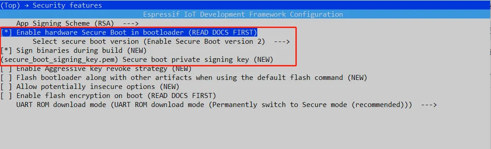
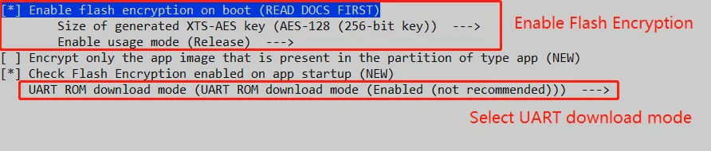
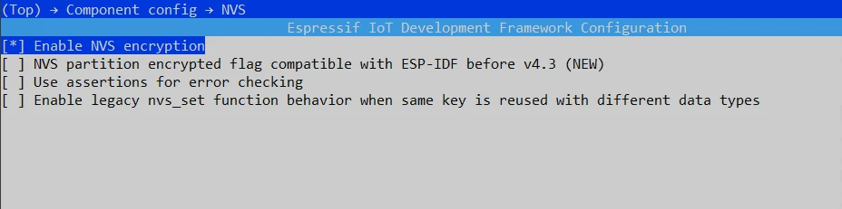
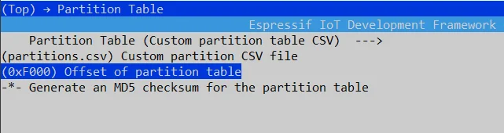
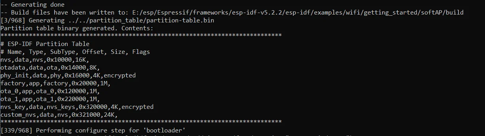
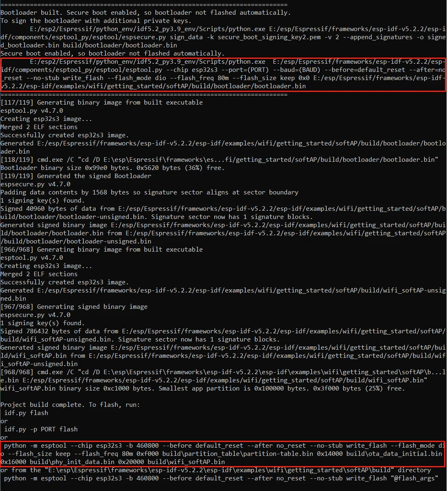
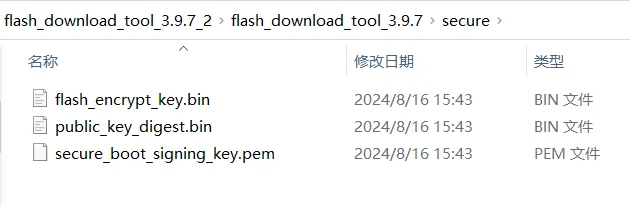
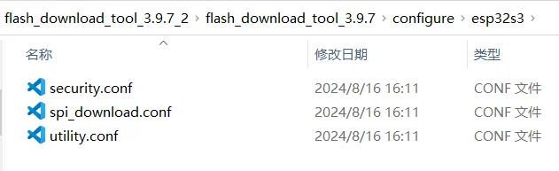
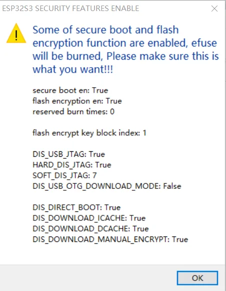
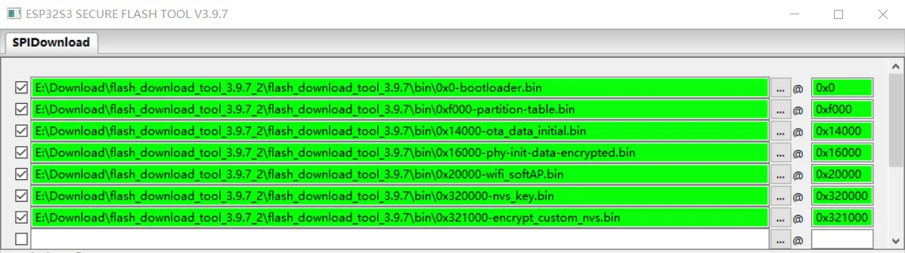

## Introduction

This tutorial is a step-by-step guide on how to set the "[Flash Encryption](https://docs.espressif.com/projects/esp-idf/en/v5.2.1/esp32s3/security/flash-encryption.html#flash-encryption) plus the [Secure Boot V2](https://docs.espressif.com/projects/esp-idf/zh_CN/v5.2.1/esp32s3/security/secure-boot-v2.html#secure-boot-v2) and [NVS Encryption](https://docs.espressif.com/projects/esp-idf/en/v5.2.1/esp32s3/api-reference/storage/nvs_encryption.html#nvs-encryption)" functions on the ESP32-S3 using the [Flash Download Tool](https://www.espressif.com/en/support/download/other-tools?keys=flash).

## Flash Encryption Overview

[Flash Encryption](https://docs.espressif.com/projects/esp-idf/en/v5.2.1/esp32s3/security/flash-encryption.html#flash-encryption) is a crucial security feature for ESP32 series products, designed to encrypt the firmware stored on the external Flash chip. This encryption protects the integrity and confidentiality of the firmware, safeguarding your application against unauthorized access, tampering, or reverse-engineering. Flash Encryption is especially important in scenarios where secure data transmission and firmware protection are essential.

For more detailed instructions and configuration steps, please refer to the official [Flash Encryption User Guide](https://docs.espressif.com/projects/esp-idf/en/v5.2.1/)

### Supported SoCs

Here is the list of SoCs that supports the **Flash Encryption** and the supported key types.

| Chip                                                                                                            | Supported Key Types       |
|-----------------------------------------------------------------------------------------------------------------|---------------------------|
| [ESP32](https://docs.espressif.com/projects/esp-idf/en/v5.2.1/esp32/security/flash-encryption.html#flash)       | XTS_AES_128               |
| [ESP32-S2](https://docs.espressif.com/projects/esp-idf/en/v5.2.1/esp32s2/security/flash-encryption.html#flash)  | XTS_AES_128 & XTS_AES_256 |
| [ESP32-S3](https://docs.espressif.com/projects/esp-idf/en/v5.2.1/esp32s3/security/flash-encryption.html#flash)  | XTS_AES_128 & XTS_AES_256 |
| [ESP32-C2](https://docs.espressif.com/projects/esp-idf/en/v5.2.1/esp32c2/security/flash-encryption.html#flash)  |    SHA256   & XTS_AES_128 |
| [ESP32-C3](https://docs.espressif.com/projects/esp-idf/en/v5.2.1/esp32c3/security/flash-encryption.html#flash)  | XTS_AES_128               |
| [ESP32-C6](https://docs.espressif.com/projects/esp-idf/en/v5.2.1/esp32c6/security/flash-encryption.html#flash)  | XTS_AES_128               |
| [ESP32-H2](https://docs.espressif.com/projects/esp-idf/en/v5.2.1/esp32h2/security/flash-encryption.html#flash)  | XTS_AES_128               |

Each SoC in the ESP32 family uses a hardware-accelerated 256-bit AES-XTS encryption key to protect the data stored in external flash. These keys are securely stored in the One-Time Programmable (OTP) memory of the chip and are inaccessible from user applications.

> **Note:** This guide will focus on the **ESP32-S3** and its Flash Encryption features, providing step-by-step instructions tailored for this SoC.

## Secure Boot V2 Overview

**Secure Boot V2** is a security feature that ensures a device only runs authorized, signed code. It protects against unauthorized code execution by verifying the digital signature of each piece of software during the boot process. This prevents the execution of malicious or tampered firmware and helps maintain the integrity of the device.

For more detailed instructions and configuration steps, please refer to the official [Secure Boot V2 User Guide](https://docs.espressif.com/projects/esp-idf/zh_CN/v5.2.1/esp32s3/security/secure-boot-v2.html#secure-boot-v2).

### Supported SoCs

Here is the list of SoCs that supports the **Secure Boot V2** and the supported version.

|  Product  |  Secure Boot Version  |
|--|--|
| ESP32 ECO V3 and above versions |  [Secure Boot V1](https://docs.espressif.com/projects/esp-idf/en/release-v5.1/esp32/security/secure-boot-v1.html#secure-boot) & [Secure Boot V2](https://docs.espressif.com/projects/esp-idf/en/v5.2.1/esp32/security/secure-boot-v2.html#secure-boot-v2) （ RSA-PSS ）|
| ESP32-S2 All versions | [Secure Boot V2](https://docs.espressif.com/projects/esp-idf/en/v5.2.1/esp32s2/security/secure-boot-v2.html#secure-boot-v2) （ RSA-PSS ）|
| ESP32-S3 All versions | [Secure Boot V2](https://docs.espressif.com/projects/esp-idf/en/v5.2.1/esp32s3/security/secure-boot-v2.html#secure-boot-v2) （ RSA-PSS ）|
| ESP32-C2 All versions | [Secure Boot V2](https://docs.espressif.com/projects/esp-idf/en/v5.2.1/esp32c2/security/secure-boot-v2.html#secure-boot-v2) （ ECDSA ）  |
| ESP32-C3 ECO V3 and above versions | [Secure Boot V2](https://docs.espressif.com/projects/esp-idf/en/v5.2.1/esp32c3/security/secure-boot-v2.html#secure-boot-v2) （ RSA-PSS）|
| ESP32-C6 All versions | [Secure Boot V2](https://docs.espressif.com/projects/esp-idf/en/v5.2.1/esp32c6/security/secure-boot-v2.html#secure-boot-v2) （RSA-PSS or ECDSA）     |
| ESP32-H2 All versions | [Secure Boot V2](https://docs.espressif.com/projects/esp-idf/en/v5.2.1/esp32h2/security/secure-boot-v2.html#secure-boot-v2) （RSA-PSS or ECDSA）     |

## NVS Encryption Overview

**NVS Encryption** provides secure storage for sensitive data in the Non-Volatile Storage (NVS) system of ESP32 devices. It supports two primary encryption schemes: the [HMAC Peripheral-Based Scheme](https://docs.espressif.com/projects/esp-idf/en/v5.2.1/esp32s3/api-reference/storage/nvs_encryption.html#nvs-encryption-hmac-peripheral-based-scheme) and the [Flash Encryption-Based Scheme](https://docs.espressif.com/projects/esp-idf/en/v5.2.1/esp32s3/api-reference/storage/nvs_encryption.html#nvs-encryption-flash-encryption-based-scheme). These schemes ensure that sensitive information, such as device credentials or user data, is encrypted before being written to flash memory.

For more detailed information, refer to the [NVS Encryption User Guide](https://docs.espressif.com/projects/esp-idf/en/v5.2.1/esp32s3/api-reference/storage/nvs_encryption.html#nvs-encryption).

In this guide, we will focus on the **NVS Encryption** that is based on the [Flash Encryption](https://docs.espressif.com/projects/esp-idf/en/v5.2.1/esp32s3/security/flash-encryption.html#flash-encryption) scheme, which leverages the same mechanism used for securing firmware in the external flash.

## Step-by-step Guide

This guide will walk you through enabling Flash Encryption and Secure Boot V2 on the ESP32-S3, enhancing the security of your application.

> **Warning:** Be careful when following this guide. Once you "burn" the eFuse, this operation **cannot** be reverted. eFuses are one-time programmable, and any changes made to them are permanent.

### 1 - Create a Partition Table for Your Project

The Flash memory on a single ESP chip can store multiple applications and various types of data, including calibration data, filesystems, and parameter storage. To organize this effectively, it's necessary to create a partition table that defines how the Flash space will be allocated for your project. Proper partitioning ensures that your application has the necessary space for both code and data storage.

For detailed partition table instructions, please refer to the [Partition Tables User Guide](https://docs.espressif.com/projects/esp-idf/en/v5.2.1/esp32s3/api-guides/partition-tables.html#partition-tables).

In this guide, we'll use the following partition table setup:

```c
# Name,   Type, SubType, Offset,   Size, Flags
# Note: if you have increased the bootloader size, make sure to update the offsets to avoid overlap
nvs,      data, nvs, 0x10000 , 0x4000 ,
otadata,  data, ota, 0x14000 , 0x2000 ,
phy_init, data, phy, 0x16000 , 0x1000 , encrypted
factory,  app,  factory, 0x20000 , 1M ,
ota_0,    app,  ota_0, 0x120000  , 1M ,
ota_1,    app,  ota_1, 0x220000  , 1M ,
nvs_key,  data, nvs_keys, 0x320000 , 0x1000 , encrypted
# Custom NVS data partition
custom_nvs, data, nvs, 0x321000    , 0x6000 ,
```

This partition table setting includes two `NVS` partitions, the default `nvs` and the `custom_nvs` partitions.

- The default `nvs` partition is used to store per-device PHY calibration data (different to initialization data) and store Wi-Fi data if the `esp_wifi_set_storage(WIFI_STORAGE_FLASH)` initialization function is used. As well as write data through the [nvs_set](https://docs.espressif.com/projects/esp-idf/en/v5.2.1/esp32s3/api-reference/storage/nvs_flash.html#api) API on the software. This `nvs` partition does not need to download the corresponding `nvs.bin` when the firmware is downloaded.
The default `nvs` partition will be `encrypted` while writing data to the `nvs` partition via the [nvs_set](https://docs.espressif.com/projects/esp-idf/zh_CN/v5.2.1/esp32s3/api-reference/storage/nvs_flash.html#api)  API (Note: The [nvs_get](https://docs.espressif.com/projects/esp-idf/en/v5.2.1/esp32s3/api-reference/storage/nvs_flash.html#_CPPv410nvs_get_i812nvs_handle_tPKcP6int8_t) (read) API does not support NVS encryption).

- The `custom_nvs` partition can used to store multiple files which by the `custom_nvs.csv` file managed . The types of files that can be managed can refer to the [CSV File Format](https://docs.espressif.com/projects/esp-idf/en/release-v5.1/esp32/api-reference/storage/nvs_partition_gen.html#csv-file-format)  instructions. And the `custom_nvs.bin` needs to be `encrypted` with `nvs_key` and downloaded the `encrypt_custom_nvs.bin` to the `custom_nvs` partition. Use a `custom_nvs.csv` file to Manage multiple files as follows:

```text
key,type,encoding,value
server_cert,namespace,,
server_cert,file,binary,E:\esp\test\customized\server_cert\server_cert.crt
server_key,namespace,,
server_key,file,binary,E:\esp\test\customized\server_key\server.key
server_ca,namespace,,
server_ca,file,binary,E:\esp\test\customized\server_ca\server_ca.crt
```

You can also refer to [esp-idf/examples/storage/nvsgen](https://github.com/espressif/esp-idf/tree/v5.3/examples/storage/nvsgen) example. This example use a [nvs_data.csv](https://github.com/espressif/esp-idf/blob/v5.3/examples/storage/nvsgen/nvs_data.csv) file to manage some data to write in `nvs` partition.

With [Flash Encryption](https://docs.espressif.com/projects/esp-idf/en/v5.2.1/esp32s3/security/flash-encryption.html#flash-encryption) enabled, the following types of data are `encrypted` by default:

- [Second Stage Bootloader (Firmware Bootloader)](https://docs.espressif.com/projects/esp-idf/en/v5.2.1/esp32s3/api-guides/startup.html#second-stage-bootloader)
- [Partition Table](https://docs.espressif.com/projects/esp-idf/en/v5.2.1/esp32s3/api-guides/partition-tables.html#id1)
- [NVS Key Partition](https://docs.espressif.com/projects/esp-idf/en/v5.2.1/esp32s3/api-reference/storage/nvs_encryption.html#nvs-encr-key-partition)
- [Otadata](https://docs.espressif.com/projects/esp-idf/en/v5.2.1/esp32s3/api-reference/system/ota.html?highlight=ota#ota-data-partition)
- All [app type](https://docs.espressif.com/projects/esp-idf/en/v5.2.1/esp32s3/api-guides/partition-tables.html#subtype) partitions

> The [NVS key partition](https://docs.espressif.com/projects/esp-idf/en/v5.2.1/esp32s3/api-reference/storage/nvs_encryption.html#nvs-encr-key-partition) (`nvs_key` partition) is used to store the `nvs_key`, and the `nvs_key` is used to encrypt the `nvs` type partitions. In this case，default `nvs` and the `custom_nvs` partitions.

Other types of data can be encrypted conditionally:

- Any partition marked with the `encrypted` flag in the partition table. For details, see [Encrypted Partition Flag](https://docs.espressif.com/projects/esp-idf/en/v5.2.1/esp32s3/security/flash-encryption.html#encrypted-partition-flag).
- If Secure Boot is enabled，the `public key digest` will be `encrypted`.

**Flash Download Tool**

If you are using the ESP32 series chip and want to enable [Flash Encryption](https://docs.espressif.com/projects/esp-idf/en/v5.2.1/esp32s3/security/flash-encryption.html#flash-encryption), [Secure Boot V2](https://docs.espressif.com/projects/esp-idf/zh_CN/v5.2.1/esp32s3/security/secure-boot-v2.html#secure-boot-v2), and [NVS Encryption](https://docs.espressif.com/projects/esp-idf/en/v5.2.1/esp32s3/api-reference/storage/nvs_encryption.html#nvs-encryption) for mass production, we recommend using the [Flash Download Tool](https://www.espressif.com/en/support/download/other-tools?keys=flash) to automate the process.

Using the [Flash Download Tool](https://www.espressif.com/en/support/download/other-tools?keys=flash) for enabling these security features offers several advantages:

- Once the firmware download is completed, the Flash Encryption, Secure Boot, and NVS Encryption processes are automatically finalized.
- Upon the first power-up, the device will directly run the **encrypted firmware**.
- Risks related to power failure or instability during the encryption and security processes are minimized.

The operational steps for using the [Flash Download Tool](https://www.espressif.com/en/support/download/other-tools?keys=flash) to enable [Flash Encryption](https://docs.espressif.com/projects/esp-idf/en/v5.2.1/esp32s3/security/flash-encryption.html#flash-encryption), [Secure Boot V2](https://docs.espressif.com/projects/esp-idf/zh_CN/v5.2.1/esp32s3/security/secure-boot-v2.html#secure-boot-v2), and [NVS Encryption](https://docs.espressif.com/projects/esp-idf/en/v5.2.1/esp32s3/api-reference/storage/nvs_encryption.html#nvs-encryption) are as follows:

1. **Obtain the Necessary Keys**:
   - Before starting, you need to generate or obtain the encryption keys for Flash Encryption, Secure Boot, and NVS Encryption.

2. **Enable Security Features in the Software**:
   - Configure the [Flash Encryption](https://docs.espressif.com/projects/esp-idf/en/v5.2.1/esp32s3/security/flash-encryption.html#flash-encryption), [Secure Boot V2](https://docs.espressif.com/projects/esp-idf/zh_CN/v5.2.1/esp32s3/security/secure-boot-v2.html#secure-boot-v2), and [NVS Encryption](https://docs.espressif.com/projects/esp-idf/en/v5.2.1/esp32s3/api-reference/storage/nvs_encryption.html#nvs-encryption) options in your project and ensure your firmware is signed appropriately.

3. **Encrypt and Flash the Firmware**:
   - When downloading the firmware, make sure to manually encrypt the `custom_nvs.bin` if needed. This file must be encrypted separately if it contains sensitive data.

By following these steps, you can securely provision and encrypt your ESP32 devices in a mass production environment using the [Flash Download Tool](https://www.espressif.com/en/support/download/other-tools?keys=flash).

### 2 - Obtain the different keys

How to Obtain different types of [Flash Encryption Keys](https://docs.espressif.com/projects/esp-idf/en/v5.2.1/esp32s3/security/flash-encryption.html#pregenerated-flash-encryption-key)?

Users can use the [esptool](https://github.com/espressif/esptool) by running the `generate_flash_encryption_key` commands to generate the different types Flash Encryption keys.

You can use command with `--help` to query the commands instructions:

```bash
espsecure.py generate_flash_encryption_key --help
```

Run the following command to generate the `SHA-256` key:

```bash
espsecure.py generate_flash_encryption_key --keylen 128 flash_encrypt_key.bin
```

To generate the `AES-128` key, run

Please note:

- The Flash Download Tool only support `AES-128` key on ESP32-S3, so we recommend to use the `AES-128` key for ESP32-S3 Flash Encryption .

```bash
espsecure.py generate_flash_encryption_key flash_encrypt_key.bin
```

> When the `--keylen` parameter is not specified, It will generated the `AES-128` key by default

- Running the follows command to generate the   `AES-256` key

```bash
espsecure.py generate_flash_encryption_key --keylen 512 flash_encrypt_key.bin
```

#### How to Obtain [Secure Boot V2](https://docs.espressif.com/projects/esp-idf/en/v5.2.1/esp32s3/security/host-based-security-workflows.html?highlight=secure_boot_signing_key%20pem#enable-secure-boot-v2-externally) key ?

Base on the `ESP32S3`  chip to enable [Secure Boot V2](https://docs.espressif.com/projects/esp-idf/en/v5.2.1/esp32s3/security/secure-boot-v2.html#secure-boot-v2) function will requires a [rsa3072](https://docs.espressif.com/projects/esp-idf/zh_CN/release-v5.0/esp32/security/secure-boot-v2.html#generating-secure-boot-signing-key) type key.

Users can use the [esptool](https://github.com/espressif/esptool) ，and running the `espsecure.py generate_signing_key` command to generate the [Secure Boot V2](https://docs.espressif.com/projects/esp-idf/zh_CN/v5.2.1/esp32s3/security/secure-boot-v2.html#secure-boot-v2)  key.

> You can use `espsecure.py generate_signing_key --help` command to query the commands instructions.

```bash
espsecure.py generate_signing_key secure_boot_signing_key.pem --version 2 --scheme rsa3072
```

Alternatively, you can also install the [OpenSSL](https://www.openssl.org/source/) environment and to generate an [RSA 3072 type private key for Secure Boot signing ](https://docs.espressif.com/projects/esp-idf/en/release-v5.1/esp32s3/security/secure-boot-v2.html#generating-secure-boot-signing-key) with the following command:

```bash
openssl genrsa -out secure_boot_signing_key.pem 3072
```

#### How to Obtain [Secure Boot V2](https://docs.espressif.com/projects/esp-idf/en/v5.2.1/esp32s3/security/host-based-security-workflows.html?highlight=secure_boot_signing_key%20pem#enable-secure-boot-v2-externally) public key digest?

When enable Secure Boot V2 function on  [Flash Download Tool](https://www.espressif.com/en/support/download/other-tools?keys=flash)  ， you need to add the Secure Boot V2 Key Digest. So you need to base on the Secure Boot V2 Key to generate the digest of the `public key`.  Please see: [Enable Secure Boot V2 Externally](https://docs.espressif.com/projects/esp-idf/zh_CN/v5.2.1/esp32/security/host-based-security-workflows.html?highlight=secure_boot_signing_key%20pem#enable-secure-boot-v2-externally).

> You can use `espsecure.py digest_rsa_public_key --help` command to query the commands instructions.

For example:

```bash
espsecure.py digest_rsa_public_key --keyfile secure_boot_signing_key.pem --output public_key_digest.bin
```

#### How to Obtain `nvs_key` ?

You can use the `nvs partition tool` （[esp-idf/components/nvs_flash/nvs_partition_generator](https://github.com/espressif/esp-idf/tree/v5.1.2/components/nvs_flash/nvs_partition_generator)）and running the `nvs_partition_gen.py`  command to obtain the `nvs_key` file. 

> You can use `nvs_partition_gen.py --help` command to query the commands instructions.

For example:

```bash
python E:\esp\Espressif\frameworks\esp-idf-5.2.1\esp-idf\components\nvs_flash\nvs_partition_generator\nvs_partition_gen.py generate-key --keyfile nvs_key.bin
```

#### How to use `nvs_key` to encrypt the `custom_nvs.csv` file ?

If you need to download `custom_nvs.bin` when you download all firmware, you also need to manually encrypt `custom_nvs.bin` use `nvs_key`. You can running the follows command to use `nvs_key.bin` to encrypt the `custom_nvs.csv`  file and get the encrypted `encrypt_custom_nvs.bin`.

For example:

```bash
python E:\esp\Espressif\frameworks\esp-idf-5.2.1\esp-idf\components\nvs_flash\nvs_partition_generator\nvs_partition_gen.py encrypt custom_nvs.csv encrypt_custom_nvs.bin 0x6000 --inputkey keys\nvs_key.bin
```

> - `0x6000` is size of `encrypt_custom_nvs.bin` firmware

### 3 - Software Configuration

On the Software Configuration side，you will need to enable `Flash Encryption`, `Secure Boot V2` and `NVS  Encryption` setting.

```bash
idf.py menuconfig
```

Go to `Security features` then set the options as the image below:



Please note you need to add the `secure_boot_signing_key.pem` path.

Set the `Enable Flash Encryption` options:



#### Flash Encryption Modes

`Flash Encryption` supports two modes: `Release` and `Development (NOT SECURE)`.

- **Release Mode**: 
   - When `Release` mode is selected, the `SPI_BOOT_CRYPT_CNT` eFuse bit is set to `0b111`, permanently enabling Flash Encryption. This mode is **recommended for mass production**, as it provides full security by locking the encryption settings after the first flash.
  
- **Development Mode (NOT SECURE)**: 
   - In `Development (NOT SECURE)` mode, the `SPI_BOOT_CRYPT_CNT` eFuse bit is set to `0b001`. This mode allows for testing and debugging, offering the flexibility to flash firmware multiple times with encryption enabled. However, this mode is **not secure** and is intended only for development purposes. 
   - If Flash Encryption is enabled in `Development (NOT SECURE)` mode, there is one chance to disable it. To disable Flash Encryption after it has been enabled in this mode, you can run the following command:

```bash
espefuse.py -p port burn_efuse SPI_BOOT_CRYPT_CNT 0x3
```

Because the Flash Download Tool only supports AES-128 on the ESP32-S3, you should select the **AES-128** key option in the software.

Additionally, pay attention to the `UART ROM download mode` setting. If you prefer not to disable the download mode, it is recommended to select the configuration option **UART ROM download mode (Enabled, not recommended)**. For more details on different download mode configuration options, refer to the [CONFIG_SECURE_UART_ROM_DL_MODE](https://docs.espressif.com/projects/esp-idf/en/v5.2.1/esp32s3/api-reference/kconfig.html#config-secure-uart-rom-dl-mode) documentation.

#### Enable NVS Encryption

To enable the `NVS Encryption`, set the following in the configuration menu:

Go to `Component config → NVS` and set the `Enable NVS encryption`.



#### Increase the partition table offset

Since the Flash Encryption and Secure Boot V2 function will increase the size of the bootloader firmware, so you need to increase the partition table offset(Default is `0x8000`) setting. As follows:

Go to `Partition Table` and set the offset to `(0xF000)` in the `Offset of partition table`.



#### Build the project

Now you need to build the project to get the compiled firmware.

Run the build command:

```bash
idf.py build
```

Since the secure boot function is enabled, after compilation, you will generate several firmware files, including `bootloader.bin`, `bootloader-unsigned.bin`, `app.bin`, `app-unsigned.bin`, and other partition firmware files.

The `bootloader.bin` and `app.bin` are signed firmware, while `bootloader-unsigned.bin` and `app-unsigned.bin` are the unsigned versions. You need to download the **signed** firmware files (`bootloader.bin` and `app.bin`) along with the other partition firmware files.

From the compilation log, you can find the firmware file paths and the corresponding download addresses. These firmware files and their download addresses need to be imported into the Flash Download Tool, as shown below:



Firmware paths:



## 4 - Flash Download Tool Configuration

On this step, we will show how to configure the [Flash Download Tool](https://www.espressif.com/en/support/download/other-tools?keys=flash) with the generated keys. This tool is only available for **Windows**.

First, put the `Flash Encryption Key` and the `digest of the Secure boot V2 public key` into the `flash_download_tool\secure` directory, as following：



In the `configure\esp32s3\security.conf` configuration file of the [Flash Download Tool](https://www.espressif.com/en/support/download/other-tools?keys=flash), enable the `Flash Encryption` and `Secure Boot V2` configuration options.



The security configurations to be modified are:

```c
[SECURE BOOT]
secure_boot_en = True                                    \\ Enable Secure Boot         
public_key_digest_path = .\bin\public_key_digest.bin     \\ Setting public_key_digest.bin path for Secure Boot
public_key_digest_block_index = 0                        \\ Index of the eFuse block where the public key digest file is stored. Default: 0.

[FLASH ENCRYPTION]
flash_encryption_en = True                               \\ Enable Flash Encryption
reserved_burn_times = 0                                  \\ Configures how many times [0 in this case when config Flash Encryption Release mode on the software] are reserved for the flashing operation
flash_encrypt_key_block_index = 1                     \\ Index of the eFuse block where the Flash Encrypt Key file is stored. Default: 0. Range: 0~4. Note that this option can only be set to 0 for ESP32-C2. 

[SECURE OTHER CONFIG]
flash_encryption_use_customer_key_enable = True          \\ Configures whether to enable the use of a customer-specified encryption key
flash_encryption_use_customer_key_path = .\bin\flash_encrypt_key.bin          \\ Setting customer-specified Flash Encryption key file path
flash_force_write_enable = True                          \\ Configures whether to skip encryption and secure boot checks during flashing. If it is set to False (default), an error message may pop up when attempting to flash products with enabled flash encryption or secure boot.

[FLASH ENCRYPTION KEYS LOCAL SAVE]
keys_save_enable = False
encrypt_keys_enable = False
encrypt_keys_aeskey_path = 

// On the first boot, the flash encryption process burns by default the following eFuses:

[ESP32S3 EFUSE BIT CONFIG]
dis_usb_jtag = True                       \\ Configures whether to disable USB JTAG
hard_dis_jtag = True                      \\ Configures whether to hard-disable JTAG
soft_dis_jtag = 7                         \\ Configures whether to soft-disable JTAG
dis_usb_otg_download_mode = False         \\ Configures whether to disable USB OTG download
dis_direct_boot = True                    \\ Configures whether to disable direct boot mode
dis_download_icache = True                \\ Configures whether to disable the entire MMU flash instruction cache when running in UART bootloader mode
dis_download_dcache = True                \\ Configures whether to disable the entire MMU flash data cache in the UART bootloader mode
dis_download_manual_encrypt = True        \\ Configures whether to disable flash encryption operation when running in UART bootloader boot mode
```

### Restart the Flash Download Tool

Before proceeding with the process, restart the **Flash Download Tool** software. After restarting, the new configuration file located in `configure\esp32s3\security.conf` will be read, and the updated configuration will be loaded.

If everything is working correctly, a warning message will be displayed:



Now you can click `OK`.

## Import All Firmware to be Downloaded

Based on the partition table settings, add all the firmware files and their respective download addresses. The interface should look similar to the following:



## Downloading All Firmware

During the firmware download process, the Flash Download Tool will write the following to the chip's eFuse blocks:
- The `Flash encryption key` and the `Secure Boot V2 public key digest`.
- The `SPI_BOOT_CRYPT_CNT` eFuse bit will be set to enable **Flash Encryption**, and the `SECURE_BOOT_EN` eFuse bit will be set to enable **Secure Boot V2**.
- The tool will also apply all configuration settings from the `configure\esp32s3\security.conf` file to the chip's eFuses.

You will see a log similar to the one below from the tool's output:

```text
test offset :  0 0x0
case ok
test offset :  61440 0xf000
case ok
test offset :  81920 0x14000
case ok
test offset :  90112 0x16000
case ok
test offset :  131072 0x20000
case ok
test offset :  3276800 0x320000
case ok
test offset :  3280896 0x321000
case ok
.
Uploading stub...
Running stub...
Stub running...
Changing baud rate to 115200
Changed.
NO XMC flash  detected!
SPI_BOOT_CRYPT_CNT 0
SECURE_BOOT_EN False
ESP32 secure boot v2 skip generate key
Encrypting bin file ...please wait!!!
Using 256-bit key
Encrypting bin file ...please wait!!!
Using 256-bit key
Encrypting bin file ...please wait!!!
Using 256-bit key
Encrypting bin file ...please wait!!!
Using 256-bit key
Encrypting bin file ...please wait!!!
Using 256-bit key
Encrypting bin file ...please wait!!!
Using 256-bit key
Encrypting bin file ...please wait!!!
Using 256-bit key
burn secure key ...
Burn keys to blocks:
 - BLOCK_KEY1 -> [5f 4d 93 00 10 24 fd c4 3e ff 04 49 53 e2 88 83 c0 bc 2b d6 7e f1 81 0e f6 84 cd b7 0b 72 ae df]
        Reversing byte order for AES-XTS hardware peripheral
        'KEY_PURPOSE_1': 'USER' -> 'XTS_AES_128_KEY'.
        Disabling write to 'KEY_PURPOSE_1'.
        Disabling read to key block
        Disabling write to key block

 - BLOCK_KEY0 -> [c3 f6 4b 2e 84 92 f1 fc 86 d0 17 17 fe 62 04 6f e0 83 17 36 19 1a f4 9e 86 df e5 50 74 44 86 bf]
        'KEY_PURPOSE_0': 'USER' -> 'SECURE_BOOT_DIGEST0'.
        Disabling write to 'KEY_PURPOSE_0'.
        Disabling write to key block


Check all blocks for burn...
idx, BLOCK_NAME,          Conclusion
[00] BLOCK0               is not empty
        (written ): 0x0000000000000000000000000000d1f50000000000000000
        (to write): 0x000000000000000000000000490000000000000201800300
        (coding scheme = NONE)
[04] BLOCK_KEY0           is empty, will burn the new value
[05] BLOCK_KEY1           is empty, will burn the new value
.
This is an irreversible operation!
BURN BLOCK5  - OK (write block == read block)
BURN BLOCK4  - OK (write block == read block)
BURN BLOCK0  - OK (all write block bits are set)
Reading updated efuses...
Successful
The efuses to burn:
  from BLOCK0
     - SPI_BOOT_CRYPT_CNT
     - SECURE_BOOT_EN

Burning efuses:

    - 'SPI_BOOT_CRYPT_CNT' (Enables flash encryption when 1 or 3 bits are set and disabled otherwise) 0b000 -> 0b111

    - 'SECURE_BOOT_EN' (Set this bit to enable secure boot) 0b0 -> 0b1


Check all blocks for burn...
idx, BLOCK_NAME,          Conclusion
[00] BLOCK0               is not empty
        (written ): 0x0000000000000000000000004900d1f50000000201800300
        (to write): 0x000000000000000000100000001c00000000000000000000
        (coding scheme = NONE)
.
This is an irreversible operation!
BURN BLOCK0  - OK (all write block bits are set)
Reading updated efuses...
Checking efuses...
Successful

WARNING: - compress and encrypt options are mutually exclusive
Will flash uncompressed

 is stub and send flash finish
The efuses to burn:
  from BLOCK0
     - DIS_USB_JTAG
     - DIS_PAD_JTAG
     - SOFT_DIS_JTAG
     - DIS_DIRECT_BOOT
     - DIS_DOWNLOAD_ICACHE
     - DIS_DOWNLOAD_DCACHE
     - DIS_DOWNLOAD_MANUAL_ENCRYPT

Burning efuses:

    - 'DIS_USB_JTAG' (Set this bit to disable function of usb switch to jtag in module of usb device) 0b0 -> 0b1

    - 'DIS_PAD_JTAG' (Set this bit to disable JTAG in the hard way. JTAG is disabled permanently) 0b0 -> 0b1

    - 'SOFT_DIS_JTAG' (Set these bits to disable JTAG in the soft way (odd number 1 means disable ). JTAG can be enabled in HMAC module) 0b000 -> 0b111

    - 'DIS_DIRECT_BOOT' (Disable direct boot mode) 0b0 -> 0b1

    - 'DIS_DOWNLOAD_ICACHE' (Set this bit to disable Icache in download mode (boot_mode[3:0] is 0; 1; 2; 3; 6; 7)) 0b0 -> 0b1

    - 'DIS_DOWNLOAD_DCACHE' (Set this bit to disable Dcache in download mode ( boot_mode[3:0] is 0; 1; 2; 3; 6; 7)) 0b0 -> 0b1

    - 'DIS_DOWNLOAD_MANUAL_ENCRYPT' (Set this bit to disable flash encryption when in download boot modes) 0b0 -> 0b1


Check all blocks for burn...
idx, BLOCK_NAME,          Conclusion
[00] BLOCK0               is not empty
        (written ): 0x000000000000000000100000491cd1f50000000201800300
        (to write): 0x00000000000000020040000000000000001f0c0000000000
        (coding scheme = NONE)
.
This is an irreversible operation!
BURN BLOCK0  - OK (all write block bits are set)
Reading updated efuses...
Checking efuses...
Successful
```

After the firmware is downloaded, the Flash Encryption and Secure Boot V2 processes are completed. The firmware download process performs the following steps:

- Writing the `Secure Boot V2 public key digest` to chip eFuse `BLOCK_KEY0 (KEY_PURPOSE_0)`
- Writing the `Flash Encryption key` to chip eFuse `BLOCK_KEY1 (KEY_PURPOSE_1)`
- Setting the `SPI_BOOT_CRYPT_CNT` eFuse bit to `0b111` to enable Flash Encryption
- Setting the `SECURE_BOOT_EN` eFuse bit to `0b1` to enable Secure Boot V2
- Setting the `DIS_USB_JTAG` eFuse bit to `0b1` to disable USB JTAG
- Setting the `DIS_PAD_JTAG` eFuse bit to `0b1` to disable PAD JTAG
- Setting the `SOFT_DIS_JTAG` eFuse bit to `0b111` to disable JTAG functionality
- Setting the `DIS_DIRECT_BOOT` eFuse bit to `0b1` to disable direct boot
- Setting the `DIS_DOWNLOAD_ICACHE` eFuse bit to `0b1` to disable instruction cache during download
- Setting the `DIS_DOWNLOAD_DCACHE` eFuse bit to `0b1` to disable data cache during download
- Setting the `DIS_DOWNLOAD_MANUAL_ENCRYPT` eFuse bit to `0b1` to disable manual encryption during download

## Running the Firmware

During the first startup (power-up), the firmware will go through the following checks:

- Verify if the **Secure Boot V2** feature is enabled.
- Verify if the **Flash Encryption** feature is enabled.
- Verify if the **NVS Encryption** feature is enabled.
- Validate the **signed and encrypted firmware**.

If all checks and verification processes succeed, the firmware will run normally.

The firmware running log on the first startup will appear as follows:

```text
ESP-ROM:esp32s3-20210327
Build:Mar 27 2021
rst:0x1 (POWERON),boot:0x8 (SPI_FAST_FLASH_BOOT)
SPIWP:0xee
mode:DIO, clock div:1
Valid secure boot key blocks: 0
secure boot verification succeeded
load:0x3fce3980,len:0x3a1c
load:0x403c9700,len:0x4
load:0x403c9704,len:0xcbc
load:0x403cc700,len:0x52a0
entry 0x403c9914
I (73) boot: ESP-IDF v5.2.2-520-g9d6583f763 2nd stage bootloader
I (73) boot: compile time Aug 16 2024 15:58:33
I (74) boot: Multicore bootloader
I (78) boot: chip revision: v0.1
I (81) boot.esp32s3: Boot SPI Speed : 80MHz
I (86) boot.esp32s3: SPI Mode       : DIO
I (91) boot.esp32s3: SPI Flash Size : 8MB
I (96) boot: Enabling RNG early entropy source...
I (101) boot: Partition Table:
I (105) boot: ## Label            Usage          Type ST Offset   Length
I (112) boot:  0 nvs              WiFi data        01 02 00010000 00004000
I (120) boot:  1 otadata          OTA data         01 00 00014000 00002000
I (127) boot:  2 phy_init         RF data          01 01 00016000 00001000
I (135) boot:  3 factory          factory app      00 00 00020000 00100000
I (142) boot:  4 ota_0            OTA app          00 10 00120000 00100000
I (150) boot:  5 ota_1            OTA app          00 11 00220000 00100000
I (157) boot:  6 nvs_key          NVS keys         01 04 00320000 00001000
I (165) boot:  7 custom_nvs       WiFi data        01 02 00321000 00006000
I (173) boot: End of partition table
I (177) boot: Defaulting to factory image
I (182) esp_image: segment 0: paddr=00020020 vaddr=3c090020 size=20e68h (134760) map
I (217) esp_image: segment 1: paddr=00040e90 vaddr=3fc98700 size=047f8h ( 18424) load
I (221) esp_image: segment 2: paddr=00045690 vaddr=40374000 size=0a988h ( 43400) load
I (233) esp_image: segment 3: paddr=00050020 vaddr=42000020 size=81db8h (531896) map
I (339) esp_image: segment 4: paddr=000d1de0 vaddr=4037e988 size=09cd0h ( 40144) load
I (349) esp_image: segment 5: paddr=000dbab8 vaddr=00000000 size=04518h ( 17688)
I (353) esp_image: Verifying image signature...
I (354) secure_boot_v2: Verifying with RSA-PSS...
I (360) secure_boot_v2: Signature verified successfully!
I (371) boot: Loaded app from partition at offset 0x20000
I (371) secure_boot_v2: enabling secure boot v2...
I (374) secure_boot_v2: secure boot v2 is already enabled, continuing..
I (382) boot: Checking flash encryption...
I (386) flash_encrypt: flash encryption is enabled (0 plaintext flashes left)
I (394) boot: Disabling RNG early entropy source...
I (411) cpu_start: Multicore app
I (421) cpu_start: Pro cpu start user code
I (421) cpu_start: cpu freq: 160000000 Hz
I (421) cpu_start: Application information:
I (424) cpu_start: Project name:     wifi_softAP
I (430) cpu_start: App version:      v5.2.2-520-g9d6583f763
I (436) cpu_start: Compile time:     Aug 16 2024 15:58:16
I (442) cpu_start: ELF file SHA256:  d89b197be...
Warning: checksum mismatch between flashed and built applications. Checksum of built application is 6d559abf84b1d704bc99214866ff8708cf910cc472ec5ec9ca1557ca7d430710
I (447) cpu_start: ESP-IDF:          v5.2.2-520-g9d6583f763
I (454) cpu_start: Min chip rev:     v0.0
I (458) cpu_start: Max chip rev:     v0.99
I (463) cpu_start: Chip rev:         v0.1
I (468) heap_init: Initializing. RAM available for dynamic allocation:
I (475) heap_init: At 3FCA0AF8 len 00048C18 (291 KiB): RAM
I (481) heap_init: At 3FCE9710 len 00005724 (21 KiB): RAM
I (487) heap_init: At 3FCF0000 len 00008000 (32 KiB): DRAM
I (494) heap_init: At 600FE010 len 00001FD8 (7 KiB): RTCRAM
I (501) spi_flash: detected chip: generic
I (504) spi_flash: flash io: dio
I (509) flash_encrypt: Flash encryption mode is RELEASE
I (515) efuse: Batch mode of writing fields is enabled
W (520) secure_boot: Unused SECURE_BOOT_DIGEST1 should be revoked. Fixing..
W (528) secure_boot: Unused SECURE_BOOT_DIGEST2 should be revoked. Fixing..
I (536) efuse: BURN BLOCK0
I (541) efuse: BURN BLOCK0 - OK (all write block bits are set)
I (546) efuse: Batch mode. Prepared fields are committed
I (551) secure_boot: Fixed
I (555) nvs_sec_provider: NVS Encryption - Registering Flash encryption-based scheme...
I (564) sleep: Configure to isolate all GPIO pins in sleep state
I (570) sleep: Enable automatic switching of GPIO sleep configuration
I (578) main_task: Started on CPU0
I (588) main_task: Calling app_main()
I (628) nvs: NVS partition "nvs" is encrypted.
I (628) wifi softAP: ESP_WIFI_MODE_AP
I (628) pp: pp rom version: e7ae62f
I (628) net80211: net80211 rom version: e7ae62f
I (658) wifi:wifi driver task: 3fcaae94, prio:23, stack:6656, core=0
I (658) wifi:wifi firmware version: e60360a19
I (658) wifi:wifi certification version: v7.0
I (658) wifi:config NVS flash: enabled
I (658) wifi:config nano formating: disabled
I (668) wifi:Init data frame dynamic rx buffer num: 32
I (668) wifi:Init static rx mgmt buffer num: 5
I (678) wifi:Init management short buffer num: 32
I (678) wifi:Init dynamic tx buffer num: 32
I (678) wifi:Init static tx FG buffer num: 2
I (688) wifi:Init static rx buffer size: 1600
I (688) wifi:Init static rx buffer num: 10
I (698) wifi:Init dynamic rx buffer num: 32
I (698) wifi_init: rx ba win: 6
I (698) wifi_init: tcpip mbox: 32
I (708) wifi_init: udp mbox: 6
I (708) wifi_init: tcp mbox: 6
I (708) wifi_init: tcp tx win: 5760
I (718) wifi_init: tcp rx win: 5760
I (718) wifi_init: tcp mss: 1440
I (728) wifi_init: WiFi IRAM OP enabled
I (728) wifi_init: WiFi RX IRAM OP enabled
I (1258) phy_init: phy_version 680,a6008b2,Jun  4 2024,16:41:10
W (1258) phy_init: failed to load RF calibration data (0x1102), falling back to full calibration
W (1318) phy_init: saving new calibration data because of checksum failure, mode(2)
I (1338) wifi:mode : softAP (68:b6:b3:4e:3f:f1)
I (1388) wifi:Total power save buffer number: 16
I (1388) wifi:Init max length of beacon: 752/752
I (1398) wifi:Init max length of beacon: 752/752
I (1398) wifi softAP: wifi_init_softap finished. SSID:myssid password:mypassword channel:1
I (1398) esp_netif_lwip: DHCP server started on interface WIFI_AP_DEF with IP: 192.168.4.1
I (1408) main_task: Returned from app_main()
```

## Conclusion

Enabling Flash Encryption, Secure Boot V2, and NVS Encryption on the ESP32-S3 is critical for ensuring the security and integrity of your firmware and data. By following this guide, you can successfully configure and implement these features in both development and production environments. Utilizing tools like the Flash Download Tool simplifies the process, making it efficient and secure, especially in mass production settings. Always verify your configurations and ensure that the correct eFuse settings are applied, as they are irreversible.

For further exploration and testing, refer to the provided code examples and documentation links.

## References

For more information on implementing and verifying Flash Encryption, as well as practical examples, refer to the following resources:

- **Verify Flash Encryption Code**: Detailed source code for verifying the Flash Encryption process can be found in the ESP-IDF repository:
  [esp-idf/components/bootloader_support/src/flash_encrypt.c](https://github.com/espressif/esp-idf/blob/v5.2.1/components/bootloader_support/src/flash_encrypt.c)

- **Flash Encryption Test Example**: A comprehensive example demonstrating Flash Encryption in action is available in the ESP-IDF examples section:
  [esp-idf/examples/security/flash_encryption](https://github.com/espressif/esp-idf/tree/v5.2.1/examples/security/flash_encryption)
