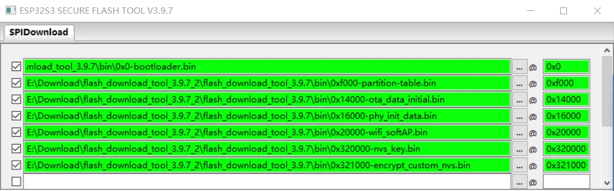

## Introduction

This document records the implementation of "[Flash Encryption](https://docs.espressif.com/projects/esp-idf/en/v5.2.1/esp32s3/security/flash-encryption.html#flash-encryption) + [Secure Boot V2](https://docs.espressif.com/projects/esp-idf/zh_CN/v5.2.1/esp32s3/security/secure-boot-v2.html#secure-boot-v2) + [NVS Encryption](https://docs.espressif.com/projects/esp-idf/en/v5.2.1/esp32s3/api-reference/storage/nvs_encryption.html#nvs-encryption)" functions on the ESP32-S3 using the [Flash Download Tool](https://www.espressif.com/en/support/download/other-tools?keys=flash).

### Overview of [Flash Encryption](https://docs.espressif.com/projects/esp-idf/en/v5.2.1/esp32s3/security/flash-encryption.html#flash-encryption)

[Flash Encryption](https://docs.espressif.com/projects/esp-idf/en/v5.2.1/esp32s3/security/flash-encryption.html#flash-encryption)  is used to encrypted the firmware in the external Flash chip used with ESP32 series products, which can protect the security of applications firmware. For more instructions, please read the [Flash Encryption](https://docs.espressif.com/projects/esp-idf/en/v5.2.1/esp32s3/security/flash-encryption.html#flash-encryption) user guide.

- Verify Flash  Encryption code：[esp-idf/components/bootloader_support/src/flash_encrypt.c](https://github.com/espressif/esp-idf/blob/v5.2.1/components/bootloader_support/src/flash_encrypt.c)

- Flash Encryption Test Example：[esp-idf/examples/security/flash_encryption](https://github.com/espressif/esp-idf/tree/v5.2.1/examples/security/flash_encryption)


### Overview of [Secure Boot V2](https://docs.espressif.com/projects/esp-idf/zh_CN/v5.2.1/esp32s3/security/secure-boot-v2.html#secure-boot-v2)

Secure Boot protects a device from running any unauthorized (i.e., unsigned) code by checking that each piece of software that is being booted is signed. For more instructions, please read the [Secure Boot V2](https://docs.espressif.com/projects/esp-idf/zh_CN/v5.2.1/esp32s3/security/secure-boot-v2.html#secure-boot-v2) user guide.


### Overview of [NVS Encryption](https://docs.espressif.com/projects/esp-idf/en/v5.2.1/esp32s3/api-reference/storage/nvs_encryption.html#nvs-encryption)

NVS Encryption supports [HMAC Peripheral-Based Schem](https://docs.espressif.com/projects/esp-idf/en/v5.2.1/esp32s3/api-reference/storage/nvs_encryption.html#nvs-encryption-hmac-peripheral-based-scheme) and [Flash Encryption-Based Schemes](https://docs.espressif.com/projects/esp-idf/en/v5.2.1/esp32s3/api-reference/storage/nvs_encryption.html#nvs-encryption-flash-encryption-based-scheme). For more instructions, please read the [NVS Encryption](https://docs.espressif.com/projects/esp-idf/en/v5.2.1/esp32s3/api-reference/storage/nvs_encryption.html#nvs-encryption) user guide.

In this case, the [NVS Encryption](https://docs.espressif.com/projects/esp-idf/en/v5.2.1/esp32s3/api-reference/storage/nvs_encryption.html#nvs-encryption) is based on the [Flash Encryption](https://docs.espressif.com/projects/esp-idf/en/v5.2.1/esp32s3/security/flash-encryption.html#flash-encryption)  scheme. 


### Products that Support `Flash Encryption`

| Chip | Supported Key Types |
|--|--|
| [ESP32](https://docs.espressif.com/projects/esp-idf/en/v5.2.1/esp32/security/flash-encryption.html#flash)       | XTS_AES_128               |
| [ESP32-S2](https://docs.espressif.com/projects/esp-idf/en/v5.2.1/esp32s2/security/flash-encryption.html#flash)  | XTS_AES_128 & XTS_AES_256 |
| [ESP32-S3](https://docs.espressif.com/projects/esp-idf/en/v5.2.1/esp32s3/security/flash-encryption.html#flash)  | XTS_AES_128 & XTS_AES_256 |
| [ESP32-C2](https://docs.espressif.com/projects/esp-idf/en/v5.2.1/esp32c2/security/flash-encryption.html#flash)  |    SHA256   & XTS_AES_128 |
| [ESP32-C3](https://docs.espressif.com/projects/esp-idf/en/v5.2.1/esp32c3/security/flash-encryption.html#flash)  | XTS_AES_128               |
| [ESP32-C6](https://docs.espressif.com/projects/esp-idf/en/v5.2.1/esp32c6/security/flash-encryption.html#flash)  | XTS_AES_128               |
| [ESP32-H2](https://docs.espressif.com/projects/esp-idf/en/v5.2.1/esp32h2/security/flash-encryption.html#flash)  | XTS_AES_128               |


### Products that Support `Secure Boot`

|  Product  |  Secure Boot Version  |
|--|--|
| ESP32 ECO V3 and above versions |  [Secure Boot V1](https://docs.espressif.com/projects/esp-idf/en/release-v5.1/esp32/security/secure-boot-v1.html#secure-boot) & [Secure Boot V2](https://docs.espressif.com/projects/esp-idf/en/v5.2.1/esp32/security/secure-boot-v2.html#secure-boot-v2) （ RSA-PSS ）|
| ESP32-S2 All versions | [Secure Boot V2](https://docs.espressif.com/projects/esp-idf/en/v5.2.1/esp32s2/security/secure-boot-v2.html#secure-boot-v2) （ RSA-PSS ）|
| ESP32-S3 All versions | [Secure Boot V2](https://docs.espressif.com/projects/esp-idf/en/v5.2.1/esp32s3/security/secure-boot-v2.html#secure-boot-v2) （ RSA-PSS ）|
| ESP32-C2 All versions | [Secure Boot V2](https://docs.espressif.com/projects/esp-idf/en/v5.2.1/esp32c2/security/secure-boot-v2.html#secure-boot-v2) （ ECDSA ）  |
| ESP32-C3 ECO V3 and above versions | [Secure Boot V2](https://docs.espressif.com/projects/esp-idf/en/v5.2.1/esp32c3/security/secure-boot-v2.html#secure-boot-v2) （ RSA-PSS）|
| ESP32-C6 All versions | [Secure Boot V2](https://docs.espressif.com/projects/esp-idf/en/v5.2.1/esp32c6/security/secure-boot-v2.html#secure-boot-v2) （RSA-PSS or ECDSA）     |
| ESP32-H2 All versions | [Secure Boot V2](https://docs.espressif.com/projects/esp-idf/en/v5.2.1/esp32h2/security/secure-boot-v2.html#secure-boot-v2) （RSA-PSS or ECDSA）     |


### Create a partition table for the project.

A single ESP chip's Flash can contain multiple apps, as well as many different kinds of data (calibration data, filesystems, parameter storage, etc). For this reason ， we need to create a partition table to plan the Flash space properly for our project. For partitioned table instructions, please read [Partition Tables](https://docs.espressif.com/projects/esp-idf/en/v5.2.1/esp32s3/api-guides/partition-tables.html#partition-tables) user guide.

In this case, suppose the partition table setting as follows:

```c
# Name,   Type, SubType, Offset,   Size, Flags
# Note: if you have increased the bootloader size, make sure to update the offsets to avoid overlap
nvs,      data, nvs, 0x10000 , 0x4000 ,
otadata,  data, ota, 0x14000 , 0x2000 ,
phy_init, data, phy, 0x16000 , 0x1000 , encrypted
factory,  app,  factory, 0x20000 , 1M ,
ota_0,    app,  ota_0, 0x120000  , 1M ,
ota_1,    app,  ota_1, 0x220000  , 1M ,
nvs_key,  data, nvs_keys, 0x320000 , 0x1000 , encrypted
# Custom NVS data partition
custom_nvs, data, nvs, 0x321000    , 0x6000 ,
```

This partition table setting includes two `NVS` partitions, the default `nvs` and the `custom_nvs` partition.

- The default `nvs` partition is used to store per-device PHY calibration data (different to initialisation data) and store Wi-Fi data if the esp_wifi_set_storage(WIFI_STORAGE_FLASH) initialization function is used. As well as write data through the [nvs_set](https://docs.espressif.com/projects/esp-idf/en/v5.2.1/esp32s3/api-reference/storage/nvs_flash.html#api) API on the software. This `nvs` partition does not need to download the corresponding `nvs.bin` when the firmware downloading. The default `nvs` partition will be `encrypted` while writing data to the `nvs` partition via the [nvs_set](https://docs.espressif.com/projects/esp-idf/zh_CN/v5.2.1/esp32s3/api-reference/storage/nvs_flash.html#api)  API (Note: The [nvs_get](https://docs.espressif.com/projects/esp-idf/en/v5.2.1/esp32s3/api-reference/storage/nvs_flash.html#_CPPv410nvs_get_i812nvs_handle_tPKcP6int8_t) (read) API does not support NVS encryption).

- The `custom_nvs` partition can used to store multiple files which by the `custom_nvs.csv` file managed . The types of files that can be managed can refer to the [CSV File Format](https://docs.espressif.com/projects/esp-idf/en/release-v5.1/esp32/api-reference/storage/nvs_partition_gen.html#csv-file-format)  instructions. And the `custom_nvs.bin` needs to be `encrypted` with `nvs_key` and downloaded the `encrypt_custom_nvs.bin` to the `custom_nvs` partition. Use a `custom_nvs.csv` file to Manage multiple files as follows:

```c
key,type,encoding,value
server_cert,namespace,,
server_cert,file,binary,E:\esp\test\customized\server_cert\server_cert.crt
server_key,namespace,,
server_key,file,binary,E:\esp\test\customized\server_key\server.key
server_ca,namespace,,
server_ca,file,binary,E:\esp\test\customized\server_ca\server_ca.crt
```

With [Flash Encryption](https://docs.espressif.com/projects/esp-idf/en/v5.2.1/esp32s3/security/flash-encryption.html#flash-encryption) enabled, the following types of data are `encrypted` by default:

- [Second Stage Bootloader (Firmware Bootloader)](https://docs.espressif.com/projects/esp-idf/en/v5.2.1/esp32s3/api-guides/startup.html#second-stage-bootloader)
- [Partition Table](https://docs.espressif.com/projects/esp-idf/en/v5.2.1/esp32s3/api-guides/partition-tables.html#id1)
- [NVS Key Partition](https://docs.espressif.com/projects/esp-idf/en/v5.2.1/esp32s3/api-reference/storage/nvs_encryption.html#nvs-encr-key-partition)
- [Otadata](https://docs.espressif.com/projects/esp-idf/en/v5.2.1/esp32s3/api-reference/system/ota.html?highlight=ota#ota-data-partition)
- All [app type](https://docs.espressif.com/projects/esp-idf/en/v5.2.1/esp32s3/api-guides/partition-tables.html#subtype) partitions

> The [NVS key partition](https://docs.espressif.com/projects/esp-idf/en/v5.2.1/esp32s3/api-reference/storage/nvs_encryption.html#nvs-encr-key-partition) (`nvs_key` partition) is used to store the `nvs_key`, and the `nvs_key` is used to encrypt the default `nvs` partition and the defined `custom_nvs` partition.

Other types of data can be encrypted conditionally:

- Any partition marked with the `encrypted` flag in the partition table. For details, see [Encrypted Partition Flag](https://docs.espressif.com/projects/esp-idf/en/v5.2.1/esp32s3/security/flash-encryption.html#encrypted-partition-flag).
- If Secure Boot is enabled，the `public key digest` will be `encrypted`.

If you are using the ESP32 series chip and want to enable the  [Flash Encryption](https://docs.espressif.com/projects/esp-idf/en/v5.2.1/esp32s3/security/flash-encryption.html#flash-encryption) and [Secure Boot V2](https://docs.espressif.com/projects/esp-idf/zh_CN/v5.2.1/esp32s3/security/secure-boot-v2.html#secure-boot-v2) and [NVS Encryption](https://docs.espressif.com/projects/esp-idf/en/v5.2.1/esp32s3/api-reference/storage/nvs_encryption.html#nvs-encryption) functions , from the perspective of mass production environment, we recommend using the [Flash Download Tool](https://www.espressif.com/en/support/download/other-tools?keys=flash) to complete all process.

Utilizing the [Flash Download Tool](https://www.espressif.com/en/support/download/other-tools?keys=flash) to complete the [Flash Encryption](https://docs.espressif.com/projects/esp-idf/en/v5.2.1/esp32s3/security/flash-encryption.html#flash-encryption) and [Secure Boot V2](https://docs.espressif.com/projects/esp-idf/zh_CN/v5.2.1/esp32s3/security/secure-boot-v2.html#secure-boot-v2) and [NVS Encryption](https://docs.espressif.com/projects/esp-idf/en/v5.2.1/esp32s3/api-reference/storage/nvs_encryption.html#nvs-encryption) functions have the following advantages on the operational steps :

- Once the firmware download is completed, all the security and encrypted process are also finished.
- When the chip is powered on for the first time, it is will runing the `ciphertext firmware` directly.
- The risk of `Power Failure` or `Power Supply Instability` in security and encrypted processes can be avoided.

Using the  [Flash Download Tool](https://www.espressif.com/en/support/download/other-tools?keys=flash) to complete [Flash Encryption](https://docs.espressif.com/projects/esp-idf/en/v5.2.1/esp32s3/security/flash-encryption.html#flash-encryption) and [Secure Boot V2](https://docs.espressif.com/projects/esp-idf/zh_CN/v5.2.1/esp32s3/security/secure-boot-v2.html#secure-boot-v2) and [NVS Encryption](https://docs.espressif.com/projects/esp-idf/en/v5.2.1/esp32s3/api-reference/storage/nvs_encryption.html#nvs-encryption) functions steps are as follows:

- First, you need to obtain the corresponding keys for Flash encryption and Secure boot and NVS encryption.
- Next, you need to enable the [Flash Encryption](https://docs.espressif.com/projects/esp-idf/en/v5.2.1/esp32s3/security/flash-encryption.html#flash-encryption) and [Secure Boot V2](https://docs.espressif.com/projects/esp-idf/zh_CN/v5.2.1/esp32s3/security/secure-boot-v2.html#secure-boot-v2) and [NVS Encryption](https://docs.espressif.com/projects/esp-idf/en/v5.2.1/esp32s3/api-reference/storage/nvs_encryption.html#nvs-encryption) functions configuration option on the software and get the signed firmware.
- Then, if you need to download `custom_nvs.bin` when you download all firmware, you will also need to manually encrypt `custom_nvs.bin`.

## Obtain the different keys

### How to Obtain different types of [Flash Encryption Keys](https://docs.espressif.com/projects/esp-idf/en/v5.2.1/esp32s3/security/flash-encryption.html#pregenerated-flash-encryption-key) ?

Users can use  [esptool](https://github.com/espressif/esptool) and running the `espsecure.py generate_flash_encryption_key` commands to generate the different types Flash Encryption keys . As follows:

> You can use `espsecure.py generate_flash_encryption_key --help` command to query the commands instructions

- Running the follows command to generate the `SHA-256` key

```bash
espsecure.py generate_flash_encryption_key --keylen 128 flash_encrypt_key.bin
```

- Running the follows command to generate the  `AES-128` key

Please note:
- The Flash Download Tool only support `AES-128` key on ESP32-S3, so we recommend to use the `AES-128` key for ESP32-S3 Flash Encryption .

```bash
espsecure.py generate_flash_encryption_key flash_encrypt_key.bin
```

> When the `--keylen` parameter is not specified, It will generated the `AES-128` key by default

- Running the follows command to generate the   `AES-256` key

```bash
espsecure.py generate_flash_encryption_key --keylen 512 flash_encrypt_key.bin
```

### How to Obtain [Secure Boot V2](https://docs.espressif.com/projects/esp-idf/en/v5.2.1/esp32s3/security/host-based-security-workflows.html?highlight=secure_boot_signing_key%20pem#enable-secure-boot-v2-externally) key ?

Base on the `ESP32S3`  chip to enable [Secure Boot V2](https://docs.espressif.com/projects/esp-idf/en/v5.2.1/esp32s3/security/secure-boot-v2.html#secure-boot-v2) function will requires a [rsa3072](https://docs.espressif.com/projects/esp-idf/zh_CN/release-v5.0/esp32/security/secure-boot-v2.html#generating-secure-boot-signing-key) type key.

Users can use the [esptool](https://github.com/espressif/esptool) ，and running the `espsecure.py generate_signing_key` command to generate the [Secure Boot V2](https://docs.espressif.com/projects/esp-idf/zh_CN/v5.2.1/esp32s3/security/secure-boot-v2.html#secure-boot-v2)  key

```bash
espsecure.py generate_signing_key secure_boot_signing_key.pem --version 2 --scheme rsa3072
```

Alternatively, you can also install the [OpenSSL](https://www.openssl.org/source/) environment and to generate an [RSA 3072 type private key for Secure Boot signing ](https://docs.espressif.com/projects/esp-idf/en/release-v5.1/esp32s3/security/secure-boot-v2.html#generating-secure-boot-signing-key) with the following command:

```bash
openssl genrsa -out secure_boot_signing_key.pem 3072
```

When enable Secure Boot V2 function on  [Flash Download Tool](https://www.espressif.com/en/support/download/other-tools?keys=flash)  ， you need to add the Secure Boot V2 Key Digest. So you need to base on the Secure Boot V2 Key to generate the digest of the `public key`.  Please see: [Enable Secure Boot V2 Externally](https://docs.espressif.com/projects/esp-idf/zh_CN/v5.2.1/esp32/security/host-based-security-workflows.html?highlight=secure_boot_signing_key%20pem#enable-secure-boot-v2-externally).

```bash
espsecure.py digest_rsa_public_key --keyfile secure_boot_signing_key.pem --output public_key_digest.bin
```

### How to Obtain `nvs_key` ?

You can use the `nvs partition tool` （[esp-idf/components/nvs_flash/nvs_partition_generator](https://github.com/espressif/esp-idf/tree/v5.1.2/components/nvs_flash/nvs_partition_generator)）and running the `nvs_partition_gen.py`  command to obtain the `nvs_key` file. As follows:

```bash
python E:\esp\Espressif\frameworks\esp-idf-5.2.1\esp-idf\components\nvs_flash\nvs_partition_generator\nvs_partition_gen.py generate-key --keyfile nvs_key.bin
```

If you need to download `custom_nvs.bin` when you download all firmware, you also need to manually encrypt `custom_nvs.bin` use `nvs_key`. You can running the follows command to use `nvs_key.bin` to encrypt the `custom_nvs.csv`  file and get the encrypted `encrypt_custom_nvs.bin`.

```bash
python E:\esp\Espressif\frameworks\esp-idf-5.2.1\esp-idf\components\nvs_flash\nvs_partition_generator\nvs_partition_gen.py encrypt custom_nvs.csv encrypt_custom_nvs.bin 0x6000 --inputkey keys\nvs_key.bin
```

> - `0x6000` is size of `encrypt_custom_nvs.bin` firmware

## Software Configuration

On the Software Configuration，you need to enable `Flash Encryption` and `Secure Boot V2` and `NVS  Encryption` setting.

`idf.py menuconfig → Security features`
  
  - Enable Seucre Boot 
    [*] Enable hardware Secure Boot in bootloader (READ DOCS FIRST)
        Select secure boot version (Enable Secure Boot version 2)  --->
    [*] Sign binaries during build (NEW)
    (secure_boot_signing_key.pem) Secure boot private signing key (NEW) 


  - Enable Flash Encryption
    [*] Enable flash encryption on boot (READ DOCS FIRST) 
        Size of generated XTS-AES key (AES-128 (256-bit key))  ---> 
        Enable usage mode (Release)  ---> 
    [*] Encrypt only the app image that is present in the partition of type app (NEW) 
    [*] Check Flash Encryption enabled on app startup (NEW) 
        UART ROM download mode (UART ROM download mode (Permanently disabled (recommended)))  ---> 


  - Enable NVS Encryption

    `idf.py menuconfig → Component config → NVS`
    [*] Enable NVS encryption 


Since the Flash Encryption and Secure Boot V2 function will increase the size of the bootloader firmware, so you need to increase the partition table offset(Default is `0x8000`) setting. As follows:

`idf.py menuconfig → Partition Table → (0xF000) Offset of partition table`


### Compile the project to get the compiled firmware

Then , you need compile the project to get the compiled firmware.

```bash
idf.py build
```

Because of the secure boot function is enabled. After compiled , you will get the `bootloader.bin` and `bootloader-unsigned.bin` and `app.bin` and `app-unsigned.bin` and other partition firmware bin files. The `bootloader.bin` and `app.bin` are signed firmware. The `bootloader-unsigned.bin` and `app-unsigned.bin` are unsigned firmware. We need to downlaod the signed firmware and other partition firmware bin files.

From the compilation completion log, you can see the firmware path and firmware download address. The firmware and firmware download address are need to be imported to the Flash Download tool . As follows:


### [Flash Download Tools](https://www.espressif.com/en/support/download/other-tools?keys=flash)   Configuration

Put the `Flash Encryption Key` and the `digest of the Secure boot V2 public key` into the `flash_download_tool\secure` directory. As follows：


In the `configure\esp32s3\security.conf` configuration file of the [Flash Download Tool](https://www.espressif.com/en/support/download/other-tools?keys=flash) , enable the `Flash Encryption` and `Secure Boot V2` configuration option . 


The security configurations to be modified are as follows:

```c
[SECURE BOOT]
secure_boot_en = True                  
public_key_digest_path = .\bin\public_key_digest.bin
public_key_digest_block_index = 0

[FLASH ENCRYPTION]
flash_encryption_en = True
reserved_burn_times = 0
flash_encrypt_key_block_index = 1

[SECURE OTHER CONFIG]
flash_encryption_use_customer_key_enable = True
flash_encryption_use_customer_key_path = .\bin\flash_encryption_key.bin
flash_force_write_enable = True

[FLASH ENCRYPTION KEYS LOCAL SAVE]
keys_save_enable = False
encrypt_keys_enable = False
encrypt_keys_aeskey_path = 

[ESP32S3 EFUSE BIT CONFIG]
dis_usb_jtag = True
hard_dis_jtag = True
soft_dis_jtag = 7
dis_usb_otg_download_mode = False
dis_direct_boot = True
dis_download_icache = True
dis_download_dcache = True
dis_download_manual_encrypt = True
```

### Restart the [Flash Download Tools](https://www.espressif.com/en/support/download/other-tools?keys=flash)  

After restart the [Flash Download Tools](https://www.espressif.com/en/support/download/other-tools?keys=flash) ，it is will read the  `configure\esp32s3\security.conf`  configuration informations. As follows：


### Import all firmware to be Downloaded

According to partition table setting, add all the firmware and firmware downloade address . As follows:



### Downloading all firmware

The Flash download tool will write the `Flash encryption key`  and  `Secure boot V2 Key public key digest` to the chip `eFuse BLOCK` during the firmware downloading process.
- And wirting the（`SPI_BOOT_CRYPT_CNT`） eFuse bit to enable `Flash Encryption` and writing the `SECURE_BOOT_EN` eFuse bit to enable `Secure Boot V2`.
- Then writing all （`configure\esp32s3\security.conf` ）`[ESP32S3 EFUSE BIT CONFIG]` configuration setting to chip eFuse. As follows log from black box :

```bash
test offset :  3276800 0x320000
case ok
test offset :  3280896 0x321000
case ok
.
Changing baud rate to 115200
Changed.
NO XMC flash  detected!
ESP32 secure boot v2 skip generate key
burn secure key ...
Burn keys to blocks:
 - BLOCK_KEY0 -> [ae ba 41 be 66 f5 00 35 7d 20 9e 62 5f f7 b4 3a 6a 3c 2a fd f8 3e ac cc 2b 00 bb ae a8 b8 79 5b]
        'KEY_PURPOSE_0': 'USER' -> 'SECURE_BOOT_DIGEST0'.
        Disabling write to 'KEY_PURPOSE_0'.
        Disabling write to key block


Check all blocks for burn...
idx, BLOCK_NAME,          Conclusion
[00] BLOCK0               is not empty
        (written ): 0x00000000800000020040000040040000000f0c0201000200
        (to write): 0x000000000000000000000000090000000000000000800100
        (coding scheme = NONE)
[04] BLOCK_KEY0           is empty, will burn the new value
.
This is an irreversible operation!
BURN BLOCK4  - OK (write block == read block)
BURN BLOCK0  - OK (all write block bits are set)
Reading updated efuses...
Successful
The efuses to burn:
  from BLOCK0
     - SPI_BOOT_CRYPT_CNT
     - SECURE_BOOT_EN

Burning efuses:

    - 'SPI_BOOT_CRYPT_CNT' (Enables flash encryption when 1 or 3 bits are set and disabled otherwise) 0b001 -> 0b111

    - 'SECURE_BOOT_EN' (Set this bit to enable secure boot) 0b0 -> 0b1


Check all blocks for burn...
idx, BLOCK_NAME,          Conclusion
[00] BLOCK0               is not empty
        (written ): 0x00000000800000020040000049040000000f0c0201800300
        (to write): 0x000000000000000000100000001c00000000000000000000
        (coding scheme = NONE)
.
This is an irreversible operation!
BURN BLOCK0  - OK (all write block bits are set)
Reading updated efuses...
Checking efuses...
Successful

WARNING: - compress and encrypt options are mutually exclusive
Will flash uncompressed
Took 0.43s to erase flash block
Took 0.05s to erase flash block
Took 0.08s to erase flash block
Took 1.23s to erase flash block
Took 0.05s to erase flash block
Took 0.24s to erase flash block
The efuses to burn:
  from BLOCK0
     - DIS_USB_JTAG
     - DIS_PAD_JTAG
     - SOFT_DIS_JTAG
     - DIS_DIRECT_BOOT
     - DIS_DOWNLOAD_ICACHE
     - DIS_DOWNLOAD_DCACHE
     - DIS_DOWNLOAD_MANUAL_ENCRYPT

Burning efuses:

    - 'DIS_USB_JTAG' (Set this bit to disable function of usb switch to jtag in module of usb device) 0b1 -> 0b1
        The same value for DIS_USB_JTAG is already burned. Do not change the efuse.

    - 'DIS_PAD_JTAG' (Set this bit to disable JTAG in the hard way. JTAG is disabled permanently) 0b1 -> 0b1
        The same value for DIS_PAD_JTAG is already burned. Do not change the efuse.

    - 'SOFT_DIS_JTAG' (Set these bits to disable JTAG in the soft way (odd number 1 means disable ). JTAG can be enabled in HMAC module) 0b111 -> 0b111
        The same value for SOFT_DIS_JTAG is already burned. Do not change the efuse.

    - 'DIS_DIRECT_BOOT' (Disable direct boot mode) 0b1 -> 0b1
        The same value for DIS_DIRECT_BOOT is already burned. Do not change the efuse.

    - 'DIS_DOWNLOAD_ICACHE' (Set this bit to disable Icache in download mode (boot_mode[3:0] is 0; 1; 2; 3; 6; 7)) 0b1 -> 0b1
        The same value for DIS_DOWNLOAD_ICACHE is already burned. Do not change the efuse.

    - 'DIS_DOWNLOAD_DCACHE' (Set this bit to disable Dcache in download mode ( boot_mode[3:0] is 0; 1; 2; 3; 6; 7)) 0b1 -> 0b1
        The same value for DIS_DOWNLOAD_DCACHE is already burned. Do not change the efuse.

    - 'DIS_DOWNLOAD_MANUAL_ENCRYPT' (Set this bit to disable flash encryption when in download boot modes) 0b0 -> 0b1


Check all blocks for burn...
idx, BLOCK_NAME,          Conclusion
[00] BLOCK0               is not empty
        (written ): 0x000000008000000200500000491c0000000f0c0201800300
        (to write): 0x000000000000000000000000000000000010000000000000
        (coding scheme = NONE)
.
This is an irreversible operation!
BURN BLOCK0  - OK (all write block bits are set)
Reading updated efuses...
Checking efuses...
Successful
```

After the firmware is downloaded, all the Flash Encryption and Secure Boot V2 process are completed.

### Running the Firmware

Upon the first power-up startup, the firmware will :
  - Check whether the Secure Boot V2 feature is enabled
  - Check whether the Flash Encryption feature is enabled
  - Then，verify Signed and Encrypted firmware
  - If the verification succeeds, the firmware will running normally

