## Learning Objectives
<!--
- **Learning Objective:** Outline the topic in discussion and what kind of project the user can expect at the end of the guide.
-->
This tutorial is an introduction to how to develop applications with ESP-IDF and an Espressif development board, in our case ESP32-C3-DevKitM-1.


**Note:** The tutorial is **compatible with any Espressif SoCs**. Just be mindful during the setup process that the commands might differ slightly for other SoCs. The differences will be highlighted in this tutorial.


By the end of this tutorial, we will be able to:
- Have general understanding of how ESP-IDF works
- Able to set up ESP-IDF
- Able to run a simple program on an Espressif SoC


## Recommended prerequisite
<!--
- **Prerequisite:** List out the knowledge that the reader is assumed to know prior to starting the guide.
  - Previous guides that would provide the prerequisite knowledge:
-->
<!-- Links to the prerequisite guides:
- [Prerequisite 1](link)
- [Prerequisite 2](link) -->
This tutorial serves as the foundation of all the other tutorials using Espressif SoCs, such as the ESP32, hence no prerequisite knowledge is required for this tutorial.

## Introduction
<!--
- **Introduction:** Provide background knowledge and description of the protocol/technology involved.
- When the protocol/solution is established
- Necessity of the protocol
- In what situations that the protocol is used
-->
ESP-IDF is Espressif's official IoT Development Framework for most of the Espressif SoCs. It provides a self-sufficient SDK for any generic application development on Espressif SoCs.

The primary programming language used in ESP-IDF is C. Also, there is support for C++ and R that will be described in other guides.

### Requirements

Hardware:

- Computer running Windows, Linux, or macOS
- ESP32-C3-DevKitM-1 development board
- USB cable (data + power) compatible with your development board

Software

- ESP-IDF version 5.2.2

## Step-by-step Guide
<!--
- **Step 1: Setting Up the Project**
  - Describe setting up a blank project.
- **Step 2: Project Description**
  - Describe the project and the steps in which the project will be built.
- **Step 3: Building the Project**
  - Describe building the project in steps, provide code snippets
  - Include checkpoints where readers can run a partial project & look at the output.
  - This is to ensure that the reader is following along the guide and to be able to detect errors early in the project.

** Important! Remember to include notes if
- there are differences in
-->

### Step 1: Install relevant drivers (Windows only)

The first step in running application on an Espressif SoC is to ensure that the computer is able to recognize and communicate with the SoCs. If you use Windows, this involves installing the relevant driver.

> Note:
> For Linux and MacOS computer, this step is not necessary. Kindly proceed to [Step 2](#step-2-install-the-esp-idf)

#### 1.1 Connect the SoC
Let's first check if the computer can recognize your SoC.

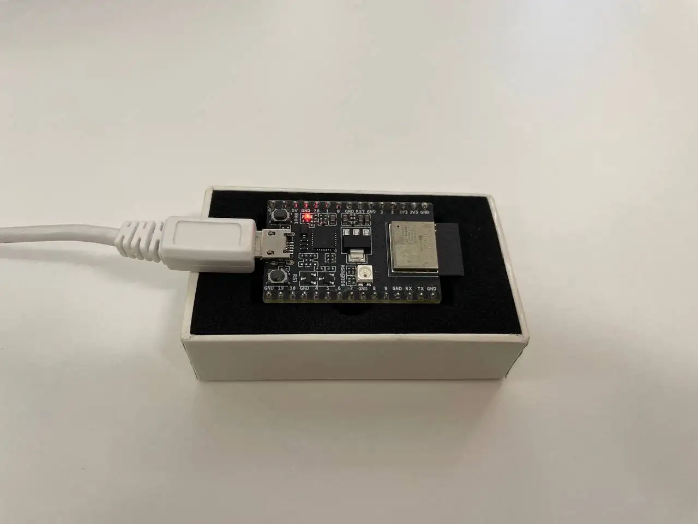


Connect the USB cable to your Espressif SoC and open up the Device Manager. (Window's Icon > Search for "Device Manager")

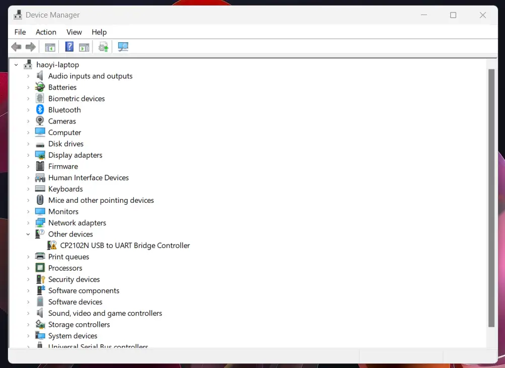

Under *Other devices*, there is an entry called `CP2102N USB to UART Bridge Controller` with a warning icon, this is normal. This implies that the computer is unable to communicate with the SoC just yet. Hence it is necessary to install the driver.

#### 1.2 Get the driver files

Navigate to [CP210x USB to UART Driver page](https://www.silabs.com/developers/usb-to-uart-bridge-vcp-drivers).

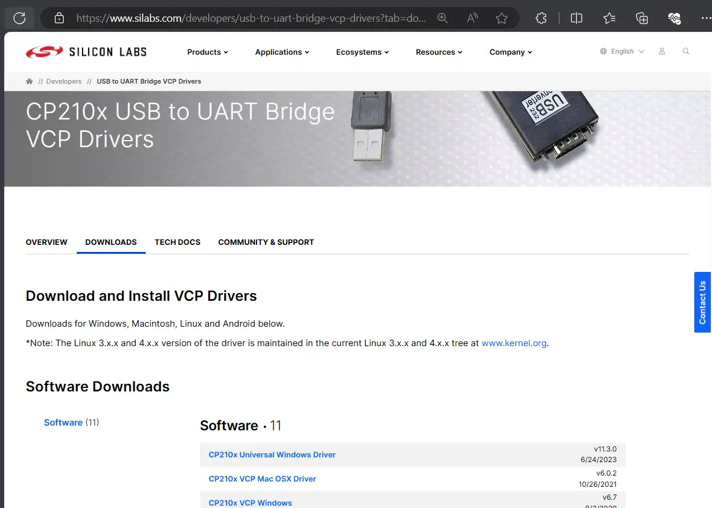

Under the *Downloads* tab, select the *CP210x Universal Windows Driver*, this will download the drivers in a zip file.

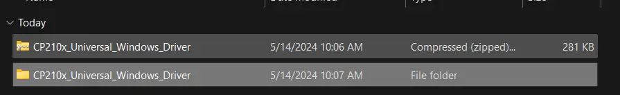

Navigate to the downloaded zip file, and unzip it.

#### 1.3 Install the driver

Go back to the Device Manager, right click on the "CP2102N USB to UART Bridge Controller", and click update driver.

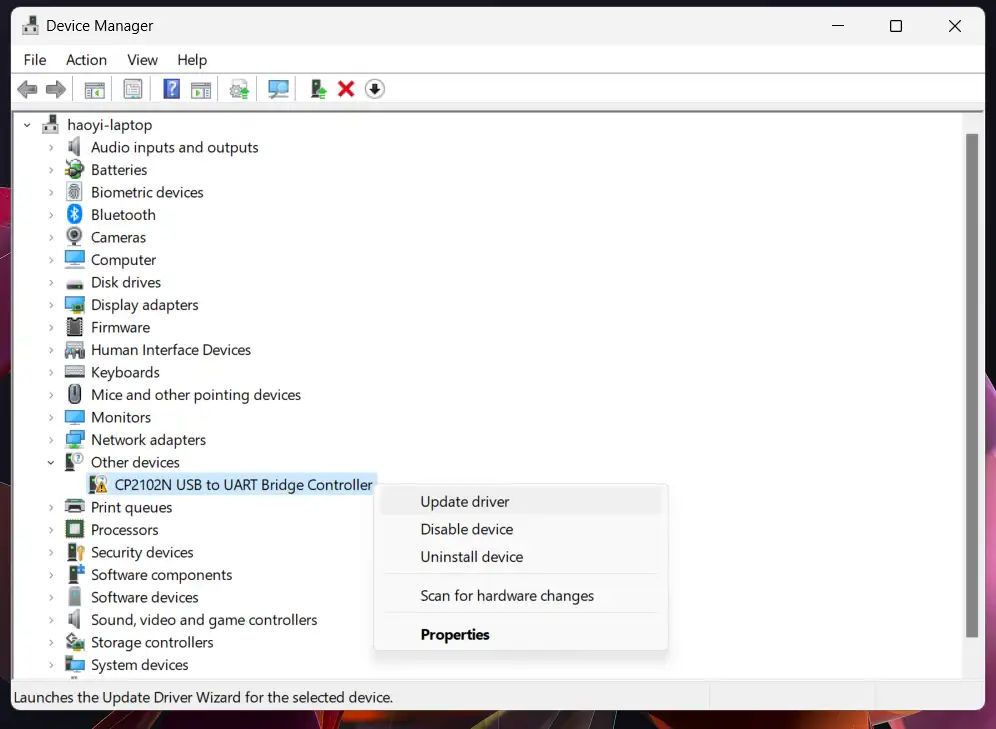

Next, as the driver files have been downloaded and extracted, select the option "Browse my computer for drivers"

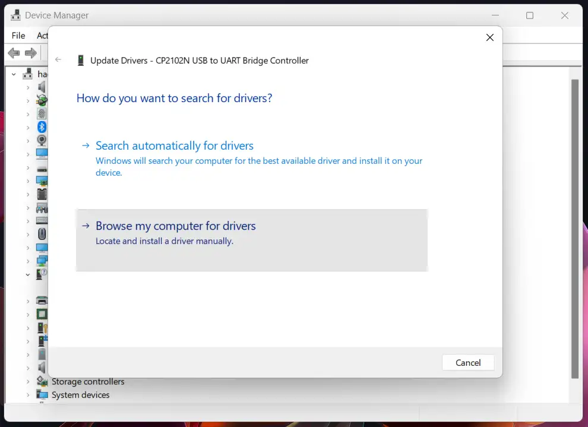

Next, select the *top level driver file* (CP210x_Universal_Windows_Driver) and click next.

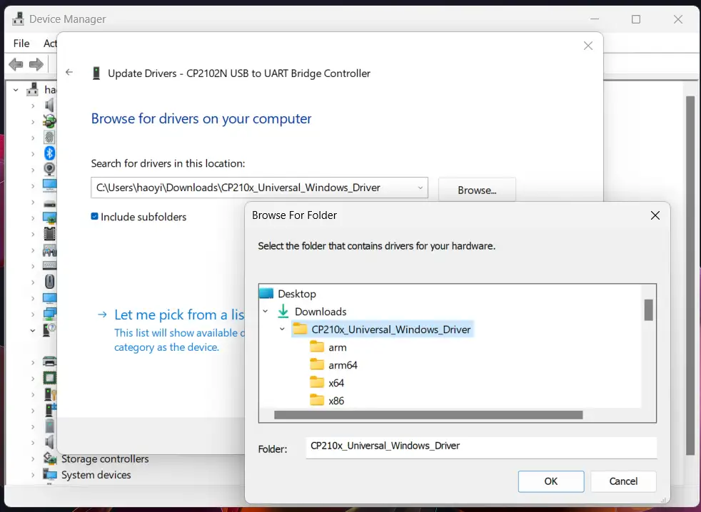

The driver will be installed and you should see the following message.

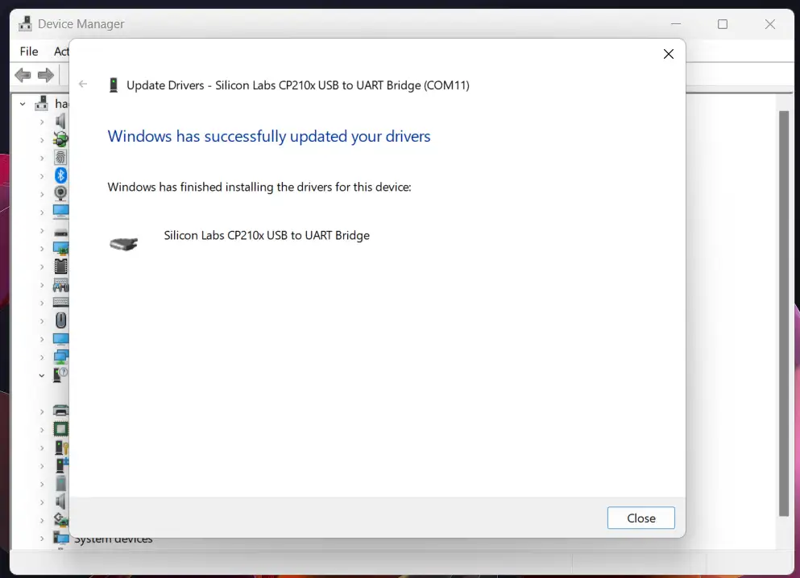

Close the pop up. In the device manager, we can see that the entry for the SoC is now updated. It should appear as below.


The entry will specify which *COM Port* number is connected to the SoC. Try to disconnect and reconnect to double-check the port number.


Take note of which COM Port the Espressif SoC is connected to. This will be important when uploading the application in the later steps. The port can differ across different computers.


For the rest of this guide, `COMx` will refer to the COM port that the Espressif SoC is connected to.

### Step 2: Install the ESP-IDF

Navigate to the [ESP-IDF Programming Guide](https://docs.espressif.com/projects/esp-idf/en/stable/esp32/get-started/index.html#manual-installation). Under `Manual Installation`, select the guide that corresponds to your operating system.

#### For Linux and macOS

In the [ESP-IDF Getting Started guide](https://docs.espressif.com/projects/esp-idf/en/stable/esp32/get-started/linux-macos-setup.html), complete *Step 1. Install Prerequisites* to *Step 4. Set up the Environment Variables*. We will continue on the running the blink example in the next step.

#### For Windows

Under the [installation guide for Windows](https://docs.espressif.com/projects/esp-idf/en/stable/esp32/get-started/windows-setup.html), as shown in the image below, select *Windows Installer Download*, then *Online Universal Installer*, and run the executable file.


Follow through with the installation step, the installation can be customized if needed (for example: select another destination for installation)

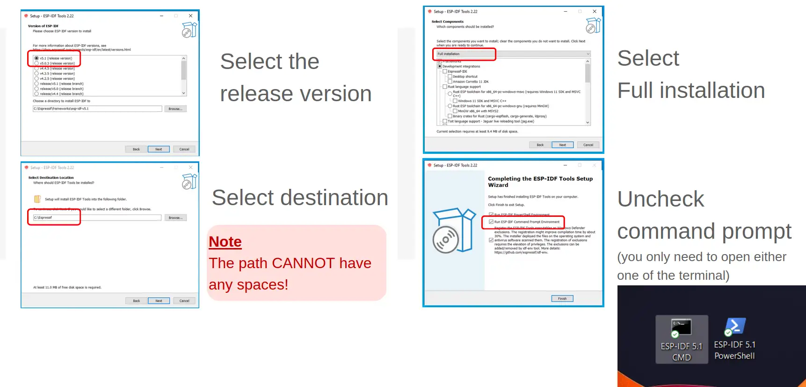

Once the command prompt icon is available on the desktop screen, we will have the necessary application to program the Espressif SoC!

### Step 3: Learn ESP-IDF file hierarchy

#### For Linux and macOS

Open the terminal and navigate to the ESP-IDF directory (should be located at `~/esp` if you didn't change the settings proposed in the installation guide).

#### For Windows

Click on the ESP-IDF terminal icon (either one is fine).

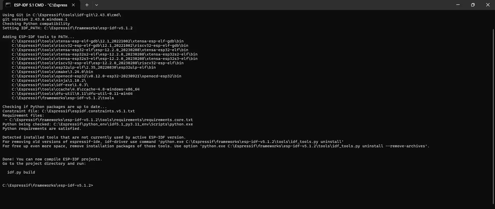

The output above is normal, the terminal is setting up the environment necessary to develop on the SoC.

#### 3.1 Listing the IDF

> For this section of the guide, we will be showing the output using the Windows terminal. There shouldn't be much difference for Linux and macOS.

On the Windows terminal, run `dir`. (`ls` for Linux and macOS user), below is the expected output.

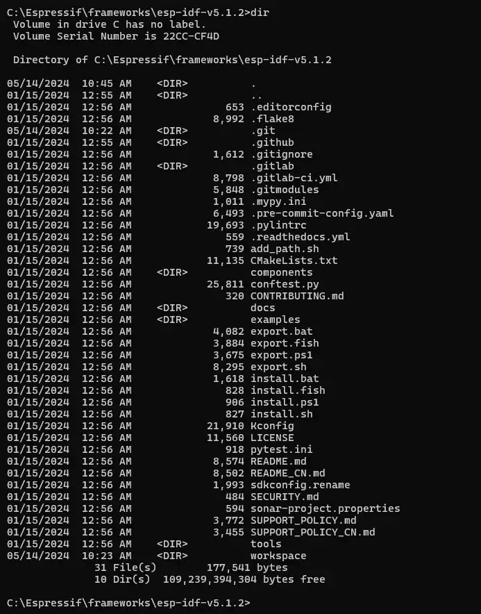

As you can see, the folders here repeat the folders in the [ESP-IDF Github repository](https://github.com/espressif/esp-idf).

#### 3.2 Go to the project directory

We will be running the blink example, which is located under `examples > get-started > blink`.

Run `cd examples\get-started\blink` to change directory into the blink project. Listing the directory will show the following output:

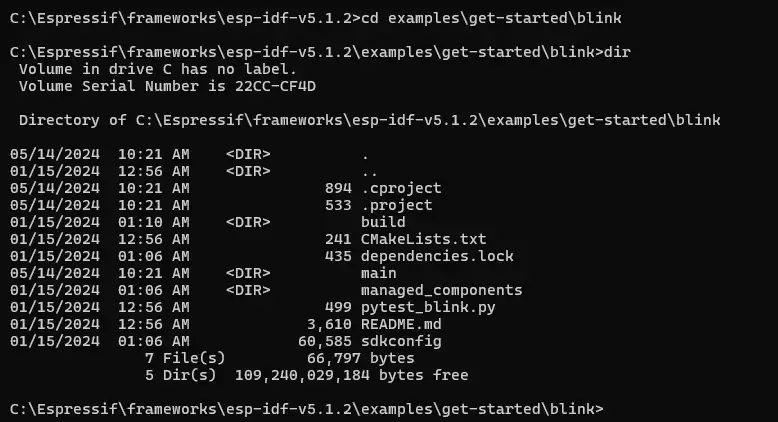

For an overview of the components in the project directory, see the [explanation here](https://docs.espressif.com/projects/esp-idf/en/stable/esp32/api-guides/build-system.html#example-project).


### Step 4: Run the blink example
We will now go through the workflow for uploading and running a sample project.

#### 4.1 Set the target SoC
We will first configure the IDF such that the project will be build for the specific target (SoC) that we have.


For this example, we are using an *ESP32-C3-DevKitM-1*. Hence, in the terminal, run `idf.py set-target esp32c3`


**Note:** Remember to change the argument for `set-target` according to the hardware available!

For example, if an ESP32-S3 development board is used, you need to run `idf.py set-target esp32s3` instead.



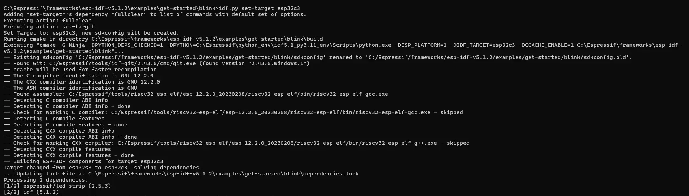

It is important to set the chips now to avoid encountering errors while uploading the binaries to the SoC.

For more information on target selection, see [here](https://docs.espressif.com/projects/esp-idf/en/stable/esp32/api-guides/tools/idf-py.html#selecting-idf-target)


#### 4.2 Build the binaries

Next, we need to build our blink example project to get a binary.

In the terminal, go to the root of your project directory (in this case, the *blink* folder), and run `idf.py build`.

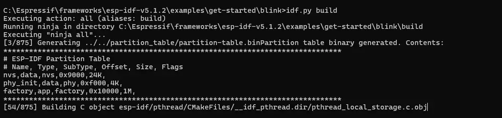


All the relevant source code and dependencies will compile at this stage. Pay attention to the line `Project build complete. To flash, run this command:` near the end of the output.

At this stage, any syntatic errors or dependencies errors will be flagged out by the compiler if the build fails. The `build` stage will compile the source code into an executable program for the Espressif SoCs.

For more information on the `build` command, see [here](https://docs.espressif.com/projects/esp-idf/en/stable/esp32/api-guides/tools/idf-py.html#build-the-project-build)


#### 4.3 Upload the binaries to the Espressif SoC

Next, we will upload the binaries to the Espressif SoC.

In the terminal, run `idf.py -p COMx flash`

> Note: Windows: Please enter the COM Port number available from the device manager in [step 1.3](#13-install-the-driver). For this example, the COM port used is COM11, but the COM Port number might be different across devices.

> Note: Linux and macOS users should replace `COMx` with the serial port to which the board is connected. The serial ports have the following naming patterns.
>
> - Linux: starting with `/dev/tty`
> - macOS: starting with `/dev/cu`


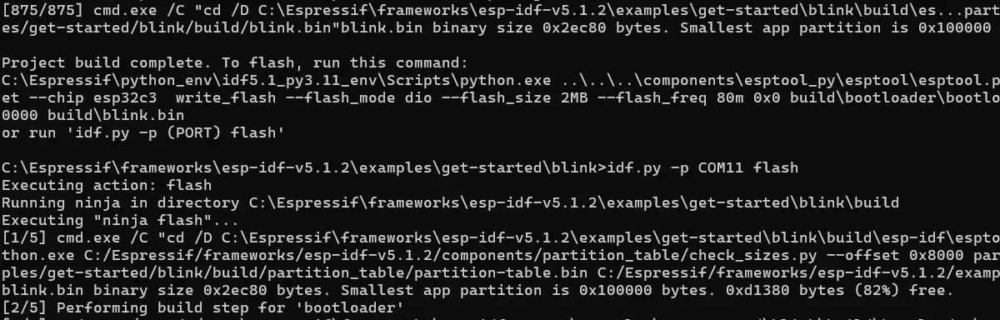

If the flashing is successful, the following should be observed:

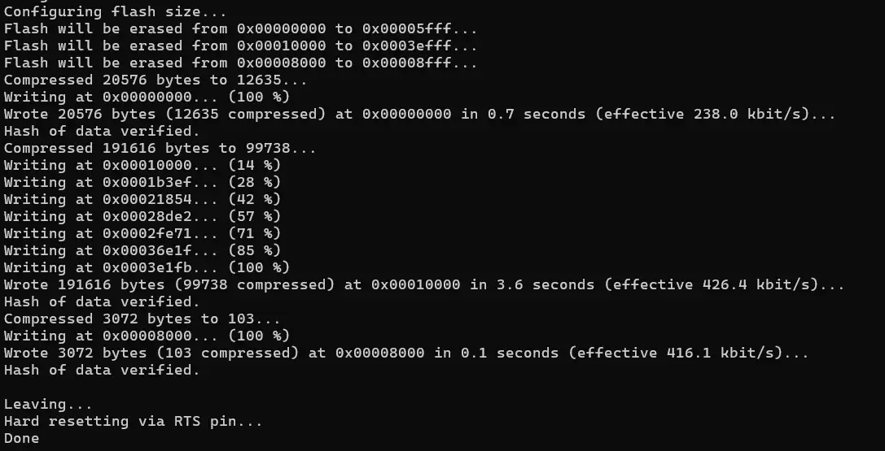

#### 4.4 View the console output of the Espressif SoC

To view the serial monitor:
- Windows: run `idf.py -p COMx monitor`
- Linux: run `idf.py -p /dev/ttyx monitor`
- macOS: run `idf.py -p /dev/cu.x monitor`

For the above, `x` refer to the serial port connected to the Espressif SoC. Try to disconnect and reconnect to double-check the port number.

> For Windows: check the port number via the Device Manager
>
> For Linux: run `ls /dev/tty*` to list the serial ports
>
> For macOS: run `ls /dev/cu.*` to list the serial ports

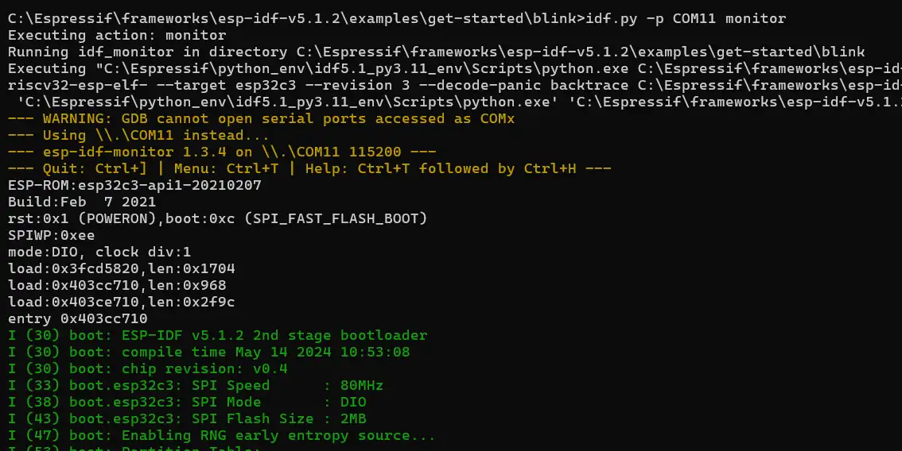

For the blink example, the output should correspond to the LED blinking on the Espressif SoC.

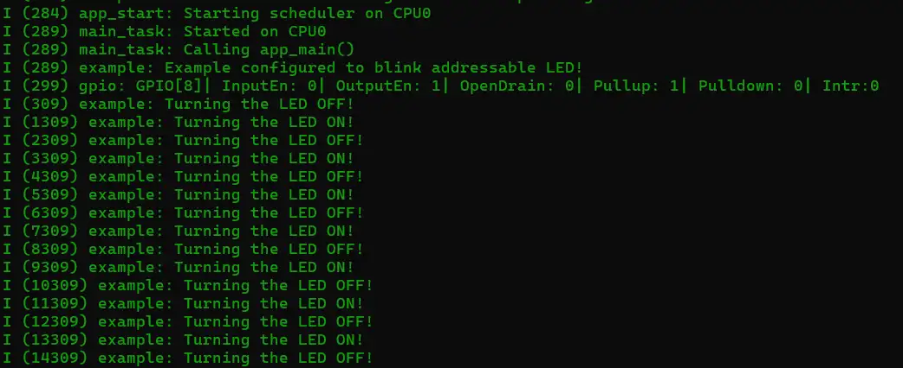

To exit from the serial monitor, the key combination is `Ctrl` + `]`.

> Quick tip: the commands can be run in sucession such as `idf.py build flash monitor`

## Code Reference
<!--
- **Code Reference:**
  - Provide the code in whole.
  - Explain why the code is written in a certain way and why it's called.
  - Provide expected output if the portion of code is run.

-->
Here is a brief overview of the example code under `blink/main/blink_example_main.c`

```c
void app_main(void)
{

    /* Configure the peripheral according to the LED type */
    configure_led();

    while (1) {
        ESP_LOGI(TAG, "Turning the LED %s!", s_led_state == true ? "ON" : "OFF");
        blink_led();
        /* Toggle the LED state */
        s_led_state = !s_led_state;
        vTaskDelay(CONFIG_BLINK_PERIOD / portTICK_PERIOD_MS);
    }
}
```

*`void app_main(void)`*

This is the main entry point of the project.


*`configure_led()`*

This is a function that initializes the hardware required to blink the LED.


## Conclusion
<!--
- ** Next tutorial **
  - Link to the subsequent sub-module
-->

Throughout this guide, we've explored the capabilities of the Espressif IoT Development Framework (ESP-IDF) and the Espressif SoCs.

We've delved into the installation of the VCP driver. We've also installed ESP-IDF's prerequisites using the ESP-IDF Tools installer. Moreover, we explored the ESP-IDF environment, where we walked through the different steps in building, uploading, and running a simple application on an Espressif development board!

By following this guide, we have gained a deeper understanding of the Espressif SoCs and ESP-IDF, and how they can be leveraged to build efficient and powerful IoT applications. We hope this knowledge serves as a solid foundation for any future project with the Espressif hardware!

Feel free to explore the [other examples](https://github.com/espressif/esp-idf/tree/master/examples) available in ESP-IDF and explore what Espressif SoCs can offer! Also, check out various solutions offered by Espressif to build even more impressive projects!

If you would like to understand more about how ESP-IDF is structured and how to build even more robust applications with it, feel free to check out the Espressif Developer Conference 2023 Talk on the topic [here](https://youtu.be/J8zc8mMNKtc?si=sr59c2lNmPmd4WtF).

## Error & Troubleshooting
<!--
- **Error & Troubleshooting:**
  - Include possible errors that users can encounter and the ways to solve them.
  - Continuously update this section based on comments under the guide and feedback from workshops.
-->
Here are some common errors:

### Error 1: Gibberish output during monitor
- Some may encounter random garbage output after running `idf.py monitor`
- To resolve:
  - Exit the monitor
  - Run `idf.py menuconfig`
  - Select `Component Config` > `Hardware Settings` > `Main XTAL Config` > `Main XTAL Frequency`
  - Set `CONFIG_XTAL_FREQ_SEL` to 26 MHz
  - Build and flash the application again.

Some other errors are also described in the [ESP-IDF Programming Guide](https://docs.espressif.com/projects/esp-idf/en/stable/esp32/get-started/windows-setup.html#additional-tips).


## References

<!--
- **References:**
  - Links to references on the protocol in discussion.
  - Github example
  - ESP Docs

-->
- **References:**
    - [ESP-IDF Programming Guide](https://docs.espressif.com/projects/esp-idf/en/stable/esp32/index.html)
    - [ESP-IDF Github Repository](https://github.com/espressif/esp-idf/tree/master)
    - [Espressif Developer Conference 2023: ESP-IDF Getting Started](https://youtu.be/J8zc8mMNKtc?si=sr59c2lNmPmd4WtF)
