# Getting started with ESP IDF


## 1. Learning Objective:
<!--
- **Learning Objective:** Outline the topic in discussion and what kind of project the user can expect at the end of the guide.
-->
This tutorial serves as a complete guide for an introduction to the ESP-IDF development with the ESP32 DevKit.

By the end of this tutorial, we will be able to:
- Understand how the ESP-IDF works
- Able to setup the IDF
- Able to run a simple program on an ESP32 DevKit

  
## 2. Recommended prerequisite:
<!-- 
- **Prerequisite:** List out the knowledge that the reader is assumed to know prior to starting the guide.
  - Previous guides that would provide the prerequisite knowledge:
-->
<!-- Links to the prerequisite guides:
- [Prerequisite 1](link)
- [Prerequisite 2](link) -->
This tutorial serves as the foundation of all the other tutorials using ESP, hence there are no prerequisite for this tutorial.

## 3. Introduction:
<!--
- **Introduction:** Provide background knowledge and description of the protocol/technology involved.
- When the protocol/solution is established
- Necessity of the protocol
- In what situations that the protocol is used
-->
ESP-IDF is Espressif's official IoT Development Framework for the ESP32 series of SoCs. It provides a self-sufficient SDK for any generic application development on these platform.

The primary programming language used on ESP-IDF will be C. Language support for other languages C++ and R are available and will be described in other guides. 

### Requirements:
This tutorial will be using the following software:
- ESP-IDF version 5.2.1 

This tutorial will be using the following hardware
- 1x ESP32-C3-DevKitM-1
- 1x USB wire to connect the computer to the ESP32 DevKit

#### Note:
The tutorial is compatible with any other ESP32 series SoCs. Just be mindful during the setup process that the command might be slightly different for other SoCs, it will be highlighted in the guide.

## 4. Step-by-step Guide:
<!--
- **Step 1: Setting Up the Project**
  - Describe setting up a blank project.
- **Step 2: Project Description**
  - Describe the project and the steps in which the project will be built.
- **Step 3: Building the Project**
  - Describe building the project in steps, provide code snippets
  - Include checkpoints where readers can run a partial project & look at the output.
  - This is to ensure that the reader is following along the guide and to be able to detect errors early in the project.

** Important! Remember to include notes if 
- there are differences in
-->

### Step 1: Installing the relevant drivers (Windows only)

The first step in running application on the ESP32 DevKits is to ensure that the computer is able to recognize and communicate with the SoCs. For those using the Windows Operating System, this involves installing the relevant driver.

> Note: 
> For Linux and MacOS computer, this step is not necessary. Kindly proceed to [Step 2](#step-2-installing-the-prerequisite)

#### 1.1 Connecting the Devkit
We first check if the computer is able to recongnize the SoCs. 

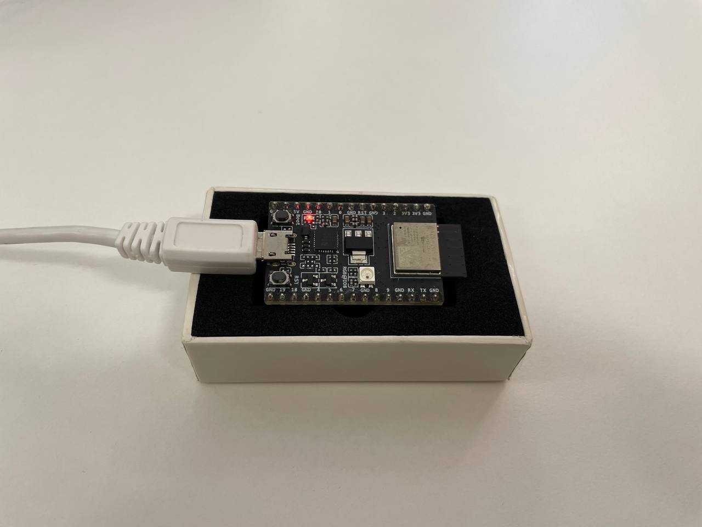


Connect the USB to the ESP32 DevKit and open up the Device Manager. (Window's Icon > Search for "Device Manager") 

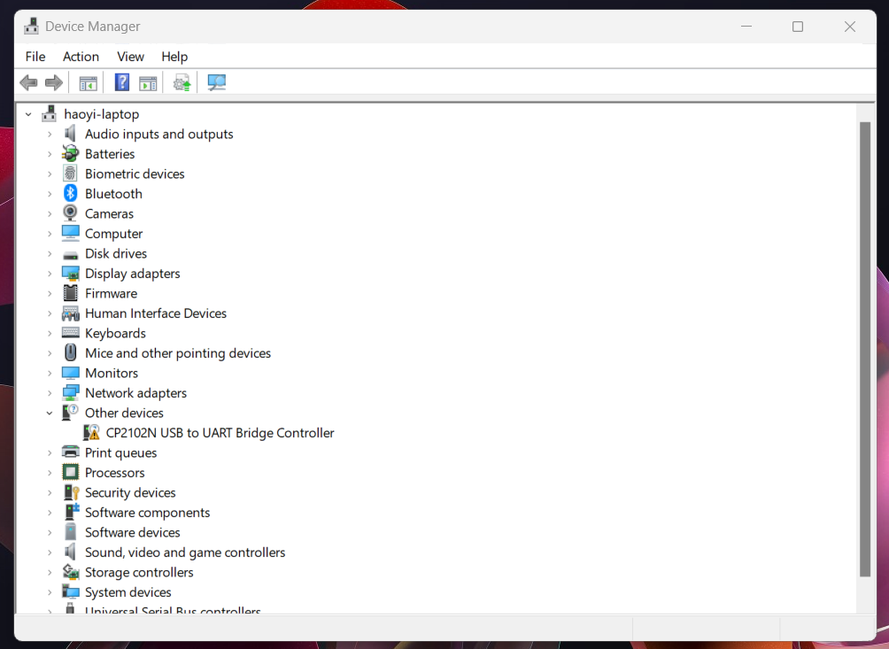

Under *Other devices*, there is an entry called "CP2102N USB to UART Bridge Controller" with a warning icon, this is normal. This implies that the computer is unable to communicate with the SoC just yet. Hence it is necessary to install the driver.

#### 1.2 Getting the driver files

Navigate to [CP210x USB to UART Driver page](https://www.silabs.com/developers/usb-to-uart-bridge-vcp-drivers). 

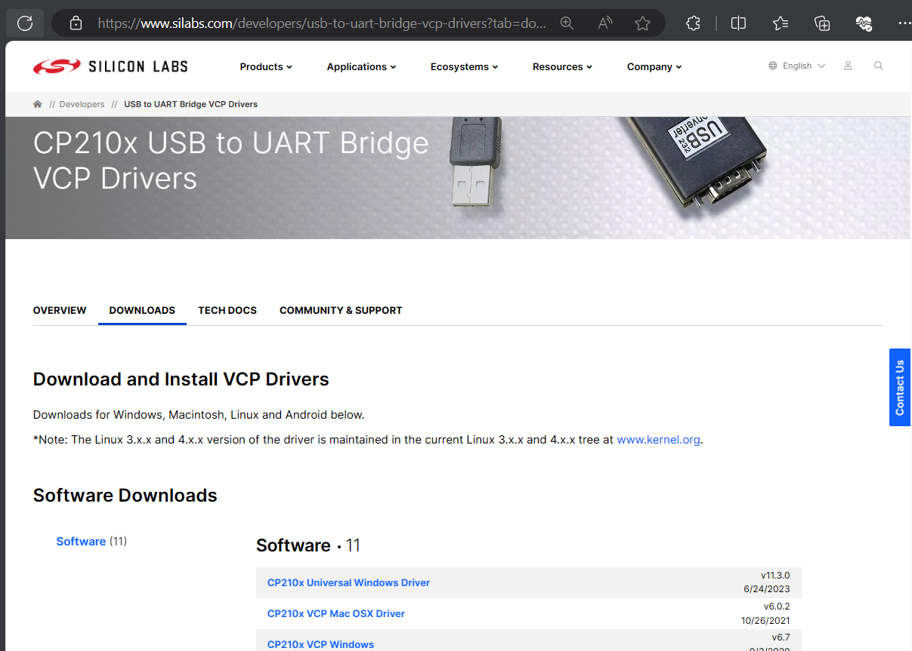

Under the *Downloads* tab, select the *CP210x Universal Windows Driver*, this will download the drivers in a zip file.

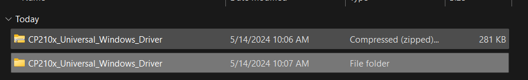

Navigate to the downloaded zip file, and unzip it. 

#### 1.3 Installing the driver

Go back to the Device Manager, right click on the "CP2102N USB to UART Bridge Controller", and click update driver.

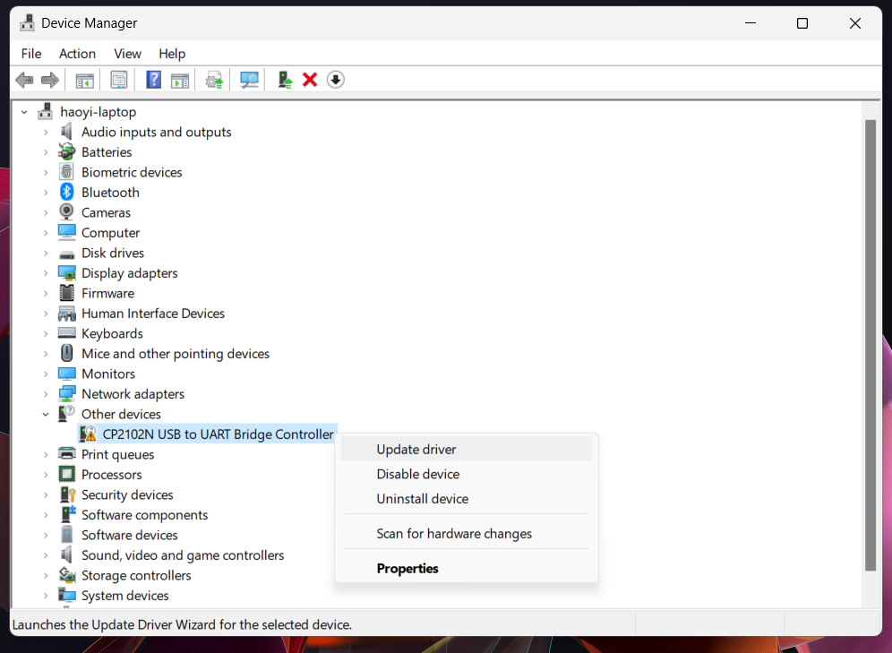

Next, as the driver files have been downloaded and extracted, select the option "Browse my computer for drivers"


Next, select the *top level driver file* (CP210x_Universal_Windows_Driver) and click next.

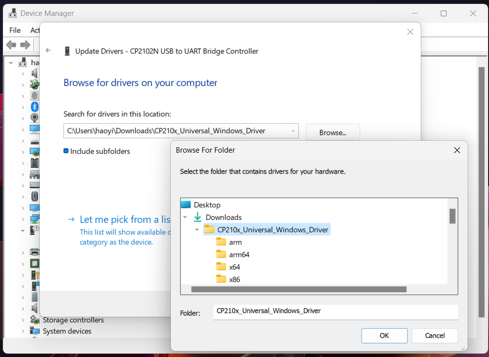

The driver will be installed and you should see the following message.

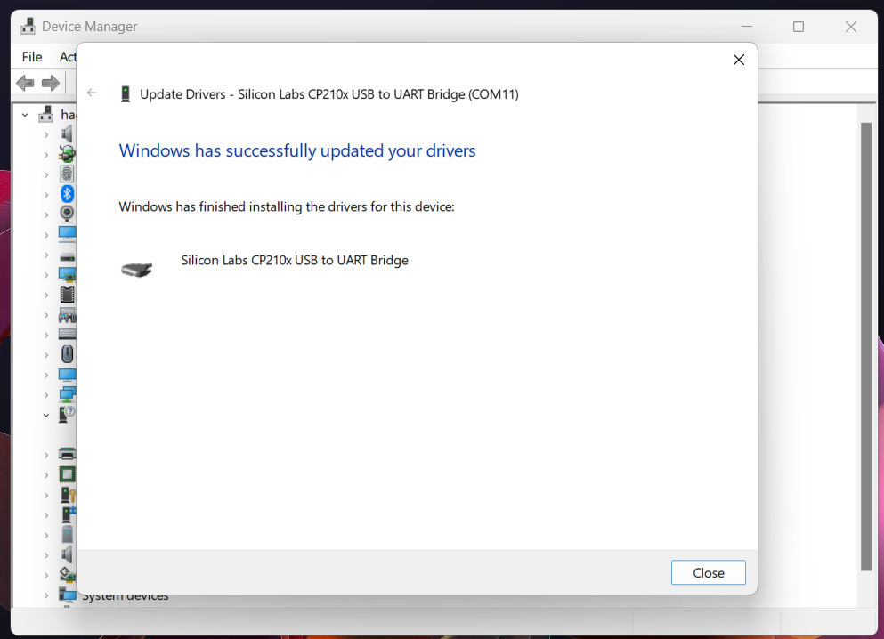

Close the pop up. In the device manager, we can see that the entry for the SoC is now updated. It should appear as below.

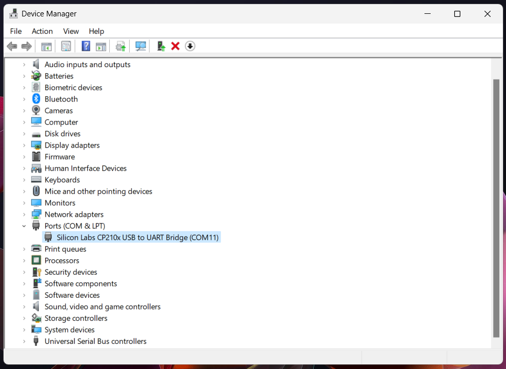

The entry will specify which *COM Port* refers to the SoC connect to the computer. (Do try to disconnect and reconnect to double check) 

Do take note which COM Port the ESP32 DevKit is connected to as this will be important when uploading the application in the later steps. The port can differ across different computers. 

> Note: 
> For subsequent part of this guide, `COMx` will refer to the COM port that the ESP32 DevKit is connected to.

### Step 2: Installing the ESP-IDF 

Navigate to the [ESP-IDF programming guide](https://docs.espressif.com/projects/esp-idf/en/stable/esp32/get-started/index.html). Under "Manual Installation", select the guide that correspond to your operating system.

#### For Linux and macOS

Kindly follow the steps outlined in the [ESP-IDF guide](https://docs.espressif.com/projects/esp-idf/en/stable/esp32/get-started/linux-macos-setup.html) until *Step 4. Set up the Environment Variables*. We will continue on the running the blink example in the next step.

#### For Windows

Under the [installation guide for Windows](https://docs.espressif.com/projects/esp-idf/en/stable/esp32/get-started/windows-setup.html), select the Online Universal Installer and run the executable file. 

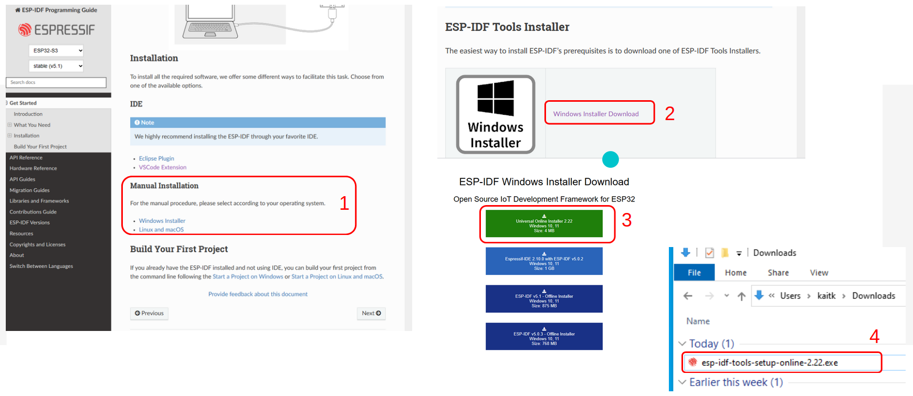

Follow through with the installation step, the installation can be customized if needed (for example: selecting another destination for installation)


Once the command prompt icon is available on the desktop screen, we will have the necessary application to program the ESP32 DevKits!

### Step 3: Understanding the ESP-IDF file hierarchy

#### For Linux and macOS

Open the terminal and navigate to the ESP-IDF directory (should be located at `~/esp` if there are no deviation from the installation guide).

#### For Windows

Click on the ESP-IDF terminal icon (either one is fine).


The output above is normal, the terminal is setting up the environment necessary to develop on the SoC.

#### 3.1 Listing the IDF

> For this section of the guide, we will be showing the output using the Windows terminal. There should not be much deviation of the output for Linux and macOS user.

On the windows terminal, run `dir`. (`ls` for Linux and macOS user), below is the expected output.


We can notice that the folder here are exactly the same as the ones on the [ESP-IDF Github repository](https://github.com/espressif/esp-idf). 

#### 3.2 Navigating to the project directory

We will be running the blink example, which is located under `examples > get-started > blink`.

Run `cd examples\get-started\blink` to change directory into the blink project. Listing the directory will show following output.

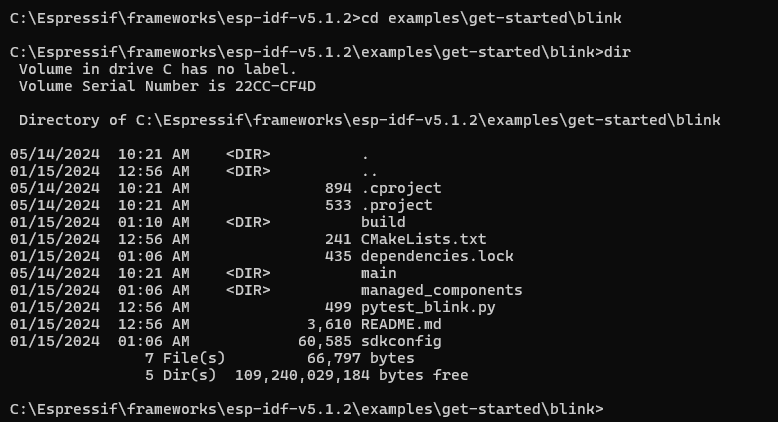

For an overview of the different component in the project directory, kindly refer to the [explanation here](https://docs.espressif.com/projects/esp-idf/en/stable/esp32/api-guides/build-system.html#example-project).


### Step 4: Running the blink example
We will now go through the workflow in uploading and running a sample project.

#### 4.1 Setting the target SoC
We will first configure the IDF such that the project will be build for the specific target(chip) that we have.


For this example, we are using an ESP32C3 DevKit. Hence, in the terminal, run `idf.py set-target esp32c3`

> Note:
> Remember to change the argument to `set-target` according to the hardware available! 
> For example, if an ESP32-S3 DevKit is used, you need to run `idf.py set-target esp32s3` instead

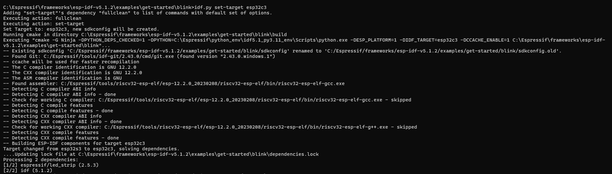

It is important to set the chips now to avoid encountering errors when trying to upload the binaries to the SoC.

For more information on target selection, [see here](https://docs.espressif.com/projects/esp-idf/en/stable/esp32/api-guides/tools/idf-py.html#selecting-idf-target)


#### 4.2 Building the binaries

Next, we will need to compile our blink example project into the binaries.

In the terminal, run `idf.py build`.
 


> Note: 
> Run this command at the top level project directory (In this case, the *blink* folder).

The projects will compile all the relevant source code and dependencies at this stage. Do look out for the line "Project build complete. To flash, run this command:" near the end of the output.


#### 4.3 Uploading the binaries to the ESP32 DevKit

Next, we will upload the binaries to the ESP32 DevKit.

In the terminal, run `idf.py -p COMx flash`

> Note: Please enter the COM Port number available from the device manager in [step 1.3](#13-installing-the-driver). For this example, the COM port used in COM11, but the COM Port number might be different across devices.

> Linux and macOS user should replace `COMx` with the serial port which the board is connected. The serial ports have the following naming patterns.

> Linux: starting with `/dev/tty`

> macOS: starting with `/dev/cu`


If the flashing is successful, the following should be observed:

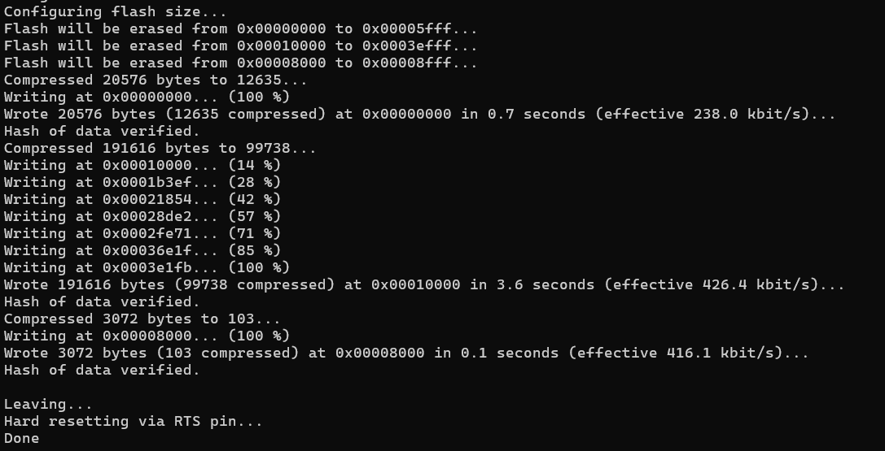

#### 4.4 Viewing the console output of the ESP32 DevKit

To view the serial monitor, run `idf.py -p COMx monitor`


For the blink example, the output should correspond to the blinking of the led on the ESP32 DevKit.

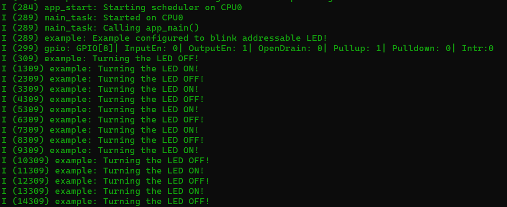

To exit from the serial monitor, the key combination is `Ctrl` + `]`.

> Quick tip: the commands can be run in sucession such as `idf.py build flash monitor`

## 5. Code Reference:
<!--
- **Code Reference:**
  - Provide the code in whole.
  - Explain why the code is written in a certain way and why it's called.
  - Provide expected output if the portion of code is run.

-->
Here is a brief overview of the example code under `blink/main/blink_example_main.c`

```c 
void app_main(void)
{

    /* Configure the peripheral according to the LED type */
    configure_led();

    while (1) {
        ESP_LOGI(TAG, "Turning the LED %s!", s_led_state == true ? "ON" : "OFF");
        blink_led();
        /* Toggle the LED state */
        s_led_state = !s_led_state;
        vTaskDelay(CONFIG_BLINK_PERIOD / portTICK_PERIOD_MS);
    }
}
```

### 5.1 `void app_main(void)`

This is the main entry point of the project.


### 5.2 `configure_led()`

This is a function that initialize the hardware required for blinking the led.


## 6. Conclusion
<!--
- ** Next tutorial **
  - Link to the subsequent sub-module 
-->

Throughout this guide, we've explored the capabilities of the Espressif IoT Development Framework (ESP-IDF) and the ESP32 SoCs. 

We've delved into the installation of VCP driver. We've also installed ESP-IDF's prerequisites with the ESP-IDF Tools installer. Moreover, we explored the ESP-IDF environment, where we walked through the different steps in building, uploading and running a simple programme on the ESP32 DevKit!

By following this guide, we have gained a deeper understanding of the ESP32 SoC and the ESP-IDF, and how they can be leveraged to build efficient and powerful IoT applications. We hope this knowledge serves as a solid foundation for any future project with ESP32 SoC!

Do feel free to explore the [other examples](https://github.com/espressif/esp-idf/tree/master/examples) available on the ESP-IDF and explore what ESP32 SoCs may offer! Also, do to check out the various solutions offered by Espressif to build ever more impressive projects!

If you would like to understand more about how ESP-IDF is structured and how to build even more robust applications with the ESP-IDF, feel free to check out Espressif Developer Conference 2023 Talk on the topic [here](https://youtu.be/J8zc8mMNKtc?si=sr59c2lNmPmd4WtF).

## 7. Error & Troubleshooting:
<!--
- **Error & Troubleshooting:**
  - Include possible errors that users can encounter and the ways to solve them.
  - Continuously update this section based on comments under the guide and feedback from workshops.
-->
Here are some common errors:

### Error 1: Gibberish output during monitor
- Some may encounter random garbage output after running `idf.py monitor`
- To resolve:
  - Exit the monitor
  - Run `idf.py menuconfig`
  - Select `Component Config` > `Hardware Settings` > `Main XTAL Config` > `Main XTAL Frequency` 
  - Set `CONFIG_XTAL_FREQ_SEL` to 26 MHz
  - Build and flash the application again.

Some are the errors are also described on the [ESP-IDF programming guide](https://docs.espressif.com/projects/esp-idf/en/stable/esp32/get-started/windows-setup.html#additional-tips).


## 8. References:

<!--
- **References:**
  - Links to references on the protocol in discussion.
  - Github example 
  - ESP Docs

-->
- **References:**
    - [ESP-IDF Programming Guide](https://docs.espressif.com/projects/esp-idf/en/stable/esp32/index.html)
    - [ESP-IDF Github Repository](https://github.com/espressif/esp-idf/tree/master)
    - [Espressif Developer Conference 2023: ESP-IDF Getting Started](https://youtu.be/J8zc8mMNKtc?si=sr59c2lNmPmd4WtF)
