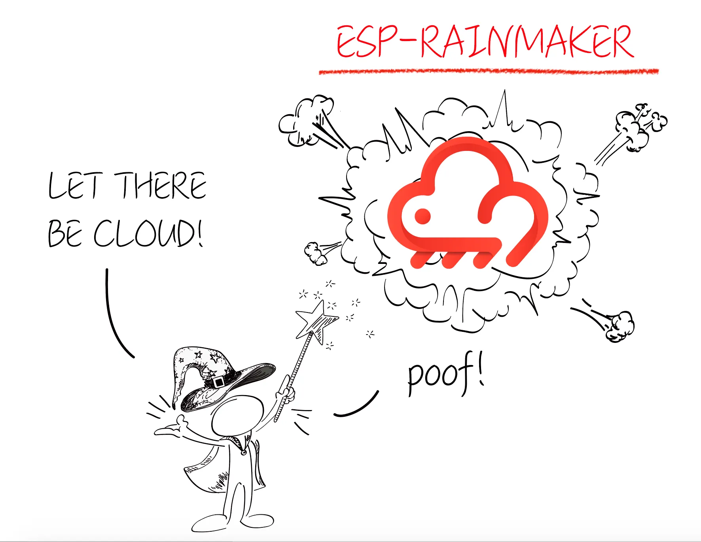
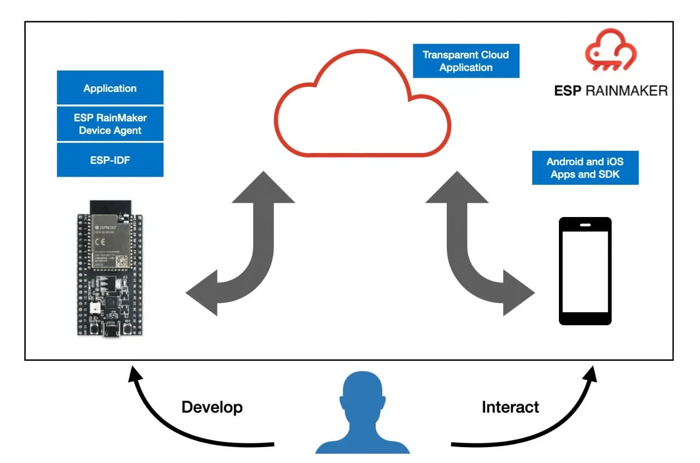
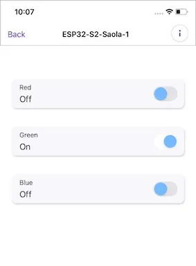
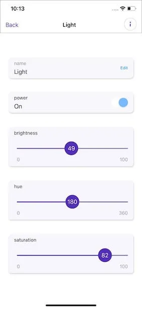

Today we announced [ESP RainMaker](https://rainmaker.espressif.com). This is another step forward for Espressif to enable makers to build connected devices and access them through phone apps, 3rd party services or voice assistants, quickly, without having to manage the infrastructure.

The ESP RainMaker is a collection of [device-agent SDK](https://github.com/espressif/esp-rainmaker), a transparent cloud application and [iOS](https://apps.apple.com/us/app/esp-rainmaker/id1497491540)/[Android](https://play.google.com/store/apps/details?id=com.espressif.rainmaker&hl=en_IN) phone apps. This lets developers write the firmware and instantaneously interact with it through the phone-apps, or through other services.

## Developer Workflow

We are excited about this launch as it gives more power to firmware developers. And I want to talk about this a bit.

As a firmware developer working with RainMaker this is how the workflow looks like:

- You build applications using the goodness of Espressif’s ESP-IDF open-source SDK and the RainMaker Agent.
- You choose to expose any parameters of your device in the application’s firmware that you wish to control externally.
- The RainMaker agent syncs these attributes with the RainMaker cloud. The RainMaker cloud transparently makes the device parameters available to the phone applications and other services. This does not require you to write any code in the cloud. The cloud application is built with AWS Serverless services.
- The RainMaker phone applications then redraw themselves to present the parameters of the devices to the user. Reading or changing these attributes is as easy as toggling a button on the phone.
- The availability of a Python client library lets you access the same parameters through a command-line or through python programs, that you could then link with any other services.

And all of this, without any configuration of the cloud interfaces, or phone apps. All you can continue to focus on is the device firmware.

## Examples

Let’s quickly look at some examples that will make things clearer.

## GPIO

The simplest example is GPIOs. Let’s say you wish to expose some GPIO controls from your device. Your RainMaker code for this will look like:

Basically,

- __esp_rmaker_create_device:__  You define a name for a device and a callback (in this case* gpio_callback*) that will handle the requests when the parameter is modified externally.
- __esp_rmaker_device_add_param:__  You add parameters (or attributes) of the device that you wish to expose. Here we add 3 GPIOs (Red, Green, Blue). We mention that this parameter is of type *bool*. We can create parameters of other data types as well.
- __esp_rmaker_param_add_ui_type:__  Each parameter also includes a UI type that the phone application should use for displaying that parameter. In this case we mention that a UI type “toggle” element should be used.

Correspondingly the phone apps will show the following while accessing the device:

## Light

You can also use other parameter types, for example let’s look at the light example.

In the GPIOs example earlier, we had used a “raw” datatype as *bool*. The RainMaker agent also provides some pre-defined higher level datatypes (standard types). This example uses these higher level APIs for creating the parameters. Note that we could also have written this code using the raw datatype instead, but this is a short-hand utility API.

A list of these standard types is available here: [https://rainmaker.espressif.com/docs/standard-types.html](https://rainmaker.espressif.com/docs/standard-types.html). It also has the corresponding [Standard Types C API](https://docs.espressif.com/projects/esp-rainmaker/en/latest/c-api-reference/rainmaker_standard_types.html#standard-devices) that is used in the code above. We will continue to update this list of standard types as we go along.

The phone apps then redraw themselves to match what is written in the firmware:

## Bridges

You can also easily export multiple “logical devices” within the same ESP32 node. This makes it convenient in cases where your ESP32 acts as a bridge and allows the RainMaker phone apps to interact with these bridged devices.

## More Examples

You can find many other samples in the [esp-rainmaker/examples/](https://github.com/espressif/esp-rainmaker) directory of the ESP RainMaker project.

## Specifications

While we make this infrastructure available, we want to be as transparent as possible about the architecture and the data exchange that flows through the ESP RainMaker infrastructure.

- The ESP32-S2/ESP32 to RainMaker cloud communication details are captured here: [https://rainmaker.espressif.com/docs/node-cloud-comm.html](https://rainmaker.espressif.com/docs/node-cloud-comm.html)
- The RainMaker agent that implements (in the C language) the above protocol is available at: [https://github.com/espressif/esp-rainmaker](https://github.com/espressif/esp-rainmaker)
- The REST APIs exposed by the RainMaker cloud are captured in this swagger documentation: [https://swaggerapis.rainmaker.espressif.com](https://swaggerapis.rainmaker.espressif.com). These APIs are used by the phone apps and the Python library to interact with the RainMaker cloud.
- The Python CLI that uses these APIs is available here: [https://github.com/espressif/esp-rainmaker/tree/master/cli](https://github.com/espressif/esp-rainmaker/tree/master/cli)

Feel free to [reach out to us](https://github.com/espressif/esp-rainmaker/issues) if you have any feedback, requests or suggestions for ESP RainMaker.

## Get started using the ESP RainMaker

Support for ESP-RainMaker is currently enabled for ESP32-S2 SoCs. If you have an ESP32-S2 based development board with you, you can get started with using ESP RainMaker from here: [https://rainmaker.espressif.com/docs/get-started.html](https://rainmaker.espressif.com/docs/get-started.html)

You can also head over to the [ESP RainMaker](https://github.com/espressif/esp-rainmaker) GitHub repository.

We are excited about releasing this, and we hope you find it helpful. We really look forward to what you will do!
