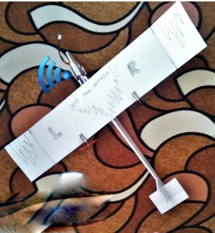
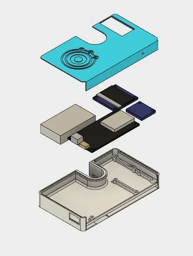

Welcome to our June Newsletter!

Hi everyone,

Our campus recruitment program for 2019 has already started, while we also accept university graduates and experienced professionals during summer 2018. We are delighted to be able to offer several [job opportunities](https://www.espressif.com/en/company/job-opportunities/job-search?title=&field_classification_value=Corporate) to applicants interested in working for our Research and Development, Engineering, Information Technology, Marketing, Business Operation, Documentation, and Human Resources Departments in our Chinese offices and abroad (Pune and Brno branches).

Successful candidates will join teams of specialists in chip design, software/ firmware development, business development and marketing. At Espressif Systems we are passionate about creating state-of-the-art chipsets and enabling our customers to deliver innovative products. Espressif Systems is a multi-national IoT company with a growing business cycle both in China and abroad. This allows us to offer competitive salaries, annual bonuses, comprehensive medical care and health insurance packages, continuing professional development

programs and many more benefits. All this happens in a positive work environment that encourages collaboration, communication and technological innovation.

Furthermore, Espressif Systems is an equal opportunities employer and considers all applicants on the basis of individual merit, regardless of their race, national and ethnic origin, color, religion, age, disability, marital and pregnancy status, gender identity, sexual orientation and any other legally-protected status.

Based on our [recent funding from Intel Capital and the Beijing Singularity Power Investment Fund L.P. (SPC)](https://www.espressif.com/en/media_overview/news/espressif-receives-investment-intel-capital-and-beijing-singularity-power?position=1&list=5Znn2jxt9Y1ovadDbCKX3ypj4HT9GYG3lLxvmuq0cZc), our aim for 2018 is to expand the range of our products, reach new and bigger markets, and deliver our innovative IoT solutions to more people across the world. Our customers, our partners and our supporters are always at the core of our strategic goals. Nothing would be possible without them.

Best wishes, John Lee

Senior Customer Support Officer

## IoT Seminars by Espressif India in Pune

The Indian branch of Espressif Systems is only a few months old, but it is already highly active, organizing IoT seminars for the local community of developers in Pune. The last session was held at the end of May and it focused on FreeRTOS. Due to popular demand, there will be a complementary session on __Saturday__ , __June 9th__ , __from 10:00am to 1:00pm__ , which aims to cover the wide range of questions that could not be tackled during the first two-hour session. Places are limited, so [register now](https://www.meetup.com/Internet-Of-Things-Pune-IoTPune/events/251196679/) to make sure you can attend this seminar.

[Keep Reading](https://www.espressif.com/en/media_overview/news/iot-seminars-espressif-india-pune?position=0&list=OxOJfQt5u21fP9RX6KD3ZFrxXB7dHwD47Yl5qulW-S4)

## ESP8266-based DIY Model Airplane

Imagine you are an aviation enthusiast and you have less than 15 US dollars to spend on your hobby. What can you do? Well, an [ESP8266](https://www.espressif.com/en/products/hardware/esp8266ex/overview)-based IoT solution might be just right for you! [Ravi Butani](http://www.instructables.com/member/RAVI_BUTANI/), an electronics engineer from India, has devised a [remote-controlled light-weight DIY aircraft](http://www.instructables.com/id/WIFI-CONTROLLED-RC-PLANE/), combining his passion about electronics and aviation. What’s more, his project relies on the power of ESP8266.

[Keep reading](https://www.espressif.com/en/media_overview/news/esp8266-based-wifi-controlled-diy-model-airplane?position=0&list=CjctZJoAuosj2ULOA9i94lMku_YCvy4uUrRffPYOTn4)

## “La Cool Co.” Wins 2nd Prize at VivaTech 2018

There is considerable media hype surrounding cryptocurrencies nowadays, not least due to the volatility of their value. Those who have invested in them need to instantly get the latest updates on their value, so that they can plan their next moves accordingly. In response to this reality, [Igor Fonseca Albuquerque](https://www.hackster.io/igorF2) has created a highly versatile gadget that is based on [ESP32](https://www.espressif.com/en/products/hardware/esp32/overview).

[Keep Reading](https://www.espressif.com/en/media_overview/news/esp32-based-smart-wallet?position=2&list=vjy_eO2mVN0qxk8vNZJzln9dRzymrIgMn7Um_cgVU2Q)

## ESP32-based Smart Wallet

There is considerable media hype surrounding cryptocurrencies nowadays, not least due to the volatility of their value. Those who have invested in them need to instantly get the latest updates on their value, so that they can plan their next moves accordingly. In response to this reality, [Igor Fonseca Albuquerque](https://www.hackster.io/igorF2) has created a highly versatile gadget that is based on[ESP32](https://www.espressif.com/en/products/hardware/esp32/overview).

[Keep Reading](https://www.espressif.com/en/media_overview/news/esp32-based-smart-wallet?position=2&list=vjy_eO2mVN0qxk8vNZJzln9dRzymrIgMn7Um_cgVU2Q)

*Originally published at *[*mailchi.mp*](https://mailchi.mp/f500229dfb77/espressif-esp-news-june-2018)*.*
