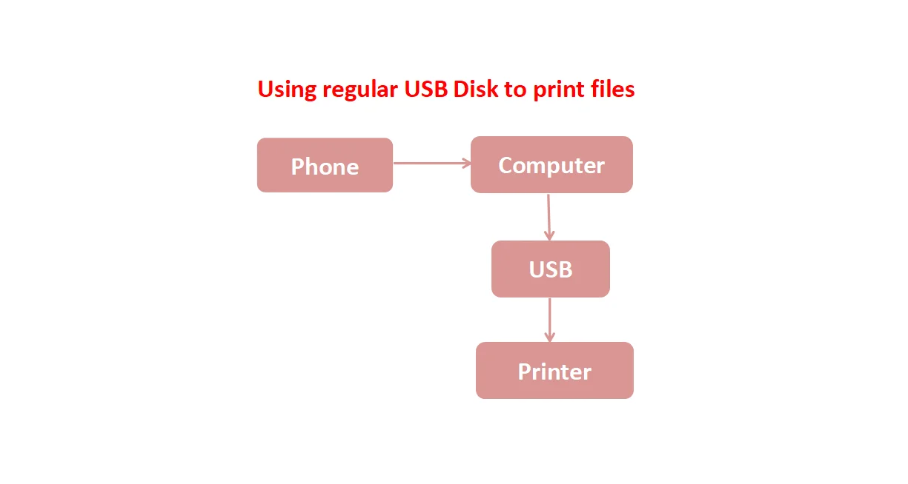

In modern digital life, we often encounter scenarios where data transfer is not flexible or efficient enough, especially when exporting camera photos, printing files, and sharing videos.

In this article, we will have a closer look at the mentioned scenarios and propose a solution - Multi-function USB Dongle based on ESP32-S3.

### Scenario: Exporting Camera Photos

After taking photos with a traditional camera, users typically need to remove the camera's SD card, insert it into a card reader, connect the card reader to a computer, and then export the photos through a series of complicated steps. This process is not only multi-step but also time-consuming and laborious, making it cumbersome for users who value convenience.

### Scenario: Printing files

When printing files, users often need to transfer the file from a phone or camera to a computer first, then copy the files from the computer to a USB drive, and finally insert the USB drive into the printer to print. This process is not only tedious but also prone to errors due to the involvement of multiple devices and media, which affects printing efficiency and user experience.

<figure style="width: 90%; margin: 0 auto; text-align: center;">
    
    <figcaption>Printing Process</figcaption>
</figure>

### Scenario: Sharing Videos with Multiple People

When sharing videos with multiple people, users typically upload the videos to an email service and then enter multiple email addresses for sharing. However, manually entering email addresses is prone to errors and omissions, and email services often have video size limitations, further increasing the complexity of the operation.

Some people may choose Bluetooth technology to share videos, but the Bluetooth pairing process is complicated and the transmission speed is slow, making it unsuitable for quickly sharing large videos.

These scenarios highlight the inconveniences in data transfer between digital devices, especially when multiple steps and devices are involved. As technology advances, there is a growing expectation for more direct and efficient data management and transfer solutions, such as cloud services, wireless printing technologies, and more advanced direct device connectivity features to simplify these processes.

## Overview of ESP-Dongle

The ESP-Dongle is a multifunctional USB device solution based on the Espressif ESP32-S3 module. It not only has a small size but also seamlessly integrates the functions of a USB MSC wireless disk and a USB wireless network card into one device. It also supports dual-function switching via a sliding switch.



## Product Display

### USB MSC Wireless Disk Mode

The ESP-Dongle can be used as an ordinary USB disk. Users can plug the ESP-Dongle directly into a phone and quickly read or write all files on the SD card via USB, supporting saving files from the SD card to the phone. It also supports uploading files from the phone to the SD card.

<figure style="width: 100%; margin: 0 auto; text-align: center;">
    
    <figcaption>USB Disk</figcaption>
</figure>

The ESP-Dongle can also be used as a wireless USB disk to read and write SD card data via Wi-Fi using an HTTP server. Users can power the ESP-Dongle with a power bank and switch to USB wireless mode using the sliding switch. In this mode, the ESP-Dongle will create a Wi-Fi hotspot named `ESP-Wireless-Disk`, allowing multiple phones or computers to connect simultaneously. Users can then browse SD card files or save files to their mobile phones by accessing the ESP-Dongle's HTTP server directly.

<figure style="width: 100%; margin: 0 auto; text-align: center;">
    
    <figcaption>Wireless Disk</figcaption>
</figure>

### USB Wireless Network Card Mode

Users can insert the ESP-Dongle into a printer, connect their mobile phones to the ESP-Dongle's Wi-Fi hotspot, upload files from the phone via the HTTP server interface, and the printer can read the files directly from the ESP-Dongle for printing.

<figure style="width: 100%; margin: 0 auto; text-align: center;">
    
    <figcaption>Printer</figcaption>
</figure>

The ESP-Dongle can also be used as a Wi-Fi or Bluetooth network adapter. Users can switch the ESP-Dongle's working mode to a wireless network card using the button. After plugging the ESP-Dongle into a computer, the computer can be directly connected to the Internet.

<figure style="width: 100%; margin: 0 auto; text-align: center;">
    
    <figcaption>Wi-Fi Adapter</figcaption>
</figure>

## ESP-Dongle Hardware System

The ESP-Dongle is powered through a Type-C port. The hardware system consists of the following parts:

- Main MCU: ESP32-S3-MINI-1-N8
- USB Type-C Port
- SD Card Slot
- LDO Circuit
- Slide Switch
- Tap Button
- LED

## ESP-Dongle Hardware Design

The ESP-Dongle hardware schematic is provided below. For hardware design instructions, please refer to [ESP Hardware Design Guidelines](https://docs.espressif.com/projects/esp-hardware-design-guidelines/en/latest/esp32s3/index.html#esp-hardware-design-guidelines).



Description of different circuit blocks:

  - `USB Type-C`: The differential signal lines D- and D+ of the USB Type-C interface are connected directly to the USB interface of the ESP32-S3. At the same time, the D-, D+, and VUSB pins are protected against electrostatic discharge through ESD protection components to prevent damage from electrostatic discharge. It should be noted that the CC pin requires a 5.1 kΩ pull-down resistor; otherwise, it will not be recognized by the USB host.
  - `LDO`: The HE9073A33M5R is a low dropout voltage regulator (LDO) chip used for power voltage regulation. It can be used for stabilizing the input voltage range from 3.3 V to 7 V and outputting a stable 3.3 V to ensure the stability of the system's power supply.
  - `MicroSD Card`: The SD card interface supports 1-line, 4-line SDIO mode, and SPI mode. To ensure signal stability, each pin needs to be pulled up by a 10 kΩ resistor and use ESD protection devices to prevent damage from electrostatic discharge.
  - `Button`: The button is used to switch the Wi-Fi or Bluetooth network adapter working mode of the ESP-Dongle.
  - `LED`: The LED indicator is used for observing the working status of the ESP-Dongle.
  - `Switch`: The two endpoints of the slide switch are pulled up and pulled down respectively, and the level state is read by GPIO4 to determine the current switch's on/off state. The sliding switch is used to switch between the USB wireless disk or USB wireless network card working modes of the ESP-Dongle.

## Software Implementation

The complete application functionality is a combination of multiple individual application functions. Espressif provides many application examples for user reference and as a starting point for further development.

### USB MSC Wireless Disk Mode

For USB MSC wireless disk application, you can refer to the ESP-IDF example:
- [esp-iot-solution/examples/usb/device/usb_msc_wireless_disk](https://github.com/espressif/esp-iot-solution/tree/master/examples/usb/device/usb_msc_wireless_disk)

The example using ESP32-S3 as a USB Disk with Wireless accessibility. HTTP file server can be used with both upload and download capability.

The implementation uses [espressif/esp_tinyusb](https://components.espressif.com/components/espressif/esp_tinyusb/versions/1.4.4) component for SD Card access via MSC USB device Class, and [espressif/esp32_s3_usb_otg](https://components.espressif.com/components/espressif/esp32_s3_usb_otg/versions/1.6.0) component to develop wireless storage devices, Wi-Fi network cards.

### USB MSC Wireless Network Card Mode

For USB wireless network card application, you can refer to the ESP-IDF example:
- [esp-iot-solution/examples/usb/device/usb_dongle](https://github.com/espressif/esp-iot-solution/tree/master/examples/usb/device/usb_dongle)

The implementation uses [tinyusb_dongle](https://github.com/espressif/esp-iot-solution/tree/master/examples/usb/device/usb_dongle/components/tinyusb_dongle) component to support USB Host to surf the Internet wirelessly via USB-ECM/RNDIS, and support hot swap.

As one of the simplest output peripherals, LED indicators can indicate the current operating state of the system by blinking in different types. For LED indicator application, you can use the [espressif/led_indicator](https://components.espressif.com/components/espressif/led_indicator/versions/0.9.3) component which can help you define multiple groups of different blink types. For more instructions, please refer to [LED Indicator User Guide](https://docs.espressif.com/projects/esp-iot-solution/en/latest/display/led_indicator.html).

## Recommended documents

- [USB Device Stack](https://docs.espressif.com/projects/esp-idf/en/v5.3.1/esp32s3/api-reference/peripherals/usb_device.html#usb-device-stack)
- [Wi-Fi Driver Programming Guide](https://docs.espressif.com/projects/esp-idf/en/v5.3.1/esp32s3/api-guides/wifi.html#wi-fi-driver)
- [HTTP Server Programming Guide](https://docs.espressif.com/projects/esp-idf/en/v5.3.1/esp32s3/api-reference/protocols/esp_http_server.html#http-server)
