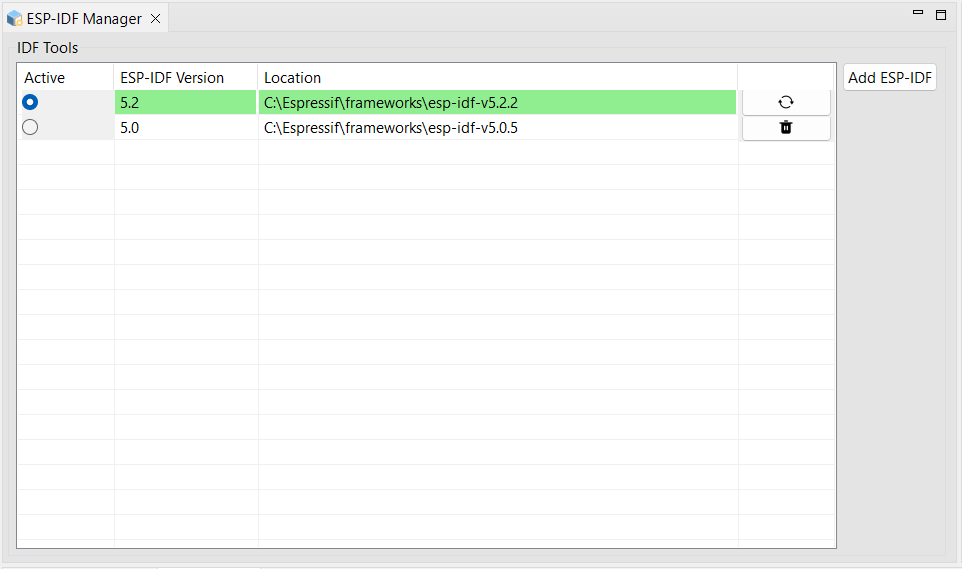

## 1. Installation

I have been playing with the newest version of Espressif IDE. It's probably the best way to get started with ESP-IDF, especially for beginners.

The installer encapsulates entire installation process including:

- IDE itself - of course!
- Latest version of ESP-IDF
- All the necessary tools
- All necessary drivers

Theoretically nothing could go wrong, and probably won't go wrong for somebody who never installed ESP-IDF on their system before.

Unfortunately for me the new setup interfered with some remaining bits of previous installation of Espressif-IDE / ESP-IDF. I had to figure it out and manually add ESP-IDF that was previously installed by the installer.

## 2. Managing ESP-IDF Installations

This is something I had to use immediately to fix the issues I had with previous installations.
Fortunately **ESP-IDF Manager** works well, and I was able to add existing ESP-IDF (the same that was installed by the setup) here, what fixed all my problems.

There are some minor issues that could be mentioned and fixed in upcoming versions, for instance:

- **Add ESP-IDF** button suggest that it can be used to add (existing?) ESP-IDF, it would be nice to have separate button **Add** and **Install**.
- **Reload** button is a bit mysterious, it's hard to understand what it actually means

## 3. Creating a New Project

## 4. Playing with Components

## 5. GitHub source code

Source code for this project can be found in the following address:

https://github.com/raffarost/espresso

## 7. Contact info

| | |
| --- | --- |
| Author | Zim Kalinowski |
| Date   | June 2024 |
| email  | zim.kalinowski@zoho.com |

## 8. References

- [x] [XXX](https://xxx.xxx)
