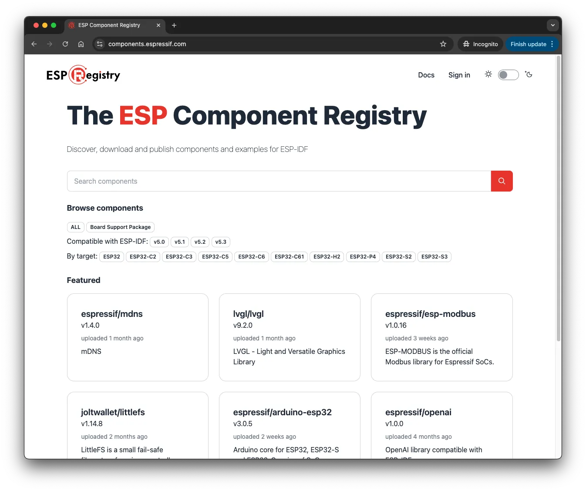
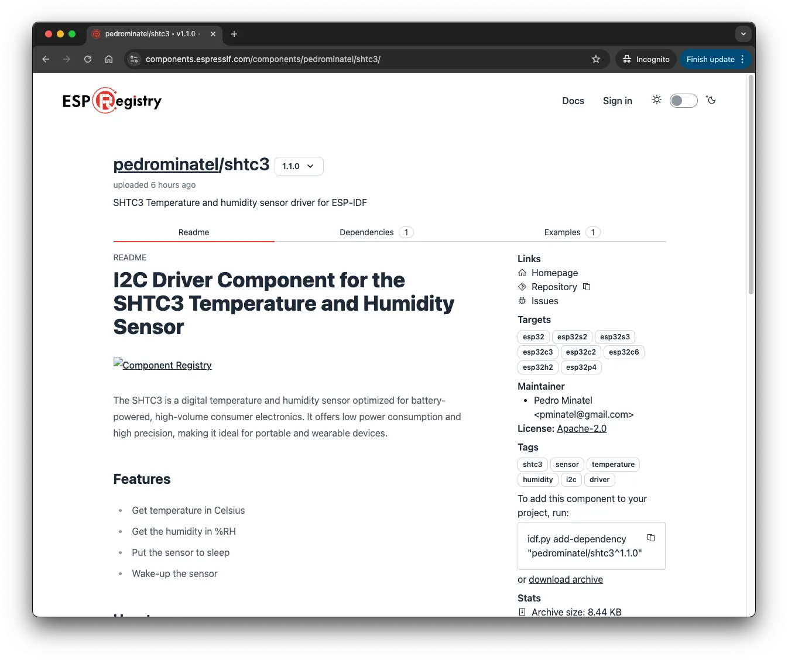

When starting a new project, we often reuse code from existing components, such as libraries, to save time. This not only saves time but also makes your project easier to maintain.

In the [ESP-IDF](https://idf.espressif.com), components are widely used to make the framework more modular, making it clearer to understand and maintain. The naming convention in the ESP-IDF is to use the term "component" instead of "library" because the ESP-IDF is more like an operating system with self-contained modules that interact with the system at a high level.

## What is ESP-Registry?

<figure style="width: 90%; margin: 0 auto; text-align: center;">
    
    <figcaption>ESP-Registry Logo</figcaption>
</figure>

To support the high number of components on the ESP-IDF, [Espressif](https://espressif.com) has developed the [ESP-Registry](https://components.espressif.com/), a platform that keeps all components available for anyone to use in a central repository. With the ESP-Registry, users can easily find and install components, use examples, and eventually create and upload their own components.

<figure style="width: 90%; margin: 0 auto; text-align: center;">
    
    <figcaption>ESP-Registry landing page</figcaption>
</figure>


Currently (Oct 2024), the Registry has **477 components**, developed by Espressif, partners, and the community.

Some examples:

- [led_strip](https://components.espressif.com/components/espressif/led_strip/): Driver designed for the addressable LEDs like WS2812.
- [ds18b20](https://components.espressif.com/components/espressif/ds18b20/): Driver for the DS18B20 temperature sensor using the 1-Wire protocol.
- [arduino-esp32](https://components.espressif.com/components/espressif/arduino-esp32): Component for the Arduino core for the ESP32 to be used inside the ESP-IDF.

## Why should I write my own component?

Right now, there is probably a developer searching for some driver, library, or anything that could help them develop their project. If you have what they are looking for, but you haven't shared it anywhere, you will not be able to know and help them. Don't forget that it could be you next time.

Besides that, making components can also help you with other projects that might use the same components, and keeping them in the Registry can save your time looking where the component was stored and how you manage the version, download, etc.

The main objective for the ESP-Registry is to keep a single platform for components, where developers across the world can search and use the shared components, however, the way the components is managed by the Component Manager, makes the use of components very easy for any developer. The components are managed in a way that you can specify the components in a `.yaml` file as a dependency for your project and the build system will download from the Registry the component automatically during the first build.

The main propose for this article is not to describe the Registry and the Component Manager. Make sure to check the other articles and related content.

> Sharing knowledge is one of the most rewarding things you can do.

Before continuing, the component we will write will be available on this [GitHub repository](https://github.com/pedrominatel/esp-components/tree/main/shtc3), so this article will be focused on GitHub as our versioning platform and you will need an account in order to publish your own component.

You can find more components examples at the [ESP-BSP](https://github.com/espressif/esp-bsp/tree/master/components) repository.

## Writing an I2C component

Now it's time to start with the new component. For this article we will use a I2C temperature and humidity sensor.

### The sensor: SHTC3

For this component, the [Sensirion SHTC3](https://sensirion.com/products/catalog/SHTC3) will be used. This is a I2C temperature and humidity sensor with a typical accuracy of ±2 %RH and ±0.2 °C. To know more about the specifications, please visit the [product page](https://sensirion.com/products/catalog/SHTC3).

If you don't have this sensor, you can change to any other I2C device. All the information you might need for the new sensor should be provided by the manufacturer, including the device address, registers, etc.

### The Board: ESP32-C3-DevKit-RUST-1

This is the sensor used on the [ESP32-C3-DevKit-RUST-1](https://github.com/esp-rs/esp-rust-board/tree/v1.2) and this is the board that will be used to create the component.

The ESP32-C3-DevKit-RUST-1 development board has 2 sensors connected to the I2C peripheral on the following GPIOs:

| Signal     | GPIO        |
|------------|-------------|
| SDA        | GPIO10      |
| SCL        | GPIO8       |

All the project files are available on the project GitHub.



### Creating the component

The Component Manager [documentation](https://docs.espressif.com/projects/idf-component-manager/en/latest/) is very comprehensive and you will find all the information you need there, including the [simple component](https://docs.espressif.com/projects/idf-component-manager/en/latest/guides/packaging_components.html#a-simple-esp-idf-component) structure.

To create the component, we will go through some steps:

1. Create the new component using the command line.
2. Create the component manifest file and set with the component information.
3. Set the license.
4. Write the README.md file.
5. Write the code for the sensor driver.
6. Write the example.

We assume that you already have the ESP-IDF installed on your system. If you don't, please check our article about installing the ESP-IDF.

On the Espressif DevCon23, Ivan Grokhotkov, gave a talk titled: Developing, Publishing, and Maintaining Components for ESP-IDF. You can watch this talk as an additional material for your studies.



#### Create the new component

The process will be done by the CLI (Command-line Interface) tool `idf.py`.

```bash
idf.py create-component shtc3
```

After that, the new folder should contain the following structure:

```text
.
└── shtc3
    ├── CMakeLists.txt
    ├── include
    │   └── shtc3.h
    └── shtc3.c
```

#### Create the Manifest file

The manifest file is mandatory and this is the file that the Registry will recognize it as a component. The bare-minimum for this file is described in the documentation, but we will fill with the most common important fields.

Create the `idf_component.yml` in the component root directory with this content. You can change it if you want.

```yaml
version: 1.0.0
description: SHTC3 Temperature and humidity sensor driver for ESP-IDF
url:
repository:
issues:
maintainers:
  - "Author Name <author@email.com>"
tags:
  - shtc3
  - sensor
  - temperature
  - humidity
  - i2c
  - driver
dependencies:
  idf : ">=5.3"
```

- **version**: This contains the component version following the [version format convention](https://docs.espressif.com/projects/idf-component-manager/en/latest/reference/versioning.html#versioning-scheme) `major.minor.patch` (0.0.0~0).
- **targets**: This is the list of the supported targets.
- **description**: Brief description about the component.
- **url**: URL to the component page or company page.
- **repository**: GitHub component repository with the `https://` or `git@`.
- **issues**: URL to the place you can open issues for this component.
- **maintainers**: List of the maintainers with email.
- **tags**: Tags that might be relevant for searching in the Registry page.
- **dependencies**: You can add the dependencies, like the ESP-IDF minimum version or other components.

This component will require the ESP-IDF v5.3 or higher (latest stable release in Oct 2024).

#### Set the License

Now we need to define the license file. This is a very important step for any open-source project.

You can use the [spdx.org](https://spdx.org/licenses/) license list for reference.

#### Create the README file

#### Component code

From now on, we will create the required code for the component to get the values from the sensor using I2C peripheral. The focus for the code explanation will be more on the new I2C driver.

To avoid a very long code description, please see the full code on the **SHTC3** component [repository on GitHub](https://github.com/pedrominatel/esp-components/tree/main/shtc3).



The basic flow for the component side will be:

- Create the I2C device that will be attached read from the I2C bus.
  - The I2C bus will be handled by the component example or the project that will use the component.
- Read the sensor registers
  - Temperature
  - Humidity
  - ID/serial
- Set the sensor registers
  - Wake
  - Sleep
- Detach the sensor from the bus

On the `include/shtc3.h`:

```c
#include "driver/i2c_master.h"

#define SHTC3_I2C_ADDR   ((uint8_t)0x70) // I2C address of SHTC3 sensor
```

The SHTC3 sensor address is `0x70` and there is no address selection, so we can use always the same address.

Create the enumeration to hold the registers that can be read or written to the sensor.

```c
// SHTC3 register addresses write only
typedef enum {
    SHTC3_REG_READ_ID       = 0xEFC8, // Read ID register
    SHTC3_REG_WAKE          = 0x3517, // Wake up sensor
    SHTC3_REG_SLEEP         = 0xB098, // Put sensor to sleep
    SHTC3_REG_SOFT_RESET    = 0x805D  // Soft reset
} shtc3_register_w_t;

// SHTC3 register addresses read-write
typedef enum {
    // Temperature first with clock stretching enabled in normal mode
    SHTC3_REG_T_CSE_NM  = 0x7CA2,
    // Humidity first with clock stretching enabled in normal mode
    SHTC3_REG_RH_CSE_NM = 0x5C24,
    // Temperature first with clock stretching enabled in low power mode
    SHTC3_REG_T_CSE_LM  = 0x6458,
    // Humidity first with clock stretching enabled in low power mode
    SHTC3_REG_RH_CSE_LM = 0x44DE,
    // Temperature first with clock stretching disabled in normal mode
    SHTC3_REG_T_CSD_NM  = 0x7866,
    // Humidity first with clock stretching disabled in normal mode
    SHTC3_REG_RH_CSD_NM = 0x58E0,
    // Temperature first with clock stretching disabled in low power mode
    SHTC3_REG_T_CSD_LM  = 0x609C,
    // Humidity first with clock stretching disabled in low power mode
    SHTC3_REG_RH_CSD_LM = 0x401A
} shtc3_register_rw_t;
```

As mentioned before, this project will be based on the new I2C API from ESP-IDF.

On the `shtc3.c`:

We can start by creating the function to handle the I2C device creation, that will be attached to the bus.

```c
i2c_master_dev_handle_t shtc3_device_create(i2c_master_bus_handle_t bus_handle,
    const uint16_t dev_addr, const uint32_t dev_speed)
{
    i2c_device_config_t dev_cfg = {
        .dev_addr_length = I2C_ADDR_BIT_LEN_7,
        .device_address = dev_addr,
        .scl_speed_hz = dev_speed,
    };
    i2c_master_dev_handle_t dev_handle;
    // Add device to the I2C bus
    ESP_ERROR_CHECK(i2c_master_bus_add_device(bus_handle, &dev_cfg, &dev_handle));
    return dev_handle;
}
```

In this function, the `i2c_master_bus_handle_t` will be provided and then the device will be created and attached to the bus by calling `i2c_master_bus_add_device`.

To create the device, the following settings are required:

- `dev_addr_length`: Device address length, that could it be 7 or 8 bits. Please see this information in the datasheet.
- `device_address`: Device address.
- `scl_speed_hz`: Bus clock speed. For normal mode up to 100kHz and fast mode up to 400kHz.

Once the device is attached to the bus, the `i2c_master_dev_handle_t` will be returned to be used on any read or write operation with this sensor.

To remove the device from the bus you can use the function `i2c_master_bus_rm_device`. Let's add to our component.

```c
esp_err_t shtc3_device_delete(i2c_master_dev_handle_t dev_handle)
{
    return i2c_master_bus_rm_device(dev_handle);
}
```

To read and write operations, we will use 2 functions:

- `i2c_master_transmit`: Perform a write transaction on the I2C bus.
- `i2c_master_transmit_receive`: Perform a write-read transaction on the I2C bus.

The function `i2c_master_receive` will be not used on this component. The complete list of functions can be found on the [documentation](https://docs.espressif.com/projects/esp-idf/en/latest/esp32/api-reference/peripherals/i2c.html#functions).

On this sensor, the recommended (see datasheet) flow is:

1. Wakeup command
2. Measurement command
3. Read out command
4. Sleep command

Now let's add the register write function to wakeup and sleep:

```c
static esp_err_t shtc3_wake(i2c_master_dev_handle_t dev_handle)
{
    esp_err_t ret;
    shtc3_register_w_t reg_addr = SHTC3_REG_WAKE;
    uint8_t read_reg[2] = { reg_addr >> 8, reg_addr & 0xff };
    ret = i2c_master_transmit(dev_handle, read_reg, 2, -1);
    ESP_RETURN_ON_ERROR(ret, TAG, "Failed to wake up SHTC3 sensor");
    return ret;
}
```

Sleep:

```c
static esp_err_t shtc3_sleep(i2c_master_dev_handle_t dev_handle)
{
    esp_err_t ret;
    shtc3_register_w_t reg_addr = SHTC3_REG_SLEEP;
    uint8_t read_reg[2] = { reg_addr >> 8, reg_addr & 0xff };
    ret = i2c_master_transmit(dev_handle, read_reg, 2, -1);
    ESP_RETURN_ON_ERROR(ret, TAG, "Failed to put SHTC3 sensor to sleep"); 
    return ret;
}
```

To read the temperature and humidity from the sensor, now we will use the `i2c_master_transmit_receive` function.

```c
 esp_err_t shtc3_get_th(i2c_master_dev_handle_t dev_handle,
          shtc3_register_rw_t reg,
          float *data1,
          float *data2)
{
    esp_err_t ret;
    uint8_t b_read[6] = {0};
    uint8_t read_reg[2] = { reg >> 8, reg & 0xff };

    shtc3_wake(dev_handle);
    // Read 4 bytes of data from the sensor
    ret = i2c_master_transmit_receive(dev_handle, read_reg, 2, b_read, 6, 200);
    ESP_RETURN_ON_ERROR(ret, TAG, "Failed to read data from SHTC3 sensor");
    shtc3_sleep(dev_handle);

    // Convert the data
    *data1 = ((((b_read[0] * 256.0) + b_read[1]) * 175) / 65535.0) - 45;
    *data2 = ((((b_read[3] * 256.0) + b_read[4]) * 100) / 65535.0);

    return ret;
}
```

On this function, we will wakeup the sensor, write and read the data (temperature and humidity) and set the sensor to sleep. The conversion from the raw values to the temperature in Celsius and humidity in %RH is also described in the sensor datasheet.

The CRC for the temperature and humidity will be not considered for this example. If you need to implement the CRC, please see the information provided by the manufacturer.

This is a very basic sensor, with no configuration or calibration registers.

#### Example for the component

Adding the examples is highly recommended. This will help developers to understand how to use the component and will let people test it easily.

To include the example, follow these steps:

1. Create the **examples** folder in the component root folder.
2. Create a new project using `idf.py`.

Inside the `examples` folder, run the command to create a new blank project structure with the name `shtc3`.

```bash
idf.py create-project shtc3_read
```

3. Create the example manifest file `idf_component.yml` inside the `shtc_read/main` folder.

```yaml
dependencies:
  <github_namespace>/shtc3:
    version: "*"
    override_path: '../../../'
```

Replace the `<github_namespace>` with your GitHub account name or organization.

After that, component folder structure should be something like:

```text
.
└── shtc3
    ├── examples
    │   └── shtc3_read
    │       └── CMakeLists.txt
    │       └── main
    │           └── CMakeLists.txt
    │           └── idf_component.yml
    │           └── shtc3_read.c
    ├── CMakeLists.txt
    ├── README.md
    ├── idf_component.yml
    ├── licesne.txt
    ├── include
    │   └── shtc3.h
    └── shtc3.c
```

4. Create the example

Now let's create the component example and test it.

This example will do:

- Initialize the I2C bus.
- Create the sensor I2C device.
- Probe the I2C bus and check the sensor presence.
- Get the sensor ID.
- Start a new task to read the sensor every 1000 ms.

On the `app_main` function in the `shtc3_read.c` file, add the bus initialization and the device creation functions.

```c
i2c_master_bus_handle_t i2c_bus_init(uint8_t sda_io, uint8_t scl_io)
{
    i2c_master_bus_config_t i2c_bus_config = {
        .i2c_port = CONFIG_SHTC3_I2C_NUM,
        .sda_io_num = sda_io,
        .scl_io_num = scl_io,
        .clk_source = I2C_CLK_SRC_DEFAULT,
        .glitch_ignore_cnt = 7,
        .flags.enable_internal_pullup = true,
    };

    i2c_master_bus_handle_t bus_handle;
    ESP_ERROR_CHECK(i2c_new_master_bus(&i2c_bus_config, &bus_handle));
    ESP_LOGI(TAG, "I2C master bus created");
    return bus_handle;
}
```

The bus initialization is done by the function `i2c_new_master_bus` and the `bus_handle` will be used to create the device on this bus. If you have more devices, you can add to the same bus, but this will be not covered on this article.

```c
i2c_master_bus_handle_t bus_handle = i2c_bus_init(SHTC3_SDA_GPIO, SHTC3_SCL_GPIO);
shtc3_handle = shtc3_device_create(bus_handle, SHTC3_I2C_ADDR, CONFIG_SHTC3_I2C_CLK_SPEED_HZ);
```

Make sure to import the component header file.

```c
#include "shtc3.h"
```

Now to proof that the sensor is present in the I2C bus, we can probe and check it before the read and write operations. This probe has the timeout set to 200 ms.

```c
esp_err_t err = i2c_master_probe(bus_handle, SHTC3_I2C_ADDR, 200);
```

With the probe result, we can decide if the read task will be created or not.

```c
if(err == ESP_OK) {
        ESP_LOGI(TAG, "SHTC3 sensor found");
        uint8_t sensor_id[2];
        err = shtc3_get_id(shtc3_handle, sensor_id);
        ESP_LOGI(TAG, "Sensor ID: 0x%02x%02x", sensor_id[0], sensor_id[1]);

        if(err == ESP_OK) {
            ESP_LOGI(TAG, "SHTC3 ID read successfully");
            xTaskCreate(shtc3_read_task, "shtc3_read_task", 4096, NULL, 5, NULL);
        } else {
            ESP_LOGE(TAG, "Failed to read SHTC3 ID");
        }

    } else {
        ESP_LOGE(TAG, "SHTC3 sensor not found");
        shtc3_device_delete(shtc3_handle);
    }
```

Task to read the sensor.

```c
void shtc3_read_task(void *pvParameters)
{
    float temperature, humidity;
    esp_err_t err = ESP_OK;
    shtc3_register_rw_t reg = SHTC3_REG_T_CSE_NM;

    while (1) {
        err = shtc3_get_th(shtc3_handle, reg, &temperature, &humidity);
        if(err != ESP_OK) {
            ESP_LOGE(TAG, "Failed to read data from SHTC3 sensor");
        } else {
            ESP_LOGI(TAG, "Temperature: %.2f C, Humidity: %.2f %%", temperature, humidity);
        }
        vTaskDelay(1000 / portTICK_PERIOD_MS);
    }
}
```

On this task, the sensor will be woken up, the readout will be read and processed, and then the sensor will return to sleep mode.

#### Creating Kconfig (optional)

As a bonus, this component has a dedicated configuration menu using a `Kconfig` file. On this configuration menu, you will be able to set the I2C GPIOs (SDA and SCL), the I2C port number and the bus frequency.

```text
menu "Driver SHTC3 Sensor"
            
    menu "I2C"
        config SHTC3_I2C_NUM
            int "I2C peripheral index"
            default -1
            range -1 3
            help
                For auto select I2C peripheral, set to -1.

        config SHTC3_I2C_SDA
            int "I2C SDA pin"
            default 17
            range 0 55
            help
                Set the I2C SDA pin for the data signal.

        config SHTC3_I2C_SCL
            int "I2C SCL pin"
            default 18
            range 0 55
            help
                Set the I2C SCL pin for the clock signal.

        config SHTC3_I2C_CLK_SPEED_HZ
            int "I2C clock speed (Hz)"
            default 100000
            range 10000 400000
            help
                Set the I2C clock speed in Hz.
    endmenu
  
endmenu
```

The `Kconfig` file should be placed on the component root directory. To set the values, you can use the command:

```bash
idf.py menuconfig
```

Having a component with a clear documentation and at least one example, can make your component frustration free. Developers enjoy when it just works!

### Publishing the component to the ESP-Registry

Now we have everything needed to read the SHTC3 sensor, we need to publish the component to the Component Registry. To do that, there are 2 ways:

- Manual
- GitHub Action

The manual procedure can be found in the [Publish the Component](https://docs.espressif.com/projects/idf-component-manager/en/latest/guides/packaging_components.html#publish-the-component) section in the documentation.

Alternatively to the manual procedure, we can use GitHub Actions to publish every new version of the component automatically.

On this article, we will focus on the GitHub Action procedure.

#### GitHub Actions

If you are not familiar with GitHub Actions, you can read the [official documentation](https://github.com/features/actions).

In sum, GitHub Action is a continuous integration and continuous delivery (CI/CD) platform that automates workflows right on in your GitHub repository. You can use GitHub Actions in a vast situations and you can automate for example the component publishing process.

#### Workflow

To use the actions, we need to create a folder on the root directory of your component repository, named `.github` (do not forget the dot).

Inside this folder, create another folder named `workflows`. On this folder, two workflow files will be created.

- `build_examples.yml`: This workflow will build the component example.
- `upload_components.yml`: This workflow will upload the component to the registry.

The folder structure will be:

```text
.
.github
└── workflows
    └── build_examples.yml
    └── upload_components.yml
└── shtc3
```

**build_examples.yml**

The build workflow will compile the example with the ESP-IDF version specified in the `idf_ver` and will run when you push to the main branch or create a PR (pull request).

This workflow is important to ensure that the code can be built successfully, preventing any potential issues before uploading the component to the registry.

```yaml
name: 'build'

on:
  push:
    branches:
      - 'main'
  pull_request:
    types: [opened, reopened, synchronize]

jobs:
  build:
    name: build target
    runs-on: ubuntu-latest
    strategy:
      fail-fast: false
      matrix:
        espidf_target:
          - esp32
          - esp32c3
          - esp32c6
          - esp32h2
          - esp32p4
          - esp32s2
          - esp32s3
        examples_path:
          - 'shtc3/examples/shtc3_read'
    steps:
      - name: Checkout repository
        uses: actions/checkout@v4
        with:
          submodules: 'recursive'
      - name: Build Test Application with ESP-IDF
        uses: espressif/esp-idf-ci-action@v1.1.0
        with:
          esp_idf_version: "latest"
          target: ${{ matrix.espidf_target }}
          path: ${{ matrix.examples_path }}
```

You can modify this workflow as you wish, like adding more examples to be tested, remove targets that you do not need, or adding different ESP-IDF versions to be tested.

**upload_components.yml**

To publish the component, the workflow `upload_component` will process the component by using the [upload-components-ci-action](https://github.com/espressif/upload-components-ci-action).

This workflow will run only when the component is pushed to the main branch. This avoids publishing the component before merging the branch to the main.

An important note is that the action will only publish the component if there is no component published with the same version. This means that you need to change the version in the manifest file before running this workflow.

```yaml
name: Push components to Espressif Component Service

on:
    push:
      branches:
        - main

jobs:
  upload_components:
    runs-on: ubuntu-latest
    steps:
      - uses: actions/checkout@master

      - name: Upload components to component service
        uses: espressif/upload-components-ci-action@v1
        with:
          directories: >
            shtc3;
          namespace: "<namespace>"
          api_token: ${{ secrets.IDF_COMPONENT_API_TOKEN }}
```

Replace the `namespace` with your GitHub username or organization.

In order to upload the component, you need to provide the API key. This key is a secret and **cannot be public**.

**Create the Action secret**

GitHub has the [secret tokens](https://docs.github.com/en/actions/security-for-github-actions/security-guides/using-secrets-in-github-actions) manager that you can use in the Actions workflow.

To create the API token, go to [tokens](https://components.espressif.com/settings/tokens/) in the Registry and create a new token with `write:components`scope. Make sure to copy the token and store a copy in a safe place. Once you create the token, you will not be able see the full token later.

Now, on your GitHub repository, create a new secret token with the name `IDF_COMPONENT_API_TOKEN` and add the API token as the secret. This secret will be only accessed by the actions inside your repository.

After everything created, you can push all the files to a branch on your repository, test the workflow run and if all goes green (in the actions tab), you can merge and see your component published.

<figure style="width: 90%; margin: 0 auto; text-align: center;">
    
    <figcaption>ESP-Registry SHTC3 Component</figcaption>
</figure>

For this article, the published component can be found in the Registry: [SHTC3](https://components.espressif.com/components/pedrominatel/shtc3/)

## Using the component

This is the time for testing the published component. For that, we will use the component published for this article, the [SHTC3](https://components.espressif.com/components/pedrominatel/shtc3/). After your own component is published, you can use the same approach.

On the component page, you will see the command from the `idf.py` to add the component to your project. In this case:

```bash
idf.py add-dependency "pedrominatel/shtc3^1.1.0"
```

Run this command inside a project that you want to add the component. By running this command, a new `idf_component.yml` will be added to your project with the new requirement/dependency for your project.

Now you can set the target and build the example (in case you are using the ESP32-C3):

```bash
idf.py set-target esp32c3
idf.py build flash monitor
```

In the build output in the console, you will note this:

```text
Processing 2 dependencies:
[1/2] pedrominatel/shtc3 (1.1.0)
[2/2] idf (5.4.0)
```

Once you build the project, the build system will automatically download all dependencies to a folder called `managed_components`.

If you are not able to see the dependencies or the `managed_components` folder, you can try:

```bash
idf.py reconfigure
```

Another way is to create a new project based on the component example.

<figure style="width: 90%; margin: 0 auto; text-align: center;">
    
    <figcaption>ESP-Registry SHTC3 Component example</figcaption>
</figure>

```bash
idf.py create-project-from-example "pedrominatel/shtc3^1.1.0:shtc3_read"
```

Set the target, build, and flash.

```bash
cd shtc3_read
idf.py set-target esp32c3
idf.py build flash monitor
```

With this command, a new project based on the example will be created. You can just set the target, configure according to your board GPIO, build and flash.

## Conclusion

Publishing a component is not just about sharing code—it’s about sharing knowledge. When you contribute a component to the registry, you’re helping developers solve challenges and build better solutions. Depending on the impact and adoption of your component, you may gain recognition and appreciation from the developer community.

This article is not just a guide on how to create an I2C component; it’s an encouragement for you to start sharing your work and expertise with others. Every contribution helps build a stronger, more collaborative community.

## Reference

- [ESP-Registry](https://components.espressif.com/)
- [ESP-Registry Documentation](https://docs.espressif.com/projects/idf-component-manager/en/latest/)
- [Compote Documentation](https://docs.espressif.com/projects/idf-component-manager/en/latest/reference/compote_cli.html)
- [Component Examples](https://github.com/espressif/esp-bsp/tree/master/components)
- [My Components](https://github.com/pedrominatel/esp-components)