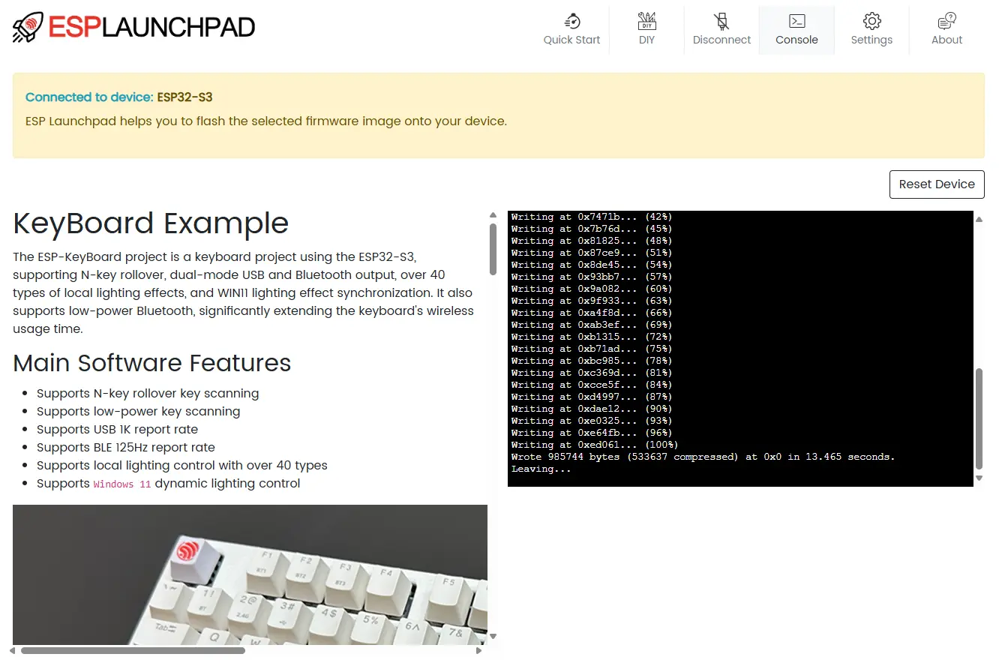

Today, Espressif is excited to announce the release of [esp-iot-solution v2.0](https://github.com/espressif/esp-iot-solution/tree/release/v2.0). The components in the `release/v2.0` branch will receive bugfix maintenance for two years (until January 25, 2027, [ESP-IDF v5.3 EOL](https://docs.espressif.com/projects/esp-idf/en/release-v5.3/esp32s3/versions.html#support-periods)). This version categorizes and organizes commonly used IoT development features, including display, lighting, sensors, audio, motor control, input devices, USB, and more.

Each category contains multiple feature-rich components that users can install, use, and update individually via the [ESP Component Manager](https://components.espressif.com/). Additionally, this version offers a wealth of [example code](https://github.com/espressif/esp-iot-solution/tree/release/v2.0/examples) to help users get started quickly. Below, we introduce some representative components.

For more detailed information, please refer to the [esp-iot-solution v2.0 documentation](https://docs.espressif.com/projects/esp-iot-solution/en/release-v2.0/index.html).

## Basic Components

**[button](https://components.espressif.com/components/espressif/button)**

Buttons are an essential part of IoT devices. In `esp-iot-solution v2.0`, the `button` component provides a complete set of button drivers and event handling features, supporting single-click, double-click, long-press, and more. It supports various button types, including standard buttons, ADC buttons, matrix buttons, and custom buttons. Additionally, it offers features like button debounce and sleep mode. With the `button` component, users can focus on event handling without needing to understand the underlying button drivers.

**[led_indicator](https://components.espressif.com/components/espressif/led_indicator)**

LED indicators are also a fundamental and necessary feature in IoT devices, providing timely visual feedback to help users quickly understand device status. The `led_indicator` component in `esp-iot-solution v2.0` offers a comprehensive LED indicator solution, covering LED effect design (including color, brightness, and blinking), LED priority management, and LED effect switching. It is compatible with various LED types, including single-color LEDs, RGB LEDs, and WS2812 LEDs.

## Electrical and Lighting

**[lightbulb_driver](https://components.espressif.com/components/espressif/lightbulb_driver)**

For professional developers and lighting system integrators, Espressif offers a cost-effective lighting solution that enables users to quickly develop high-performance, low-power smart lighting products. The `lightbulb_driver` component integrates multiple dimming schemes and simplifies application integration through an abstraction layer, fully supporting all ESP32 series chips. It supports PWM, IIC, and single-wire dimming schemes, including RGB+cool/warm color temperature, RGB+CCT/brightness, and more. The component also provides features like gradient effects, white balance calibration, power-off memory, and configurations for up to five types of LEDs, with power limitation and low power consumption characteristics.

**[zero_detection](https://components.espressif.com/components/espressif/zero_detection)**

Zero-cross detection is a crucial part of dimmers, used to detect the zero-crossing point of voltage or current waveforms to adjust the lights at the optimal time. This not only achieves smooth, flicker-free dimming but also reduces electromagnetic interference (EMI) and extends the lifespan of the lights. The `zero_detection` component uses MCPWM capture or GPIO interrupts to detect signal periods and trigger edges, determine signal validity, and handle signal loss, providing foundational support for dimmer design.

## Display Components

**[display/lcd](https://github.com/espressif/esp-iot-solution/tree/release/v2.0/components/display/lcd)**

Espressif provides developers with a comprehensive [LCD driver solution guide](https://docs.espressif.com/projects/esp-iot-solution/en/release-v2.0/display/index.html), covering the entire process from LCD driver development to GUI applications. Based on the ESP-IDF [esp_lcd](https://github.com/espressif/esp-idf/tree/release/v5.3/components/esp_lcd) component, it offers numerous [LCD drivers](https://github.com/espressif/esp-iot-solution/tree/release/v2.0/components/display/lcd) supporting QSPI, RGB, MIPI, and other interfaces. Additionally, this version introduces the innovative [esp_lcd_usb_display](https://components.espressif.com/components/espressif/esp_lcd_usb_display) component, which allows projecting display content onto a PC via USB, significantly enhancing debugging and development efficiency.

**[display/tools](https://github.com/espressif/esp-iot-solution/tree/release/v2.0/components/display/tools)**

For resource-limited devices, `esp-iot-solution v2.0` offers a lightweight file system management tool: [esp_mmap_assets](https://components.espressif.com/components/espressif/esp_mmap_assets). This component supports fast loading and displaying of image data. To better support GUI applications, it provides an interface for [LVGL](https://lvgl.io/) to interact with the file system, allowing loading of fonts, images, and other resources from the file system.

## USB Components

**[usb_device_uvc](https://components.espressif.com/components/espressif/usb_device_uvc)**

UVC (USB Video Class) is a USB device class standard for video devices. The `usb_device_uvc` component is a UVC device class library based on the USB-OTG peripheral, supporting the display of ESP's image data on a PC or other host devices via USB-OTG. It supports various resolutions, frame rates, and formats, allowing users to send image data according to the UVC standard by simply registering callback functions. With this component, users can develop standard USB cameras, USB displays, and more. Espressif also provides a complete [UVC device example](https://github.com/espressif/esp-iot-solution/tree/release/v2.0/examples/usb/device/usb_webcam) to help users turn the ESP32-S3-EYE development board into a standard webcam.

**[esp_msc_ota](https://components.espressif.com/components/espressif/esp_msc_ota)**

`esp_msc_ota` is a firmware upgrade solution based on USB MSC (Mass Storage Class), supporting automatic firmware updates to ESP32 series devices via USB storage devices. Users can simply copy the firmware file to a USB device (such as a USB flash drive), insert it into the USB host interface of the ESP device, and achieve firmware upgrades. This solution is suitable for devices in non-network environments, such as outdoor advertising screens and lightboxes.

## Motor Control

**[esp_sensorless_bldc_control](https://components.espressif.com/components/espressif/esp_sensorless_bldc_control)**

Brushless Direct Current (BLDC) motors, which achieve better speed-torque characteristics and fast dynamic response through electronic commutation, have become an important part of modern industrial and consumer electronics. The `esp_sensorless_bldc_control` component provides a complete sensorless trapezoidal control solution, supporting both ADC sampling and comparator sampling methods, with features like position estimation, stall protection, overcurrent and undervoltage protection. Additionally, we offer a complete [BLDC smart fan solution](https://github.com/espressif/esp-iot-solution/tree/release/v2.0/examples/motor/bldc_fan_rainmaker), supporting stepless speed regulation, natural wind, and Rainmaker remote control.

**[esp_simplefoc](https://components.espressif.com/components/espressif/esp_simplefoc)**

[SimpleFOC](https://simplefoc.com/) is a popular open-source FOC control library. The `esp_simplefoc` component is an ESP adaptation of SimpleFOC, encapsulating peripheral interfaces to support any Espressif chip with LEDC or MCPWM, and optimizing FOC floating-point calculations to further improve control efficiency. By referring to the [FOC examples](https://github.com/espressif/esp-iot-solution/tree/release/v2.0/examples/motor) provided in `esp-iot-solution`, users can quickly get started with FOC control and achieve efficient motor control.

## Large Language Model (LLM) Integration

**[openai](https://components.espressif.com/components/espressif/openai)**

OpenAI's GPT series models, such as GPT-3, have become significant breakthroughs in the field of natural language processing, providing developers with powerful natural language processing capabilities. The `openai` component is an LLM integration component based on the [OpenAI API](https://platform.openai.com/docs/api-reference/introduction), supporting various input methods including text, voice, and images, and multiple output formats including text, voice, and images. Users can quickly integrate OpenAI API with ESP series chips to achieve natural language processing functions. You can refer to the [esp-box chatgpt_demo](https://github.com/espressif/esp-box/tree/master/examples/chatgpt_demo) example to learn how to use the `openai` component.

## Quick Experience with esp-launchpad

`esp-iot-solution v2.0` also provides [esp-iot-solution-launchpad](https://espressif.github.io/esp-launchpad/?flashConfigURL=https://dl.espressif.com/AE/esp-iot-solution/release_v2_0/config.toml), allowing users to flash precompiled firmware via a web interface without installing any development environment, enabling a quick experience of the latest features.

<figure style="width: 90%; margin: 0 auto; text-align: center;">
    
    <figcaption>esp-iot-solution Launchpad</figcaption>
</figure>

## More Features

The complete list of components supported by `esp-iot-solution v2.0` is as follows. You can click the links for more detailed information. We welcome you to download and experience it. If you have any questions or suggestions, please raise them in [esp-iot-solution/discussions](https://github.com/espressif/esp-iot-solution/issues).

| Component | Version |
| --- | --- |
| [aht20](https://components.espressif.com/components/espressif/aht20/versions/1.0.0) |  |
| [at581x](https://components.espressif.com/components/espressif/at581x/versions/1.0.0) |  |
| [avi_player](https://components.espressif.com/components/espressif/avi_player/versions/1.0.0) |  |
| [ble_anp](https://components.espressif.com/components/espressif/ble_anp/versions/0.1.0) |  |
| [ble_conn_mgr](https://components.espressif.com/components/espressif/ble_conn_mgr/versions/0.1.2) |  |
| [ble_hci](https://components.espressif.com/components/espressif/ble_hci/versions/1.0.0) |  |
| [ble_hrp](https://components.espressif.com/components/espressif/ble_hrp/versions/0.1.0) |  |
| [ble_htp](https://components.espressif.com/components/espressif/ble_htp/versions/0.1.0) |  |
| [ble_ota](https://components.espressif.com/components/espressif/ble_ota/versions/0.1.12) |  |
| [ble_services](https://components.espressif.com/components/espressif/ble_services/versions/0.1.0) |  |
| [bootloader_support_plus](https://components.espressif.com/components/espressif/bootloader_support_plus/versions/0.2.6) |  |
| [button](https://components.espressif.com/components/espressif/button/versions/3.4.0) |  |
| [cmake_utilities](https://components.espressif.com/components/espressif/cmake_utilities/versions/1.0.0) |  |
| [drv10987](https://components.espressif.com/components/espressif/drv10987/versions/0.1.0) |  |
| [elf_loader](https://components.espressif.com/components/espressif/elf_loader/versions/0.1.0) |  |
| [esp_lcd_axs15231b](https://components.espressif.com/components/espressif/esp_lcd_axs15231b/versions/1.0.0) |  |
| [esp_lcd_ek79007](https://components.espressif.com/components/espressif/esp_lcd_ek79007/versions/1.0.1) |  |
| [esp_lcd_gc9b71](https://components.espressif.com/components/espressif/esp_lcd_gc9b71/versions/1.0.2) |  |
| [esp_lcd_hx8399](https://components.espressif.com/components/espressif/esp_lcd_hx8399/versions/1.0.1) |  |
| [esp_lcd_jd9165](https://components.espressif.com/components/espressif/esp_lcd_jd9165/versions/1.0.1) |  |
| [esp_lcd_jd9365](https://components.espressif.com/components/espressif/esp_lcd_jd9365/versions/1.0.1) |  |
| [esp_lcd_nv3022b](https://components.espressif.com/components/espressif/esp_lcd_nv3022b/versions/1.0.0) |  |
| [esp_lcd_panel_io_additions](https://components.espressif.com/components/espressif/esp_lcd_panel_io_additions/versions/1.0.1) |  |
| [esp_lcd_sh8601](https://components.espressif.com/components/espressif/esp_lcd_sh8601/versions/1.0.0) |  |
| [esp_lcd_spd2010](https://components.espressif.com/components/espressif/esp_lcd_spd2010/versions/1.0.2) |  |
| [esp_lcd_st7701](https://components.espressif.com/components/espressif/esp_lcd_st7701/versions/1.1.1) |  |
| [esp_lcd_st7703](https://components.espressif.com/components/espressif/esp_lcd_st7703/versions/1.0.1) |  |
| [esp_lcd_st77903_qspi](https://components.espressif.com/components/espressif/esp_lcd_st77903_qspi/versions/1.0.0) |  |
| [esp_lcd_st77903_rgb](https://components.espressif.com/components/espressif/esp_lcd_st77903_rgb/versions/1.0.0) |  |
| [esp_lcd_st77916](https://components.espressif.com/components/espressif/esp_lcd_st77916/versions/1.0.0) |  |
| [esp_lcd_st77922](https://components.espressif.com/components/espressif/esp_lcd_st77922/versions/1.0.2) |  |
| [esp_lcd_touch_spd2010](https://components.espressif.com/components/espressif/esp_lcd_touch_spd2010/versions/1.0.0) |  |
| [esp_lcd_touch_st7123](https://components.espressif.com/components/espressif/esp_lcd_touch_st7123/versions/1.0.0) |  |
| [esp_lcd_usb_display](https://components.espressif.com/components/espressif/esp_lcd_usb_display/versions/1.0.0) |  |
| [esp_lv_decoder](https://components.espressif.com/components/espressif/esp_lv_decoder/versions/0.1.2) |  |
| [esp_lv_fs](https://components.espressif.com/components/espressif/esp_lv_fs/versions/1.0.0) |  |
| [esp_mmap_assets](https://components.espressif.com/components/espressif/esp_mmap_assets/versions/1.3.0) |  |
| [esp_msc_ota](https://components.espressif.com/components/espressif/esp_msc_ota/versions/1.0.0) |  |
| [esp_sensorless_bldc_control](https://components.espressif.com/components/espressif/esp_sensorless_bldc_control/versions/1.0.0) |  |
| [esp_simplefoc](https://components.espressif.com/components/espressif/esp_simplefoc/versions/1.0.0) |  |
| [esp_tinyuf2](https://components.espressif.com/components/espressif/esp_tinyuf2/versions/1.0.0) |  |
| [extended_vfs](https://components.espressif.com/components/espressif/extended_vfs/versions/0.3.2) |  |
| [gprof](https://components.espressif.com/components/espressif/gprof/versions/0.1.0) |  |
| [i2c_bus](https://components.espressif.com/components/espressif/i2c_bus/versions/1.0.0) |  |
| [ina236](https://components.espressif.com/components/espressif/ina236/versions/0.1.0) |  |
| [iot_usbh](https://components.espressif.com/components/espressif/iot_usbh/versions/0.2.1) |  |
| [iot_usbh_cdc](https://components.espressif.com/components/espressif/iot_usbh_cdc/versions/0.2.2) |  |
| [iot_usbh_modem](https://components.espressif.com/components/espressif/iot_usbh_modem/versions/0.2.1) |  |
| [ir_learn](https://components.espressif.com/components/espressif/ir_learn/versions/1.0.0) |  |
| [keyboard_button](https://components.espressif.com/components/espressif/keyboard_button/versions/1.0.0) |  |
| [knob](https://components.espressif.com/components/espressif/knob/versions/1.0.0) |  |
| [led_indicator](https://components.espressif.com/components/espressif/led_indicator/versions/1.0.0) |  |
| [lightbulb_driver](https://components.espressif.com/components/espressif/lightbulb_driver/versions/1.3.3) |  |
| [ntc_driver](https://components.espressif.com/components/espressif/ntc_driver/versions/1.1.0) |  |
| [openai](https://components.espressif.com/components/espressif/openai/versions/1.0.1) |  |
| [pwm_audio](https://components.espressif.com/components/espressif/pwm_audio/versions/1.1.2) |  |
| [spi_bus](https://components.espressif.com/components/espressif/spi_bus/versions/1.0.0) |  |
| [touch_proximity_sensor](https://components.espressif.com/components/espressif/touch_proximity_sensor/versions/0.1.2) |  |
| [usb_device_uac](https://components.espressif.com/components/espressif/usb_device_uac/versions/1.0.0) |  |
| [usb_device_uvc](https://components.espressif.com/components/espressif/usb_device_uvc/versions/1.1.2) |  |
| [usb_stream](https://components.espressif.com/components/espressif/usb_stream/versions/1.4.0) |  |
| [xz](https://components.espressif.com/components/espressif/xz/versions/1.0.0) |  |
| [zero_detection](https://components.espressif.com/components/espressif/zero_detection/versions/0.0.6) |  |
