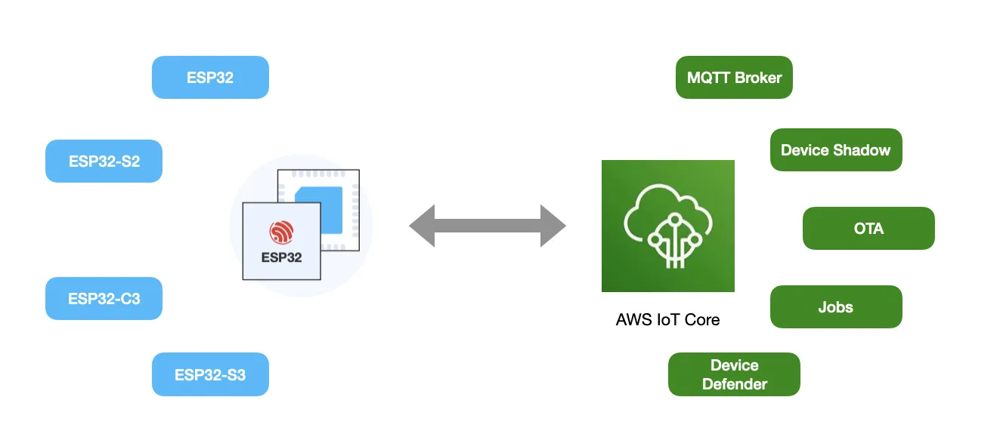

Since 2017, Espressif SoCs have been capable of connecting to the AWS IoT Core and related services. There are two ways to connect Espressif Wi-Fi SoCs to the AWS IoT Core.

The first one is by using [Amazon provided FreeRTOS distribution](https://docs.aws.amazon.com/freertos/latest/userguide/getting_started_espressif.html). The FreeRTOS distribution is an all-inclusive solution, providing the kernel, the connectivity libraries, and its own build system. This offers a seamless way of connecting qualified SoCs to AWS IoT and related services. Yet, there are certain limitations on using this FreeRTOS distribution with Espressif SoCs. The SMP support to utilise multiple cores of SoCs like ESP32, as well as support for newer SoCs like ESP32-C3 are not yet available through the FreeRTOS distribution.

The second way of connecting an Espressif Wi-Fi SoC to the AWS IoT Core, is by using the [IoT Device SDK for Embedded C](https://github.com/espressif/esp-aws-iot/) which is a stand-alone library, that includes support for MQTT and Device Shadow. However, support for other AWS services like OTA and Device Defender, was not available in this agent until recently.

202009.00 and newer releases of the IoT Device SDK for Embedded C include a larger set of libraries for connecting to various AWS services (AWS IoT MQTT Broker, Device Shadow, AWS IoT Jobs, AWS IoT Device Defender, AWS IoT Over-the-air Update Library etc.). Additionally, the above-mentioned newer releases provide maximum flexibility by allowing the LTS releases of the AWS libraries to be used separately. This option gives developers the freedom to choose from different Espressif SoCs and versions of ESP-IDF, which allows for effective integration.

On that account, we have just launched support for the 202103.00 release of the SDK in beta, for Espressif boards: [https://github.com/espressif/esp-aws-iot/tree/release/beta](https://github.com/espressif/esp-aws-iot/tree/release/beta)


At the time of writing this article, the beta release supports the following __AWS Standard LTS libraries__ :

- coreHTTP
- coreJSON
- coreMQTT
- corePKCS11

and the following __AWS LTS libraries__ :

- AWS IoT Device Shadow
- AWS IoT Jobs
- AWS IoT OTA

To simplify the use of these libraries, we have made the following examples available:

- [coreMQTT with TLS Mutual Authentication](https://github.com/espressif/esp-aws-iot/tree/release/beta/examples/mqtt/tls_mutual_auth)
- [Device Shadow Example](https://github.com/espressif/esp-aws-iot/tree/release/beta/examples/thing_shadow)
- [Jobs Example](https://github.com/espressif/esp-aws-iot/tree/release/beta/examples/jobs)
- [OTA over MQTT](https://github.com/espressif/esp-aws-iot/tree/release/beta/examples/ota/ota_mqtt)
- [coreHTTP with TLS Mutual Authentication](https://github.com/espressif/esp-aws-iot/tree/release/beta/examples/http/http_mutual_auth)
- [OTA over HTTP](https://github.com/espressif/esp-aws-iot/tree/release/beta/examples/ota/ota_http)

Let us take take a look at the *Device Shadow* library and the corresponding example to see how we can use it easily:

> __Note:__  The following section assumes that the reader is familiar with using AWS IoT from the Web console, and has ESP-IDF setup on their computer.If have not setup the AWS IoT Core, follow steps given [here](https://docs.aws.amazon.com/iot/latest/developerguide/iot-gs.html#aws-iot-get-started).[](https://docs.aws.amazon.com/iot/latest/developerguide/iot-gs.html#aws-iot-get-started)If you have not installed ESP-IDF, follow steps given [here](https://docs.espressif.com/projects/esp-idf/en/latest/esp32/get-started/).

Begin by cloning the repository, checking out the `release/beta` branch and updating the submodule.Then, navigate to the Device Shadow example and set the AWS IoT endpoint, identifier and port.

> __Note:__  The example has been tested with ports 8883 and 443. In general, port 8883 is for secured MQTT connections. Port 443 requires the use of the ALPN TLS extension with the ALPN protocol name, which is not required when using port 8883.More on this here: [https://aws.amazon.com/blogs/iot/mqtt-with-tls-client-authentication-on-port-443-why-it-is-useful-and-how-it-works/](https://aws.amazon.com/blogs/iot/mqtt-with-tls-client-authentication-on-port-443-why-it-is-useful-and-how-it-works/)

Open menuconfig and set the required values.Add the device certificates, as shown [here](https://github.com/espressif/esp-aws-iot/tree/release/beta/examples#configuring-your-device).Finally, build and flash the example onto your Espressif SoC.

```
git clone --recursive https://github.com/espressif/esp-aws-iot
cd esp-aws-iot
git checkout release/beta 
git submodule update --init --recursive 
cd examples/thing_shadow 
idf.py menuconfig # Set example and connection configuration here.
idf.py build flash monitor –p <UART port>
```

You should now start seeing logs on your console every few seconds, describing the current status.The [README within the example](https://github.com/espressif/esp-aws-iot/blob/release/beta/examples/thing_shadow/README.md) contains more detailed steps and troubleshooting instructions, should you run into any issues.

While the port of these libraries to the ESP32 platform is in beta, they are ready to be used for development. We will continue to work on adding more examples and porting other available LTS libraries.They will be out of beta once the qualification is complete.

If you have any questions or face any problems, you can file an issue on [our repository](https://github.com/espressif/esp-aws-iot/tree/release/beta/).

Thanks [Amey Inamdar](https://medium.com/u/96a9b11b7090?source=post_page-----8eeeea28b79b--------------------------------).
