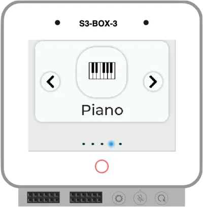

## Introduction

The ESP32 microcontroller is a versatile and powerful device, widely used in IoT and embedded applications. One of its advanced features is the ability to store multiple firmware images in its flash memory and switch between them. This capability can be leveraged for various purposes, such as testing different firmware versions, running multiple applications, or maintaining a backup firmware.

In this article, we will explore how to use the ESP32 Graphical Bootloader to switch between multiple firmware images stored in the flash memory. This bootloader serves as the primary application, allowing you to select and run different firmware images. We will also demonstrate how each application can switch back to the bootloader.

## How It Works

The bootloader allows the user to select an application from a graphical menu. Once an application is selected, the corresponding partition is chosen, and the chip reboots. The bootloader then switches to the newly selected application. During the startup of this application, there is a code segment that switches the boot partition back to the original application containing the bootloader. Consequently, after another restart, the original bootloader application is displayed again. The bootloader is using [OTA mechanism](https://docs.espressif.com/projects/esp-idf/en/stable/esp32/api-reference/system/ota.html), just the applications are already present in the flash memory.

## Partition Table

To enable multiple firmware images, we need a custom partition table. Below is an example of a file [partitions.csv](https://github.com/georgik/esp32-graphical-bootloader/blob/main/partitions.csv) that accommodates the bootloader and five OTA (Over-The-Air) partitions, designed for a 16MB flash memory commonly used in [ESP32-S3-BOX-3](https://github.com/espressif/esp-box) and [M5Stack-CoreS3](https://docs.m5stack.com/en/core/CoreS3):

```csv
# Name,      Type, Subtype,   Offset,  Size, Flags
nvs,         data, nvs,       0x9000,   24K,
otadata,     data, ota,       ,         8K,
phy_init,    data, phy,       ,         4K,
factory,     app,  factory,   ,         2M,
ota_0,       app,  ota_0,     ,         2816K,
ota_1,       app,  ota_1,     ,         2816K,
ota_2,       app,  ota_2,     ,         2816K,
ota_3,       app,  ota_3,     ,         2816K,
ota_4,       app,  ota_4,     ,         2816K,
```

This partition table should be defined in your project and the following option must be enabled in your [sdkconfig](https://github.com/georgik/esp32-graphical-bootloader/blob/main/sdkconfig.defaults) file:

```shell
CONFIG_PARTITION_TABLE_CUSTOM=y
```

## Set Up the Graphical Bootloader

### Quick Start with Pre-built Firmware

The example application is available as a binary image in [Releases](https://github.com/georgik/esp32-graphical-bootloader/releases).

It can be flashed to the device from address 0x0

```shell
esptool.py --chip esp32s3 write_flash 0x0000 graphical_bootloader_esp32-s3-box-3.bin
```

You can also run the simulation of the application in the web browser using Wokwi.

[](https://wokwi.com/experimental/viewer?diagram=https://gist.githubusercontent.com/urish/c3d58ddaa0817465605ecad5dc171396/raw/ab1abfa902835a9503d412d55a97ee2b7e0a6b96/diagram.json&firmware=https://github.com/georgik/esp32-graphical-bootloader/releases/latest/download/graphical-bootloader-esp32-s3-box.uf2
)

[Run on-line in Wokwi Simulator](https://wokwi.com/experimental/viewer?diagram=https://gist.githubusercontent.com/urish/c3d58ddaa0817465605ecad5dc171396/raw/ab1abfa902835a9503d412d55a97ee2b7e0a6b96/diagram.json&firmware=https://github.com/georgik/esp32-graphical-bootloader/releases/latest/download/graphical-bootloader-esp32-s3-box.uf2
)

### Clone the Repository

If you'd like to build your own version, please follow the instructions in this chapter.

Start by cloning the project repository:

```shell
git clone https://github.com/georgik/esp32-graphical-bootloader.git
cd esp32-graphical-bootloader
```

### Select the Target Board

Set the appropriate board using `BUILD_BOARD` variable. For example, to configure for ESP32-S3-BOX-3, use:

```shell
cmake -DBUILD_BOARD=esp-box-3 -Daction=build_all_apps -P Bootloader.cmake
```

List of other supported boards could be found in `boards` directory.


### Merge Binaries into a Single Image

After building, merge the binaries into a single image:

```shell
esptool.py --chip esp32s3 merge_bin  -o build.esp-box-3/combined.bin --flash_mode dio --flash_size 16MB \
    0x0 build.esp-box-3/bootloader/bootloader.bin \
    0x8000 build.esp-box-3/partition_table/partition-table.bin \
    0xf000 build.esp-box-3/ota_data_initial.bin \
    0x20000 build.esp-box-3/esp32-graphical-bootloader.bin \
    0x220000 apps/tic_tac_toe/build.esp-box-3/tic_tac_toe.bin \
    0x4E0000 apps/wifi_list/build.esp-box-3/wifi_list.bin \
    0x7A0000 apps/calculator/build.esp-box-3/calculator.bin \
    0xA60000 apps/synth_piano/build.esp-box-3/synth_piano.bin \
    0xD20000 apps/game_of_life/build.esp-box-3/game_of_life.bin
```

### Flash the Merged Binary to the ESP32

Finally, flash the combined binary to the ESP32:

```shell
esptool.py --chip esp32s3 write_flash 0x0 build.esp-box-3/combined.bin
```

## How to Use the Bootloader

Once flashed, the ESP32 will boot into the graphical bootloader. This bootloader allows you to select which application to run. The user interface is intuitive, and you can navigate through the different applications stored in the OTA partitions.

## Create a Custom Application

The following steps will explain how to create a custom ESP-IDF application for ESP32-S3-BOX-3 which works with the Graphical Bootloader.



```shell
idf.py create-project hello_app
cd hello_app
idf.py set-target esp32s3
idf.py add-dependency "espressif/esp-box-3^1.2.0"
idf.py add-dependency "espressif/esp_codec_dev==1.1.0"
cp ../calculator/sdkconfig.defaults .
cp ../calculator/sdkconfig.defaults.esp-box-3 .
```

### Switch to Application Stored in OTA Partition

The following code snippet from the bootloader shows how to switch to another application. This is particularly useful for managing multiple applications stored in different OTA partitions:

```c
// For button 1, next_partition will not change, thus pointing to 'ota_0'
if (next_partition && esp_ota_set_boot_partition(next_partition) == ESP_OK) {
    printf("Setting boot partition to %s\\n", next_partition->label);
    esp_restart();  // Restart to boot from the new partition
} else {
    printf("Failed to set boot partition\\n");
}
```

### Returning to the Original Application in Factory Partition

Each application can include a mechanism to switch back to the original application (bootloader). Here is an example function from one of the sub-applications:

```c
#include "esp_ota_ops.h"

void reset_to_factory_app() {
    // Get the partition structure for the factory partition
    const esp_partition_t *factory_partition = esp_partition_find_first(ESP_PARTITION_TYPE_APP, ESP_PARTITION_SUBTYPE_APP_FACTORY, NULL);
    if (factory_partition != NULL) {
        if (esp_ota_set_boot_partition(factory_partition) == ESP_OK) {
            printf("Set boot partition to factory, restarting now.\\n");
        } else {
            printf("Failed to set boot partition to factory.\\n");
        }
    } else {
        printf("Factory partition not found.\\n");
    }

    fflush(stdout);
}
```

This function can be called at the beginning of the application to ensure that the device reverts to the factory firmware (bootloader) in case of a crash. After this operation, any reset will boot into the original firmware.

In your application's `CMakeLists.txt`, ensure that you include the required dependency:

```shell
idf_component_register(SRCS "hello_app.c"
                    INCLUDE_DIRS "."
                    REQUIRES app_update)
```

### Application Code

Update the code of `main/hello_app.c` to switch to factory app and display a message on the screen.

```c
#include <stdio.h>
#include "freertos/FreeRTOS.h"
#include "freertos/task.h"
#include "esp_log.h"
#include "lvgl.h"
#include "bsp/esp-bsp.h"
#include "esp_ota_ops.h"

void reset_to_factory_app() {
    // Get the partition structure for the factory partition
    const esp_partition_t *factory_partition = esp_partition_find_first(ESP_PARTITION_TYPE_APP, ESP_PARTITION_SUBTYPE_APP_FACTORY, NULL);
    if (factory_partition != NULL) {
        if (esp_ota_set_boot_partition(factory_partition) == ESP_OK) {
            printf("Set boot partition to factory, restarting now.\\n");
        } else {
            printf("Failed to set boot partition to factory.\\n");
        }
    } else {
        printf("Factory partition not found.\\n");
    }

    fflush(stdout);
}

void app_main(void) {
    reset_to_factory_app();

    // Initialize the BSP
    bsp_i2c_init();
    bsp_display_start();

    // Create a label and set its text
    lv_obj_t *label = lv_label_create(lv_scr_act());
    lv_label_set_text(label, "Hello ESP32-S3-BOX-3");
    lv_obj_align(label, LV_ALIGN_CENTER, 0, 0);

    // Start the display backlight
    bsp_display_backlight_on();

    printf("Hello ESP32-S3-BOX-3\n");

    // Handle LVGL tasks
    while (1) {
        lv_task_handler();
        vTaskDelay(pdMS_TO_TICKS(10));
    }
}
```

### Flash the Application

You can build and flash the application directly to the OTA partition.

```shell
idf.py @../../boards/esp-box-3.cfg build
esptool.py --chip esp32s3 write_flash 0x220000 build.esp-box-3/hello_app.bin
```

### Change an Application Icon

Icons displayed in Graphical Bootloader are part of the bootloader firmware, it's not part of an application. Icons are stored in `resources/images`.

You can simply replace one of existing png files.

If you'd like to use your own name for icon, then update the bootloader code `main/bootloader_ui.c`:

```c
LV_IMG_DECLARE(icon_hello_app)
```

Register the icon to `main/CMakeLists.txt`. IDF build process will convert the icon to proper format.

```c
lvgl_port_create_c_image("../resources/images/icon_hello_app.png" "images/gen/" "ARGB8888" "NONE")
```

After the change of the icon, you need to rebuild and flash the main application:

```shell
idf.py @boards/esp-box-3 fullclean
idf.py @boards/esp-box-3 app-flash
```

## Useful Links

- [ESP32 Graphical Bootloader GitHub Repository](https://github.com/georgik/esp32-graphical-bootloader)
- [ESP-IDF Documentation](https://docs.espressif.com/projects/esp-idf/en/latest/)
- [ESP-BSP Components](https://components.espressif.com/components?q=tags:bsp)

## Conclusion

The ESP32 Graphical Bootloader provides a powerful way to manage multiple applications on a single device. By leveraging OTA partitions, you can store and switch between different applications with ease. Whether you're a maker looking to experiment with different projects or a professional needing multiple application environments, this bootloader simplifies the process.
