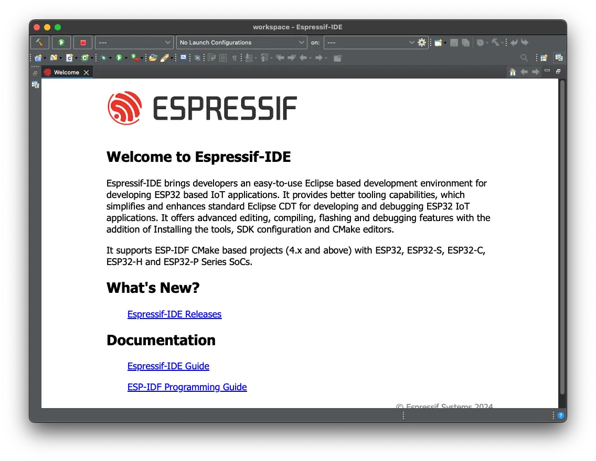

## How to create a blog post on the Developer Portal

[Please see the contribution guideline](../../pages/contribution-guide/content-writing-workflow)

## You can do:

Write your content in Markdown.

Markdown is a lightweight markup language that you can use to add formatting elements to plaintext text documents. It was created by John Gruber and Aaron Swartz in 2004 to help people "write using an easy-to-read and easy-to-write plain text format, optionally convert it to structurally valid XHTML (or HTML)".

### Add images

Store all your images on inside the assets folder.

### Add code block


#include <stdio.h>
#include "led_strip.h"

// 10MHz resolution, 1 tick = 0.1us (led strip needs a high resolution)
#define LED_STRIP_RMT_RES_HZ  (10 * 1000 * 1000)

led_strip_handle_t led_strip;

void configure_led(void)
{
    // LED strip general initialization, according to your led board design
    led_strip_config_t strip_config = {
        // Set the GPIO that the LED is connected
        .strip_gpio_num = 8,
        // Set the number of connected LEDs in the strip
        .max_leds = 1,
        // Set the pixel format of your LED strip
        .led_pixel_format = LED_PIXEL_FORMAT_GRB,
        // LED strip model
        .led_model = LED_MODEL_WS2812,
        // In some cases, the logic is inverted
        .flags.invert_out = false,
    };

    // LED strip backend configuration: RMT
    led_strip_rmt_config_t rmt_config = {
        // Set the clock source
        .clk_src = RMT_CLK_SRC_DEFAULT,
        // Set the RMT counter clock
        .resolution_hz = LED_STRIP_RMT_RES_HZ,
        // Set the DMA feature (not supported on the ESP32-C6)
        .flags.with_dma = false,
    };

    // LED Strip object handle
    led_strip_new_rmt_device(&strip_config, &rmt_config, &led_strip);
}

void app_main(void)
{
    configure_led();
    led_strip_set_pixel(led_strip, 0, 20, 0, 0);
    led_strip_refresh(led_strip);
}


You can highlight some specific lines on your code:


    led_strip_config_t strip_config = {
        // Set the GPIO8 that the LED is connected
        .strip_gpio_num = 8,
        // Set the number of connected LEDs, 1
        .max_leds = 1,
        // Set the pixel format of your LED strip
        .led_pixel_format = LED_PIXEL_FORMAT_GRB,
        // LED model
        .led_model = LED_MODEL_WS2812,
        // In some cases, the logic is inverted
        .flags.invert_out = false,
    };


### Add YouTube videos



### Add Asciinema

[Please see the contribution guideline](../../pages/contribution-guide/asciinema-casts)

### Flow Charts

[Please see the contribution guideline](../../pages/contribution-guide/content-writing-workflow)

### Timeline

The following table shows ESP-IDF support of Espressif SoCs where alt text and alt text denote preview status and support, respectively. The preview support is usually limited in time and intended for beta versions of chips. Please use an ESP-IDF release where the desired SoC is already supported.




ESP32
ESP32-S2
ESP32-C3
ESP32-S3



ESP32-C2



ESP32-C6
ESP32-H2



ESP32
ESP32-S2
ESP32-C3
ESP32-S3



ESP32-P4
ESP32-C5




### Links

GitHub repository links



### Extra

Please see the [shortcodes](https://blowfish.page/docs/shortcodes/) for more features.
