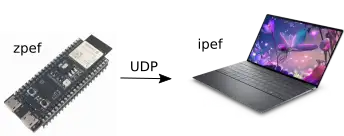
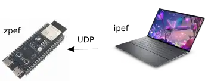
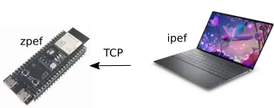
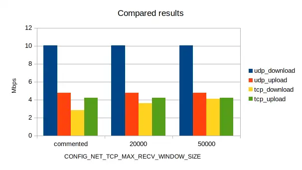

Those who develop IoT applications based on Zephyr OS often need to optimize the communication performance. It can be done by tweaking the Wi-Fi network stack parameters. However, how do you evaluate the resulting changes and find the most suitable configuration? In this article, we will overview a method to optimize communication performance by using the `iperf` and `zperf` tools.

`iperf` is a tool that allows generating network traffic to measure the maximum achievable network bandwidth. `zperf` is a very similar tool but designed for Zephyr OS.


## 1. Prepare the testing environment

To evaluate the communication performance, we are going to use the following setup:

- Wi-Fi home router
- ESP32-S3-DevKitC-1
- Computer running Ubuntu 22.04


To simplify packet generation and consumption on the Wi-Fi network, we will use `iperf` on the computer and zperf on the ESP32-S3-DevKitC-1. `zperf` is included in the standard Zephyr distribution.

This structured testing approach allows to systematically analyze the impact of Zephyr parameter adjustments on Wi-Fi communication in various real-world scenarios, including:

- ESP32 Sending UDP Packets to PC:
  
- PC Sending UDP Packets to ESP32
  
- ESP32 Sending TCP Packets to PC
  
- PC sending TCP Packets to ESP32:
  

## 2. Configure your computer

We are going to install the following on the computer:

- `iperf`
- Zephyr OS

### 2.1. Install `iperf`

On a terminal window, execute the following command:

```sh
sudo apt-get install iperf
```

Please note that administrator privileges are required to successfully complete this installation.


### 2.2. Install Zephyr OS

To setup Zephyr OS and its dependencies, follow the instructions in the subsections.


#### 2.2.1. Install Dependencies

On a terminal window, execute the following command:

```sh
sudo apt install --no-install-recommends \
  git cmake ninja-build gperf ccache dfu-util device-tree-compiler wget \
  python3-dev python3-pip python3-setuptools python3-tk python3-wheel \
  xz-utils file make gcc gcc-multilib g++-multilib libsdl2-dev libmagic1
```


#### 2.2.2. Install West

Install the Python script that manages the Zephyr OS build system by running:

```sh
pip install west
```


#### 2.2.3. Initialize Zephyr

Now, initialize Zephyr on your machine by running:

```sh
west init ~/zephyrproject
cd ~/zephyrproject
west update
```


#### 2.2.4. Install Python dependencies

After initializing Zephyr, install additional Python dependencies by running:

```sh
pip install -r ~/zephyrproject/zephyr/scripts/requirements.txt
```


#### 2.2.5. Download and Install Zephyr SDK

For cross-compiling `zperf`, download and install the Zephyr SDK by running:

```sh
cd ~
wget https://github.com/zephyrproject-rtos/sdk-ng/releases/download/v0.16.8/zephyr-sdk-0.16.8_linux-x86_64.tar.xz
wget -O - https://github.com/zephyrproject-rtos/sdk-ng/releases/download/v0.16.8/sha256.sum | shasum --check --ignore-missing
tar xvf zephyr-sdk-0.16.8_linux-x86_64.tar.xz
cd zephyr-sdk-0.16.8

./setup.sh
```


#### 2.2.6. Install Espressif binary blobs

To successfully build your ESP32-S3 Wi-Fi application on Zephyr, install the `hal_espressif` binary blobs:

```sh
west blobs fetch hal_espressif
```


#### 2.2.7. Install udev rules

Additionally, install udev rules to allow flashing ESP32-S3 as a regular user:

```sh
sudo cp /opt/zephyr-sdk-0.16.4/sysroots/x86_64-pokysdk-linux/usr/share/openocd/contrib/60-openocd.rules /etc/udev/rules.d
sudo udevadm control --reload
```

## 3. Configure your ESP32-S3-DevKitC-1

To run `zperf` on your ESP32-S3-DevKitC-1, do the following:

- Create the overlay file
- Build and flash `zperf`

### 3.1. Create the overlay file

- Create the file `zephyr/samples/net/zperf/boards/esp32s3_devkitc.overlay` and add the following content:
  ```sh
  /*
  * Copyright (c) 2024 Espressif Systems (Shanghai) Co., Ltd.
  *
  * SPDX-License-Identifier: Apache-2.0
  */
  &wifi {
      status = "okay";
  };
  ```
- To the file `zephyr/samples/net/zperf/prj.conf`, add the following:
  ```sh
  CONFIG_NET_BUF_DATA_SIZE=1500
  CONFIG_NET_IF_UNICAST_IPV4_ADDR_COUNT=1
  CONFIG_NET_MAX_CONTEXTS=5
  CONFIG_NET_TC_TX_COUNT=1
  CONFIG_NET_SOCKETS=y
  CONFIG_NET_SOCKETS_POSIX_NAMES=y
  CONFIG_NET_SOCKETS_POLL_MAX=4
  CONFIG_POSIX_MAX_FDS=8
  CONFIG_INIT_STACKS=y
  CONFIG_TEST_RANDOM_GENERATOR=y
  CONFIG_NET_L2_ETHERNET=y
  CONFIG_NET_SHELL=y
  CONFIG_NET_L2_WIFI_SHELL=y
  CONFIG_NET_CONFIG_SETTINGS=y
  CONFIG_LOG=y
  CONFIG_SHELL_CMDS_RESIZE=n
  CONFIG_NET_IPV6=n
  CONFIG_NET_DHCPV4=n
  CONFIG_NET_CONFIG_MY_IPV4_ADDR="<STATION IP ADDRESS>"
  CONFIG_NET_CONFIG_MY_IPV4_GW="<GATEWAY IP ADDRESS>"
  CONFIG_NET_CONFIG_MY_IPV4_NETMASK="255.255.255.0"
  CONFIG_NET_TCP_MAX_RECV_WINDOW_SIZE=50000
  ```
  Replace `<STATION IP ADDRESS>` and `<GATEWAY IP ADDRESS>` with the actual IP addresses relevant to your network configuration.


### 3.2. Build and flash `zperf`

> Note: After updating any configuration parameters in `zephyr/samples/net/zperf/prj.conf` , build `zperf` and flash it onto the ESP32-S3-DevKitC-1.

Ensure that the ESP32-S3-DevKitC-1 is connected to the computer via USB, then run a testing sequence using the following west commands:

```sh
west build -b esp32s3_devkitc/esp32s3/procpu zephyr/samples/net/zperf --pristine
west flash
west espressif monitor
```


## 4. Run the tests

Before starting the testing sequence, always remember to [build and flash zperf](#32-build-and-flash-zperf).


After the build and flash commands, you will access the `zperf` terminal. Connect the ESP32-S3-DevKitC-1 to the Wi-Fi router using the following steps:

```sh
wifi connect <SSID> <PASSWORD>
net ping <PC_IP>
```

Testing run output:

```sh
*** Booting Zephyr OS build zephyr-v3.5.0-2714-g031c842ecb76 ***
[00:00:00.387,000] <inf> net_config: Initializing network
[00:00:00.387,000] <inf> net_config: Waiting interface 1 (0x3fcc8810) to be up...
[00:00:00.388,000] <inf> net_config: Interface 1 (0x3fcc8810) coming up
[00:00:00.388,000] <inf> net_config: IPv4 address: 192.168.15.2
uart:~$ wifi connect <SSID> <PASSWORD>
Connection requested
Connected
uart:~$ net ping 192.168.15.8
PING 192.168.15.8
28 bytes from 192.168.15.8 to 192.168.15.2: icmp_seq=1 ttl=64 time=219 ms
28 bytes from 192.168.15.8 to 192.168.15.2: icmp_seq=2 ttl=64 time=434 ms
28 bytes from 192.168.15.8 to 192.168.15.2: icmp_seq=3 ttl=64 time=356 ms
uart:~$
```

Now, open a second terminal where you will run `iperf`.


### 4.1. ESP32 Sending UDP Packets to PC:

On the `iperf` terminal, type:

```sh
iperf -s -l 1K -u -B 192.168.15.8
```

On the `zperf` terminal, type:

```sh
zperf udp upload 192.168.15.6 5001 10 1K 5M
```


### 4.2. PC Sending UDP Packets to ESP32:

On the `zperf` terminal, type:

```sh
zperf udp download 5001
```

On the `iperf` terminal, type:

```sh
iperf -l 1K -u -c 192.168.15.2 -b 10M
```

### 4.3. ESP32 Sending TCP Packets to PC

On the `iperf` terminal, type:

```sh
iperf -s -l 1K -B 192.168.15.8
```

On the `zperf` terminal, type:

```sh
zperf tcp upload 192.168.15.8 5001 10 1K 5M
```

### 4.4. C Sending TCP Packets to ESP32

On the `zperf` terminal, type:

```sh
zperf tcp download 5001
```

On the `iperf` terminal, type:

```sh
zperf tcp download 5001
```


## 5. Results

To illustrate the tangible impact of adjusting network-sensitive parameters for ESP32-S3 Wi-Fi throughput, we conducted a series of tests, each time modifying the parameter `CONFIG_NET_TCP_MAX_RECV_WINDOW_SIZE`. The result highlights the performance progression before and after parameter changes:


### 5.1. Initial Configuration

The parameter `CONFIG_NET_TCP_MAX_RECV_WINDOW_SIZE` commented out.

<table>
<thead>
  <tr>
    <th>DEVICE </th>
    <th>PROTOCOL  </th>
    <th>ROLE </th>
    <th>DIRECTION </th>
    <th>RATE </th>
  </tr>
</thead>
<tbody>
  <tr>
    <td rowspan="4"> ESP32-S3 </td>
    <td rowspan="2">UDP </td>
    <td>SERVER </td>
    <td>DOWNLOAD </td>
    <td>10.05 Mbps </td>
  </tr>
  <tr>
    <td>CLIENT </td>
    <td>UPLOAD </td>
    <td>4.78 Mbps </td>
  </tr>
  <tr>
    <td rowspan="2">TCP </td>
    <td>SERVER </td>
    <td>DOWNLOAD </td>
    <td>2.83 Mbps </td>
  </tr>
  <tr>
    <td>CLIENT </td>
    <td>UPLOAD </td>
    <td>4.22 Mbps </td>
  </tr>
</tbody>
</table>

### 5.2. Modified Configuration (Increased Window Size):

The parameter `CONFIG_NET_TCP_MAX_RECV_WINDOW_SIZE=20000`

<table>
<thead>
  <tr>
    <th>DEVICE </th>
    <th>PROTOCOL  </th>
    <th>ROLE </th>
    <th>DIRECTION </th>
    <th>RATE </th>
  </tr>
</thead>
<tbody>
  <tr>
    <td rowspan="4"> ESP32-S3 </td>
    <td rowspan="2">UDP </td>
    <td>SERVER </td>
    <td>DOWNLOAD </td>
    <td>10.05 Mbps </td>
  </tr>
  <tr>
    <td>CLIENT </td>
    <td>UPLOAD </td>
    <td>4.78 Mbps </td>
  </tr>
  <tr>
    <td rowspan="2">TCP </td>
    <td>SERVER </td>
    <td>DOWNLOAD </td>
    <td>3.62 Mbps </td>
  </tr>
  <tr>
    <td>CLIENT </td>
    <td>UPLOAD </td>
    <td>4.22 Mbps </td>
  </tr>
</tbody>
</table>

### 5.3. Further Modified Configuration (Increased Window Size):

The parameter `CONFIG_NET_TCP_MAX_RECV_WINDOW_SIZE=50000`

<table>
<thead>
  <tr>
    <th>DEVICE </th>
    <th>PROTOCOL  </th>
    <th>ROLE </th>
    <th>DIRECTION </th>
    <th>RATE </th>
  </tr>
</thead>
<tbody>
  <tr>
    <td rowspan="4"> ESP32-S3 </td>
    <td rowspan="2">UDP </td>
    <td>SERVER </td>
    <td>DOWNLOAD </td>
    <td>10.05 Mbps </td>
  </tr>
  <tr>
    <td>CLIENT </td>
    <td>UPLOAD </td>
    <td>4.78 Mbps </td>
  </tr>
  <tr>
    <td rowspan="2">TCP </td>
    <td>SERVER </td>
    <td>DOWNLOAD </td>
    <td>4.07 Mbps </td>
  </tr>
  <tr>
    <td>CLIENT </td>
    <td>UPLOAD </td>
    <td>4.22 Mbps </td>
  </tr>
</tbody>
</table>

### 5.4. Comparative results chart

These results are provided below.



These are valuable insights into the dynamic relationship between network parameters and ESP32-S3 Wi-Fi throughput. It is possible to fine-tune these parameters to achieve optimal performance in diverse network scenarios.

## 6. Conclusion

This article presented how to measure communication performance in response to changes in the values of the Zephyr OS Wi-Fi network stack configuration parameter. The ESP32-S3-DevKitC-1 development board was used.

By installing, configuring, and utilizing the `iperf` and `zperf` tools, and following the procedure outlined in this article, it is possible to tangibly observe the performance evolution as the configuration parameters are modified.
