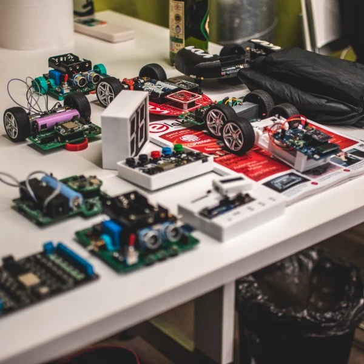


New event!


## Další komunitní event se blíží

Ano! Tento rok jsme se rozhodli uspořádat dva komunitní eventy. Na základě našich i Vašich zpětných vazeb chceme tento pojmout trochu jinak a dát větší prostor workshopu. Pro event jsme také zvolili nové příjemné místo, a to hned nad prostory naší české kanceláře v Bochnerově paláci v areálu Vlněny. Pokud tě baví bastlení, programování, zkrátka cokoli kolem našich ESPéček, nebo si prostě zvědavý na naše novinky a chceš si popovídat s našimi vývojáři, tohle si nesmíš nechat ujít!

### Na co se můžeš těšit:

<article class="gallery">
  
  
  
  
  
  
  
  
</article>

- **Přednášky**: Čekají tě inspirativní přednášky od vývojářů z Espressifu, lokálních firem a zapálených nadšenců do ESP! Přijď si poslechnout nejnovější trendy, tipy a triky přímo od lidí, kteří tvoří budoucnost těchto technologií.

- **Workshop**: Připravili jsme pro tebe dvouhodinový praktický workshop, kde si budeš moci osahat vývoj na našem novém čipu **ESP32-C6** s **ESP-IDF** frameworkem. Důraz bude kladen na snadný přechod od jednodušších frameworků, jako jsou Arduino nebo MicroPython. Budeš mít jedinečnou příležitost ponořit se do vývoje s podporou odborníků! Nezapomeň si vzít **vlastní notebook**, a pokud máš, přibal si s sebou **kabel s USB-C koncovkou**. O vše ostatní se postaráme my a **devkit je po workshopu tvůj**.

- **Praktická dema**: Sestrojili jsme funkční ukázky nových čipů, které nejsou jen na obdivování, ale můžeš si je rovnou sám vyzkoušet! Přijď objevit co všechno ESP dokážou.

- **Networking**: Uvolněná atmosféra u pivka s lidmi, kteří sdílejí stejné nadšení! Poznej nové přátele, popovídej si s tech influencery a promluv si s našimi vývojáři. Toto je ideální příležitost navázat nové kontakty a sdílet své nápady s komunitou.

### Důležité informace:

- **Kdy:** 18. 10. 2024 od 15:00 do 21:00
- **Kde:** Akce proběhne v Bochnerově paláci v areálu Vlněna na adrese **Přízova 3** (vstup je z vnitrobloku Vlněny)

Místa jsou omezená, zajisti si to své co nejdříve ve formuláři níže! **Vstup je zdarma**, ale **vyžaduje registraci**. Tu prosím vyplň jen tehdy, pokud se opravdu chystáš přijít.

<iframe src="https://docs.google.com/forms/d/e/1FAIpQLSeqeP4L90wLu0om38q-wvxKYKI1_Y4Hf4T928NQI8LBW4mHhQ/viewform?embedded=true" width="640" height="1400" frameborder="0" marginheight="0" marginwidth="0">Načítání…</iframe>

Podrobnější informace o akci zveřejníme brzy, takže sleduj tuto stránku a naše další kanály. Na místě bude samozřejmě zajištěno **občerstvení, pivo i nealko**, takže se můžeš těšit na pohodový večer plný technologií a skvělé atmosféry!

Těšíme se na Tebe!

Team Espressif Systems

<iframe width="600" height="200" frameborder="0" scrolling="no" marginheight="0" marginwidth="0" src="https://maps.google.com/maps?width=600&amp;height=200&amp;hl=en&amp;q=Espressif%20System%20Czech+(Espressif%20Systems%20(Czech)%20s.r.o.)&amp;t=&amp;z=15&amp;ie=UTF8&amp;iwloc=B&amp;output=embed"><a href="https://www.gps.ie/">gps systems</a></iframe>

