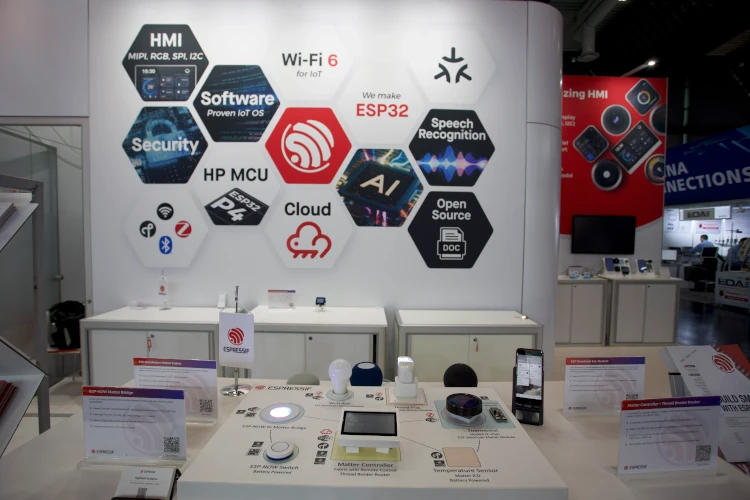
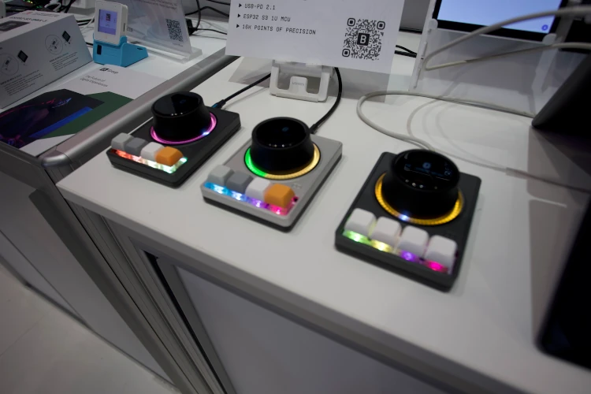
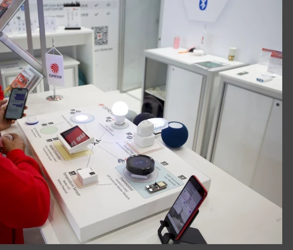
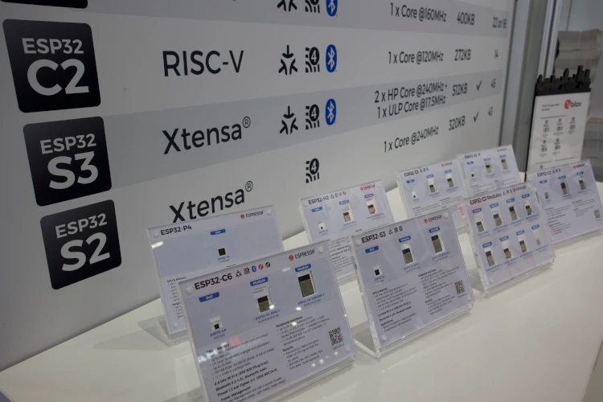
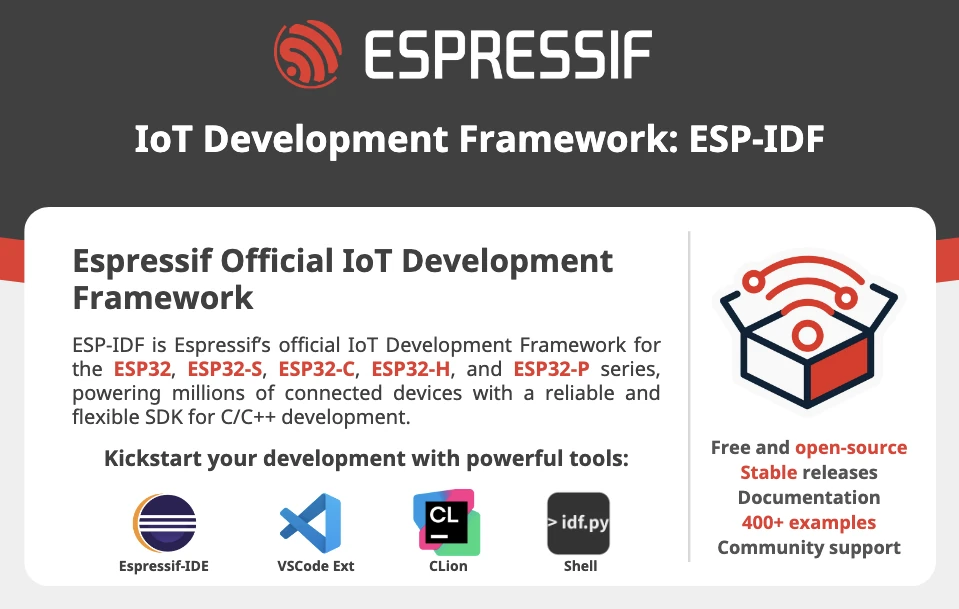
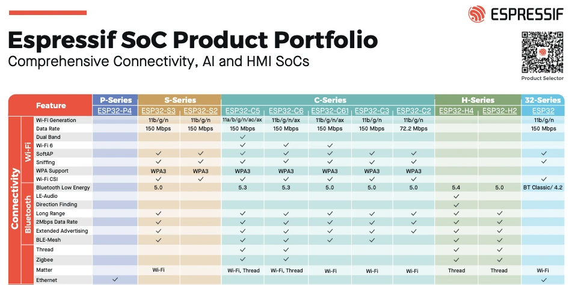
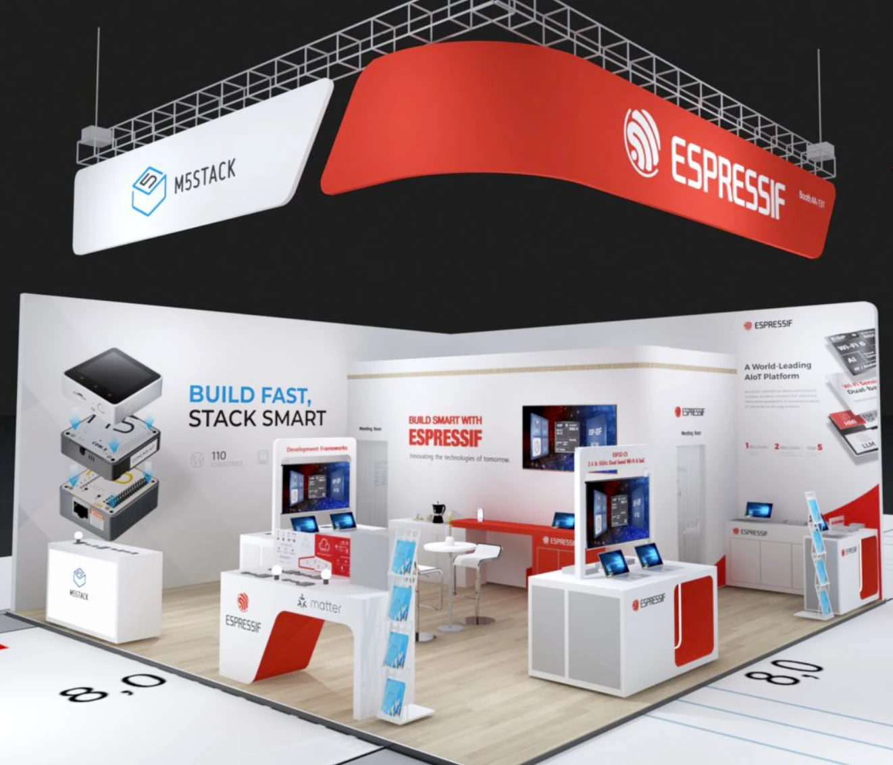

We're thrilled to announce that Espressif will once again be attending Embedded World 2025 in Nuremberg!

:calendar: __Dates:__ March 11th (Tuesday) - March 13th (Thursday)

:round_pushpin: __Location:__ [Nürnberg Messe](https://maps.app.goo.gl/VxCwWjMbHgogbsTd6), Hall __4A__, Booth __131__

Come visit us and dive into the latest innovations and breakthroughs from Espressif! 

This is your chance to meet and interact with our developers, explore live demos, and discuss the most recent advancements in __ESP-IDF__ and all our frameworks. We'll be showcasing our newest technologies and sharing insights on how they can be leveraged to build smarter, more efficient solutions.

Together with us, you will also find [__M5Stack__](https://m5stack.com/) and their incredible modular systems. 

:tada: What's waiting for you at our booth?
- :rocket: __New SoCs:__ Get the latest updates, including the powerful __ESP32-C5__ and the efficient __ESP32-H4__. 
- :robot: __AI & HMI Solutions:__ Explore how __ESP32-P4__ and __ESP32-S3__ are revolutionizing the fields of embedded Artificial Intelligence and Human-Machine Interfaces, enabling innovative and cost-sensitive solutions. 
- :cloud: __Rainmaker & Matter:__ Learn more about our cutting-edge IoT solutions and how they enable seamless smart home and cloud integrations, ensuring compatibility and ease of deployment.
- :video_game: __Gaming Classics, Reimagined:__ Witness classic video games brought back to life on Espressif's platforms.

<article class="gallery">
    
    
    
    
    
    
    
    
</article>

Whether you're a developer, engineer, or enthusiast, there will be something for everyone. We'll also have technical experts available for in-depth discussions and to answer your questions directly. 

See you in Nuremberg!

## Download Material

- [Update product catalog](https://dl.espressif.com/public/Espressif%20SoC%20Product%20Portfolio.pdf)
- [ESP-IDF news flyer](https://dl.espressif.com/public/Espressif-Embedded-World-Flyer-Final-ESP-IDF.pdf)
- [ESP-Rust news flyer](https://dl.espressif.com/public/Espressif-Embedded-World-Flyer-Final-Rust.pdf)
- [Arduino news flyer](https://dl.espressif.com/public/Espressif-Embedded-World-Flyer-Final-Arduino.pdf)
- [Zephyr news flyer](https://dl.espressif.com/public/Espressif-Embedded-World-Flyer-Final-Zephyr.pdf)

