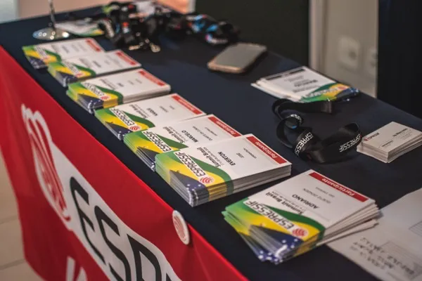
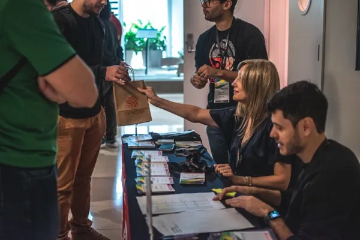
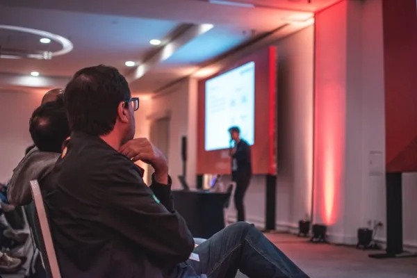
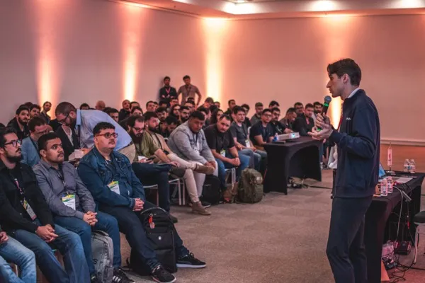
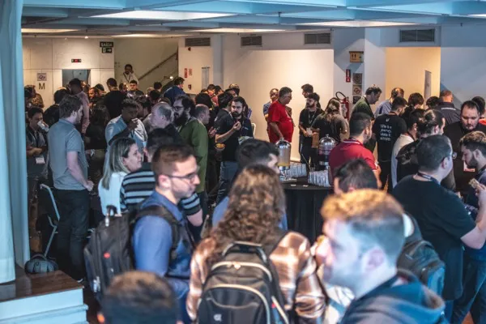
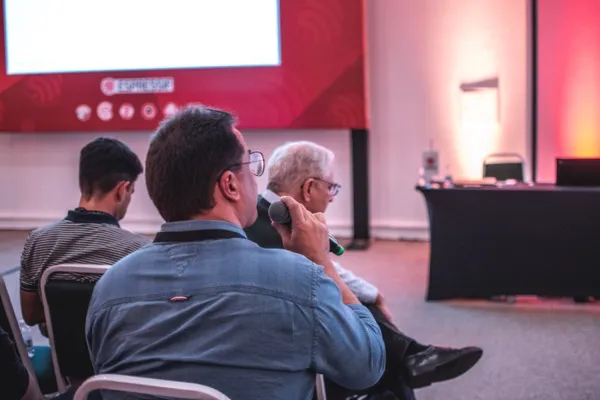
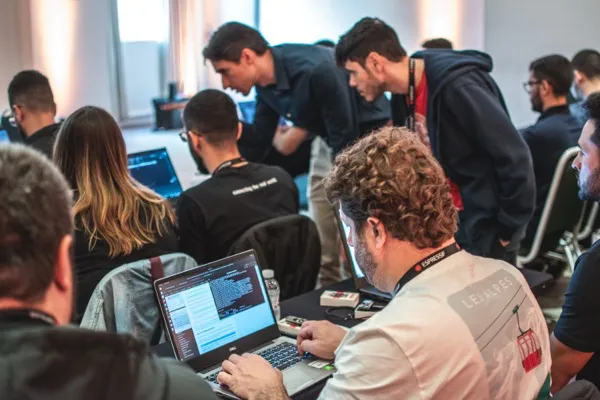

Nos dias 5 e 6 de agosto, Campinas (SP) receberá a segunda edição do **Espressif Summit Brazil**, que ocorrerá no moderno Hotel Vitória Concept. O evento tem início às 9h00, com um welcome coffee, seguido do keynote pontualmente às 9h30.

Após o sucesso da edição inaugural, o Summit retorna trazendo uma programação ampliada, com conteúdos exclusivos focados na comunidade técnica. O primeiro dia será marcado por uma série de palestras ministradas por renomados especialistas da Espressif, incluindo convidados internacionais, abordando os mais recentes avanços em IoT, segurança digital, hardware, software, firmware e conectividade wireless. Os temas das palestras incluem **Arduino**, **ESP-IDF**, **NuttX**, **Zephyr**, **segurança**, **redes**, **protocolos**, **RainMaker**, **Matter** e muito mais.

No segundo dia, o público terá acesso a uma agenda diversificada com palestras adicionais, workshops práticos (vagas limitadas), sessões interativas de hardware hacking, além de painéis de discussão e muitas oportunidades para ampliar conexões profissionais, trocar experiências e realizar networking com especialistas da indústria.

Durante todo o evento, haverá também uma área de exposições com a participação de empresas parceiras e distribuidores, apresentando produtos inovadores, protótipos avançados e soluções comerciais desenvolvidas com tecnologias Espressif. Os visitantes poderão ainda conferir ferramentas e recursos técnicos essenciais para acelerar o desenvolvimento de dispositivos conectados.

Se você é desenvolvedor, arquiteto de sistemas, especialista em segurança, engenheiro de hardware, ou simplesmente apaixonado por inovação tecnológica, o Espressif Summit Brazil 2025 é imperdível.

Venha participar deste grande encontro de tecnologia, inovação e colaboração com a Espressif e sua comunidade de parceiros!

<article class="gallery">
    
    
    
    
    
    
    
    
</article>

## Como participar

As inscrições para as palestras dos dois dias serão gratuitas. Os workshops terão um custo adicional. As inscrições serão realizadas pelo [Portal Embarcados](https://embarcados.com.br/) e as vagas são limitadas. Garanta já a sua [aqui](https://embarcados.com.br/espressif-summit-brasil-2025/)!

## Agenda

### Dia 5 de Agosto

- **09h00**: Welcome Coffee
- **09h30**: Boas vindas e Keynote
- **10h30 às 12h00**: Palestras Técnicas
- **12h00 às 13h00**: Intervalo para Almoço e Networking
- **13h00 às 17h30**:  Palestras Técnicas
- **17h30 às 18h00**: Encerramento do Dia

### Dia 6 de Agosto

- **08h30**: Welcome Coffee
- **09h00 às 12h00**: Workshops Práticos (***salas workshop 1 e 2***)
- **09h00 às 12h00**: Palestras (***sala talks & hackespace***)
- **12h00 às 13h00**: Intervalo para Almoço e Networking
- **13h00 às 17h00**: Workshops Práticos (***salas workshop 1 e 2***)
- **13h00 às 17h00**: Palestras, Painéis e Sessões de Hardware Hacking (***sala talks & hackespace***)
- **17h00 às 17h30**: Encerramento Oficial e Agradecimentos (***sala talks & hackespace***)

## Palestras

| Horário | Tópico                                                                                 | Palestrante(s)                                   | Slides  |
|---------|----------------------------------------------------------------------------------------|--------------------------------------------------|---------|
| 09:30   | Boas vindas e Keynote                                                                  | Ivan Grokhotkov                                  |         |
| 10:00   | Apresentação Corporativa: M5Stack and Embarcados                                       | Allen Chao, Thiago Lima                          | [📥](https://dl.espressif.com/public/10-00-Allen-Chao-M5Stack-Corporate-Overview.pdf) [📥](https://dl.espressif.com/public/10-00-Thiago-Lima-Embarcados-Corporate-Overview.pdf) |
| 10:30   | Uma atualização sobre as soluções da Espressif: De A(rduino) a Z(ephyr)                | Pedro Minatel, Ivan Grokhotkov, Ricardo Tafas    | [📥](https://dl.espressif.com/public/10-30-Ricardo-Tafas-A-to-Z.pdf) [📥](https://dl.espressif.com/public/10-30-Ivan-Grokhotkov-A-to-Z.pdf) |
| 11:30   | Interoperabilidade e inovação para casas inteligentes: RainMaker e Matter              | Pedro Minatel                                    | [📥](https://dl.espressif.com/public/11-30-Pedro%20Minatel-Interoperabilityand-Innovation-for-Smart-Homes-Exploring-RainMaker-and-Matter.pdf) |
| 13:00   | Segurança em dispositivos ESP32 – Um panorama de como proteger seu projeto             | Amey Inamdar                                     | [📥](https://dl.espressif.com/public/13-00-Amey-Inamdar-Security-in-ESP32-Devices-An-Overview-of-How-to-Protect-Your-Project.pdf) |
| 14:00   | Colocando o S no IoT: Conectividade segura com o ESP-IDF                               | Euripedes Rocha                                  | [📥](https://dl.espressif.com/public/14-00-Euripedes-Rocha-Putting-the-S-in-IoT-Secure-Connectivity-with-ESP-IDF.pdf) |
| 15:00   | ESP-BIST: Simplificando o desenvolvimento de aplicações seguras                        | Lucas Tamborrino                                 | [📥](https://dl.espressif.com/public/15-00-Lucas-Tamborrino-ESP-BIST-Simplifying-the-Development-of-Secure-Applications.pdf) |
| 16:00   | Python em NuttX: novas possibilidades para sistemas embarcados                         | Tiago Medicci                                    | [📥](https://dl.espressif.com/public/16-00-Tiago-Medicci-Python-on-NuttX-New-Possibilities-for-Embedded-Systems.pdf) |
| 16:30   | Zigbee com Arduino: conectando seus dispositivos ao Home Assistant                     | Lucas Vaz                                        | [📥](https://dl.espressif.com/public/16-30-Lucas-Vaz-Zigbee-with-Arduino-Connecting-Your-Devices-to-Home-Assistant.pdf) |
| 17:00   | Projetos ESP-IDF de alto desempenho: como usar CI/CD para ganhar agilidade e confiança | Pedro Minatel                                    | [📥](https://dl.espressif.com/public/17-00-Pedro-Minatel-High-Performance-ESP-IDF-Projects-How-to-Use-CI-CD-to-Gain-Agility-and-Confidence.pdf) |

## Workshops

| Horário | Workshop                                                                                    | Instrutor(es)             | Slides                                                            |
|---------|---------------------------------------------------------------------------------------------|---------------------------|-------------------------------------------------------------------|
| 09:00   | ESP-IDF básico: do zero ao seu primeiro projeto com ESP32 e componentes                     | Pedro, Fabio              | [📥](https://developer.espressif.com/workshops/esp-idf-basic/)    |
| 09:00   | ESP-IDF avançado: técnicas e ferramentas avançadas para dominar o desenvolvimento com ESP32 | Ivan, Euripedes           | [📥](https://developer.espressif.com/workshops/esp-idf-advanced/) |
| 13:00   | Arduino no ESP-IDF: simplificando o desenvolvimento com flexibilidade                       | Rodrigo Garcia, Lucas V.  | [📥](https://github.com/SuGlider/Espressif_Brazil_Summit_2025)    |
| 13:00   | Apresentando o ESP32-P4 para soluções de conectividade                                      | Euripedes, Guilherme      | [📥](https://dl.espressif.com/public/p4-slides-export.pdf)        |

## Sobre a Espressif

A Espressif Systems (SSE: 688018.SH) é uma empresa pública, multinacional e fabless de semicondutores, que desenvolve chips de comunicação sem fio de última geração e baixo consumo de energia. Nossas soluções de AIoT são sustentáveis, versáteis e acessíveis, atendendo a uma ampla variedade de aplicações inteligentes em diversos setores. Com um ciclo de desenvolvimento completo, inovamos em todas as camadas da tecnologia — desde os protocolos Wi-Fi, Bluetooth LE e IEEE 802.15.4, até RF, MCUs RISC-V, algoritmos de IA, sistemas operacionais, toolchains, frameworks de AIoT e serviços em nuvem.

### Nossa Missão e Visão

Na Espressif, temos o compromisso de oferecer soluções de AIoT open-source que capacitam tanto empresas quanto desenvolvedores. Ao disponibilizar ferramentas acessíveis e recursos abrangentes, fortalecemos uma comunidade global de inovadores que buscam gerar impacto positivo no mundo real. Nossa visão é promover a colaboração, inspirar a criatividade e impulsionar o avanço tecnológico rumo a um futuro mais conectado, eficiente e sustentável.

