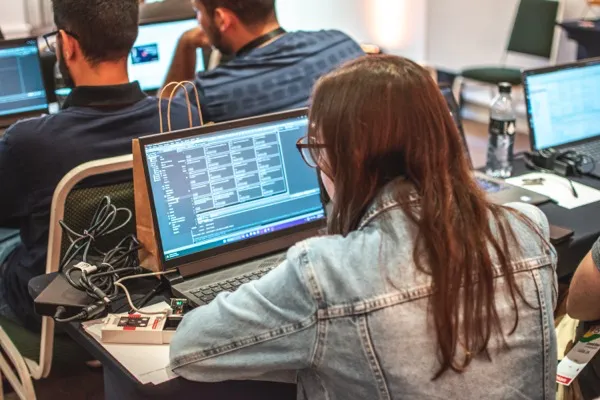

Nos dias 5 e 6 de agosto, Campinas (SP) receberá a segunda edição do **Espressif Summit Brazil**, que ocorrerá no moderno Hotel Vitória Concept. O evento tem início às 9h00, com um welcome coffee, seguido do keynote pontualmente às 9h30.

Após o sucesso da edição inaugural, o Summit retorna trazendo uma programação ampliada, com conteúdos exclusivos focados na comunidade técnica. O primeiro dia será marcado por uma série de palestras ministradas por renomados especialistas da Espressif, incluindo convidados internacionais, abordando os mais recentes avanços em IoT, segurança digital, hardware, software, firmware e conectividade wireless. Os temas das palestras incluem **Arduino**, **ESP-IDF**, **NuttX**, **Zephyr**, **segurança**, **redes**, **protocolos**, **RainMaker**, **Matter** e muito mais.

No segundo dia, o público terá acesso a uma agenda diversificada com palestras adicionais, workshops práticos (vagas limitadas), sessões interativas de hardware hacking, além de painéis de discussão e muitas oportunidades para ampliar conexões profissionais, trocar experiências e realizar networking com especialistas da indústria.

Durante todo o evento, haverá também uma área de exposições com a participação de empresas parceiras e distribuidores, apresentando produtos inovadores, protótipos avançados e soluções comerciais desenvolvidas com tecnologias Espressif. Os visitantes poderão ainda conferir ferramentas e recursos técnicos essenciais para acelerar o desenvolvimento de dispositivos conectados.

Se você é desenvolvedor, arquiteto de sistemas, especialista em segurança, engenheiro de hardware, ou simplesmente apaixonado por inovação tecnológica, o Espressif Summit Brazil 2025 é imperdível.

Venha participar deste grande encontro de tecnologia, inovação e colaboração com a Espressif e sua comunidade de parceiros!

<article class="gallery">
    
    
    
    
    
    
    
    
</article>

## Como participar

As inscrições para as palestras dos dois dias serão gratuitas. Os workshops terão um custo adicional. As inscrições serão realizadas pelo [Portal Embarcados](https://embarcados.com.br/) e as vagas são limitadas. Garanta já a sua [aqui](https://embarcados.com.br/)!

## Agenda

### Dia 5 de Agosto

- **09h00**: Welcome Coffee
- **09h30**: Boas vindas e Keynote
- **10h30 às 12h00**: Palestras Técnicas
- **12h00 às 13h00**: Intervalo para Almoço e Networking
- **13h00 às 17h30**:  Palestras Técnicas
- **17h30 às 18h00**: Encerramento do Dia

### Dia 6 de Agosto

- **08h30**: Welcome Coffee
- **09h00 às 12h00**: Workshops Práticos (***salas workshop 1 e 2***)
- **09h00 às 12h00**: Palestras (***sala talks & hackespace***)
- **12h00 às 13h00**: Intervalo para Almoço e Networking
- **13h00 às 17h00**: Workshops Práticos (***salas workshop 1 e 2***)
- **13h00 às 17h00**: Palestras, Painéis e Sessões de Hardware Hacking (***sala talks & hackespace***)
- **17h00 às 17h30**: Encerramento Oficial e Agradecimentos (***sala talks & hackespace***)

> A agenda completa será digulgada em breve!

## Sobre a Espressif

A Espressif Systems (SSE: 688018.SH) é uma empresa pública, multinacional e fabless de semicondutores, que desenvolve chips de comunicação sem fio de última geração e baixo consumo de energia. Nossas soluções de AIoT são sustentáveis, versáteis e acessíveis, atendendo a uma ampla variedade de aplicações inteligentes em diversos setores. Com um ciclo de desenvolvimento completo, inovamos em todas as camadas da tecnologia — desde os protocolos Wi-Fi, Bluetooth LE e IEEE 802.15.4, até RF, MCUs RISC-V, algoritmos de IA, sistemas operacionais, toolchains, frameworks de AIoT e serviços em nuvem.

### Nossa Missão e Visão

Na Espressif, temos o compromisso de oferecer soluções de AIoT open-source que capacitam tanto empresas quanto desenvolvedores. Ao disponibilizar ferramentas acessíveis e recursos abrangentes, fortalecemos uma comunidade global de inovadores que buscam gerar impacto positivo no mundo real. Nossa visão é promover a colaboração, inspirar a criatividade e impulsionar o avanço tecnológico rumo a um futuro mais conectado, eficiente e sustentável.

