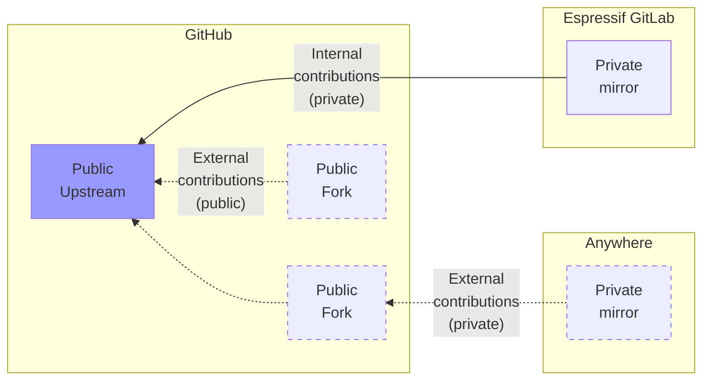

## Overview

The contribution diagram below shows how contributions can be done to [espressif / developer-portal][], marked as **Public Upstream**. It is Developer Portal's public GitHub repo.

[espressif / developer-portal]: https://github.com/espressif/developer-portal "Espressif Developer Portal"



The **internal contributions** from Espressif will be prepared in the private mirror on Espressif's GitLab, because during writing and editing, some sensitive information might be mentioned, such as the details of the upcoming products, speculations about future plans, etc.

The **external contributions** can be done in the following ways:

- **Public**: External contributors create a fork of `espressif / developer-portal` and offer a PR.
- **Private**: External contributors create a private mirror anywhere they want, prepare the material to contribute, and either invite Espressif's reviewers to their private mirror or offer a PR via a fork and have the review done publicly.

## Usage

The workflows for contributions are as follows:

- For public contributions from a forked repo to `espressif / developer-portal`, follow the standard GitHub procedures.
- For private contributions, see
  - [How to contribute from Espressif GitLab](#how-to-contribute-from-espressif-gitlab)
  - [How to contribute from Anywhere](#how-to-contribute-from-anywhere)
  - [How to set up a private mirror](#how-to-set-up-a-private-mirror)

### How to contribute from Espressif GitLab

To contribute from the private mirror on Espressif GitLab to `espressif / developer-portal`, do the following:

- In GitLab mirror, create a new branch and make the desired updates
- Invite Espressif's reviewers to do the review
- Once the private work on the new branch is done, do the following in the GitLab mirror:
  ```sh
  # Pull latest updates from upstream main if any
  git fetch upstream main && git pull upstream main
  # ! Replace <new-branch> with your branch name
  git rebase upstream/main <new-branch>
  # Push the branch with contributions to the public repo
  git push upstream <new-branch>
  ```
- In `espressif / developer-portal`, create a PR from your `<new-branch>` to `main`
- Remove the merged branch in GitLab mirror


### How to contribute from Anywhere

For private contributions from anywhere, do the following:

- Set up a private mirror as described in [How to set up a private mirror](#how-to-set-up-a-private-mirror)
- In your private mirror, create a new branch and make the desired updates
- Invite Espressif's reviewers to your private mirror to do the review
- Once the private work on the new branch is finished, do the following in the private mirror:
  ```sh
  # Pull latest updates from upstream main if any
  git fetch upstream main && git pull upstream main
  # ! Replace <new-branch> with your branch name
  git rebase upstream/main <new-branch>
  # Push the branch with contributions to the public repo
  git push upstream <new-branch>
  ```
- After that, fork `espressif / developer-portal` and create a PR from your `<new-branch>` to `main` of `espressif / developer-portal` (public review will be done at this stage)


### How to set up a private mirror

To set up a private mirror of `espressif / developer-portal`, do the following:

- Create a private [mirror][create a mirror] of [espressif / developer-portal][]
- (GitHub only) In the private mirror, consider [disabling][disable a workflow] the existing GitHub workflows as no developer portal deployment can be done from a mirror anyway
- On GitHub, create a fork of `espressif / developer-portal`
- In the private mirror, [add][configure a fork] your fork from the previous step as the upstream remote; you will want to push your contributions upstream to create a PR to `espressif / developer-portal`

[create a mirror]: https://docs.github.com/en/repositories/creating-and-managing-repositories/duplicating-a-repository#mirroring-a-repository
[disable a workflow]: https://docs.github.com/en/actions/using-workflows/disabling-and-enabling-a-workflow#disabling-a-workflow
[configure a fork]: https://docs.github.com/en/pull-requests/collaborating-with-pull-requests/working-with-forks/configuring-a-remote-repository-for-a-fork
