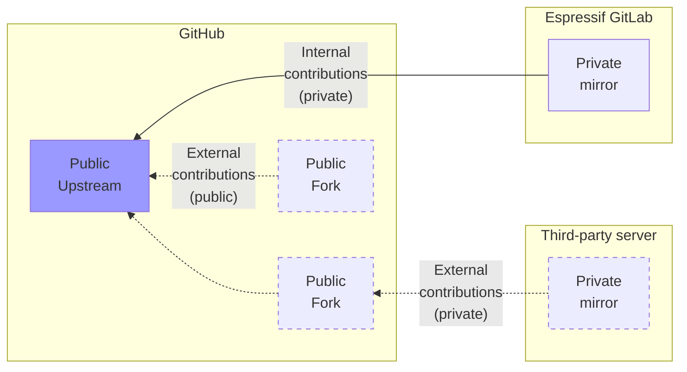

## Overview

The contribution diagram below shows how contributions can be done to [espressif / developer-portal][], marked as **Public Upstream**. It is Developer Portal's public GitHub repo.

[espressif / developer-portal]: https://github.com/espressif/developer-portal "Espressif Developer Portal"


```mermaid
flowchart RL
    id1[Public<br>Upstream]
    id2[Private<br>mirror]
    id3[Public<br>Fork]
    id4[Private<br>mirror]
    id5[Public<br>Fork]
    subgraph sg1 [GitHub]
        id1
        id3
        id5
    end
    subgraph sg2 [Espressif GitLab]
        id2
    end
    subgraph sg3 [Third-party server]
        id4
    end
    id2 -- Internal<br>contributions<br>(private) ---> id1
    id3 -. External<br>contributions<br>(public) .-> id1
    id4 -. External<br>contributions<br>(private) .-> id5
    id5 -.-> id1
    style id1 fill:#99f
    classDef dashedStyle stroke-width:1px,stroke-dasharray: 5 5;
    class id3,id4,id5 dashedStyle;
```

Pick the workflow that matches your situation:

1. [Public fork on GitHub](#public-fork-on-github) — external contributors (usual path)
2. [Private mirror on Espressif GitLab](#private-mirror-on-espressif-gitlab) — Espressif staff
3. [Private mirror on a third-party server](#private-mirror-on-a-third-party-server) — advanced / rare

## Public fork on GitHub

This is the default way to contribute to [espressif / developer-portal][].

1. **Fork** `espressif / developer-portal`. On how to do it, follow the GitHub’s [fork a repository][fork a repo] guide.
2. **Clone your fork** (replace `<your-username>` with your GitHub username). Submodules are required; use a shallow fetch to keep the clone smaller:
   ```sh
   git clone --recursive --shallow-submodules https://github.com/<your-username>/developer-portal.git
   cd developer-portal
   ```
3. **Create a feature branch** for your work:
   ```sh
   git switch -c my-feature-branch
   ```
4. **Make your changes**, commit, and push the branch to your fork.
5. **Open a pull request** against `main` on `espressif / developer-portal`. See GitHub’s [creating a pull request][create a pr] guide for the UI steps and branch comparison.


## Private mirror on Espressif GitLab

Espressif contributors prepare changes in the private GitLab mirror, then they are sync-merged to the public upstream after review.

1. In the GitLab mirror, create a feature branch and add your changes.
2. Open a merge request and invite Espressif reviewers.
3. After review and approval, the branch is sync-merged to [espressif / developer-portal][] on GitHub.

## Private mirror on a third-party server

Use this only when you need a private workspace (for example, a private GitHub mirror).

1. Create a private [mirror][create a mirror] of [espressif / developer-portal][].
2. **(GitHub only)** In the private mirror, consider [disabling existing GitHub workflows][disable a workflow] as deployment cannot run from a mirror anyway.
3. On GitHub, [fork][fork a repo] `espressif / developer-portal`.
4. In the private mirror, [add your fork as `upstream`][configure a fork] so you can push reviewed branches there before opening a public PR to `espressif / developer-portal`.
5. In the private mirror, create a branch, make your changes, and invite Espressif reviewers.
6. When the private review is done, push the branch to your fork.
7. [Create a pull request][create a pr] from your fork's `<new-branch>` to `espressif / developer-portal`'s `main` for the final public review.


[fork a repo]: https://docs.github.com/en/pull-requests/collaborating-with-pull-requests/working-with-forks/fork-a-repo
[create a pr]: https://docs.github.com/en/pull-requests/collaborating-with-pull-requests/proposing-changes-to-your-work-with-pull-requests/creating-a-pull-request
[contributing to a project]: https://docs.github.com/en/get-started/exploring-projects-on-github/contributing-to-a-project
[create a mirror]: https://docs.github.com/en/repositories/creating-and-managing-repositories/duplicating-a-repository#mirroring-a-repository
[disable a workflow]: https://docs.github.com/en/actions/using-workflows/disabling-and-enabling-a-workflow#disabling-a-workflow
[configure a fork]: https://docs.github.com/en/pull-requests/collaborating-with-pull-requests/working-with-forks/configuring-a-remote-repository-for-a-fork
