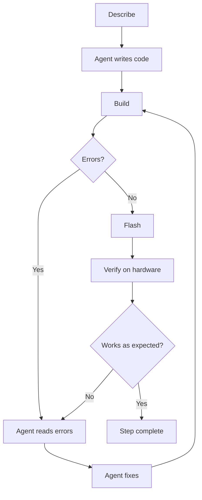

## AI agents and ESP-IDF

ESP-IDF projects are a good fit for agent-assisted development. They have a consistent structure, documented APIs, and a build system that provides clear feedback. This gives an agent useful context and objective results it can act on.

Here are some typical things you can ask an AI agent to do in an ESP-IDF project:

- **Create a project scaffold:** generate the directory structure, `CMakeLists.txt`, configuration files, and application entry point.
- **Write a function:** describe the behaviour you need and let the agent select the appropriate ESP-IDF APIs and connect the implementation.
- **Create a component:** generate a component with a public header, source files, configuration, and build registration.
- **Review code:** check for missing error handling, incorrect API usage, and violations of project conventions.
- **Refactor code:** break up a monolithic `app_main`, extract reusable functions, or reorganise a component without changing its behaviour.
- **Port code from another platform:** migrate an Arduino application or another embedded project to ESP-IDF APIs.
- **Migrate from an older ESP-IDF version:** identify deprecated APIs and update them to supported equivalents.
- **Generate documentation:** add Doxygen comments, write a README, or produce usage examples from the source code.

You'll get hands-on practice with most of these during the assignments.

### Espressif-specific tools

For questions about Espressif products, the free [Espressif ChatBot](https://chat.espressif.com/) provides access to current information from Espressif documentation and platforms. It is useful when you want an answer without giving an agent access to your project.

Espressif also provides MCP servers that bring this information directly into a coding agent:

- **[Espressif Documentation MCP Server](https://mcp.espressif.com/#espressif-documentation):** searches current Espressif documentation, including ESP-IDF programming guides and API references.
- **[ESP Component Registry MCP Server](https://mcp.espressif.com/#esp-component-registry):** searches the registry and retrieves information about reusable ESP-IDF components.

These MCP servers help the agent use current, authoritative sources instead of relying only on training data, which can become outdated as ESP-IDF evolves.

### Workflow for embedded development

In a traditional embedded workflow, you manually move information between tools: write code, build it, copy an error, search the documentation, edit the code, flash the firmware, and observe the hardware. An agent can connect many of these steps and use the result of one as input for the next:

This closed-loop workflow contains two feedback loops:

1. **Build feedback loop:** the agent writes or changes code, runs `idf.py build`, reads compiler and linker errors, applies a fix, and builds again. This loop can often run without manual intervention.
2. **Hardware feedback loop:** after a successful build, the firmware is flashed and tested on the device. Serial logs, runtime errors, and observed hardware behaviour become new input for the agent.

Each participant in the loop has a clear role:

- **You describe the intent.** Explain what the firmware should do, its constraints, and how success will be measured.
- **The agent implements and checks.** It edits files, uses tools, runs commands, and reacts to their output.
- **The toolchain provides objective feedback.** Compiler errors, warnings, tests, and serial logs show whether the implementation is technically valid.
- **You verify the hardware behaviour.** A successful build does not prove that the correct LED blinks, a sensor is accurate, or timing requirements are met.

| Step | Traditional workflow | With an AI agent |
|---|---|---|
| Scaffolding | Create files manually | Generate them from a prompt or spec |
| Build errors | Read, search, and fix manually | Let the agent read and fix them iteratively |
| Configuration | Write Kconfig by hand | Generate it from stated requirements |
| Refactoring | Coordinate edits manually | Apply related changes across files |
| Documentation | Write it separately | Generate it alongside code |

This workflow is not fully autonomous. You still decide whether the implementation matches the intent and report physical observations the agent cannot make. The loop ends when the acceptance criteria are met, not merely when the build succeeds.

### Spec-driven development

Write a clear specification before you ask the agent to implement something. A vague prompt such as:

> *"Write me a temperature sensor driver."*

...gives the agent very little to work with. It may make assumptions that do not match your expectations or ask several clarifying questions before it can begin.

A spec-driven prompt gives the agent a clear contract:

> *"Create a component called `temperature_sensor` for ESP32-C5 using ESP-IDF v6.0.2. The public API should be: `esp_err_t temperature_sensor_init(void)`, `esp_err_t temperature_sensor_read(float *out_celsius)`, `esp_err_t temperature_sensor_deinit(void)`. Use `CONFIG_TEMPERATURE_SENSOR_SAMPLE_PERIOD_MS` (Kconfig, default 1000 ms) for the sampling interval. Use the ESP-IDF internal temperature sensor driver."*

The result will be more predictable, easier to review, and closer to what you intended.

For larger tasks, keep the specification in Markdown files committed with your project:

- **`ARCHITECTURE.md`:** how the system is structured, including components, responsibilities, and interactions. Recommended location: `docs/ARCHITECTURE.md`.
- **`PLAN.md`:** what you want to build and why, including high-level goals, constraints, and open questions. Recommended location: `docs/PLAN.md`.
- **`STEP.md`:** the current task, expressed as a single focused description of what the agent should do next. Recommended location: `docs/STEP.md`.

Once these files are in place, you can ask:

> *"Read docs/PLAN.md, docs/ARCHITECTURE.md, and docs/STEP.md, then implement accordingly."*

Update `docs/STEP.md` for each new task without repeating the complete project context. We'll go deeper into this approach in Lecture 2.

## Next step

Now that you know how agents fit into ESP-IDF development, configure an ESP-IDF project with reusable skills and persistent rules.

[Assignment 2: Configure your ESP-IDF project for AI agents](../assignment-2)

[Back to workshop home](/workshops/ai-agent-coding-for-esp-idf/)
