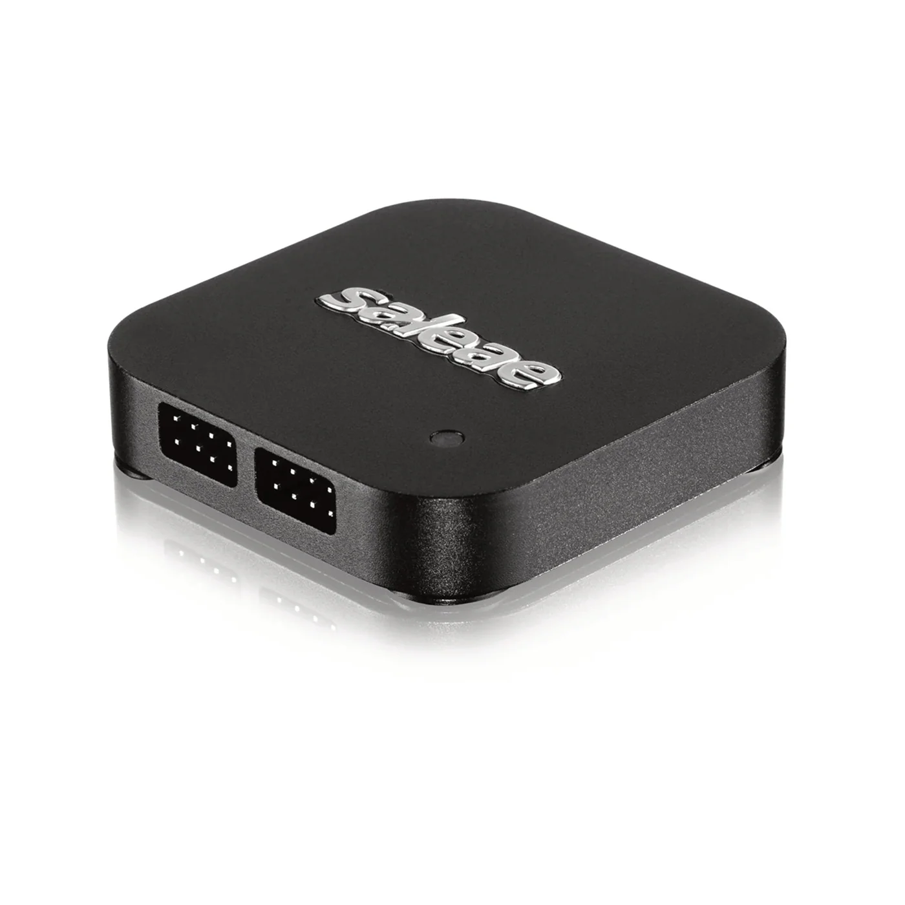

## Bonus: Debugging and refactoring with AI

> [!NOTE]
> This is an optional assignment. If you've finished the main workshop content, this is a great way to practice two more high-value AI agent workflows: diagnosing bugs and improving code structure.

---

In this assignment, you will practice using an AI agent to identify and fix bugs in firmware code and then refactor the existing code to improve its structure. Both workflows build directly on the `led-blink` project and the `led_blink` component from assignments 2 and 3.

Before starting the agent, export the ESP-IDF environment in the terminal from which you launch it. This allows the agent to run `idf.py`, build, flash, and monitor without additional environment setup.

### Part A: Debugging with AI

#### Step 1: Introduce a bug

To practice the debugging workflow, intentionally introduce a bug into the `led_blink` component from assignment 3. A few options:

- Remove the `led_strip_refresh()` call after changing the pixel, so the logs change but the physical LED does not.
- Give the `led_strip` driver an invalid data GPIO, so `led_blink_init()` fails.
- Remove the `vTaskDelay` call from the blink task so the task starves the scheduler.

Choose one bug and note the resulting error or unexpected runtime behaviour. Do not update the specification files—the implementation is intentionally violating the existing specification.

#### Step 2: Let the agent find and fix the error

Let the agent run the complete diagnostic cycle and read the terminal output directly. Tell it about any physical symptom that it cannot observe itself:

```text
Build the project. If the build succeeds, detect the ESP32-C5 serial port,
flash the application, and monitor its output.
The physical symptom is: <describe what you observed>.
Identify the root cause in the led_blink component, explain it, and fix it.
Repeat the build, flash, and monitor cycle, then ask me to confirm the physical
LED behaviour.
```

The agent will read build errors, initialisation failures, or monitor output and trace them back to the source. For a bug such as a missing `led_strip_refresh()` call, the build and logs may look correct, so your report that the physical LED is not changing is essential evidence.


If the agent doesn't have terminal access enabled, you can still share the output by pasting `build.log` or the serial monitor output into the chat. But giving the agent direct terminal access is faster and removes a manual step.


#### Step 3: Understand the fix

Before accepting the proposed change, ask the agent to explain it:

```
Why does this fix address the root cause? What would happen without it?
```

Understanding the fix is as important as applying it. If the explanation doesn't make sense, push back with follow-up questions until it does.

Ask the agent to rebuild, flash, and monitor after applying the fix:

```text
Rebuild the project, fix any remaining errors, then flash and monitor it.
Report the serial output and ask me to confirm the physical LED behaviour.
```

Do not continue until the build succeeds and you have confirmed that the physical addressable LED behaves as specified.

### Part B: Refactoring with AI

#### Step 1: Review the current state

At this point the `led-blink` project has:

- `main/led_blink.c` with a minimal `app_main` that initialises the component, selects a colour, and starts blinking.
- `components/led_blink/` with the `led_strip` driver, FreeRTOS task, lifecycle functions, and thread-safe colour API.

The component works, but the blink task's stack size and priority are still hardcoded. Move these values into Kconfig so they can be adjusted without editing the component source.

#### Step 2: Update the spec

First, add the task settings to the `Configuration (Kconfig)` section in `ARCHITECTURE.md`:

```markdown
LED_BLINK_TASK_STACK_SIZE: task stack size, default 2048, range 1024–8192
LED_BLINK_TASK_PRIORITY: task priority, default 5, range 1–24
```

Then update `STEP.md` with the refactoring task:

**`STEP.md`**

```markdown
# Step 3: Refactor led_blink component

Read PLAN.md and ARCHITECTURE.md, then refactor the led_blink component:

1. Add `LED_BLINK_TASK_STACK_SIZE` to Kconfig (default 2048, range 1024-8192).
2. Add `LED_BLINK_TASK_PRIORITY` to Kconfig (default 5, range 1-24).
3. Use `CONFIG_LED_BLINK_TASK_STACK_SIZE` and `CONFIG_LED_BLINK_TASK_PRIORITY` when creating the blink task.
4. Preserve the existing `led_blink_init`, `led_blink_start`, `led_blink_stop`, and `led_blink_set_color` behaviour.

## Acceptance criteria

- [ ] `Kconfig` defines `LED_BLINK_TASK_STACK_SIZE` and `LED_BLINK_TASK_PRIORITY` with defaults and help text.
- [ ] No stack size or priority value is hardcoded in `led_blink.c`.
- [ ] Calling `led_blink_stop()` followed by `led_blink_start()` still restarts blinking correctly.
- [ ] `led_blink_set_color()` still changes the color safely while the task is running.
- [ ] `idf.py build` succeeds with no errors.
```

#### Step 3: Plan and implement

Switch to planning mode first and ask the agent to describe what it would change:

```
Read PLAN.md, ARCHITECTURE.md, and STEP.md, then describe the changes you would make.
```

Review the plan before implementation. Depending on the agent, approve it through a confirmation prompt, checkbox, or button. If no built-in option is available, switch to Agent mode and send:

```
Read PLAN.md, ARCHITECTURE.md, and STEP.md, then implement accordingly.
```

#### Step 4: Build, flash, and test

Ask the agent to verify that the refactoring did not change the component's behaviour:

```text
Build the project and fix any errors without changing the requirements.
Temporarily update app_main to start blinking blue, stop after two seconds,
change the color to green, and start blinking again.
Flash and monitor the application, report the logs, and ask me to confirm the
physical LED behaviour.
```

Confirm that the LED blinks blue, stops, and then blinks green. After verification, ask the agent to restore the normal `app_main`, rebuild the project, and confirm that the working tree contains no temporary test code.

### Part C: External tools

An agent can also use external instruments through an MCP server. In this exercise, you will connect a Saleae logic analyzer to Cursor through the experimental [Logic 2 MCP server](https://docs.saleae.com/mcp/guides/getting-started). This allows the agent to list connected devices, start and stop captures, add protocol analyzers, and export captured data.

The MCP server currently supports Saleae Logic 8, Logic Pro 8, and Logic Pro 16 devices. Keep the Logic 2 application open while using the server.

#### Step 1: Enable the Logic 2 MCP server

Open Logic 2 and go to **Settings > Automation**, then enable **MCP Server**. You can also open the Automation settings using the button in the bottom bar.

By default, the server listens locally at:

```text
http://127.0.0.1:10530
```

The server is available only from your computer and does not require credentials.

#### Step 2: Connect Cursor to Logic 2

Add the server in **Cursor Settings > Tools & MCP**, or add the following entry to `~/.cursor/mcp.json`:

```json
{
  "mcpServers": {
    "logic2": {
      "url": "http://127.0.0.1:10530"
    }
  }
}
```

Return to the MCP settings and confirm that `logic2` is connected and its tools are enabled. Then verify the connection from the agent:

```text
List the Saleae logic analyzers I have connected. Exclude simulation devices.
```

The agent should report the model and device ID of the connected analyzer. If it cannot connect, confirm that Logic 2 is running, the MCP server is enabled, and the URL is correct.



#### Step 3: Connect the ESP32-C3-DevKit-RUST-1

The ESP32-C3-DevKit-RUST-1 includes an ICM-42670-P inertial measurement unit at address `0x68` and an SHTC3 temperature and humidity sensor at address `0x70`. Both sensors share the board's I2C bus:

| I2C signal | ESP32-C3 GPIO | Saleae channel |
|---|---|---|
| SDA | GPIO10, header pin labelled `IO10/SDA` | Digital channel 0 |
| SCL | GPIO8, header pin labelled `IO8/SCL` | Digital channel 1 |
| GND | Any board GND pin | GND |

Turn off or disconnect the board before attaching the probes. Then:

1. Connect a Saleae ground wire to a GND pin on the development board.
2. Connect Saleae digital channel 0 to `IO10/SDA`.
3. Connect Saleae digital channel 1 to `IO8/SCL`.
4. Check every connection, then power the board through its USB connector.

> [!WARNING]
> The logic analyzer and development board must share a common ground. Do not connect a Saleae input to the `3V3`, `5V`, or `VBAT` pins. The analyzer inputs should only observe SDA and SCL; they do not power the I2C bus.

#### Step 4: Create and run the SHTC3 example

The project for this exercise is based on the `shtc3_read` example from version 1.4.1 of the [`pedrominatel/shtc3`](https://components.espressif.com/components/pedrominatel/shtc3/versions/1.4.1/examples/shtc3_read) component. Ask the agent to create, configure, build, flash, and verify the example.

The monitor should report that the SHTC3 was found at address `0x70`, followed by a new temperature and relative humidity measurement every second.

#### Step 5: Capture and decode the I2C traffic

With the ESP32-C3-DevKit-RUST-1 powered and generating I2C traffic, ask the agent to operate the logic analyzer:

```text
Use the connected Saleae logic analyzer to capture digital channels 0 and 1
for 30 seconds at a valid sample rate of at least 1 MS/s.
Add an I2C analyzer with SDA on channel 0 and SCL on channel 1.
After the capture completes, export the decoded data and summarize the
addresses, reads, writes, acknowledgements, and any protocol errors.
```

The decoded traffic should contain acknowledgements from `0x68`, `0x70`, or both, depending on what the firmware accesses. Compare the analyzer output with the ESP-IDF monitor logs.

If the analyzer reports no I2C packets, ask the agent to inspect the raw channels before changing the firmware:

```text
Check whether either captured channel contains transitions.
If there are transitions but no decoded I2C packets, verify the SDA and SCL
channel mapping and report any malformed bus activity.
If both channels are inactive, report their idle states and list the wiring
and firmware checks I should perform.
```

Always tell the agent the exact channel mapping. A protocol analyzer configured with swapped or incorrect channels may produce no decoded data even when electrical activity is present.

#### Step 6: Clean up

After verifying the capture, stop the monitor and disconnect power before removing the probes. Keep or delete the separate `shtc3_read` example as needed, and confirm that no Saleae capture exports or temporary test files were added to the workshop's Git working tree.

## Next step

[Back to workshop home](/workshops/ai-agent-coding-for-esp-idf/)

---

Thank you for completing the AI Agent Coding for ESP-IDF workshop!

We hope the sessions gave you a practical feel for how AI agents fit into embedded development, not as a magic shortcut, but as a genuine tool that saves time when used with intention.

The patterns you practised here — spec files, planning mode, closed-loop builds, reusable skills — work just as well on real projects as they do on workshop exercises. Take them with you.

If you build something useful, share it. Publish your components to the [ESP Component Registry](https://components.espressif.com/), post on the [ESP32 forum](https://esp32.com/), or open a discussion on [GitHub](https://github.com/espressif/developer-portal/discussions). The community grows when people share what they make.

See you at the next one.
