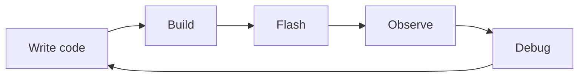
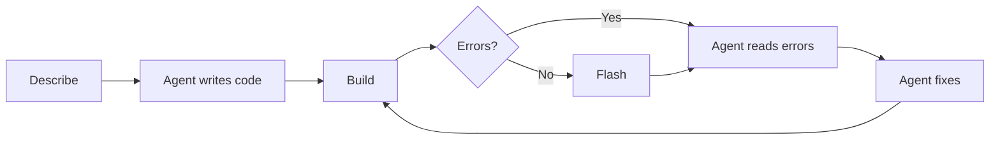

## AI Agent Coding Overview

Let's start with the big picture. AI-assisted coding is changing the way developers work, and if you haven't tried it yet for embedded development, this workshop is a great place to start.

The idea is simple: instead of spending time writing boilerplate, hunting through documentation, or manually chasing build errors, you describe what you want and let an AI agent do a lot of the heavy lifting. That frees you up to focus on the things that actually need your attention, like design decisions, hardware validation, and making sure the firmware does what it's supposed to do.

For ESP-IDF development specifically, this works really well. The project structure is consistent, the APIs are documented, and the build system gives clear feedback. All of that gives an AI agent enough context to be genuinely useful.

### What is an AI Coding Agent?

An AI coding agent is more than a smarter autocomplete. It's a tool that combines a large language model (LLM) with access to your actual development environment: your files, your terminal, your build output, and your project context.

Instead of just suggesting code for you to copy and paste, an agent can open files, make changes, run a build, read the error output, fix the issue, and try again, all on its own. You review the result and decide whether to keep it.

That's a very different experience from a chatbot.

Some of the most popular AI coding agents right now include:

- [Cursor](https://www.cursor.com/): an IDE built around AI agents, with deep codebase awareness and support for custom rules and skills.
- [GitHub Copilot](https://github.com/features/copilot): available inside VS Code and other editors, with an agent mode that can make multi-file changes and run terminal commands.
- [OpenAI Codex](https://platform.openai.com/docs/guides/codex): a cloud-based coding agent from OpenAI, accessible via the API or the ChatGPT interface.

Most of these agents can be used directly from the IDE, where they have access to your open files and project context, or from the CLI, where you can run them as part of a script or automated workflow. Both modes are useful: the IDE is great for interactive development, while the CLI fits well into build pipelines and batch tasks.

In this workshop we'll use Cursor as the primary example, but the concepts apply to any of these tools.

#### Agent vs Chatbot

Both use a chat interface, so it's easy to mix them up. Here's the practical difference:

| | Chatbot | AI Coding Agent |
|---|---|---|
| **Context** | What you paste into the chat | Your entire project, open files, terminal |
| **Actions** | Generates text suggestions | Reads, writes, and runs code |
| **Iteration** | You apply changes manually | Agent applies changes and re-checks |
| **Error handling** | You paste errors back manually | Agent reads build output and self-corrects |
| **Memory** | Stateless between messages | Maintains project context across steps |

A chatbot is great for questions. An agent is great for getting things built. In this workshop, you'll be working with agents.

### AI Agents and ESP-IDF

Here are some of the things you can ask an AI agent to do in an ESP-IDF project:

- **Create project scaffolds:** generate the full directory structure, `CMakeLists.txt`, `Kconfig`, and the app entry point.
- **Write functions:** describe the behaviour you need and let the agent pick the right ESP-IDF APIs and wire everything up.
- **Create components:** get a complete component with public header, source file, and build config in one shot.
- **Review code:** ask the agent to check for missing error handling, incorrect API usage, or anything that doesn't follow the project conventions.
- **Refactor code:** break up a monolithic `app_main`, extract reusable functions, or reorganise a component without changing behaviour.
- **Port code from other platforms:** bring in Arduino code and have the agent rewrite it using ESP-IDF APIs.
- **Migrate from older ESP-IDF versions:** find deprecated APIs and update them to the current equivalents.
- **Generate documentation:** add Doxygen comments, write a README, or produce usage examples straight from the source code.

You'll get hands-on practice with most of these during the assignments.

### Tools

Getting the most out of an AI agent isn't just about the model. The tools and context you give it make a big difference. Here are the most important ones for ESP-IDF work:

- **`AGENTS.md`:** a file you commit to your project that gives the agent its standing instructions. Things like the target chip, ESP-IDF version, logging conventions, and component structure. The agent reads it automatically at the start of every session, so you don't have to explain the basics every time.
- **`SKILL.md`:** reusable instruction sets for specific tasks. Think of them as recipes the agent can follow for things like creating a component or running validation.
- **MCP Servers:** these connect the agent to live external sources. The [Espressif Documentation MCP Server](https://mcp.espressif.com) gives it access to up-to-date ESP-IDF API docs, and the [ESP Component Registry MCP Server](https://mcp.espressif.com) lets it search for and fetch components directly.

Together, these tools make the agent much more reliable, especially for a fast-moving ecosystem like ESP-IDF where training data can go stale quickly.

### Workflow for Embedded Development

The classic embedded dev loop goes like this:

Every step is manual. Errors mean going back to the start, and it's easy to spend more time on the loop than on the actual problem.

With an AI agent in the mix, it looks more like this:

The agent takes care of the mechanical parts. You focus on describing the intent, reviewing the output, and verifying the result on hardware. The number of back-and-forth cycles drops a lot, especially for tasks with a clear structure.

### Spec-Driven Development

Here's something that will save you a lot of time: write a clear spec before you prompt the agent.

A vague prompt like this:

> *"Write me a temperature sensor driver."*

...gives the agent very little to work with. When a prompt is too vague, the agent will either make assumptions that don't match your expectations, or it will start asking a lot of clarifying questions before writing a single line of code. Both situations slow you down. The more context you give upfront, the less back-and-forth you'll have.

A spec-driven prompt like this gives the agent a real contract to implement:

> *"Create a component called `temperature_sensor` for ESP32-C6 using ESP-IDF v6.0.2. The public API should be: `esp_err_t temperature_sensor_init(void)`, `esp_err_t temperature_sensor_read(float *out_celsius)`, `esp_err_t temperature_sensor_deinit(void)`. Use `CONFIG_TEMPERATURE_SENSOR_SAMPLE_PERIOD_MS` (Kconfig, default 1000 ms) for the sampling interval. Use the ESP-IDF internal temperature sensor driver. Follow the project rules in AGENTS.md."*

The output will be predictable, easier to review, and much closer to what you actually wanted on the first try.

Taking a few minutes to plan before prompting is not extra work. It's the fastest way to get a good result. We'll go deeper on this in Lecture 2.

## Next step

Now that you know the basic concepts, let's get your hands dirty. First up is setting up the environment.

[Assignment 1: Set Up Your AI Agent Coding Environment](../assignment-1)

[Back to workshop home](/workshops/ai-agent-coding-for-esp-idf/)
