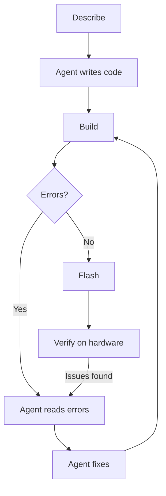

## Lecture 1: The New Workflow for Embedded Development

If you've been doing embedded development for a while, you already know the loop: write some code, build it, flash it, stare at the serial output, figure out what went wrong, and go back to the start. It works, but it's slow, and a lot of that time is spent on things that aren't really the interesting part.

AI agents change this by taking over the mechanical parts of the loop. The agent can read your build output, apply a fix, and rebuild without you having to copy-paste errors or manually track down which line caused a type mismatch. You stay focused on the parts that actually need your judgment.

### The Closed-Loop Development Model

Here's what the loop looks like with an agent in the mix:

The agent handles the write-build-fix cycle. You handle the describe and verify steps. The number of manual round trips drops significantly, especially for tasks with a predictable structure like scaffolding a component or wiring up a peripheral driver.

### What Changes with AI Agents

| Step | Traditional | With AI Agent |
|---|---|---|
| Scaffolding | Manual file creation | Prompt-driven generation |
| Build errors | Read, search, fix manually | Agent reads and fixes automatically |
| Kconfig/CMake | Written by hand | Generated from description |
| Refactoring | Manual edits | Agent applies changes across files |
| Documentation | Written separately | Generated alongside code |

### Structuring Your Prompts

The quality of the output depends a lot on the quality of the input. A useful pattern for ESP-IDF prompts:

1. **State the target:** chip, IDF version, component name.
2. **Describe the behaviour:** what the code should do, not how.
3. **Specify constraints:** which APIs to use, naming conventions, file structure.
4. **Reference the rules file:** always end with "Follow the project rules in AGENTS.md."

You don't need to write an essay. A few clear lines beat a long vague paragraph every time.

As your project grows, you can take this further by writing the spec as Markdown files committed alongside your code:

- **`PLAN.md`:** what you want to build and why. High-level goals, constraints, and open questions.
- **`ARCHITECTURE.md`:** how the system is structured. Components, their responsibilities, and how they interact.
- **`STEP.md`:** the current task. A single, focused description of what the agent should do next.

Once these files are in place, your prompt becomes simply: *"Read PLAN.md, ARCHITECTURE.md, and STEP.md, then implement accordingly."* Update `STEP.md` for each new task without repeating yourself. We'll use this approach in the assignments.

### Reviewing Agent Output

Before accepting any change, run through this quickly:

- Does the generated file follow the expected component structure?
- Are ESP-IDF API calls correct for the specified IDF version?
- Are error return values checked?
- Are no secrets or hardcoded credentials introduced?

The agent accelerates the work; you're still the one responsible for correctness. Treat every generated file as a first draft that needs a quick read before it lands in your project.

## Next step

[Lecture 2: What You Should Know About ESP-IDF to Work Better with Agents](../lecture-2)

[Back to workshop home](/workshops/ai-agent-coding-for-esp-idf/)
