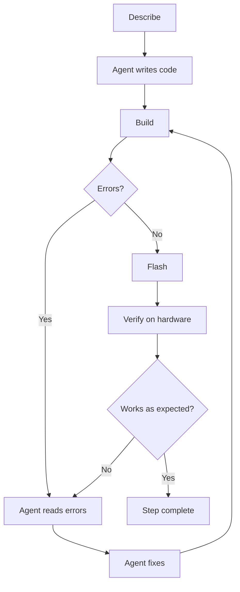

## Lecture 1: The new workflow for embedded development

If you've been doing embedded development for a while, you already know the loop: write some code, build it, flash it, stare at the serial output, figure out what went wrong, and go back to the start. It works, but it's slow, and a lot of that time is spent on things that aren't really the interesting part.

AI agents change this by taking over the mechanical parts of the loop. The agent can read your build output, apply a fix, and rebuild without you having to copy-paste errors or manually track down which line caused a type mismatch. You stay focused on the parts that actually need your judgment.

### The closed-loop development model

In a traditional workflow, you move information between each tool yourself. You run the build, copy the error, search the documentation, edit the code, and try again. In a closed-loop workflow, the agent can perform those connected steps and use the result of one step as input for the next.

Here's what the loop looks like with an agent in the mix:



The workflow has two feedback loops:

1. **Build feedback loop:** the agent writes or changes the code, runs `idf.py build`, reads compiler and linker errors, applies a fix, and builds again. This loop can often run without manual intervention.
2. **Hardware feedback loop:** after a successful build, the firmware is flashed and tested on the device. Serial logs, runtime errors, and observed hardware behaviour become new input for the agent. The agent can then update the code and return to the build loop.

Each part has a clear role:

- **You describe the intent.** Explain what the firmware should do, its constraints, and how success will be measured. The spec files and acceptance criteria help here.
- **The agent implements and checks.** It edits files, uses tools, runs commands, and reacts to the output.
- **The toolchain provides objective feedback.** Compiler errors, warnings, tests, and serial logs show whether the implementation is technically valid.
- **You verify the hardware behaviour.** A successful build does not prove that the correct LED blinks, a sensor is accurate, or timing requirements are met.

Closed loop does not mean fully autonomous. The agent can automate the mechanical work, but you still decide whether the implementation matches the intent. Hardware access can also limit automation. If the agent cannot access the serial port or observe the physical device, you need to report what happened or provide the monitor output.

The loop ends when the implementation meets the acceptance criteria, not simply when the build succeeds. This distinction is important in embedded development because code can compile correctly and still behave incorrectly on real hardware.

### What changes with AI agents

| Step | Traditional | With AI Agent |
|---|---|---|
| Scaffolding | Manual file creation | Prompt-driven generation |
| Build errors | Read, search, fix manually | Agent reads and fixes automatically |
| Kconfig/CMake | Written by hand | Generated from description |
| Refactoring | Manual edits | Agent applies changes across files |
| Documentation | Written separately | Generated alongside code |

### Structuring your prompts

The quality of the output depends a lot on the quality of the input. A useful pattern for ESP-IDF prompts:

1. **State the target:** SoC (partnumber), board name and version, ESP-IDF version, component name.
2. **Describe the behaviour:** what the code should do, not how.
3. **Specify constraints:** which APIs to use, naming conventions, file structure.
4. **Reference the rules file:** always end with "Follow the project rules in AGENTS.md."

You don't need to write an essay. A few clear lines beat a long vague paragraph every time.

As your project grows, you can take this further by writing the spec as Markdown files committed alongside your code:

- **`ARCHITECTURE.md`:** how the system is structured. Components, their responsibilities, and how they interact.
- **`PLAN.md`:** what you want to build and why. High-level goals, constraints, and open questions.
- **`STEP.md`:** the current task. A single, focused description of what the agent should do next.

Once these files are in place, your prompt becomes simply:

> *"Read PLAN.md, ARCHITECTURE.md, and STEP.md, then implement accordingly."*

Update `STEP.md` for each new task without repeating yourself. We'll use this approach in the assignments.

### Reviewing agent output

Before accepting any change, run through this quickly:

- Does the generated file follow the expected component structure?
- Are ESP-IDF API calls correct for the specified version?
- Are error return values checked?
- Are no secrets or hardcoded credentials introduced?

The agent accelerates the work; you're still the one responsible for correctness. Treat every generated file as a first draft that needs a quick read before it lands in your project.

### Git flow and version control

Working with an AI agent makes version control more important, not less. The agent can make changes across multiple files in a single step, and those changes can be hard to untangle if something goes wrong. A solid Git workflow gives you a safety net.

**Use a branch for each feature or step.** Before asking the agent to implement anything, create a branch:

```bash
git checkout -b feat/led-blink
```

If the result is good, merge it. If it goes sideways, discard it cleanly:

```bash
git checkout main
git branch -D feat/led-blink
```

No digging through partial changes or trying to figure out what the agent touched.

**Commit after each working state.** Don't wait until the end. Every time the build passes and the behaviour is correct, commit:

```bash
git add .
git commit -m "feat: implement LED blink with configurable GPIO and interval"
```

This gives you checkpoints you can return to, and makes it easy to ask the agent:

> *"Compare the current state to the last commit and explain what changed."*

**Let the agent run Git commands too.** You can ask the agent to stage, commit, or even write the commit message:

```
Stage all changes and commit with a conventional commit message describing what was implemented.
```

The agent knows the diff and can write a more accurate message than a rushed `"fix stuff"`.

**Recommended branch naming for this kind of workflow:**

| Branch | Purpose |
|---|---|
| `main` | Stable, working code only |
| `feat/<name>` | New feature or component |
| `fix/<name>` | Bug fix |
| `refactor/<name>` | Code restructuring |
| `step/<n>` | One agent-driven implementation step |

> [!NOTE]
> We won't use Git flow during this workshop to keep things moving, but treat it as a default habit for any real project. The time it saves when something goes wrong is worth the few extra seconds per step.

## Next step

[Lecture 2: What you should know about ESP-IDF to work better with agents](../lecture-2)

[Back to workshop home](/workshops/ai-agent-coding-for-esp-idf/)
