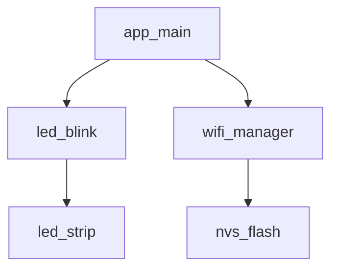
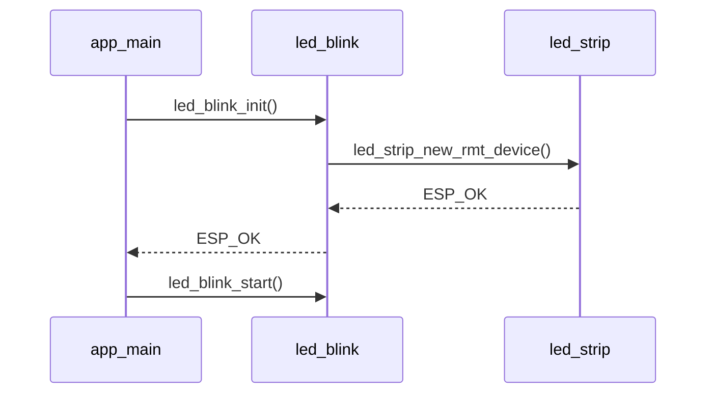

## Introduction

Spec-driven development is a workflow where you write a clear specification first and let the AI agent generate the implementation from it. This approach produces more consistent, reviewable code and reduces the number of correction cycles.

### Structuring your prompts

The quality of the output depends on the quality of the input. A useful prompt for ESP-IDF work should:

1. **State the target:** identify the SoC, exact board model, ESP-IDF version, and affected component.
2. **Describe the behaviour:** explain what the firmware should do and how success will be observed.
3. **Specify constraints:** name required APIs, conventions, files, interfaces, and hardware limitations.
4. **Define acceptance criteria:** list the checks that must pass before the task is complete.

You do not need to write an essay. A few precise requirements are more useful than a long but ambiguous prompt. If project rules are stored in `AGENTS.md`, supported agents load them automatically.

### What is a spec?

A spec is a structured description of what you want to build. For ESP-IDF components, a good spec covers:

- **Purpose:** what the component does and why.
- **API surface:** the public functions, their signatures, and their return types.
- **Configuration:** any `Kconfig` options, their names, defaults, and valid ranges.
- **Dependencies:** the ESP-IDF components, header files, and external libraries that are required.
- **Behaviour and errors:** expected results, failure cases, and error codes.
- **Lifecycle and concurrency:** valid call order, resource cleanup, and whether functions are thread-safe.
- **Constraints:** target SoC, IDF version, coding conventions.
- **Acceptance criteria:** checks that prove the implementation meets the requirements.

### Writing a spec for an ESP-IDF component

A spec does not need to be a formal document. A well-structured prompt is sufficient, but saving it as `SPEC.md` keeps it version-controlled and reusable across agent sessions. For example:

**`SPEC.md`**

```markdown
Component: temperature_sensor
Target: ESP32-C5, ESP-IDF v6.0.2

API:
  esp_err_t temperature_sensor_init(void);
  esp_err_t temperature_sensor_read(float *out_celsius);
  esp_err_t temperature_sensor_deinit(void);

Kconfig:
  TEMPERATURE_SENSOR_SAMPLE_PERIOD_MS: sampling period in ms, default 1000, range 100-60000

Dependencies:
  - Build component: esp_driver_tsens (PRIV_REQUIRES)
  - Header: driver/temperature_sensor.h

Constraints:
  - Use ESP_LOGI with tag "temp_sensor" for all log output.
  - Do not call the API from an interrupt service routine.
  - The caller must serialise access; the API is not thread-safe.
  - Follow the component structure in AGENTS.md.

Behaviour and errors:
  - init returns ESP_ERR_INVALID_STATE if the component is already initialised.
  - Return ESP_ERR_INVALID_ARG if out_celsius is NULL.
  - read and deinit return ESP_ERR_INVALID_STATE if the component is not initialised.
  - deinit releases all resources allocated by init.

Acceptance criteria:
  - The component declares esp_driver_tsens in PRIV_REQUIRES.
  - idf.py build succeeds for ESP32-C5.
  - On target hardware, init, read, and deinit return ESP_OK and read produces
    a valid Celsius value.
```

If a requirement is unknown, record it as an open question instead of leaving the agent to guess. Ask the agent to list ambiguities and assumptions before it starts implementing, then resolve anything that could affect the API or architecture.

### The spec-driven workflow

1. **Write the spec** before writing any code. This forces you to think through the design.
2. **Ask the agent to review it** and identify ambiguities, missing requirements, and assumptions.
3. **Resolve the open questions**, then ask the agent to implement the approved spec.
4. **Review the generated files** against the spec: check API names, Kconfig entries, dependencies, error handling, and cleanup.
5. **Build and test:** ask the agent to run the checks when it has access to the tools; otherwise, run them yourself and share the output.
6. **Update the spec first** when requirements change, then ask the agent to update the implementation to match.

### Reviewing agent output

Treat generated code as a first draft and compare it with the approved specification. For an ESP-IDF change, check at least:

- Does the generated file structure match the specification?
- Are the APIs correct for the selected ESP-IDF version and target?
- Are return values and documented failure cases handled?
- Do Kconfig symbols, defaults, ranges, and help text match the requirements?
- Are component dependencies declared in the correct `CMakeLists.txt` or manifest?
- Does the implementation avoid secrets and hardcoded credentials?
- Were the required build, test, and hardware acceptance criteria actually verified?

If the output does not match the specification, correct the spec or the implementation explicitly. Do not weaken a requirement simply to make a build pass.

### Keep the spec as the source of truth

Commit the spec alongside the code and review changes to both together. If the implementation needs to deviate from the spec, document and approve that change rather than allowing the two to drift apart. This gives future developers and agent sessions an accurate description of the intended behaviour.

For guidance on branches and checkpoints, see the optional [Git workflow for agent-assisted development](../optional-git-workflow/).

### Keep each task focused

A good specification also makes the agent interaction more efficient:

- Keep the current task and its acceptance criteria in `STEP.md` instead of repeating the complete architecture in every message.
- Keep persistent conventions in `AGENTS.md`; do not restate instructions the agent already loads automatically.
- Ask for one coherent change at a time so the agent can retrieve fewer files and you can review a smaller diff.
- Point to the relevant spec and source paths instead of pasting whole files into the chat.
- Start a new task only after the current acceptance criteria are met and `STEP.md` has been updated.

Reducing repetition must not remove required context. Target, board, interfaces, constraints, and acceptance criteria still need to be explicit in the specification.

### Use diagrams for structural requirements

Mermaid diagrams can make relationships and runtime flows unambiguous while remaining readable by both people and agents. For example, a component diagram can define dependencies:



A sequence diagram can describe an initialisation flow:



Add a diagram when it communicates a requirement more clearly than prose. Keep the corresponding API, error behaviour, and acceptance criteria in text so the specification remains complete.

### Tools for spec-driven development

You can manage specifications with ordinary Markdown files, or use a toolkit that provides a more structured workflow. [GitHub Spec Kit](https://github.com/github/spec-kit/) helps you turn a feature description into a specification, implementation plan, and actionable tasks for an AI coding agent.

Such tools are optional and are not specific to ESP-IDF. Review their generated files, add the hardware and ESP-IDF constraints described above, and keep the resulting specifications in version control with the code.

### Why this works well for embedded code

Embedded firmware has well-defined interfaces (GPIO, I2C, SPI, UART) and strict conventions (ESP-IDF component structure, `idf_component_register`, error codes). These constraints give the agent enough structure to generate correct code from a spec with minimal guesswork.

Spec-driven development also makes reviews easier: instead of reviewing free-form generated code, reviewers can compare the implementation against the stated spec.

## Next step

[Assignment 3: Prepare specs and prompts for an ESP-IDF project](../assignment-3)

[Back to workshop home](/workshops/ai-agent-coding-for-esp-idf/)
