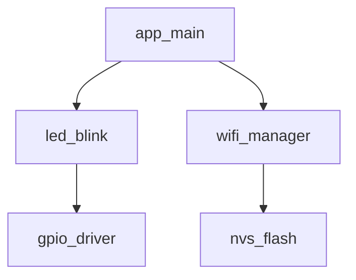
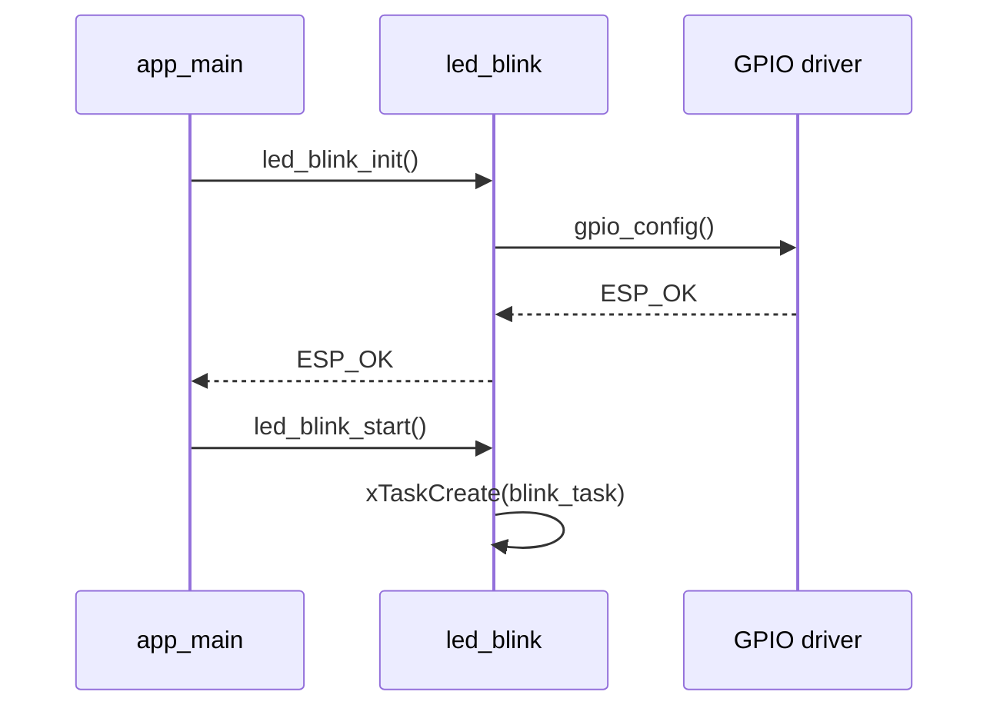

## Introduction

You've got the basics down. This lecture is about working smarter: spending fewer tokens, getting better results, and building habits that scale as your projects grow.

### Export the ESP-IDF environment first

Before starting the agent, export the ESP-IDF environment in the terminal from which you will launch it:

```bash
source "$HOME/esp/v6.0.2/esp-idf/export.sh"
```

Replace the path if ESP-IDF is installed elsewhere. Starting the agent from that terminal lets it inherit the ESP-IDF environment, including access to `idf.py` and the required toolchain. Exporting the environment in a different terminal does not update an agent that is already running. If you use an IDE-based agent, launch the IDE from the exported terminal or ensure that its ESP-IDF extension has configured the environment.

### Saving tokens

Every message you send to an agent costs tokens. A bloated context, a vague prompt, or a lengthy exchange uses more tokens than a focused interaction. A few things that help:

**Keep context tight.** Open only the files relevant to the current task. Agents in IDE mode pick up everything in the open editor — closing unrelated tabs reduces noise and cost.

**Use STEP.md as a scoped task.** Instead of dumping all requirements in the chat, keep them in `STEP.md` and reference it. The agent reads it once, and you don't repeat yourself across messages.

**Avoid over-explaining.** If `AGENTS.md` already captures your conventions, you don't need to restate them. Trust the rules file and keep prompts short.

**Ask for one thing at a time.** A prompt that asks for five changes at once is harder for the agent to get right and harder for you to review. Break it into steps. Each step is cheaper and more accurate.

**Summarise long sessions.** If a session has gone on for many turns, start a new chat and paste a brief summary of the current state. A fresh context is almost always cheaper and cleaner than a long one.

### Planning with expensive models, executing with cheaper ones

Not all tasks need the same model. Thinking and planning benefit from the most capable models available. Writing boilerplate and applying well-defined changes can be done with a faster, cheaper model.

A practical split:

| Task | Model type |
|---|---|
| Writing PLAN.md and ARCHITECTURE.md | High-capability (reasoning) |
| Reviewing ambiguous requirements | High-capability (reasoning) |
| Implementing from a clear spec | Fast and cheap |
| Fixing a specific build error | Fast and cheap |
| Reviewing generated code for correctness | High-capability (reasoning) |

In practice, use a reasoning model to produce the spec and the plan, then switch to a faster model to execute. You get most of the quality at a fraction of the cost. Most IDEs let you switch models per chat session.

### Using tools and scripts to save time and tokens

Repetitive tasks are a good target for automation. If you find yourself giving the agent the same context at the start of every session, that's a candidate for a script.

**Pre-prompt scripts.** A simple shell script can assemble a context blob from your project files and paste it as the first message. For example:

```bash
echo "Project context:" && cat AGENTS.md PLAN.md ARCHITECTURE.md
```

Copy that output to your clipboard and paste it as the opening message of any new session.

**Build wrappers.** Instead of manually copying build errors into the chat, write a script that runs the build and formats the output for the agent:

```bash
idf.py build 2>&1 | tee build.log
echo "Build failed. Error output:" && tail -n 40 build.log
```

**`idf.py` shortcuts.** Set up shell aliases for the commands you run constantly:

```bash
alias idf-build='idf.py build'
alias idf-flash='idf.py -p /dev/ttyUSB0 flash monitor'
```

The less you have to type manually, the more time you spend on the interesting parts.

### Creating your own skills

A `SKILL.md` file is a reusable recipe the agent can follow for a specific task. You've already seen how to add skills with `npx skills add`. Here's how to write your own.

A skill file is plain Markdown. The structure is simple:

```markdown
# Skill name

Brief description of what this skill does.

## Steps

1. Step one.
2. Step two.
3. Step three.

## Constraints

- Any rules the agent must follow.
- References to AGENTS.md or other files if relevant.
```

Some useful skills to create for ESP-IDF development:

- **Create component:** defines the exact file structure, naming conventions, and Kconfig requirements the agent must follow every time.
- **Add unit test:** scaffolds a Unity-based test app for any component.
- **Port to new target:** describes how to identify SoC-specific code and update it for a different target.
- **Publish to registry:** walks through cleaning up a component, adding metadata, and publishing it to the ESP Component Registry.

Once a skill is in your project, you invoke it with a single line: *"Use the create component skill to add a `wifi_manager` component."* No need to restate all the conventions.

### Using subagents

Some IDEs and agent tools support subagents: separate agent instances that work on a specific task in parallel or in sequence, without sharing the main session's context.

This is useful when:

- You want to run a code review without polluting your implementation session.
- You need to explore two different approaches simultaneously and compare results.
- You have a long-running task (like generating documentation for every component) that you want to hand off and check later.

In Cursor, you can launch a background agent from the agent panel. Give it a focused task, a reference to the relevant spec files, and let it run while you continue working in the main session.

A practical pattern for ESP-IDF: use a subagent to review every component before you flash. Give it the component source, the header, and a prompt like:

```
Review led_blink.c against led_blink.h.
Check for: missing error handling, unchecked esp_err_t returns,
hardcoded values that should be Kconfig options, and anything
that doesn't follow AGENTS.md. Report findings only, make no changes.
```

You get a focused review without interrupting your main workflow.

### Mermaid diagrams as architecture specifications

You've been writing architecture in plain text inside `ARCHITECTURE.md`. Mermaid diagrams are a step up: they're structured, unambiguous, and the agent can read them as a precise specification.

A component dependency diagram tells the agent exactly how the pieces fit together:



A sequence diagram works well for describing the runtime behaviour of an initialisation flow:



Add diagrams like these to `ARCHITECTURE.md` alongside the text descriptions. When you ask the agent to implement, it has both a human-readable description and a machine-readable structure to work from. The result is usually more accurate than text alone.

---

You have now completed the main content of the AI Agent Coding for ESP-IDF workshop. If you want to go further, there's one more optional assignment waiting.

## Next step

[Bonus: Assignment 4: Debugging and refactoring with AI](../assignment-4)

[Back to workshop home](/workshops/ai-agent-coding-for-esp-idf/)
