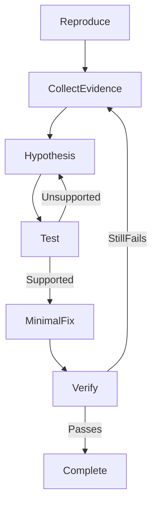

## Introduction

Debugging is not a sequence of random code changes. It is a process of collecting evidence, explaining that evidence with a testable hypothesis, and verifying that a minimal change fixes the root cause.

An AI agent can accelerate this loop by reading build output, searching the code, consulting documentation, and rerunning checks. It cannot replace evidence from the target hardware or decide that a symptom is fixed without verification.

### The debugging loop

Use the same sequence for build failures, crashes, and incorrect hardware behaviour:

1. **Reproduce:** describe the expected and observed behaviour and make the failure happen consistently.
2. **Collect evidence:** capture the first relevant error, logs, backtrace, reset reason, configuration, and physical observations.
3. **Form a hypothesis:** explain one likely root cause and identify evidence that supports or contradicts it.
4. **Test the hypothesis:** run a focused diagnostic check before changing unrelated code.
5. **Apply a minimal fix:** change only what is needed to address the supported root cause.
6. **Verify:** repeat the original reproduction steps and check for regressions.



Do not let the agent skip directly from a symptom to an edit. A plausible explanation is still only a hypothesis until the evidence supports it.

### Evidence in an ESP-IDF project

Different failures require different evidence:

| Failure | Useful evidence |
|---|---|
| Compiler or linker error | The first error, affected source line, component `CMakeLists.txt`, and declared dependencies |
| Configuration error | Kconfig definition, `sdkconfig.defaults*`, selected target, and reconfiguration output |
| Startup failure | `ESP_LOGE` output, returned `esp_err_t`, reset reason, and initialization order |
| Crash or watchdog reset | Panic output, decoded backtrace, task name, stack size, and logs immediately before the failure |
| Wrong peripheral behaviour | Exact board, schematic or board documentation, GPIO/peripheral configuration, logs, and physical observation |
| Timing or protocol problem | Timestamps, protocol traces, logic-analyzer evidence, and expected timing constraints |

Capture the complete first error and enough surrounding output to understand it. The final line of a build log often reports only that the build failed, not why.

ESP-IDF monitor output can include reset reasons, panic information, and decoded backtraces when the matching application ELF is available. Keep the firmware build and captured runtime output from the same build.

### Separate software evidence from hardware evidence

A successful build proves that the project compiles. A successful flash proves that data reached the device. Expected log messages prove that the relevant code path ran.

None of these proves that an LED emitted light, a sensor value is accurate, or a bus waveform meets its electrical requirements. Report physical observations to the agent explicitly:

```text
The build and flash succeeded. The log reports LED ON and LED OFF every
500 ms, but the physical onboard LED remains off.
```

This distinction prevents the agent from treating software logs as proof of physical behaviour.

### Give the agent a diagnostic contract

A debugging prompt should define the symptom, available evidence, scope, and verification:

```text
Expected: the onboard addressable LED alternates ON and OFF every 500 ms.
Observed: the log alternates correctly, but the physical LED remains off.
Board: ESP32-C5-DevKitC-1. ESP-IDF: v6.0.2.

Inspect the led_blink component and the captured monitor output.
First identify the most likely root cause and cite the supporting evidence.
Do not edit files until you have explained a focused diagnostic check.
After I approve the diagnosis, apply the minimal fix, build, flash, and ask me
to confirm the physical LED behaviour.
```

For a compiler failure, replace the physical symptom with the build command and complete error output. For a crash, include the panic and backtrace.

### Review the diagnosis before the edit

Before approving a fix, check that the agent:

- Distinguishes observed facts from assumptions.
- Connects the hypothesis to specific code or configuration.
- Explains why the proposed diagnostic check can confirm or reject it.
- Avoids unrelated refactoring during diagnosis.
- Defines how the original failure will be reproduced after the fix.

If the evidence does not support the hypothesis, collect more evidence instead of applying several speculative changes at once.

### Verify the root cause and the fix

A debugging task is complete only when:

- The original failure can no longer be reproduced.
- The expected build and runtime checks pass.
- Physical behaviour is confirmed when relevant.
- The explanation accounts for both the symptom and the fix.
- Temporary diagnostic code and configuration are removed.
- No unrelated behaviour changed.

## Next step

[Assignment 6: Debug an ESP-IDF application with AI](../assignment-6)

[Back to workshop home](/workshops/ai-agent-coding-for-esp-idf/)
